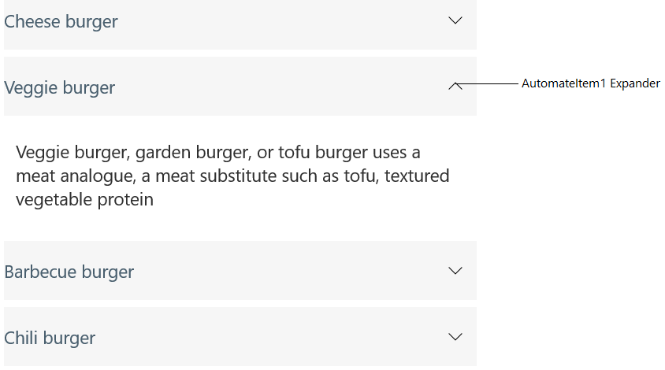

# Accessibility in Xamarin Accordion (SfAccordion)

The Accordion control has built-in `AutomationId` for inner elements. The `AutomationId` API allows the automation framework to find and interact with the inner elements of the Accordion control. To keep unique AutomationId, these inner element's AutomationIds are updated based on the Accordion control `AutomationId`. 

For example, if you set Accordion's AutomationId as "Automation", then Automation framework will interact with expander icon of AccordionItem  as `AutomationItem1 Expander`. Here, along with the control's AutomationId, index of an item will also be added for differentiating each AccordionItem expander. 

<table>
<tr>
<th align="center" >View</th>
<th align="center" >AutomationId Format</th>
<th align="center" >Example</th>
</tr>

<tr>
<td>Expander Icon</td>
<td>ControlAutomationId+Item+ItemIndex Expander</td>
<td>
AutomationItem1 Expander  
where <b>Automation</b> represents Control AutomationId, <b>Item1</b> represents Item text appended with item index which has been generated based on item position and <b>Expander</b> represents the expander dropdown icon. 
</td>
</tr>
</table>

The following image shows the AutomationIds of inner elements.

## See also

[How to get an AccordionItem in Xamarin.Forms (SfAccordion)](https://www.syncfusion.com/kb/11439/)
