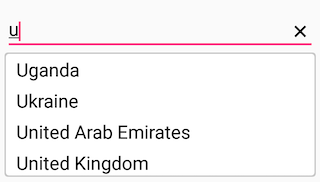

# Customizing AutoComplete

## Customizing AutoComplete in Xamarin AutoComplete (SfAutoComplete)

AutoComplete provides user friendly customizing options for both entry part and drop down part. In this section, customizing entire AutoComplete control is explained.

## Customizing the Entry

[`TextColor`](https://help.syncfusion.com/cr/xamarin/Syncfusion.SfAutoComplete.XForms.SfAutoComplete.html#Syncfusion_SfAutoComplete_XForms_SfAutoComplete_TextColor), [`TextSize`](https://help.syncfusion.com/cr/xamarin/Syncfusion.SfAutoComplete.XForms.SfAutoComplete.html#Syncfusion_SfAutoComplete_XForms_SfAutoComplete_TextSize), [`FontAttributes`](https://help.syncfusion.com/cr/xamarin/Syncfusion.SfAutoComplete.XForms.SfAutoComplete.html#Syncfusion_SfAutoComplete_XForms_SfAutoComplete_FontAttributes), [`FontFamily`](https://help.syncfusion.com/cr/xamarin/Syncfusion.SfAutoComplete.XForms.SfAutoComplete.html#Syncfusion_SfAutoComplete_XForms_SfAutoComplete_FontFamily) and [`BorderColor`](https://help.syncfusion.com/cr/xamarin/Syncfusion.SfAutoComplete.XForms.SfAutoComplete.html#Syncfusion_SfAutoComplete_XForms_SfAutoComplete_BorderColor) are the properties used to customize the foreground color, font size, font attribute, font family and border color of the entry part.





<?xml version="1.0" encoding="utf-8" ?>
<ContentPage xmlns="http://xamarin.com/schemas/2014/forms"
             xmlns:x="http://schemas.microsoft.com/winfx/2009/xaml"
             xmlns:autocomplete="clr-namespace:Syncfusion.SfAutoComplete.XForms;assembly=Syncfusion.SfAutoComplete.XForms"
             xmlns:ListCollection="clr-namespace:System.Collections.Generic;assembly=netstandard"
             xmlns:local="clr-namespace:AutocompleteSample"
             x:Class="AutocompleteSample.MainPage">
    <StackLayout 
        VerticalOptions="Start"
        HorizontalOptions="Start" 
        Padding="30">
        <autocomplete:SfAutoComplete HeightRequest="45" 
                                     Text="Sample text" 
                                     TextColor="#1976d2" 
                                     TextSize="20" 
                                     BorderColor="#1976d2"/>
    </StackLayout>
</ContentPage>





using Syncfusion.SfAutoComplete.XForms;
using Xamarin.Forms;

namespace AutocompleteSample
{
    public partial class MainPage : ContentPage
    {
        public MainPage()
        {
            InitializeComponent();
            StackLayout stackLayout = new StackLayout()
            {
                VerticalOptions = LayoutOptions.Start,
                HorizontalOptions = LayoutOptions.Start,
                Padding = new Thickness(30)
            };

            SfAutoComplete autoComplete = new SfAutoComplete()
            {
                HeightRequest = 45,
                Text = "Sample text",
                TextColor = Color.FromHex("1976d2"),
                TextSize = 20,
                BorderColor = Color.FromHex("1976d2")
            };
            stackLayout.Children.Add(autoComplete);
            this.Content = stackLayout;
        }
    }
}





## Custom Template for Suggestion Items

[`ItemTemplate`](https://help.syncfusion.com/cr/xamarin/Syncfusion.SfAutoComplete.XForms.SfAutoComplete.html#Syncfusion_SfAutoComplete_XForms_SfAutoComplete_ItemTemplate) property helps to decorate suggestion items with custom templates. The following code explains the steps to add an image to the suggestion list item.





<?xml version="1.0" encoding="utf-8" ?>
<ContentPage xmlns="http://xamarin.com/schemas/2014/forms"
             xmlns:x="http://schemas.microsoft.com/winfx/2009/xaml"
             xmlns:autocomplete="clr-namespace:Syncfusion.SfAutoComplete.XForms;assembly=Syncfusion.SfAutoComplete.XForms"
             xmlns:ListCollection="clr-namespace:System.Collections.Generic;assembly=netstandard"
             xmlns:local="clr-namespace:AutocompleteSample"
             x:Class="AutocompleteSample.MainPage">
    <ContentPage.BindingContext>
        <local:PersonViewModel/>
    </ContentPage.BindingContext>
    <StackLayout 
        VerticalOptions="Start"
        HorizontalOptions="Start" 
        Padding="30">
        <autocomplete:SfAutoComplete HeightRequest="40" 
                                     DisplayMemberPath="Name" 
                                     DataSource="{Binding PersonCollection}">
            <autocomplete:SfAutoComplete.ItemTemplate>
                <DataTemplate>
                    <StackLayout Orientation="Horizontal" 
                                 Padding="2,0,0,0">
                        <Image Source="User.png" 
                               WidthRequest="12"/>
                        <Label Text="{Binding Name}" 
                               VerticalOptions="Center"/>
                    </StackLayout>
                </DataTemplate>
            </autocomplete:SfAutoComplete.ItemTemplate>
        </autocomplete:SfAutoComplete>
    </StackLayout>
</ContentPage>





using Syncfusion.SfAutoComplete.XForms;
using System.Collections.ObjectModel;
using Xamarin.Forms;

namespace AutocompleteSample
{
    public partial class MainPage : ContentPage
    {

        PersonViewModel personViewModel = new PersonViewModel();

        public MainPage()
        {
            InitializeComponent();
            StackLayout stackLayout = new StackLayout()
            {
                VerticalOptions = LayoutOptions.Start,
                HorizontalOptions = LayoutOptions.Start,
                Padding = new Thickness(30)
            };
            SfAutoComplete autoComplete = new SfAutoComplete()
            {
                HeightRequest = 40,
                DisplayMemberPath="Name",
                DataSource= personViewModel.PersonCollection,
            };

            DataTemplate itemTemplate = new DataTemplate(() =>
            {
                StackLayout layout = new StackLayout()
                {
                    Orientation = StackOrientation.Horizontal,
                    Padding=new Thickness(2,0,0,0),
                };

                Image image = new Image();
                image.WidthRequest = 12;
                image.Source = ImageSource.FromFile("BackgroundColor.png");
                layout.Children.Add(image);

                Label nameLabel = new Label();
                nameLabel.VerticalOptions = LayoutOptions.Center;
                nameLabel.SetBinding(Label.TextProperty, "Name");
                layout.Children.Add(nameLabel);
                return new ViewCell { View = layout };
            });
            autoComplete.ItemTemplate = itemTemplate;

            this.BindingContext = personViewModel;
            stackLayout.Children.Add(autoComplete);
            this.Content = stackLayout;
        }
    }
}





Following code contains the the ViewModel properties.





    public class Person
    {
        private int age;
        public int Age
        {
            get { return age; }
            set { age = value; }
        }

        private string name;
        public string Name
        {
            get { return name; }
            set { name = value; }
        }
    }

    public class PersonViewModel
    {
        private ObservableCollection<Person> personCollection;
        public ObservableCollection<Person> PersonCollection
        {
            get { return personCollection; }
            set { personCollection = value; }
        }

        public PersonViewModel()
        {
            personCollection = new ObservableCollection<Person>();
            personCollection.Add(new Person() { Age = 21, Name = "Aldan" });
            personCollection.Add(new Person() { Age = 25, Name = "Clara" });
            personCollection.Add(new Person() { Age = 23, Name = "Aldrin" });
            personCollection.Add(new Person() { Age = 25, Name = "Mark" });
            personCollection.Add(new Person() { Age = 25, Name = "Lucas" });
            personCollection.Add(new Person() { Age = 24, Name = "Alan" });
            personCollection.Add(new Person() { Age = 25, Name = "James" });
            personCollection.Add(new Person() { Age = 22, Name = "Aaron" });
        }
    }





## Customizing the Suggestion Box

### Changing suggestion item height

[`DropDownItemHeight`](https://help.syncfusion.com/cr/xamarin/Syncfusion.SfAutoComplete.XForms.SfAutoComplete.html#Syncfusion_SfAutoComplete_XForms_SfAutoComplete_DropDownItemHeight) property is used to modify the height of suggestion items in drop down list. The code example is given below:





<?xml version="1.0" encoding="utf-8" ?>
<ContentPage xmlns="http://xamarin.com/schemas/2014/forms"
             xmlns:x="http://schemas.microsoft.com/winfx/2009/xaml"
             xmlns:autocomplete="clr-namespace:Syncfusion.SfAutoComplete.XForms;assembly=Syncfusion.SfAutoComplete.XForms"
             xmlns:ListCollection="clr-namespace:System.Collections.Generic;assembly=netstandard"
             xmlns:local="clr-namespace:AutocompleteSample"
             x:Class="AutocompleteSample.MainPage">
    <StackLayout 
        VerticalOptions="Start" 
        HorizontalOptions="Start"
        Padding="30">
        <autocomplete:SfAutoComplete x:Name="autoComplete"
                                     HeightRequest="40"
                                     DropDownItemHeight="45">
            <autocomplete:SfAutoComplete.AutoCompleteSource>
                <ListCollection:List x:TypeArguments="x:String">
                    <x:String>India</x:String>
                    <x:String>Uganda</x:String>
                    <x:String>Ukraine</x:String>
                    <x:String>Canada</x:String>
                    <x:String>United Arab Emirates</x:String>
                    <x:String>United Kingdom</x:String>
                </ListCollection:List>
            </autocomplete:SfAutoComplete.AutoCompleteSource>
        </autocomplete:SfAutoComplete>
    </StackLayout>
</ContentPage>





using Syncfusion.SfAutoComplete.XForms;
using System.Collections.Generic;
using Xamarin.Forms;

namespace AutocompleteSample
{
    public partial class MainPage : ContentPage
    {
        public MainPage()
        {
            InitializeComponent();
            StackLayout stackLayout = new StackLayout()
            {
                VerticalOptions = LayoutOptions.Start,
                HorizontalOptions = LayoutOptions.Start,
                Padding = new Thickness(30)
            };

            SfAutoComplete autoComplete = new SfAutoComplete()
            {
                HeightRequest = 40,
                DropDownItemHeight = 45,
                AutoCompleteSource = new List<string>()
                {
                    "India",
                    "Uganda",
                    "Ukraine",
                    "Canada",
                    "United Arab Emirates",
                    "United Kingdom"
                }
            };

            stackLayout.Children.Add(autoComplete);
            this.Content = stackLayout;
        }
    }
}





### Changing suggestion box corner radius

The [`DropDownCornerRadius`](https://help.syncfusion.com/cr/xamarin/Syncfusion.SfAutoComplete.XForms.SfAutoComplete.html#Syncfusion_SfAutoComplete_XForms_SfAutoComplete_DropDownCornerRadius) property is used to modify the corner radius of suggestion box. The following code example demonstrates how to change the suggestion box corner radius. 





<?xml version="1.0" encoding="utf-8" ?>
<ContentPage xmlns="http://xamarin.com/schemas/2014/forms"
             xmlns:x="http://schemas.microsoft.com/winfx/2009/xaml"
             xmlns:autocomplete="clr-namespace:Syncfusion.SfAutoComplete.XForms;assembly=Syncfusion.SfAutoComplete.XForms"
             xmlns:ListCollection="clr-namespace:System.Collections.Generic;assembly=netstandard"
             xmlns:local="clr-namespace:AutocompleteSample"
             x:Class="AutocompleteSample.MainPage">
    <StackLayout 
        VerticalOptions="Start" 
        HorizontalOptions="Start"
        Padding="30">
        <autocomplete:SfAutoComplete x:Name="autoComplete"
                                     HeightRequest="40"
                                     DropDownCornerRadius="3">
            <autocomplete:SfAutoComplete.AutoCompleteSource>
                <ListCollection:List x:TypeArguments="x:String">
                    <x:String>India</x:String>
                    <x:String>Uganda</x:String>
                    <x:String>Ukraine</x:String>
                    <x:String>Canada</x:String>
                    <x:String>United Arab Emirates</x:String>
                    <x:String>United Kingdom</x:String>
                </ListCollection:List>
            </autocomplete:SfAutoComplete.AutoCompleteSource>
        </autocomplete:SfAutoComplete>
    </StackLayout>
</ContentPage>





using Syncfusion.SfAutoComplete.XForms;
using System.Collections.Generic;
using Xamarin.Forms;

namespace AutocompleteSample
{
    public partial class MainPage : ContentPage
    {
        public MainPage()
        {
            InitializeComponent();
            StackLayout stackLayout = new StackLayout()
            {
                VerticalOptions = LayoutOptions.Start,
                HorizontalOptions = LayoutOptions.Start,
                Padding = new Thickness(30)
            };

            SfAutoComplete autoComplete = new SfAutoComplete()
            {
                HeightRequest = 40,
                DropDownCornerRadius = 3,
                AutoCompleteSource = new List<string>()
                {
                    "India",
                    "Uganda",
                    "Ukraine",
                    "Canada",
                    "United Arab Emirates",
                    "United Kingdom"
                }
            };

            stackLayout.Children.Add(autoComplete);
            this.Content = stackLayout;
        }
    }
}





### Changing suggestion box background color

The [`DropDownBackgroundColor`](https://help.syncfusion.com/cr/xamarin/Syncfusion.SfAutoComplete.XForms.SfAutoComplete.html#Syncfusion_SfAutoComplete_XForms_SfAutoComplete_DropDownBackgroundColor) property is used to modify the background color of suggestion box. The following code example demonstrates how to change the suggestion box background color. 





<?xml version="1.0" encoding="utf-8" ?>
<ContentPage xmlns="http://xamarin.com/schemas/2014/forms"
             xmlns:x="http://schemas.microsoft.com/winfx/2009/xaml"
             xmlns:autocomplete="clr-namespace:Syncfusion.SfAutoComplete.XForms;assembly=Syncfusion.SfAutoComplete.XForms"
             xmlns:ListCollection="clr-namespace:System.Collections.Generic;assembly=netstandard"
             xmlns:local="clr-namespace:AutocompleteSample"
             x:Class="AutocompleteSample.MainPage">
    <StackLayout 
        VerticalOptions="Start" 
        HorizontalOptions="Start"
        Padding="30">
        <autocomplete:SfAutoComplete x:Name="autoComplete"
                                     HeightRequest="40"
                                     DropDownBackgroundColor="Red">
            <autocomplete:SfAutoComplete.AutoCompleteSource>
                <ListCollection:List x:TypeArguments="x:String">
                    <x:String>India</x:String>
                    <x:String>Uganda</x:String>
                    <x:String>Ukraine</x:String>
                    <x:String>Canada</x:String>
                    <x:String>United Arab Emirates</x:String>
                    <x:String>United Kingdom</x:String>
                </ListCollection:List>
            </autocomplete:SfAutoComplete.AutoCompleteSource>
        </autocomplete:SfAutoComplete>
    </StackLayout>
</ContentPage>





using Syncfusion.SfAutoComplete.XForms;
using System.Collections.Generic;
using Xamarin.Forms;

namespace AutocompleteSample
{
    public partial class MainPage : ContentPage
    {
        public MainPage()
        {
            InitializeComponent();
            StackLayout stackLayout = new StackLayout()
            {
                VerticalOptions = LayoutOptions.Start,
                HorizontalOptions = LayoutOptions.Start,
                Padding = new Thickness(30)
            };

            SfAutoComplete autoComplete = new SfAutoComplete()
            {
                HeightRequest = 40,
                DropDownBackgroundColor = Color.Red,
                AutoCompleteSource = new List<string>()
                {
                    "India",
                    "Uganda",
                    "Ukraine",
                    "Canada",
                    "United Arab Emirates",
                    "United Kingdom"
                }
            };

            stackLayout.Children.Add(autoComplete);
            this.Content = stackLayout;
        }
    }
}





### Changing the border color of suggestion box

The DropDownBorderColor property is used to change the border color of suggestion box. The following code example demonstrates how to change the border color of suggestion box.





<?xml version="1.0" encoding="utf-8" ?>
<ContentPage xmlns="http://xamarin.com/schemas/2014/forms"
             xmlns:x="http://schemas.microsoft.com/winfx/2009/xaml"
             xmlns:autocomplete="clr-namespace:Syncfusion.SfAutoComplete.XForms;assembly=Syncfusion.SfAutoComplete.XForms"
             xmlns:ListCollection="clr-namespace:System.Collections.Generic;assembly=netstandard"
             xmlns:local="clr-namespace:AutocompleteSample"
             x:Class="AutocompleteSample.MainPage">
    <StackLayout>
    <autoComplete:SfAutoComplete HeightRequest="40" 
                                 DropDownBorderColor="Blue">
        <autoComplete:SfAutoComplete.AutoCompleteSource>
            <ListCollection:List x:TypeArguments="x:String">
                <x:String>1920 x 1080</x:String>
                <x:String>1680 x 1050</x:String>
                <x:String>1600 x 900</x:String>
                <x:String>1440 x 900</x:String>
                <x:String>1400 x 1050</x:String>
                <x:String>1366 x 768</x:String>
                <x:String>1360 x 768</x:String>
                <x:String>1280 x 1024</x:String>
                <x:String>1280 x 960</x:String>
                <x:String>1280 x 720</x:String>
                <x:String>854 x 480</x:String>
                <x:String>800 x 480</x:String>
                <x:String>480 X 640</x:String>
                <x:String>480 x 320</x:String>
                <x:String>432 x 240</x:String>
                <x:String>360 X 640</x:String>
                <x:String>320 x 240</x:String>
            </ListCollection:List>
        </autoComplete:SfAutoComplete.AutoCompleteSource>
    </autoComplete:SfAutoComplete>
</StackLayout>
</ContentPage>





using Syncfusion.SfAutoComplete.XForms;
using System.Collections.Generic;
using Xamarin.Forms;

namespace AutocompleteSample
{
    public partial class MainPage : ContentPage
    {
        public MainPage()
        {
            InitializeComponent();
            StackLayout layout = new StackLayout()
            {
                VerticalOptions = LayoutOptions.Start,
                HorizontalOptions = LayoutOptions.Start,
                Padding = new Thickness(30)
            };
            List<String> resolutionList = new List<String>();
            resolutionList.Add("1920 x 1080");
            resolutionList.Add("1680 x 1050");
            resolutionList.Add("1600 x 900");
            resolutionList.Add("1440 x 900");
            resolutionList.Add("1400 x 1050");
            resolutionList.Add("1366 x 768");
            resolutionList.Add("1360 x 768");
            resolutionList.Add("1280 x 1024");
            resolutionList.Add("1280 x 960");
            resolutionList.Add("1280 x 720");
            resolutionList.Add("854 x 480");
            resolutionList.Add("800 x 480");
            resolutionList.Add("480 X 640");
            resolutionList.Add("480 x 320");
            resolutionList.Add("432 x 240");
            resolutionList.Add("360 X 640");
            resolutionList.Add("320 x 240");

            SfAutoComplete autoComplete = new SfAutoComplete();
            autoComplete.HeightRequest = 40;
            autoComplete.AutoCompleteSource = resolutionList;
            autoComplete.DropDownBorderColor = Color.Blue;

            layout.Children.Add(autoComplete);
            Content = layout;
        }
    }
}





### Customizing suggestion items

Suggestion box items can be customized using [`DropDownItemFontAttributes`](https://help.syncfusion.com/cr/xamarin/Syncfusion.SfAutoComplete.XForms.SfAutoComplete.html#Syncfusion_SfAutoComplete_XForms_SfAutoComplete_DropDownItemFontAttributes), [`DropDownItemFontFamily`](https://help.syncfusion.com/cr/xamarin/Syncfusion.SfAutoComplete.XForms.SfAutoComplete.html#Syncfusion_SfAutoComplete_XForms_SfAutoComplete_DropDownItemFontFamily), [`DropDownTextSize`](https://help.syncfusion.com/cr/xamarin/Syncfusion.SfAutoComplete.XForms.SfAutoComplete.html#Syncfusion_SfAutoComplete_XForms_SfAutoComplete_DropDownTextSize) and [`DropDownTextColor`](https://help.syncfusion.com/cr/xamarin/Syncfusion.SfAutoComplete.XForms.SfAutoComplete.html#Syncfusion_SfAutoComplete_XForms_SfAutoComplete_DropDownTextColor) properties.





<?xml version="1.0" encoding="utf-8" ?>
<ContentPage xmlns="http://xamarin.com/schemas/2014/forms"
             xmlns:x="http://schemas.microsoft.com/winfx/2009/xaml"
             xmlns:autocomplete="clr-namespace:Syncfusion.SfAutoComplete.XForms;assembly=Syncfusion.SfAutoComplete.XForms"
             xmlns:ListCollection="clr-namespace:System.Collections.Generic;assembly=netstandard"
             xmlns:local="clr-namespace:AutocompleteSample"
             x:Class="AutocompleteSample.MainPage">
    <StackLayout 
        VerticalOptions="Start" 
        HorizontalOptions="Start"
        Padding="30">
        <autocomplete:SfAutoComplete x:Name="autoComplete"
                                     HeightRequest="40"
                                     DropDownTextColor="#1976d2"
                                     DropDownTextSize="12">
            <autocomplete:SfAutoComplete.AutoCompleteSource>
                <ListCollection:List x:TypeArguments="x:String">
                    <x:String>India</x:String>
                    <x:String>Uganda</x:String>
                    <x:String>Ukraine</x:String>
                    <x:String>Canada</x:String>
                    <x:String>United Arab Emirates</x:String>
                    <x:String>United Kingdom</x:String>
                </ListCollection:List>
            </autocomplete:SfAutoComplete.AutoCompleteSource>
        </autocomplete:SfAutoComplete>
    </StackLayout>
</ContentPage>





using Syncfusion.SfAutoComplete.XForms;
using System.Collections.Generic;
using Xamarin.Forms;

namespace AutocompleteSample
{
    public partial class MainPage : ContentPage
    {
        public MainPage()
        {
            InitializeComponent();
            StackLayout stackLayout = new StackLayout()
            {
                VerticalOptions = LayoutOptions.Start,
                HorizontalOptions = LayoutOptions.Start,
                Padding = new Thickness(30)
            };

            SfAutoComplete autoComplete = new SfAutoComplete()
            {
                HeightRequest = 40,
                DropDownTextColor = Color.FromHex("#1976d2"),
                DropDownTextSize = 16,
                AutoCompleteSource = new List<string>()
                {
                    "India",
                    "Uganda",
                    "Ukraine",
                    "Canada",
                    "United Arab Emirates",
                    "United Kingdom"
                }
            };

            stackLayout.Children.Add(autoComplete);
            this.Content = stackLayout;
        }
    }
}





### Show clear button

The autocomplete provided the user to show or hide the clear button using [`ShowClearButton`](https://help.syncfusion.com/cr/xamarin/Syncfusion.SfAutoComplete.XForms.SfAutoComplete.html#Syncfusion_SfAutoComplete_XForms_SfAutoComplete_ShowClearButton) property.





<?xml version="1.0" encoding="utf-8" ?>
<ContentPage xmlns="http://xamarin.com/schemas/2014/forms"
             xmlns:x="http://schemas.microsoft.com/winfx/2009/xaml"
             xmlns:autocomplete="clr-namespace:Syncfusion.SfAutoComplete.XForms;assembly=Syncfusion.SfAutoComplete.XForms"
             xmlns:ListCollection="clr-namespace:System.Collections.Generic;assembly=netstandard"
             xmlns:local="clr-namespace:AutocompleteSample"
             x:Class="AutocompleteSample.MainPage">
    <StackLayout 
        VerticalOptions="Start" 
        HorizontalOptions="Start"
        Padding="30">
        <autocomplete:SfAutoComplete x:Name="autoComplete"
                                     HeightRequest="40"
                                     ShowClearButton="True">
            <autocomplete:SfAutoComplete.AutoCompleteSource>
                <ListCollection:List x:TypeArguments="x:String">
                    <x:String>India</x:String>
                    <x:String>Uganda</x:String>
                    <x:String>Ukraine</x:String>
                    <x:String>Canada</x:String>
                    <x:String>United Arab Emirates</x:String>
                    <x:String>United Kingdom</x:String>
                </ListCollection:List>
            </autocomplete:SfAutoComplete.AutoCompleteSource>
        </autocomplete:SfAutoComplete>
    </StackLayout>
</ContentPage>





using Syncfusion.SfAutoComplete.XForms;
using System.Collections.Generic;
using Xamarin.Forms;

namespace AutocompleteSample
{
    public partial class MainPage : ContentPage
    {
        public MainPage()
        {
            InitializeComponent();
            StackLayout stackLayout = new StackLayout()
            {
                VerticalOptions = LayoutOptions.Start,
                HorizontalOptions = LayoutOptions.Start,
                Padding = new Thickness(30)
            };

            SfAutoComplete autoComplete = new SfAutoComplete()
            {
                HeightRequest = 40,
                ShowClearButton = true,
                AutoCompleteSource = new List<string>()
                {
                    "India",
                    "Uganda",
                    "Ukraine",
                    "Canada",
                    "United Arab Emirates",
                    "United Kingdom"
                }
            };

            stackLayout.Children.Add(autoComplete);
            this.Content = stackLayout;
        }
    }
}





### Customizing clear button

The user can customize the clear button color in the autocomplete using [`ClearButtonColor`](https://help.syncfusion.com/cr/xamarin/Syncfusion.SfAutoComplete.XForms.SfAutoComplete.html#Syncfusion_SfAutoComplete_XForms_SfAutoComplete_ClearButtonColor) Property.

N> `ClearButtonColor` property is available only on iOS and Android platform.





<?xml version="1.0" encoding="utf-8" ?>
<ContentPage xmlns="http://xamarin.com/schemas/2014/forms"
             xmlns:x="http://schemas.microsoft.com/winfx/2009/xaml"
             xmlns:autocomplete="clr-namespace:Syncfusion.SfAutoComplete.XForms;assembly=Syncfusion.SfAutoComplete.XForms"
             xmlns:ListCollection="clr-namespace:System.Collections.Generic;assembly=netstandard"
             xmlns:local="clr-namespace:AutocompleteSample"
             x:Class="AutocompleteSample.MainPage">
    <StackLayout 
        VerticalOptions="Start" 
        HorizontalOptions="Start"
        Padding="30">
        <autocomplete:SfAutoComplete x:Name="autoComplete"
                                     HeightRequest="40"
                                     ClearButtonColor="Red">
            <autocomplete:SfAutoComplete.AutoCompleteSource>
                <ListCollection:List x:TypeArguments="x:String">
                    <x:String>India</x:String>
                    <x:String>Uganda</x:String>
                    <x:String>Ukraine</x:String>
                    <x:String>Canada</x:String>
                    <x:String>United Arab Emirates</x:String>
                    <x:String>United Kingdom</x:String>
                </ListCollection:List>
            </autocomplete:SfAutoComplete.AutoCompleteSource>
        </autocomplete:SfAutoComplete>
    </StackLayout>
</ContentPage>





using Syncfusion.SfAutoComplete.XForms;
using System.Collections.Generic;
using Xamarin.Forms;

namespace AutocompleteSample
{
    public partial class MainPage : ContentPage
    {
        public MainPage()
        {
            InitializeComponent();
            StackLayout stackLayout = new StackLayout()
            {
                VerticalOptions = LayoutOptions.Start,
                HorizontalOptions = LayoutOptions.Start,
                Padding = new Thickness(30)
            };

            SfAutoComplete autoComplete = new SfAutoComplete()
            {
                HeightRequest = 40,
                ClearButtonColor = Color.Red,
                AutoCompleteSource = new List<string>()
                {
                    "India",
                    "Uganda",
                    "Ukraine",
                    "Canada",
                    "United Arab Emirates",
                    "United Kingdom"
                }
            };

            stackLayout.Children.Add(autoComplete);
            this.Content = stackLayout;
        }
    }
}





### Changing border visibility

The [`ShowBorder`](https://help.syncfusion.com/cr/xamarin/Syncfusion.SfAutoComplete.XForms.SfAutoComplete.html#Syncfusion_SfAutoComplete_XForms_SfAutoComplete_ShowBorder) property is used to modify the visibility of border. The following code example demonstrates how to change the border visibility. 





<?xml version="1.0" encoding="utf-8" ?>
<ContentPage xmlns="http://xamarin.com/schemas/2014/forms"
             xmlns:x="http://schemas.microsoft.com/winfx/2009/xaml"
             xmlns:autocomplete="clr-namespace:Syncfusion.SfAutoComplete.XForms;assembly=Syncfusion.SfAutoComplete.XForms"
             xmlns:ListCollection="clr-namespace:System.Collections.Generic;assembly=netstandard"
             xmlns:local="clr-namespace:AutocompleteSample"
             x:Class="AutocompleteSample.MainPage">
    <StackLayout 
        VerticalOptions="Start" 
        HorizontalOptions="Start"
        Padding="30">
        <autocomplete:SfAutoComplete x:Name="autoComplete"
                                     HeightRequest="40"
                                     ShowBorder="False">
            <autocomplete:SfAutoComplete.AutoCompleteSource>
                <ListCollection:List x:TypeArguments="x:String">
                    <x:String>India</x:String>
                    <x:String>Uganda</x:String>
                    <x:String>Ukraine</x:String>
                    <x:String>Canada</x:String>
                    <x:String>United Arab Emirates</x:String>
                    <x:String>United Kingdom</x:String>
                </ListCollection:List>
            </autocomplete:SfAutoComplete.AutoCompleteSource>
        </autocomplete:SfAutoComplete>
    </StackLayout>
</ContentPage>





using Syncfusion.SfAutoComplete.XForms;
using System.Collections.Generic;
using Xamarin.Forms;

namespace AutocompleteSample
{
    public partial class MainPage : ContentPage
    {
        public MainPage()
        {
            InitializeComponent();
            StackLayout stackLayout = new StackLayout()
            {
                VerticalOptions = LayoutOptions.Start,
                HorizontalOptions = LayoutOptions.Start,
                Padding = new Thickness(30)
            };

            SfAutoComplete autoComplete = new SfAutoComplete()
            {
                HeightRequest = 40,
                ShowBorder = false,
                AutoCompleteSource = new List<string>()
                {
                    "India",
                    "Uganda",
                    "Ukraine",
                    "Canada",
                    "United Arab Emirates",
                    "United Kingdom"
                }
            };

            stackLayout.Children.Add(autoComplete);
            this.Content = stackLayout;
        }
    }
}





