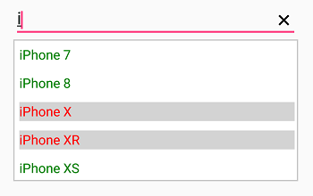

# DataTemplateSelector in Xamarin AutoComplete (SfAutoComplete)

SfAutoComplete supports DataTemplateSelector, which is used to choose a DataTemplate based on data object.
 





<?xml version="1.0" encoding="utf-8" ?>
<ContentPage xmlns="http://xamarin.com/schemas/2014/forms"
             xmlns:x="http://schemas.microsoft.com/winfx/2009/xaml"
             xmlns:autocomplete="clr-namespace:Syncfusion.SfAutoComplete.XForms;assembly=Syncfusion.SfAutoComplete.XForms"
             xmlns:ListCollection="clr-namespace:System.Collections.Generic;assembly=netstandard"
             xmlns:local="clr-namespace:AutocompleteSample"
             x:Class="AutocompleteSample.MainPage">
    <ContentPage.BindingContext>
        <local:MobileDetailViewModel/>
    </ContentPage.BindingContext>
    <ContentPage.Resources>
        <ResourceDictionary>
            <DataTemplate x:Key="default">
                <ViewCell>
                    <Grid Padding="5">
                        <Label Text="{Binding Mobile}" TextColor="Green"/>
                    </Grid>
                </ViewCell>
            </DataTemplate>
            <DataTemplate x:Key="specific">
                <ViewCell>
                    <Grid  Padding="5">
                        <Label Text="{Binding Mobile}" BackgroundColor="LightGray" TextColor="Red"/>
                    </Grid>
                </ViewCell>
            </DataTemplate>
        </ResourceDictionary>
    </ContentPage.Resources>
    <StackLayout VerticalOptions="Start" HorizontalOptions="Start" Padding="30">
        <autocomplete:SfAutoComplete DataSource="{Binding MobileCollection}" DisplayMemberPath="Mobile">
            <autocomplete:SfAutoComplete.ItemTemplate>
                <local:DataTemplateSelectorViewModel DefaultTemplate="{StaticResource default}" SpecificDataTemplate="{StaticResource specific}" />
            </autocomplete:SfAutoComplete.ItemTemplate>
        </autocomplete:SfAutoComplete>
    </StackLayout>
</ContentPage>
	




using Syncfusion.SfAutoComplete.XForms;
using System.Collections.ObjectModel;
using Xamarin.Forms;

namespace AutocompleteSample
{
    public partial class MainPage : ContentPage
    {
        DataTemplate defaultTemplate;
        DataTemplate specifictempalte;
        public MainPage()
        {
            InitializeComponent();
            MobileDetailViewModel mobileDetailViewModel = new MobileDetailViewModel();
            defaultTemplate = new DataTemplate(() =>
            {
                Grid grid = new Grid();
                grid.Padding = new Thickness(5);
                Label label = new Label();
                label.SetBinding(Label.TextProperty, "Mobile");
                label.TextColor = Color.Green;
                grid.Children.Add(label);
                return new ViewCell { View = grid };
            });

            specifictempalte = new DataTemplate(() =>
            {
                Grid grid = new Grid();
                grid.Padding = new Thickness(5);
                Label label = new Label();
                label.SetBinding(Label.TextProperty, "Mobile");
                label.BackgroundColor = Color.LightGray;
                label.TextColor = Color.Red;
                grid.Children.Add(label);
                return new ViewCell { View = grid };
            });
            StackLayout layout = new StackLayout()
            {
                VerticalOptions = LayoutOptions.Start,
                HorizontalOptions = LayoutOptions.Start,
                Padding = new Thickness(30)
            };
            SfAutoComplete autoComplete = new SfAutoComplete();
            autoComplete.HeightRequest = 40;
            autoComplete.DataSource = mobileDetailViewModel.MobileCollection;
            this.BindingContext = mobileDetailViewModel;
            autoComplete.DisplayMemberPath = "Mobile";
            autoComplete.ItemTemplate = new DataTemplateSelectorViewModel { DefaultTemplate = defaultTemplate, SpecificDataTemplate = specifictempalte };
            layout.Children.Add(autoComplete);
            Content = layout;
        }
    }
}





## Create and Initialize Business Models 

Define a simple model class MobileDetail with fields IsAvailableInStock, Mobile and populate mobile detail in ViewModel.





namespace AutocompleteSample
{
    public class MobileDetailViewModel
    {
        public ObservableCollection<MobileDetail> MobileCollection { get; set; }
        public MobileDetailViewModel()
        {
            this.MobileCollection = new ObservableCollection<MobileDetail>()
            {
                new MobileDetail () { Mobile="Samasung S8", IsAvailableInStock=false },
                new MobileDetail () { Mobile="Samasung S9", IsAvailableInStock=true },
                new MobileDetail () { Mobile="Samsung S10", IsAvailableInStock=true },
                new MobileDetail () { Mobile="Samsung S10 plus", IsAvailableInStock=true },
                new MobileDetail () { Mobile="iPhone 7", IsAvailableInStock=true },
                new MobileDetail () { Mobile="iPhone 8", IsAvailableInStock=true },
                new MobileDetail () { Mobile="iPhone X", IsAvailableInStock=false },
                new MobileDetail () { Mobile="iPhone XR", IsAvailableInStock=false },
                new MobileDetail () { Mobile="iPhone XS", IsAvailableInStock=true },
            };
        }
    }

    public class MobileDetail
    {
        public string Mobile { get; set; }

        public bool IsAvailableInStock { get; set; }
    }
}





## OnSelectTemplate

The OnSelectTemplate is an overridden method to return a particular DataTemplate. The following code sample demonstrates how to use the OnSelectTemplate method.





namespace AutocompleteSample
{
    public class DataTemplateSelectorViewModel : DataTemplateSelector
    {
        public DataTemplate DefaultTemplate { get; set; }
        public DataTemplate SpecificDataTemplate { get; set; }

        protected override DataTemplate OnSelectTemplate(object item, BindableObject container)
        {
            var message = item as MobileDetail;
            if (message.IsAvailableInStock == null)
                return null;
            return message.IsAvailableInStock == false ? SpecificDataTemplate : DefaultTemplate;
        }

    }
}





The following screenshot illustrates the output of above code.

We have attached sample for reference. You can download the sample from the following link.

Sample Link: [SfAutoComplete_DataTemplateSelector](https://www.syncfusion.com/downloads/support/directtrac/general/ze/SfAutoComplete_DataTemplateSelector1077321876.zip)
