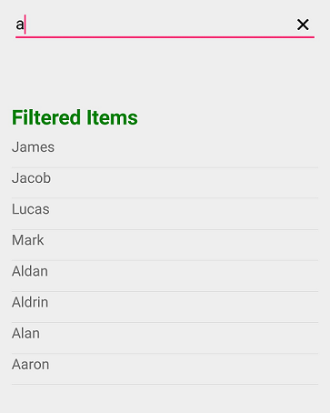

# Dealing with Suggestion Box

## Dealing with Suggestion Box in Xamarin SfAutoComplete

Suggestion box is the drop-down list box, which displays the filtered suggestions inside a popup. This section explains the properties that deals with drop-down list in the SfAutoComplete control.

## Suggestion box placement mode

Suggestion box can be placed either at the top or bottom using the `SuggestionBoxPlacement` property. By default, it is placed at the bottom.





<?xml version="1.0" encoding="utf-8" ?>
<ContentPage xmlns="http://xamarin.com/schemas/2014/forms"
             xmlns:x="http://schemas.microsoft.com/winfx/2009/xaml"
             xmlns:autocomplete="clr-namespace:Syncfusion.SfAutoComplete.XForms;assembly=Syncfusion.SfAutoComplete.XForms"
             xmlns:ListCollection="clr-namespace:System.Collections.Generic;assembly=netstandard"
             xmlns:local="clr-namespace:AutocompleteSample"
             x:Class="AutocompleteSample.MainPage">
    <StackLayout VerticalOptions="Center" 
                 HorizontalOptions="Center" 
                 Padding="30">
        <autocomplete:SfAutoComplete
	           x:Name="autoComplete"
	           HeightRequest="40"
               SuggestionBoxPlacement="Top">
            <autocomplete:SfAutoComplete.AutoCompleteSource>
                <ListCollection:List x:TypeArguments="x:String">
                    <x:String>India</x:String>
                    <x:String>Uganda</x:String>
                    <x:String>Ukraine</x:String>
                    <x:String>Canada</x:String>
                    <x:String>United Arab Emirates</x:String>
                    <x:String>France</x:String>
                    <x:String>United Kingdom</x:String>
                    <x:String>China</x:String>
                    <x:String>United States</x:String>
                    <x:String>Japan</x:String>
                    <x:String>Angola</x:String>
                </ListCollection:List>
            </autocomplete:SfAutoComplete.AutoCompleteSource>
        </autocomplete:SfAutoComplete>
    </StackLayout>
</ContentPage>





using Syncfusion.SfAutoComplete.XForms;
using System.Collections.Generic;
using Xamarin.Forms;

namespace AutocompleteSample
{
    public partial class MainPage : ContentPage
    {
        public MainPage()
        {
            InitializeComponent();
            StackLayout stackLayout = new StackLayout()
            {
                VerticalOptions = LayoutOptions.Center,
                HorizontalOptions = LayoutOptions.Center,
                Padding = 30
            };

            SfAutoComplete autoComplete = new SfAutoComplete()
            {
                HeightRequest = 40,
                SuggestionBoxPlacement = SuggestionBoxPlacement.Top,
                AutoCompleteSource = new List<string>()
                {
                    "India",
                    "Uganda",
                    "Ukraine",
                    "Canada",
                    "United Arab Emirates",
                    "France",
                    "United Kingdom",
                    "China",
                    "United States",
                    "Japan",
                    "Angola"
                }
            };
            stackLayout.Children.Add(autoComplete);
            this.Content = stackLayout;
        }
    }
}





## Maximum suggestion box height

The maximum height of the suggestion box in the SfAutocomplete control can be varied using the `MaximumDropDownHeight` property.





<?xml version="1.0" encoding="utf-8" ?>
<ContentPage xmlns="http://xamarin.com/schemas/2014/forms"
             xmlns:x="http://schemas.microsoft.com/winfx/2009/xaml"
             xmlns:autocomplete="clr-namespace:Syncfusion.SfAutoComplete.XForms;assembly=Syncfusion.SfAutoComplete.XForms"
             xmlns:ListCollection="clr-namespace:System.Collections.Generic;assembly=netstandard"
             xmlns:local="clr-namespace:AutocompleteSample"
             x:Class="AutocompleteSample.MainPage">
    <StackLayout VerticalOptions="Start" 
                 HorizontalOptions="Start" 
                 Padding="30">
        <autocomplete:SfAutoComplete
	           x:Name="autoComplete"
	           HeightRequest="40"
               MaximumDropDownHeight="100">
            <autocomplete:SfAutoComplete.AutoCompleteSource>
                <ListCollection:List x:TypeArguments="x:String">
                    <x:String>India</x:String>
                    <x:String>Uganda</x:String>
                    <x:String>Ukraine</x:String>
                    <x:String>Canada</x:String>
                    <x:String>United Arab Emirates</x:String>
                    <x:String>France</x:String>
                    <x:String>United Kingdom</x:String>
                    <x:String>China</x:String>
                    <x:String>United States</x:String>
                    <x:String>Japan</x:String>
                    <x:String>Angola</x:String>
                </ListCollection:List>
            </autocomplete:SfAutoComplete.AutoCompleteSource>
        </autocomplete:SfAutoComplete>
    </StackLayout>
</ContentPage>





using Syncfusion.SfAutoComplete.XForms;
using System.Collections.Generic;
using Xamarin.Forms;

namespace AutocompleteSample
{
    public partial class MainPage : ContentPage
    {
        public MainPage()
        {
            InitializeComponent();
            StackLayout stackLayout = new StackLayout()
            {
                VerticalOptions = LayoutOptions.Start,
                HorizontalOptions = LayoutOptions.Start,
                Padding = 30
            };

            SfAutoComplete autoComplete = new SfAutoComplete()
            {
                HeightRequest = 40,
                MaximumDropDownHeight = 100,
                AutoCompleteSource = new List<string>()
                {
                    "India",
                    "Uganda",
                    "Ukraine",
                    "Canada",
                    "United Arab Emirates",
                    "France",
                    "United Kingdom",
                    "China",
                    "United States",
                    "Japan",
                    "Angola"
                }
            };
            stackLayout.Children.Add(autoComplete);
            this.Content = stackLayout;
        }
    }
}





## Opening suggestion box on focus

Suggestion box can be shown whenever the control receives focus using the `ShowSuggestionsOnFocus` property. At this time, suggestion list is the complete list of data source.





<?xml version="1.0" encoding="utf-8" ?>
<ContentPage xmlns="http://xamarin.com/schemas/2014/forms"
             xmlns:x="http://schemas.microsoft.com/winfx/2009/xaml"
             xmlns:autocomplete="clr-namespace:Syncfusion.SfAutoComplete.XForms;assembly=Syncfusion.SfAutoComplete.XForms"
             xmlns:ListCollection="clr-namespace:System.Collections.Generic;assembly=netstandard"
             xmlns:local="clr-namespace:AutocompleteSample"
             x:Class="AutocompleteSample.MainPage">
    <StackLayout VerticalOptions="Start" 
                 HorizontalOptions="Start" 
                 Padding="30">
        <autocomplete:SfAutoComplete
	           x:Name="autoComplete"
	           HeightRequest="40"
               ShowSuggestionsOnFocus="True">
            <autocomplete:SfAutoComplete.AutoCompleteSource>
                <ListCollection:List x:TypeArguments="x:String">
                    <x:String>Great Britain</x:String>
                    <x:String>Canada</x:String>
                    <x:String>France</x:String>
                    <x:String>China</x:String>
                    <x:String>Japan</x:String>
                </ListCollection:List>
            </autocomplete:SfAutoComplete.AutoCompleteSource>
        </autocomplete:SfAutoComplete>
    </StackLayout>
</ContentPage>





using Syncfusion.SfAutoComplete.XForms;
using System.Collections.Generic;
using Xamarin.Forms;

namespace AutocompleteSample
{
    public partial class MainPage : ContentPage
    {
        public MainPage()
        {
            InitializeComponent();
            StackLayout stackLayout = new StackLayout()
            {
                VerticalOptions = LayoutOptions.Start,
                HorizontalOptions = LayoutOptions.Start,
                Padding = 30
            };

            SfAutoComplete autoComplete = new SfAutoComplete()
            {
                HeightRequest = 40,
                ShowSuggestionsOnFocus = true,
                AutoCompleteSource = new List<string>()
                {
                    "Great Britain",
                    "Canada",
                    "France",
                    "China",
                    "Japan"
                }
            };
            stackLayout.Children.Add(autoComplete);
            this.Content = stackLayout;
        }
    }
}





## Delay opening suggestion box

The `PopupDelay` property is used to delay the suggestion box opening process. It gets milliseconds as input in integer data type.
In this example, a time duration of 3 seconds is set to popup delay.





<?xml version="1.0" encoding="utf-8" ?>
<ContentPage xmlns="http://xamarin.com/schemas/2014/forms"
             xmlns:x="http://schemas.microsoft.com/winfx/2009/xaml"
             xmlns:autocomplete="clr-namespace:Syncfusion.SfAutoComplete.XForms;assembly=Syncfusion.SfAutoComplete.XForms"
             xmlns:ListCollection="clr-namespace:System.Collections.Generic;assembly=netstandard"
             xmlns:local="clr-namespace:AutocompleteSample"
             x:Class="AutocompleteSample.MainPage">
    <StackLayout VerticalOptions="Start" 
                 HorizontalOptions="Start" 
                 Padding="30">
        <autocomplete:SfAutoComplete
	           x:Name="autoComplete"
	           HeightRequest="40"
               PopupDelay="3000">
            <autocomplete:SfAutoComplete.AutoCompleteSource>
                <ListCollection:List x:TypeArguments="x:String">
                    <x:String>India</x:String>
                    <x:String>Uganda</x:String>
                    <x:String>Ukraine</x:String>
                    <x:String>Canada</x:String>
                    <x:String>United Arab Emirates</x:String>
                    <x:String>France</x:String>
                    <x:String>United Kingdom</x:String>
                    <x:String>China</x:String>
                    <x:String>United States</x:String>
                    <x:String>Japan</x:String>
                    <x:String>Angola</x:String>
                </ListCollection:List>
            </autocomplete:SfAutoComplete.AutoCompleteSource>
        </autocomplete:SfAutoComplete>
    </StackLayout>
</ContentPage>





using Syncfusion.SfAutoComplete.XForms;
using System.Collections.Generic;
using Xamarin.Forms;

namespace AutocompleteSample
{
    public partial class MainPage : ContentPage
    {
        public MainPage()
        {
            InitializeComponent();
            StackLayout stackLayout = new StackLayout()
            {
                VerticalOptions = LayoutOptions.Start,
                HorizontalOptions = LayoutOptions.Start,
                Padding = 30
            };

            SfAutoComplete autoComplete = new SfAutoComplete()
            {
                HeightRequest = 40,
                PopupDelay = 3000,
                AutoCompleteSource = new List<string>()
                {
                    "India",
                    "Uganda",
                    "Ukraine",
                    "Canada",
                    "United Arab Emirates",
                    "France",
                    "United Kingdom",
                    "China",
                    "United States",
                    "Japan",
                    "Angola"
                }
            };
            stackLayout.Children.Add(autoComplete);
            this.Content = stackLayout;
        }
    }
}





## Delay before searching algorithm starts

The `SearchDelay` property is used to delay the searching algorithm process. It gets milliseconds as input in integer data type.

In this example, a time duration of 3 seconds is set to search delay.





<?xml version="1.0" encoding="utf-8" ?>
<ContentPage xmlns="http://xamarin.com/schemas/2014/forms"
             xmlns:x="http://schemas.microsoft.com/winfx/2009/xaml"
             xmlns:autocomplete="clr-namespace:Syncfusion.SfAutoComplete.XForms;assembly=Syncfusion.SfAutoComplete.XForms"
             xmlns:ListCollection="clr-namespace:System.Collections.Generic;assembly=netstandard"
             xmlns:local="clr-namespace:AutocompleteSample"
             x:Class="AutocompleteSample.MainPage">
    <StackLayout VerticalOptions="Start" 
                 HorizontalOptions="Start" 
                 Padding="30">
        <autocomplete:SfAutoComplete
	           x:Name="autoComplete"
	           HeightRequest="40"
               SearchDelay="3000">
            <autocomplete:SfAutoComplete.AutoCompleteSource>
                 <ListCollection:List x:TypeArguments="x:String">
                    <x:String>India</x:String>
                    <x:String>Uganda</x:String>
                    <x:String>Ukraine</x:String>
                    <x:String>Canada</x:String>
                    <x:String>United Arab Emirates</x:String>
                    <x:String>France</x:String>
                    <x:String>United Kingdom</x:String>
                    <x:String>China</x:String>
                    <x:String>United States</x:String>
                    <x:String>Japan</x:String>
                    <x:String>Angola</x:String>
                </ListCollection:List>
            </autocomplete:SfAutoComplete.AutoCompleteSource>
        </autocomplete:SfAutoComplete>
    </StackLayout>
</ContentPage>





using Syncfusion.SfAutoComplete.XForms;
using System.Collections.Generic;
using Xamarin.Forms;

namespace AutocompleteSample
{
    public partial class MainPage : ContentPage
    {
        public MainPage()
        {
            InitializeComponent();
            StackLayout stackLayout = new StackLayout()
            {
                VerticalOptions = LayoutOptions.Start,
                HorizontalOptions = LayoutOptions.Start,
                Padding = 30
            };

            SfAutoComplete autoComplete = new SfAutoComplete()
            {
                HeightRequest = 40,
                SearchDelay = 3000,
                AutoCompleteSource = new List<string>()
                {
                    "India",
                    "Uganda",
                    "Ukraine",
                    "Canada",
                    "United Arab Emirates",
                    "France",
                    "United Kingdom",
                    "China",
                    "United States",
                    "Japan",
                    "Angola"
                }
            };
            stackLayout.Children.Add(autoComplete);
            this.Content = stackLayout;
        }
    }
}





## Avoid opening suggestion box

To avoid opening the drop-down, you can set the `SuggestionBoxPlacement` API to None.





<?xml version="1.0" encoding="utf-8" ?>
<ContentPage xmlns="http://xamarin.com/schemas/2014/forms"
             xmlns:x="http://schemas.microsoft.com/winfx/2009/xaml"
             xmlns:autocomplete="clr-namespace:Syncfusion.SfAutoComplete.XForms;assembly=Syncfusion.SfAutoComplete.XForms"
             xmlns:ListCollection="clr-namespace:System.Collections.Generic;assembly=netstandard"
             xmlns:local="clr-namespace:AutocompleteSample"
             x:Class="AutocompleteSample.MainPage">
    <StackLayout VerticalOptions="Start" 
                 HorizontalOptions="Start" 
                 Padding="30">
        <autocomplete:SfAutoComplete
	           x:Name="autoComplete"
	           HeightRequest="40"
            SuggestionBoxPlacement="None">
            <autocomplete:SfAutoComplete.AutoCompleteSource>
                 <ListCollection:List x:TypeArguments="x:String">
                    <x:String>India</x:String>
                    <x:String>Uganda</x:String>
                    <x:String>Ukraine</x:String>
                    <x:String>Canada</x:String>
                    <x:String>United Arab Emirates</x:String>
                    <x:String>France</x:String>
                    <x:String>United Kingdom</x:String>
                    <x:String>China</x:String>
                    <x:String>United States</x:String>
                    <x:String>Japan</x:String>
                    <x:String>Angola</x:String>
                </ListCollection:List>
            </autocomplete:SfAutoComplete.AutoCompleteSource>
        </autocomplete:SfAutoComplete>
    </StackLayout>
</ContentPage>





using Syncfusion.SfAutoComplete.XForms;
using System.Collections.Generic;
using Xamarin.Forms;

namespace AutocompleteSample
{
    public partial class MainPage : ContentPage
    {
        public MainPage()
        {
            InitializeComponent();
            StackLayout stackLayout = new StackLayout()
            {
                VerticalOptions = LayoutOptions.Start,
                HorizontalOptions = LayoutOptions.Start,
                Padding = 30
            };

            SfAutoComplete autoComplete = new SfAutoComplete()
            {
                HeightRequest = 40,
                SuggestionBoxPlacement = SuggestionBoxPlacement.None,
                AutoCompleteSource = new List<string>()
                {
                    "India",
                    "Uganda",
                    "Ukraine",
                    "Canada",
                    "United Arab Emirates",
                    "France",
                    "United Kingdom",
                    "China",
                    "United States",
                    "Japan",
                    "Angola"
                }
            };
            stackLayout.Children.Add(autoComplete);
            this.Content = stackLayout;
        }
    }
}





## Retrieve the filter suggestion items

There are two ways to get the filtered suggestion items from SfAutoComplete. 
You can use the [`FilteredItems`](https://help.syncfusion.com/cr/xamarin/Syncfusion.SfAutoComplete.XForms.SfAutoComplete.html#Syncfusion_SfAutoComplete_XForms_SfAutoComplete_FilteredItems)  API in SfAutoComplete to access filtered suggestions items.





<?xml version="1.0" encoding="utf-8" ?>
<ContentPage xmlns="http://xamarin.com/schemas/2014/forms"
             xmlns:x="http://schemas.microsoft.com/winfx/2009/xaml"
             xmlns:local="clr-namespace:AutoComplete"
             xmlns:ListCollection="clr-namespace:System.Collections.Generic;assembly=netstandard"
             xmlns:autocomplete="clr-namespace:Syncfusion.SfAutoComplete.XForms;assembly=Syncfusion.SfAutoComplete.XForms"
             x:Class="AutoComplete.MainPage">

    <ContentPage.BindingContext>
        <local:EmployeeViewModel/>
    </ContentPage.BindingContext>
    <StackLayout VerticalOptions="StartAndExpand" 
                 HorizontalOptions="StartAndExpand" 
                 Padding="30">
        <autocomplete:SfAutoComplete HeightRequest="40" 
                             x:Name="autoComplete" 
                             SuggestionMode="Contains"
                             SuggestionBoxPlacement="None"
                             DisplayMemberPath="Name"
                             DataSource="{Binding EmployeeCollection}"
                             FilteredItems="{Binding Items,Mode=TwoWay}"/>
        <StackLayout Orientation="Vertical" Margin="0,50,0,0">
            <Label Text="Filtered Items" 
               FontSize="20" 
               FontAttributes="Bold" 
               TextColor="Green"/>
            <ListView 
            x:Name="MainListView" 
            RowHeight="30"
            ItemsSource="{Binding Items}">
                <ListView.ItemTemplate>
                    <DataTemplate>
                        <ViewCell>
                            <StackLayout Orientation="Horizontal">
                                <Label Text="{Binding Name}" />
                            </StackLayout>
                        </ViewCell>
                    </DataTemplate>
                </ListView.ItemTemplate>
            </ListView>
        </StackLayout>
    </StackLayout>
</ContentPage>





using Syncfusion.SfAutoComplete.XForms;
using System;
using System.Collections;
using System.Collections.Generic;
using System.Collections.ObjectModel;
using System.ComponentModel;
using System.Runtime.CompilerServices;
using Xamarin.Forms;

namespace AutoComplete
{
    public partial class MainPage : ContentPage
    {
        public MainPage()
        {
            InitializeComponent();
            EmployeeViewModel viewModel = new EmployeeViewModel();
            this.BindingContext = viewModel;
            StackLayout stackLayout = new StackLayout()
            {
                VerticalOptions = LayoutOptions.Start,
                HorizontalOptions = LayoutOptions.Start,
                Padding = new Thickness(30)
            };

            SfAutoComplete autoComplete = new SfAutoComplete()
            {
                HeightRequest = 40,
                WidthRequest = 100,
                DisplayMemberPath = "Name",
                SuggestionBoxPlacement = SuggestionBoxPlacement.None,
                SuggestionMode = SuggestionMode.Contains,
                DataSource = viewModel.EmployeeCollection
            };

            Binding filteredItemsBinding = new Binding();
            filteredItemsBinding.Source = viewModel;
            filteredItemsBinding.Path = "Items";
            filteredItemsBinding.Mode = BindingMode.TwoWay;
            autoComplete.SetBinding(SfAutoComplete.FilteredItemsProperty, filteredItemsBinding);
            StackLayout stack = new StackLayout()
            {
                Orientation = StackOrientation.Vertical,
                Margin = new Thickness(0, 50, 0, 0)
            };

            Label filteredItemsLabel = new Label()
            {
                Text = "Filtered Items",
                FontSize = 20,
                FontAttributes = FontAttributes.Bold,
                TextColor = Color.Green
            };

            ListView MainListView = new ListView()
            {
                RowHeight = 30
            };

            Binding itemSource_binding = new Binding();
            itemSource_binding.Source = viewModel;
            itemSource_binding.Path = "Items";
            MainListView.SetBinding(ListView.ItemsSourceProperty, itemSource_binding);

            DataTemplate itemTemplate = new DataTemplate(() =>
            {
                StackLayout layout = new StackLayout()
                {
                    Orientation = StackOrientation.Horizontal
                };

                Label nameLabel = new Label();
                nameLabel.SetBinding(Label.TextProperty, "Name");
                layout.Children.Add(nameLabel);

                return new ViewCell { View = layout };
            });

            MainListView.ItemTemplate = itemTemplate;

            stack.Children.Add(filteredItemsLabel);
            stack.Children.Add(MainListView);
            stackLayout.Children.Add(autoComplete);
            stackLayout.Children.Add(stack);
            this.Content = stackLayout;
        }
    }
}





Create a `EmployeeViewModel` class with the `Employee` collection property, which is initialized with required number of data objects.





    public class Employee
    {
        private int id;
        public int ID
        {
            get { return id; }
            set { id = value; }
        }
        private string name;
        public string Name
        {
            get { return name; }
            set { name = value; }
        }
    }

    public class EmployeeViewModel : INotifyPropertyChanged
    {
        private IEnumerable<object> items;

        public IEnumerable<object> Items
        {
            get { return items; }
            set
            {
                items = value;
                NotifyPropertyChanged();
            }
        }

        public event PropertyChangedEventHandler PropertyChanged;

        private void NotifyPropertyChanged([CallerMemberName] String propertyName = "")
        {
            if (PropertyChanged != null)
            {
                PropertyChanged(this, new PropertyChangedEventArgs(propertyName));
            }
        }

        private ObservableCollection<Employee> employeeCollection;
        public ObservableCollection<Employee> EmployeeCollection
        {
            get { return employeeCollection; }
            set { employeeCollection = value; }
        }
        public EmployeeViewModel()
        {
            employeeCollection = new ObservableCollection<Employee>();
            employeeCollection.Add(new Employee() { ID = 1, Name = "Eric" });
            employeeCollection.Add(new Employee() { ID = 2, Name = "James" });
            employeeCollection.Add(new Employee() { ID = 3, Name = "Jacob" });
            employeeCollection.Add(new Employee() { ID = 4, Name = "Lucas" });
            employeeCollection.Add(new Employee() { ID = 5, Name = "Mark" });
            employeeCollection.Add(new Employee() { ID = 6, Name = "Aldan" });
            employeeCollection.Add(new Employee() { ID = 7, Name = "Aldrin" });
            employeeCollection.Add(new Employee() { ID = 8, Name = "Alan" });
            employeeCollection.Add(new Employee() { ID = 9, Name = "Aaron" });
        }
    }





The other way to get a filtered suggestion item is an event called [`FilterCollectionChanged`](https://help.syncfusion.com/cr/xamarin/Syncfusion.SfAutoComplete.XForms.SfAutoComplete.html). This event is triggered when the SfAutoComplete suggestions have changed. You can get the filtered items from the [`FilterCollectionChanged`](https://help.syncfusion.com/cr/xamarin/Syncfusion.SfAutoComplete.XForms.SfAutoComplete.html) event value argument.

<table>
<tr>
<th>Members</th>
<th>Description</th>
</tr>
<tr>
<td>Value</td>
<td>Shows filtered items in SfAutoComplete control.</td>
</tr>
</table>

The following code snippet describes how to trigger an event called [`FilterCollectionChanged`](https://help.syncfusion.com/cr/xamarin/Syncfusion.SfAutoComplete.XForms.SfAutoComplete.html).





<?xml version="1.0" encoding="utf-8" ?>
<ContentPage xmlns="http://xamarin.com/schemas/2014/forms"
             xmlns:x="http://schemas.microsoft.com/winfx/2009/xaml"
             xmlns:local="clr-namespace:AutoComplete"
             xmlns:ListCollection="clr-namespace:System.Collections.Generic;assembly=netstandard"
             xmlns:autocomplete="clr-namespace:Syncfusion.SfAutoComplete.XForms;assembly=Syncfusion.SfAutoComplete.XForms"
             x:Class="AutoComplete.MainPage">

    <ContentPage.BindingContext>
        <local:EmployeeViewModel/>
    </ContentPage.BindingContext>
    <StackLayout VerticalOptions="StartAndExpand" 
                 HorizontalOptions="StartAndExpand" 
                 Padding="30">
        <autocomplete:SfAutoComplete HeightRequest="40" 
                             x:Name="autoComplete" 
                             SuggestionMode="Contains"
                             SuggestionBoxPlacement="None"
                             DisplayMemberPath="Name"
                             DataSource="{Binding EmployeeCollection}"
                             FilteredItems="{Binding Items,Mode=TwoWay}"
                             FilterCollectionChanged="AutoComplete_FilterCollectionChanged"/>
        <StackLayout Orientation="Vertical" Margin="0,50,0,0">
            <Label Text="Filtered Items" 
               FontSize="20" 
               FontAttributes="Bold" 
               TextColor="Green"/>
            <ListView 
            x:Name="MainListView" 
            RowHeight="30">
                <ListView.ItemTemplate>
                    <DataTemplate>
                        <ViewCell>
                            <StackLayout Orientation="Horizontal">
                                <Label Text="{Binding Name}" />
                            </StackLayout>
                        </ViewCell>
                    </DataTemplate>
                </ListView.ItemTemplate>
            </ListView>
        </StackLayout>
    </StackLayout>
</ContentPage>





using Syncfusion.SfAutoComplete.XForms;
using System;
using System.Collections;
using System.Collections.Generic;
using System.Collections.ObjectModel;
using System.ComponentModel;
using System.Runtime.CompilerServices;
using Xamarin.Forms;

namespace AutoComplete
{
    public partial class MainPage : ContentPage
    {
        ListView MainListView;
        public MainPage()
        {
            InitializeComponent();
            EmployeeViewModel viewModel = new EmployeeViewModel();
            this.BindingContext = viewModel;
            StackLayout stackLayout = new StackLayout()
            {
                VerticalOptions = LayoutOptions.Start,
                HorizontalOptions = LayoutOptions.Start,
                Padding = new Thickness(30)
            };

            SfAutoComplete autoComplete = new SfAutoComplete()
            {
                HeightRequest = 40,
                WidthRequest = 100,
                DisplayMemberPath = "Name",
                SuggestionBoxPlacement = SuggestionBoxPlacement.None,
                SuggestionMode = SuggestionMode.Contains,
                DataSource = viewModel.EmployeeCollection
            };

            autoComplete.FilterCollectionChanged += AutoComplete_FilterCollectionChanged;
            Binding filteredItemsBinding = new Binding();
            filteredItemsBinding.Source = viewModel;
            filteredItemsBinding.Path = "Items";
            filteredItemsBinding.Mode = BindingMode.TwoWay;
            autoComplete.SetBinding(SfAutoComplete.FilteredItemsProperty, filteredItemsBinding);
            StackLayout stack = new StackLayout()
            {
                Orientation = StackOrientation.Vertical,
                Margin = new Thickness(0, 50, 0, 0)
            };

            Label filteredItemsLabel = new Label()
            {
                Text = "Filtered Items",
                FontSize = 20,
                FontAttributes = FontAttributes.Bold,
                TextColor = Color.Green
            };

            MainListView = new ListView()
            {
                RowHeight = 30
            };

            DataTemplate itemTemplate = new DataTemplate(() =>
            {
                StackLayout layout = new StackLayout()
                {
                    Orientation = StackOrientation.Horizontal
                };

                Label nameLabel = new Label();
                nameLabel.SetBinding(Label.TextProperty, "Name");
                layout.Children.Add(nameLabel);

                return new ViewCell { View = layout };
            });

            MainListView.ItemTemplate = itemTemplate;

            stack.Children.Add(filteredItemsLabel);
            stack.Children.Add(MainListView);
            stackLayout.Children.Add(autoComplete);
            stackLayout.Children.Add(stack);
            this.Content = stackLayout;
        }
    }
}





The following code snippet will handle the event.





        private void AutoComplete_FilterCollectionChanged(object sender, FilterCollectionChangedEventArgs e)
        {
            MainListView.ItemsSource = (IEnumerable)e.Value;
        }





