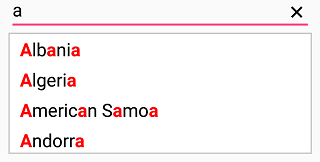

# Highlighting matched text

## Highlighting matched text in Xamarin SfAutoComplete

Highlight matching characters in a suggestion list to pick an item with more clarity. There are two ways to highlight the matching text:

* First Occurrence

* Multiple Occurrence

The text highlight can be indicated with various customizing styles by enabling the below properties. They are

* HighlightedTextColor -  sets the color of the highlighted text for differentiating the highlighted characters.

* HighlightTextFontAttributes - sets the FontAttributes of the highlighted text.

## First Occurrence

It highlights the first position of the matching characters in the suggestion list.





<?xml version="1.0" encoding="utf-8" ?>
<ContentPage xmlns="http://xamarin.com/schemas/2014/forms"
             xmlns:x="http://schemas.microsoft.com/winfx/2009/xaml"
             xmlns:autocomplete="clr-namespace:Syncfusion.SfAutoComplete.XForms;assembly=Syncfusion.SfAutoComplete.XForms"
             xmlns:ListCollection="clr-namespace:System.Collections.Generic;assembly=netstandard"
             xmlns:local="clr-namespace:AutocompleteSample"
             x:Class="AutocompleteSample.MainPage">
    <StackLayout VerticalOptions="Start" 
                 HorizontalOptions="Start" 
                 Padding="30">
        <autocomplete:SfAutoComplete HeightRequest="40"
                                     TextHighlightMode="FirstOccurrence"
                                     HighlightedTextColor="Red"
                                     HighlightedTextFontAttributes="Bold"
                                     SuggestionMode="StartsWith">
            <autocomplete:SfAutoComplete.AutoCompleteSource>
                <ListCollection:List x:TypeArguments="x:String">
                    <x:String>Albania</x:String>
                    <x:String>Algeria</x:String>
                    <x:String>American Samoa</x:String>
                    <x:String>Andorra</x:String>
                </ListCollection:List>
            </autocomplete:SfAutoComplete.AutoCompleteSource>
        </autocomplete:SfAutoComplete>
    </StackLayout>
</ContentPage>





using Syncfusion.SfAutoComplete.XForms;
using System.Collections.Generic;
using Xamarin.Forms;

namespace AutocompleteSample
{
    public partial class MainPage : ContentPage
    {
        public MainPage()
        {
            InitializeComponent();
            StackLayout stackLayout = new StackLayout()
            {
                VerticalOptions = LayoutOptions.Start,
                HorizontalOptions = LayoutOptions.Start,
                Padding = new Thickness(30)
            };

            SfAutoComplete autoComplete = new SfAutoComplete()
            {
                HeightRequest = 40,
                SuggestionMode = SuggestionMode.StartsWith,
                TextHighlightMode = OccurrenceMode.FirstOccurrence,
                HighlightedTextColor = Color.Red,
                HighlightedTextFontAttributes = FontAttributes.Bold,
                AutoCompleteSource = new List<string>()
                {
                    "Albania",
                    "Algeria",
                    "American Samoa",
                    "Andorra"
                }
            };

            stackLayout.Children.Add(autoComplete);
            this.Content = stackLayout;
        }
    }
}





## Multiple Occurrence

It highlights the matching character that are present everywhere in the suggestion list for Contains case in SuggestionMode.





<?xml version="1.0" encoding="utf-8" ?>
<ContentPage xmlns="http://xamarin.com/schemas/2014/forms"
             xmlns:x="http://schemas.microsoft.com/winfx/2009/xaml"
             xmlns:autocomplete="clr-namespace:Syncfusion.SfAutoComplete.XForms;assembly=Syncfusion.SfAutoComplete.XForms"
             xmlns:ListCollection="clr-namespace:System.Collections.Generic;assembly=netstandard"
             xmlns:local="clr-namespace:AutocompleteSample"
             x:Class="AutocompleteSample.MainPage">
    <StackLayout VerticalOptions="Start" 
                 HorizontalOptions="Start" 
                 Padding="30">
        <autocomplete:SfAutoComplete HeightRequest="40"
                                     TextHighlightMode="MultipleOccurrence"
                                     HighlightedTextColor="Red"
                                     HighlightedTextFontAttributes="Bold"
                                     SuggestionMode="Contains">
            <autocomplete:SfAutoComplete.AutoCompleteSource>
                <ListCollection:List x:TypeArguments="x:String">
                    <x:String>Albania</x:String>
                    <x:String>Algeria</x:String>
                    <x:String>American Samoa</x:String>
                    <x:String>Andorra</x:String>
                </ListCollection:List>
            </autocomplete:SfAutoComplete.AutoCompleteSource>
        </autocomplete:SfAutoComplete>
    </StackLayout>
</ContentPage>





using Syncfusion.SfAutoComplete.XForms;
using System.Collections.Generic;
using Xamarin.Forms;

namespace AutocompleteSample
{
    public partial class MainPage : ContentPage
    {
        public MainPage()
        {
            InitializeComponent();
            StackLayout stackLayout = new StackLayout()
            {
                VerticalOptions = LayoutOptions.Start,
                HorizontalOptions = LayoutOptions.Start,
                Padding = new Thickness(30)
            };

            SfAutoComplete autoComplete = new SfAutoComplete()
            {
                HeightRequest = 40,
                SuggestionMode = SuggestionMode.Contains,
                TextHighlightMode = OccurrenceMode.MultipleOccurrence,
                HighlightedTextColor = Color.Red,
                HighlightedTextFontAttributes = FontAttributes.Bold,
                AutoCompleteSource = new List<string>()
                {
                    "Albania",
                    "Algeria",
                    "American Samoa",
                    "Andorra"
                }
            };

            stackLayout.Children.Add(autoComplete);
            this.Content = stackLayout;
        }
    }
}




