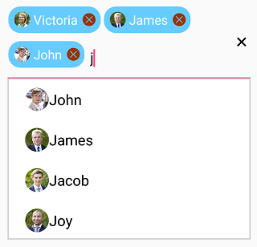

# Multiple Selection in Xamarin.Forms AutoComplete

## Overview

The [`SfAutoComplete`](https://help.syncfusion.com/cr/xamarin/Syncfusion.SfAutoComplete.XForms.SfAutoComplete.html) control allows users to select multiple items from a suggestion list. There are two ways to implement multiple selection:
* Token Representation
* Delimiter

## Token Representation

In token representation mode, selected items are displayed as customizable tokens, and users can remove each tokenized item using the close button.





<?xml version="1.0" encoding="utf-8" ?>
<ContentPage xmlns="http://xamarin.com/schemas/2014/forms"
             xmlns:x="http://schemas.microsoft.com/winfx/2009/xaml"
             xmlns:autocomplete="clr-namespace:Syncfusion.SfAutoComplete.XForms;assembly=Syncfusion.SfAutoComplete.XForms"
             xmlns:ListCollection="clr-namespace:System.Collections.Generic;assembly=netstandard"
             xmlns:local="clr-namespace:AutocompleteSample"
             x:Class="AutocompleteSample.MainPage">
    <StackLayout VerticalOptions="Start" 
                 HorizontalOptions="Start" 
                 Padding="30">
        <autocomplete:SfAutoComplete x:Name="autoComplete" 
                                     HeightRequest="40"
                                     MultiSelectMode="Token" 
                                     TokensWrapMode="Wrap" 
                                     IsSelectedItemsVisibleInDropDown="false">
            <autocomplete:SfAutoComplete.AutoCompleteSource>
                <ListCollection:List x:TypeArguments="x:String">
                    <x:String>India</x:String>
                    <x:String>Uganda</x:String>
                    <x:String>Ukraine</x:String>
                    <x:String>Canada</x:String>
                    <x:String>United Arab Emirates</x:String>
                </ListCollection:List>
            </autocomplete:SfAutoComplete.AutoCompleteSource>
        </autocomplete:SfAutoComplete>
    </StackLayout>
</ContentPage>





using Syncfusion.SfAutoComplete.XForms;
using System.Collections.Generic;
using Xamarin.Forms;

namespace AutocompleteSample
{
    public partial class MainPage : ContentPage
    {
        public MainPage()
        {
            InitializeComponent();
            StackLayout stackLayout = new StackLayout()
            {
                VerticalOptions = LayoutOptions.Start,
                HorizontalOptions = LayoutOptions.Start,
                Padding = new Thickness(30)
            };

            SfAutoComplete autoComplete = new SfAutoComplete()
            {
                HeightRequest = 40,
                MultiSelectMode = MultiSelectMode.Token,
                TokensWrapMode = TokensWrapMode.Wrap,
                IsSelectedItemsVisibleInDropDown = false,
                AutoCompleteSource = new List<string>()
                {
                    "India",
                    "Uganda",
                    "Ukraine",
                    "Canada",
                    "United Arab Emirates"
                }
            };

            stackLayout.Children.Add(autoComplete);
            this.Content = stackLayout;
        }
    }
}





### Token Wrap Modes
The selected items can be displayed as tokens inside the [`SfAutoComplete`](https://help.syncfusion.com/cr/xamarin/Syncfusion.SfAutoComplete.XForms.SfAutoComplete.html) control in two ways:

* [`Wrap`](https://help.syncfusion.com/cr/xamarin/Syncfusion.SfAutoComplete.XForms.TokensWrapMode.html#Syncfusion_SfAutoComplete_XForms_TokensWrapMode_Wrap) - When [`TokensWrapMode`](https://help.syncfusion.com/cr/xamarin/Syncfusion.SfAutoComplete.XForms.SfAutoComplete.html#Syncfusion_SfAutoComplete_XForms_SfAutoComplete_TokensWrapMode) is set to `Wrap`, the selected items will wrap to the next line of the control.

* [`None`](https://help.syncfusion.com/cr/xamarin/Syncfusion.SfAutoComplete.XForms.TokensWrapMode.html#Syncfusion_SfAutoComplete_XForms_TokensWrapMode_None) - When [`TokensWrapMode`](https://help.syncfusion.com/cr/xamarin/Syncfusion.SfAutoComplete.XForms.SfAutoComplete.html#Syncfusion_SfAutoComplete_XForms_SfAutoComplete_TokensWrapMode) is set to `None`, the selected items will be arranged horizontally.

The following example demonstrates how to use token representation with images:





<?xml version="1.0" encoding="utf-8" ?>
<ContentPage xmlns="http://xamarin.com/schemas/2014/forms"
             xmlns:x="http://schemas.microsoft.com/winfx/2009/xaml"
             xmlns:autocomplete="clr-namespace:Syncfusion.SfAutoComplete.XForms;assembly=Syncfusion.SfAutoComplete.XForms"
             xmlns:ListCollection="clr-namespace:System.Collections.Generic;assembly=netstandard"
             xmlns:local="clr-namespace:AutocompleteSample"
             x:Class="AutocompleteSample.MainPage">
    <ContentPage.BindingContext>
        <local:EmployeeViewModel/>
    </ContentPage.BindingContext>
    <ContentPage.Content>
    <StackLayout VerticalOptions="Start" 
                 HorizontalOptions="Start" 
                 Padding="30">
        <autocomplete:SfAutoComplete x:Name="autoComplete" 
                                     HeightRequest="40"
                                     DropDownItemHeight="50" 
                                     DisplayMemberPath="Name" 
                                     ImageMemberPath="Image" 
                                     MultiSelectMode="Token" 
                                     TokensWrapMode="Wrap"
                                     DataSource="{Binding EmployeeCollection}">
        </autocomplete:SfAutoComplete>
    </StackLayout>
    </ContentPage.Content>
</ContentPage>





using System;
using System.Collections.ObjectModel;
using System.ComponentModel;
using Xamarin.Forms;

namespace AutocompleteSample
{
	public partial class MainPage : ContentPage
	{
		public MainPage()
		{
			InitializeComponent();
			EmployeeViewModel employeeViewModel = new EmployeeViewModel();
			this.BindingContext = employeeViewModel;
			StackLayout stackLayout = new StackLayout()
			{
				VerticalOptions = LayoutOptions.Start,
				HorizontalOptions = LayoutOptions.Start,
				Padding = new Thickness(30)
			};

            SfAutoComplete autoComplete = new SfAutoComplete()
            {
                HeightRequest = 40,
                DropDownItemHeight = 50,
                DataSource = employeeViewModel.EmployeeCollection,
                DisplayMemberPath = "Name",
                ImageMemberPath = "Image",
                TokensWrapMode = TokensWrapMode.Wrap,
                MultiSelectMode = MultiSelectMode.Token,
            };

			stackLayout.Children.Add(autoComplete);
			this.Content = stackLayout;
		}
	}
}





### Business Model for Token Example
Define a simple model class `Employee` with properties for Name and Image, and populate employee data in the ViewModel:





namespace AutocompleteSample
{
    public class Employee
    {
        private string image;
        public string Image
        {
            get { return image; }
            set { image = value; }
        }
        private string name;
        public string Name
        {
            get { return name; }
            set { name = value; }
        }
    }
    // Create EmployeeViewModel class holds the collection of employee data.

    public class EmployeeViewModel : INotifyPropertyChanged
    {
        private ObservableCollection<Employee> employeeCollection;
        public ObservableCollection<Employee> EmployeeCollection
        {
            get { return employeeCollection; }
            set { employeeCollection = value; }
        }
        public EmployeeViewModel()
        {
            employeeCollection = new ObservableCollection<Employee>();
            employeeCollection.Add(new Employee() { Image = "John.png", Name = "John" });
            employeeCollection.Add(new Employee() { Image = "James.png", Name = "James" });
            employeeCollection.Add(new Employee() { Image = "Jacob.png", Name = "Jacob" });
            employeeCollection.Add(new Employee() { Image = "Joy.png", Name = "Joy" });
            employeeCollection.Add(new Employee() { Image = "Justin.png", Name = "Justin" });
            employeeCollection.Add(new Employee() { Image = "Jerome.png", Name = "Jerome" });
            employeeCollection.Add(new Employee() { Image = "Jessica.png", Name = "Jessica" });
            employeeCollection.Add(new Employee() { Image = "Victoria.png", Name = "Victoria" });

        }

        public int GetHeight(bool value)
        {
            if (value)
            {
                return 80;
            }
            return 40;
        }

        private int toHeight = 40;
        public int ToHeight
        {
            get { return toHeight; }
            set
            {
                toHeight = value;
                RaisePropertyChanged("ToHeight");
            }
        }
        private bool isToFocused = false;
        public bool IsToFocused
        {
            get { return isToFocused; }
            set
            {
                isToFocused = value;
                ToHeight = GetHeight(value);
                RaisePropertyChanged("IsToFocused");
            }
        }
        public event PropertyChangedEventHandler PropertyChanged;
        private void RaisePropertyChanged(String name)
        {
            if (PropertyChanged != null)
                this.PropertyChanged(this, new PropertyChangedEventArgs(name));
        }
    }
}





 
### Token Customization

You can customize tokens in various ways using the [`TokenSettings`](https://help.syncfusion.com/cr/xamarin/Syncfusion.SfAutoComplete.XForms.TokenSettings.html) property:
* [`TextColor`](https://help.syncfusion.com/cr/xamarin/Syncfusion.SfAutoComplete.XForms.TokenSettings.html#Syncfusion_SfAutoComplete_XForms_TokenSettings_TextColor) - Sets the color of the text inside the token
* [`FontSize`](https://help.syncfusion.com/cr/xamarin/Syncfusion.SfAutoComplete.XForms.TokenSettings.html#Syncfusion_SfAutoComplete_XForms_TokenSettings_FontSize) - Sets the size of the font inside the token
* [`FontFamily`](https://help.syncfusion.com/cr/xamarin/Syncfusion.SfAutoComplete.XForms.TokenSettings.html#Syncfusion_SfAutoComplete_XForms_TokenSettings_FontFamily) - Sets the font family for the text inside the token
* [`BackgroundColor`](https://help.syncfusion.com/cr/xamarin/Syncfusion.SfAutoComplete.XForms.TokenSettings.html#Syncfusion_SfAutoComplete_XForms_TokenSettings_BackgroundColor) - Sets the background color of the token
* [`SelectedBackgroundColor`](https://help.syncfusion.com/cr/xamarin/Syncfusion.SfAutoComplete.XForms.TokenSettings.html#Syncfusion_SfAutoComplete_XForms_TokenSettings_SelectedBackgroundColor) - Sets the background color of the token when it is selected
* [`IsCloseButtonVisible`](https://help.syncfusion.com/cr/xamarin/Syncfusion.SfAutoComplete.XForms.TokenSettings.html#Syncfusion_SfAutoComplete_XForms_TokenSettings_IsCloseButtonVisible) - Enables or disables the close button inside the token
* [`DeleteButtonColor`](https://help.syncfusion.com/cr/xamarin/Syncfusion.SfAutoComplete.XForms.TokenSettings.html#Syncfusion_SfAutoComplete_XForms_TokenSettings_DeleteButtonColor) - Sets the color of the close button
* [`CornerRadius`](https://help.syncfusion.com/cr/xamarin/Syncfusion.SfAutoComplete.XForms.TokenSettings.html#Syncfusion_SfAutoComplete_XForms_TokenSettings_CornerRadius) - Sets the corner radius for the token
* [`DeleteButtonPlacement`](https://help.syncfusion.com/cr/xamarin/Syncfusion.SfAutoComplete.XForms.TokenSettings.html#Syncfusion_SfAutoComplete_XForms_TokenSettings_DeleteButtonPlacement) - Sets the placement of the delete button (Left or Right)

> **Note**
> [`SelectedBackgroundColor`](https://help.syncfusion.com/cr/xamarin/Syncfusion.SfAutoComplete.XForms.TokenSettings.html#Syncfusion_SfAutoComplete_XForms_TokenSettings_SelectedBackgroundColor) and [`CornerRadius`](https://help.syncfusion.com/cr/xamarin/Syncfusion.SfAutoComplete.XForms.TokenSettings.html#Syncfusion_SfAutoComplete_XForms_TokenSettings_CornerRadius) are supported only on iOS and Android platforms.





<?xml version="1.0" encoding="utf-8" ?>
<ContentPage xmlns="http://xamarin.com/schemas/2014/forms"
             xmlns:x="http://schemas.microsoft.com/winfx/2009/xaml"
             xmlns:autocomplete="clr-namespace:Syncfusion.SfAutoComplete.XForms;assembly=Syncfusion.SfAutoComplete.XForms"
             xmlns:ListCollection="clr-namespace:System.Collections.Generic;assembly=netstandard"
             xmlns:local="clr-namespace:AutocompleteSample"
             x:Class="AutocompleteSample.MainPage">
    <ContentPage.BindingContext>
        <local:EmployeeViewModel/>
    </ContentPage.BindingContext>
    <ContentPage.Content>
        <StackLayout>
            <autocomplete:SfAutoComplete
            DisplayMemberPath="Name" 
            MultiSelectMode="Token" 
            ImageMemberPath="Image"
            TokensWrapMode="Wrap" 
            DataSource="{Binding EmployeeCollection}">
                <autocomplete:SfAutoComplete.TokenSettings>
                    <autocomplete:TokenSettings
                        FontSize="16"
                        BackgroundColor="#66ccff"
                        TextColor="White" 
                        SelectedBackgroundColor="#ffffe0"
                        DeleteButtonColor="#993300"
                        FontFamily="Times New Roman"
                        DeleteButtonPlacement="Right"
                        IsCloseButtonVisible="true"
                        CornerRadius="15"/>
                </autocomplete:SfAutoComplete.TokenSettings>
            </autocomplete:SfAutoComplete>
        </StackLayout>
    </ContentPage.Content>
</ContentPage>





using Syncfusion.SfAutoComplete.XForms;
using System.Collections.ObjectModel;
using Xamarin.Forms;

namespace AutocompleteSample
{
    public partial class MainPage : ContentPage
    {
        public MainPage()
        {
            InitializeComponent();
            this.BindingContext = new EmployeeViewModel();
            StackLayout stackLayout = new StackLayout();
            SfAutoComplete autoComplete = new SfAutoComplete()
            {
                MultiSelectMode = MultiSelectMode.Token,
                DisplayMemberPath = "Name",
                ImageMemberPath = "Image",
                TokensWrapMode = TokensWrapMode.Wrap,
            };
            autoComplete.SetBinding(SfAutoComplete.DataSourceProperty, "EmployeeCollection");
            autoComplete.TokenSettings = new TokenSettings()
            {
                FontSize = 16,
                BackgroundColor = Color.FromHex("#66ccff"),
                TextColor = Color.White,
                SelectedBackgroundColor = Color.FromHex("#ffffe0"),
                DeleteButtonColor = Color.FromHex("#993300"),
                FontFamily = "Times New Roman",
                IsCloseButtonVisible = true,
                DeleteButtonPlacement = DeleteButtonPlacement.Right,
                CornerRadius = 15
            };
            stackLayout.Children.Add(autoComplete);
            this.Content = stackLayout;
        }
    }
}





## Delimiter Mode

In delimiter mode, selected items are separated by a specified character. You can set the delimiter character using the [`Delimiter`](https://help.syncfusion.com/cr/xamarin/Syncfusion.SfAutoComplete.XForms.SfAutoComplete.html#Syncfusion_SfAutoComplete_XForms_SfAutoComplete_Delimiter) property.





<?xml version="1.0" encoding="utf-8" ?>
<ContentPage xmlns="http://xamarin.com/schemas/2014/forms"
             xmlns:x="http://schemas.microsoft.com/winfx/2009/xaml"
             xmlns:autocomplete="clr-namespace:Syncfusion.SfAutoComplete.XForms;assembly=Syncfusion.SfAutoComplete.XForms"
             xmlns:ListCollection="clr-namespace:System.Collections.Generic;assembly=netstandard"
             xmlns:local="clr-namespace:AutocompleteSample"
             x:Class="AutocompleteSample.MainPage">
    <StackLayout VerticalOptions="Start" 
                 HorizontalOptions="Start" 
                 Padding="30">
        <autocomplete:SfAutoComplete x:Name="autoComplete"
                                     HeightRequest="40" 
                                     MultiSelectMode="Delimiter"  
                                     Delimiter=",">
            <autocomplete:SfAutoComplete.AutoCompleteSource>
                <ListCollection:List x:TypeArguments="x:String">
                    <x:String>India</x:String>
                    <x:String>Uganda</x:String>
                    <x:String>Ukraine</x:String>
                    <x:String>Canada</x:String>
                    <x:String>United Arab Emirates</x:String>
                </ListCollection:List>
            </autocomplete:SfAutoComplete.AutoCompleteSource>
        </autocomplete:SfAutoComplete>
    </StackLayout>
</ContentPage>

N> The optimal value for Delimiter property is any single character.





using Syncfusion.SfAutoComplete.XForms;
using System.Collections.Generic;
using Xamarin.Forms;

namespace AutocompleteSample
{

    public partial class MainPage : ContentPage
    {
        public MainPage()
        {
            InitializeComponent();
            StackLayout stackLayout = new StackLayout()
            {
                VerticalOptions = LayoutOptions.Start,
                HorizontalOptions = LayoutOptions.Start,
                Padding = new Thickness(30)
            };

            SfAutoComplete autoComplete = new SfAutoComplete()
            {
                HeightRequest = 40,
                MultiSelectMode = MultiSelectMode.Delimiter,
                Delimiter = ",",
                AutoCompleteSource = new List<string>()
                {
                    "India",
                    "Uganda",
                    "Ukraine",
                    "Canada",
                    "United Arab Emirates"
                }
            };

            stackLayout.Children.Add(autoComplete);
            this.Content = stackLayout;
        }
    }
}





## Selection Indicator

You can indicate which items are selected in the dropdown list when using multiple selection by enabling the [`EnableSelectionIndicator`](https://help.syncfusion.com/cr/xamarin/Syncfusion.SfAutoComplete.XForms.SfAutoComplete.html#Syncfusion_SfAutoComplete_XForms_SfAutoComplete_EnableSelectionIndicator) property. You can also customize the indicator's appearance.

> **Note**
> Selection Indicator support is available only on iOS and Android platforms.





<?xml version="1.0" encoding="utf-8" ?>
<ContentPage xmlns="http://xamarin.com/schemas/2014/forms"
             xmlns:x="http://schemas.microsoft.com/winfx/2009/xaml"
             xmlns:autocomplete="clr-namespace:Syncfusion.SfAutoComplete.XForms;assembly=Syncfusion.SfAutoComplete.XForms"
             xmlns:ListCollection="clr-namespace:System.Collections.Generic;assembly=netstandard"
             xmlns:local="clr-namespace:AutocompleteSample"
             x:Class="AutocompleteSample.MainPage">
    <ContentPage.Resources>
        <ResourceDictionary>
            <OnPlatform x:TypeArguments="x:String"
                        x:Key="customfontfamily" 
                        iOS="Sample" 
                        Android="sample.ttf" 
                        WinPhone="sample.ttf#Sample"  />
        </ResourceDictionary>
    </ContentPage.Resources>
    <ContentPage.BindingContext>
        <local:EmployeeViewModel/>
    </ContentPage.BindingContext>
    <StackLayout VerticalOptions="Start" 
                 HorizontalOptions="Start" 
                 Padding="30">
        <autocomplete:SfAutoComplete x:Name="autoComplete" 
                                     HeightRequest="40" 
                                     ShowSuggestionsOnFocus="true" 
                                     IsSelectedItemsVisibleInDropDown="true" 
                                     IndicatorText="A"  
                                     IndicatorTextSize="15" 
                                     IndicatorFontFamily="{StaticResource customfontfamily}" 
                                     IndicatorTextColor="Red" 
                                     EnableSelectionIndicator="true" 
                                     MultiSelectMode="Token"
                                     DataSource="{Binding EmployeeCollection}"/>
    </StackLayout>
</ContentPage>
       




using Syncfusion.SfAutoComplete.XForms;
using System.Collections.ObjectModel;
using Xamarin.Forms;

namespace AutocompleteSample
{
    public partial class MainPage : ContentPage
    {
        public MainPage()
        {
            InitializeComponent();
            EmployeeViewModel viewModel = new EmployeeViewModel();
            StackLayout stackLayout = new StackLayout()
            {
                VerticalOptions = LayoutOptions.Start,
                HorizontalOptions = LayoutOptions.Start,
                Padding = new Thickness(30)
            };

            SfAutoComplete autoComplete = new SfAutoComplete()
            {
                HeightRequest = 40,
                ShowSuggestionsOnFocus = true,
                IsSelectedItemsVisibleInDropDown = true,
                IndicatorText = "A",
                IndicatorTextSize = 15,
                IndicatorFontFamily = Device.RuntimePlatform == "iOS" ? "Sample" : Device.RuntimePlatform == "Android" ? "sample.ttf" : "sample.ttf#Sample",
                IndicatorTextColor = Color.Red,
                EnableSelectionIndicator = true,
                MultiSelectMode = MultiSelectMode.Token,
                DataSource = viewModel.EmployeeCollection,
            };

            stackLayout.Children.Add(autoComplete);
            this.Content = stackLayout;
        }
    }
}





### Item padding

The autocomplete enables the user to provide padding for the items inside dropdown using [`ItemPadding`](https://help.syncfusion.com/cr/xamarin/Syncfusion.SfAutoComplete.XForms.SfAutoComplete.html#Syncfusion_SfAutoComplete_XForms_SfAutoComplete_ItemPadding) property.

N> [`ItemPadding`](https://help.syncfusion.com/cr/xamarin/Syncfusion.SfAutoComplete.XForms.SfAutoComplete.html#Syncfusion_SfAutoComplete_XForms_SfAutoComplete_ItemPadding) property is available only on iOS and Android platform.





 <?xml version="1.0" encoding="utf-8" ?>
<ContentPage xmlns="http://xamarin.com/schemas/2014/forms"
             xmlns:x="http://schemas.microsoft.com/winfx/2009/xaml"
             xmlns:autocomplete="clr-namespace:Syncfusion.SfAutoComplete.XForms;assembly=Syncfusion.SfAutoComplete.XForms"
             xmlns:ListCollection="clr-namespace:System.Collections.Generic;assembly=netstandard"
             xmlns:local="clr-namespace:AutocompleteSample"
             x:Class="AutocompleteSample.MainPage">
    <StackLayout VerticalOptions="Start" 
                 HorizontalOptions="Start" 
                 Padding="30">
        <autocomplete:SfAutoComplete  x:Name="autoComplete" 
                                      ShowSuggestionsOnFocus="true" 
                                     ItemPadding="20,10,0,0" 
                                     MultiSelectMode="Token">
            <autocomplete:SfAutoComplete.AutoCompleteSource>
                <ListCollection:List x:TypeArguments="x:String">
                    <x:String>India</x:String>
                    <x:String>Uganda</x:String>
                    <x:String>Ukraine</x:String>
                    <x:String>Canada</x:String>
                    <x:String>United Arab Emirates</x:String>
                </ListCollection:List>
            </autocomplete:SfAutoComplete.AutoCompleteSource>
        </autocomplete:SfAutoComplete>
    </StackLayout>
</ContentPage>
       




using Syncfusion.SfAutoComplete.XForms;
using System.Collections.Generic;
using Xamarin.Forms;

namespace AutocompleteSample
{
    public partial class MainPage : ContentPage
    {
        public MainPage()
        {
            InitializeComponent();
            StackLayout stackLayout = new StackLayout()
            {
                VerticalOptions = LayoutOptions.Start,
                HorizontalOptions = LayoutOptions.Start,
                Padding = new Thickness(30)
            };

            SfAutoComplete autoComplete = new SfAutoComplete()
            {
                HeightRequest = 40,
                MultiSelectMode = MultiSelectMode.Token,
                ShowSuggestionsOnFocus = true,
                ItemPadding = new Thickness(20, 10, 0, 0),
                AutoCompleteSource = new List<string>()
                {
                    "India",
                    "Uganda",
                    "Ukraine",
                    "Canada",
                    "United Arab Emirates"
                }
            };

            stackLayout.Children.Add(autoComplete);
            this.Content = stackLayout;
        }
    }
}





N> You can refer to our [Xamarin AutoComplete](https://www.syncfusion.com/xamarin-ui-controls/xamarin-autocomplete) feature tour page for its groundbreaking feature representations. You can also explore our [Xamarin.Forms AutoComplete example](https://github.com/syncfusion/xamarin-demos/tree/master/Forms/AutoComplete) to knows the functionalities of each feature.
