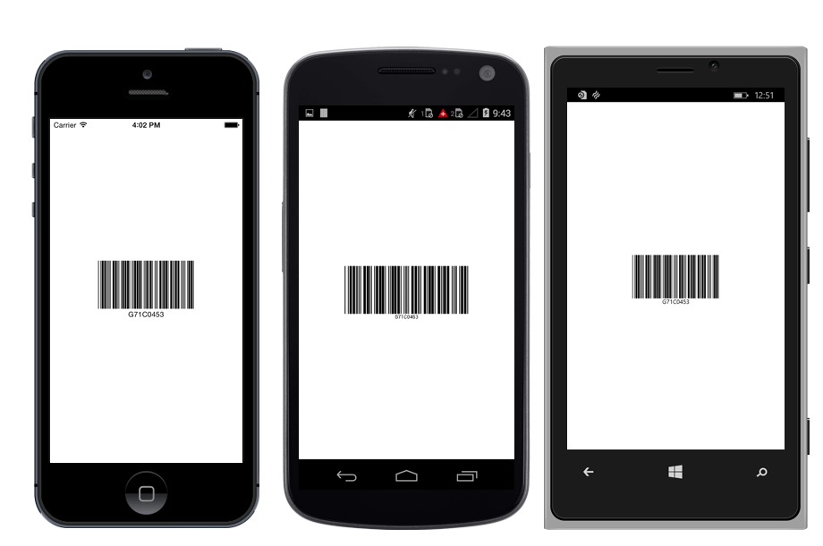
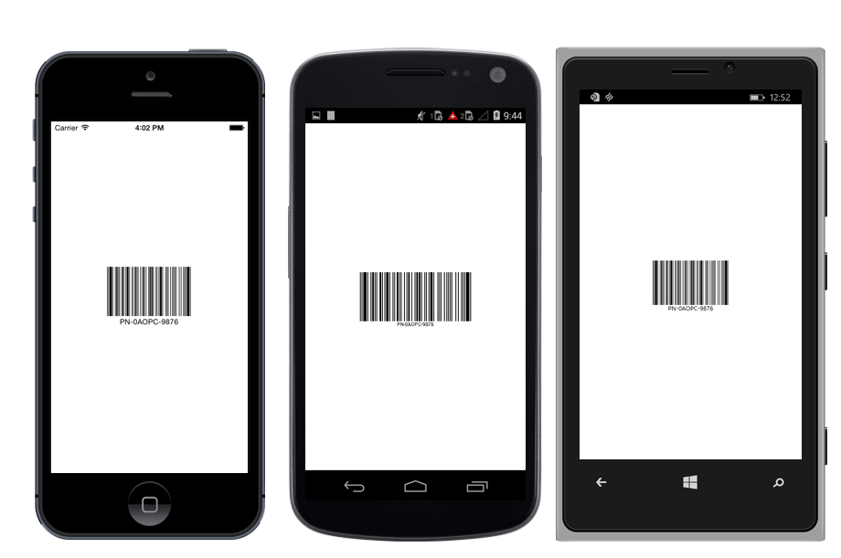
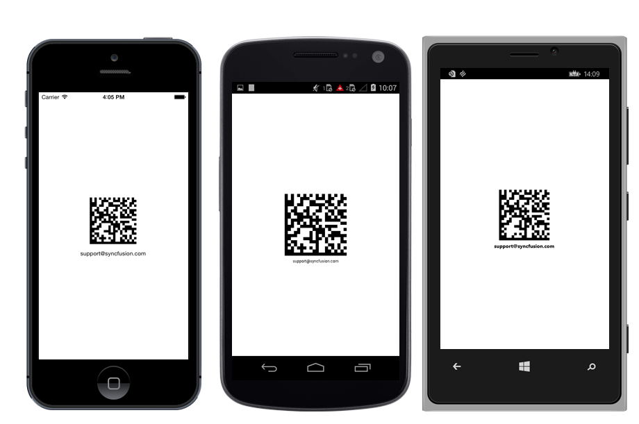

---

layout: post
title: Supported Symbologies in Syncfusion SfBarcode control for Xamarin.Forms
description: Different Symbologies supported in SfBarcode control
platform: xamarin
control: SfBarcode
documentation: ug

---

# SUPPORTED SYMBOLOGIES

 Essential Barcode supports 10 variants of one dimensional and 2 variants of two dimensional Barcodes that are illustrated as follows.

## One Dimensional Barcodes

One dimensional Barcode is also called as linear Barcode. The bars and spaces signified for each symbol in one dimensional Barcodes are grouped in such a way to represent a specific ASCII character.

* Codabar
* Code 11
* Code 32
* Code 39
* Code 39 Extended
* Code 93
* Code 93 Extended
* Code 128A
* Code 128B
* Code 128C

### Codabar

`Codabar` is a discrete numeric symbology that is used in libraries, blood banks and a variety of other information processing applications.

* Encodes only numeric characters and some special characters like dash (-), colon (:), slash (/), plus (+).
* Each character has three bars and four spaces.
* Uses characters of A, B, C, D as start and stop characters.



    barcode.Symbology = BarcodeSymbolType.CodaBar;



Codabar barcode

{:.caption}

### Code 11

`Code11` Symbology is used mainly for labeling the telecommunications equipment and it has the following structure.

* Allows character set of digits (0-9), dash (-).
* Each character is encoded with 3 bars and 2 spaces.
* Of these five elements, there may be two wide and three narrow elements or one wide and four narrow elements.



    barcode.Symbology = BarcodeSymbolType.Code11;



Code 11 barcode

{:.caption}

### Code 32

`Code32` is mainly used for coding pharmaceuticals, cosmetics and dietetics and it contains the following structure:

* Starts with ‘A’ character (ASCII 65) that is not really encoded.
* Encodes only the character set of length 8.
* One digit for Checksum module 10 that is automatically calculated.



    barcode.Symbology = BarcodeSymbolType.Code32;



Code32 barcode

{:.caption}

### Code 39

`Code39` is a Symbology of Barcode that encodes alphanumeric characters into a series of bars. It may be of any length, although more than 25 characters begin to push the bounds. This Symbology is the only type of the Barcode in common use that does not require a checksum.

* Allows character set of digits (0-9), upper case alphabets (A-Z), and symbols like space, minus (-), plus (+), period (.), dollar sign ($), slash (/), and percent (%).
* Always starts and ends with an asterisk (*) symbol, termed as start and stop character.
* Each character is encoded with 5 bars and 4 spaces where 3 are wide and 6 are narrow.



    barcode.Symbology = BarcodeSymbolType.Code39;



Code 39 barcode

{:.caption}

### Code 39 Extended

`Code39 Extended` Symbology is an extended version of `Code39` that supports full ASCII character set. So, it encodes lower case alphabets (a-z) as well as special characters in the keyboard.


    barcode.Symbology = BarcodeSymbolType.Code39Extended;



Extended Code 39 barcode

{:.caption}

### Code 93

`Code93` is designed to complement and improve upon `Code39`. It represents the full ASCII character set by using the combination of 2 characters. It is a continuous, variable-length symbology and it produces denser code.

* Encodes character set of uppercase alphabets (A-Z), digits (0-9), and special characters like asterisk (*), dash (-), dollar ($), percent (%), Space, dot (.), slash (/), and plus (+).
* The asterisk (*) is not a true encoding character, but it is the start and stop symbol for `Code93` `Symbology`.



    barcode.Symbology = BarcodeSymbolType.Code93;



Code93 barcode 

{:.caption}

### Code 93 Extended

`Code93` is designed to complement and improve upon Code 39. It represents the full ASCII character set by using the combination of 2 characters. It is a continuous, variable-length Symbology and it produces denser code.

* Encodes character set of uppercase alphabets (A-Z), digits (0-9), and special characters like asterisk (*), dash (-), dollar ($), percent (%), Space, dot (.), slash (/), and plus (+).
* The asterisk (*) is not a true encoding character, but it is the start and stop symbol for Code 93 symbology.



    barcode.Symbology = BarcodeSymbolType.Code93Extended;



Code93 Extended barcode

{:.caption}

### Code 128

`Code128` is a variable length, high density, alphanumeric, linear Barcode Symbology. It is capable of encoding full ASCII character set and extended character sets. This symbol includes a checksum digit for verification and the Barcode may also be verified character-by-character for parity of each data byte.

#### Code 128 A

`Code128A` (or Chars Set A) includes all the standard upper case U.S. alphanumeric keyboard characters and punctuation characters together with the control characters, (characters with ASCII values from 0 to 95 inclusive), and seven special characters.



    barcode.Symbology = BarcodeSymbolType.Code128A;



Code128A barcode

{:.caption}

#### Code128 B

`Code128B` (or Chars Set B) includes all the standard upper case alphanumeric keyboard characters and punctuation characters together with the lower case alphabetic characters (characters with ASCII values from 32 to 127 inclusive), and seven special characters.



    barcode.Symbology = BarcodeSymbolType.Code128B;



Code128B barcode

{:.caption}

#### Code128 C

`Code128C` (or Chars Set C) includes a set of 100 digit pairs from 00 to 99 inclusive, as well as three special characters. This allows numeric data to be encoded as two data digits per symbol character effectively twice the density of standard data.



    barcode.Symbology = BarcodeSymbolType.Code128C;



Code128C barcode

{:.caption}

### Code 128 Special characters

The last seven characters of Code Sets A and B (character values 96 - 102) and the last three characters of Code Set C (character values 100 - 102) are special non-data characters with no ASCII character equivalents that have particular significance to the Barcode reading device.

>**NOTE**:
When you specify that the data must be encoded by using Char Set C, then the number of characters after it must be even.

## Two Dimensional Barcodes

Two dimensional Barcode is a way to represent information by using two-dimensional approach. It is similar to one dimensional Barcode, but can represent more data per unit area.

* QR Code
* Data Matrix

### QR Code

QR Code is a two dimensional symbology that is popularly used in automotive industry. It is known for fast readability and greater storage capacity.



    barcode.Symbology = BarcodeSymbolType.QRCode;



QR bar code

{:.caption}

### Data Matrix

DataMatrix symbology is widely used in printed media such as labels and letters. It can be read easily by a Barcode reader and also by mobile phones. It consists of a Grid of dark and light dots or blocks forming square or rectangular symbol. The data encoded in the Barcode can be either number or alphanumeric.



    barcode.Symbology = BarcodeSymbolType.DataMatrix;



Data Matrix bar code

{:.caption}

>**NOTE**:
By default, the width of the quiet zone on all four sides of the Barcode is equal to the dimension of the blocks.