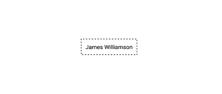
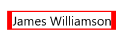

# Customization in Xamarin.Forms Border (SfBorder)

The border control supports customizing the border color, width, corner radius, background color, and more. The border can be customized using the following properties.

## Border color

You can customize the color of the border using the `BorderColor` property.




<border:SfBorder x:Name="border" BorderColor = "Red"  CornerRadius="20" BorderWidth="3">
 <Label Text="James Williamson" 
 TextColor="Black"/>
</border:SfBorder>




SfBorder border = new SfBorder();
border.CornerRadius = 20;
border.BorderColor = Color.Red;
border.BorderWidth = 3;
Label label = new Label();
label.Text = "James Williamson";
label.TextColor = Color.Black;
border.Content = label;
this.Content = border;




## Background color

The background color of the border control can be customized using the `BackgroundColor` property.




<border:SfBorder x:Name="border" BorderColor = "Red" BackgroundColor= "Green" CornerRadius="20" BorderWidth="3">
 <Label Text="James Williamson" 
 TextColor="Black"/>
</border:SfBorder>




SfBorder border = new SfBorder();
border.CornerRadius = 20;
border.BorderColor = Color.Red;
border.BorderWidth = 3;
Label label = new Label();
label.Text = "James Williamson";
label.TextColor = Color.Black;
border.Content = label;
border.BackgroundColor = Color.Green;
this.Content = border;




## Border width

You can customize the thickness of the border using the `BorderWidth` property.




<border:SfBorder x:Name="border" BorderColor = "Red" CornerRadius="20" BorderWidth="12">
 <Label Text="James Williamson" 
 TextColor="Black"/>
</border:SfBorder>




SfBorder border = new SfBorder();
border.CornerRadius = 20;
border.BorderColor = Color.Red;
border.BorderWidth = 12;
Label label = new Label();
label.Text = "James Williamson";
label.TextColor = Color.Black;
border.Content = label;
this.Content = border;




## Dashed border

You can render the border with dashes using the [`DashArray`](https://help.syncfusion.com/cr/xamarin/Syncfusion.XForms.Border.SfBorder.html#Syncfusion_XForms_Border_SfBorder_DashArray) property.



...
xmlns:sys="clr-namespace:System;assembly=netstandard"
...

<border:SfBorder x:Name="border">
    <border:SfBorder.DashArray>
        <x:Array Type="{x:Type sys:Double}">
            <sys:Double>3</sys:Double>
            <sys:Double>4</sys:Double>
        </x:Array>
    </border:SfBorder.DashArray>
    <Label Text="James Williamson" TextColor="Black" />
</border:SfBorder>




SfBorder border = new SfBorder();
border.DashArray = new double[2] { 3, 4 };
Label label = new Label();
label.Text = "James Williamson";
label.TextColor = Color.Black;
border.Content = label;
this.Content = border;




## Corner radius

You can customize the corner radius of the border on four sides using the `CornerRadius` property with type as `Thickness`.




<border:SfBorder x:Name="border" BorderColor = "Red" CornerRadius="0,10,10,0" BorderWidth="12">
 <Label Text="James Williamson" 
 TextColor="Black"/>
</border:SfBorder>




SfBorder border = new SfBorder();
border.CornerRadius =  new Thickness (0,10,10,0);
border.BorderColor = Color.Red;
border.BorderWidth = 12;
Label label = new Label();
label.Text = "James Williamson";
label.TextColor = Color.Black;
border.Content = label;
this.Content = border;




## Adding circular image

You can add any view inside the border control by adding the Content property. The following code sample demonstrates how to apply border using the `CornerRadius` property for a circular image.




<Grid HeightRequest="100" WidthRequest="100" HorizontalOptions="Center" VerticalOptions="Center">
    <border:SfBorder BorderColor="Black" HorizontalOptions="Center" VerticalOptions="Center" CornerRadius="50">
    <Image Source="plus.jpeg" />
    </border:SfBorder>
</Grid>




Grid grid = new Grid();
grid.HeightRequest = 100;
grid.WidthRequest = 100;
grid.HorizontalOptions = LayoutOptions.Center;
grid.VerticalOptions = LayoutOptions.Center;
SfBorder border = new SfBorder();
border.BorderColor = Color.Black;
border.HorizontalOptions = LayoutOptions.Center;
border.VerticalOptions = LayoutOptions.Center;
border.CornerRadius = 50;
Image image = new Image();
image.Source = "plus.jpeg";
border.Content = image;
grid.Children.Add(border);
this.Content = grid;




## Shadow Effect

The border control provides shadow effect support. To enable shadow effect, set the `HasShadow` property to true.

You can customize the color of shadow using the `ShadowColor` property. 





  <border:SfBorder 
                HorizontalOptions="Center" 
                VerticalOptions="Center"
                BackgroundColor="Green"
                HeightRequest="50"
                WidthRequest="200" 
                CornerRadius="20" 
                BorderWidth="0" 
                HasShadow="True"
                ShadowColor="Gray">
            <Label 
                    Text="James Williamson" 
                    HorizontalTextAlignment="Center" 
                    VerticalTextAlignment="Center" 
                    TextColor="White"/>
        </border:SfBorder>
	




SfBorder border = new SfBorder()
            {
                BackgroundColor = Color.Green,
                CornerRadius = 20,
                BorderWidth = 0,
                HeightRequest = 50,
                WidthRequest = 200,
                HorizontalOptions = LayoutOptions.Center,
                VerticalOptions = LayoutOptions.Center,
                HasShadow = true,
                ShadowColor = Color.Gray
            };

            Label label = new Label()
            {
                Text = "James Williamson",
                HorizontalTextAlignment = TextAlignment.Center,
                VerticalTextAlignment = TextAlignment.Center,
                TextColor = Color.White
            };

            border.Content = label;
            this.Content = border;





N> Shadow support has not been provided for UWP Platform.

## BorderThickness

By using the [`BorderThickness`](https://help.syncfusion.com/cr/xamarin/Syncfusion.XForms.Border.SfBorder.html#Syncfusion_XForms_Border_SfBorder_BorderThickness) property, you can customize the border thickness of the border on four sides.




<border:SfBorder x:Name="border" HorizontalOptions="Center" 
 VerticalOptions="Center" BorderColor = "#5534eb" BackgroundColor="#f6f6f6"
 BorderThickness="0,0,0,1" >
 <Label Text="James Williamson" TextColor="#5534eb" HorizontalTextAlignment="Center" VerticalTextAlignment="Center" />
</border:SfBorder>




SfBorder border = new SfBorder();
border.BorderColor = Color.FromHex("#5534eb");
border.BackgroundColor= Color.FromHex("#f6f6f6");
border.BorderThickness =  new Thickness (0,0,0,1);
border.HorizontalOptions = LayoutOptions.Center;
border.VerticalOptions = LayoutOptions.Center;
Label label = new Label();
label.Text = "James Williamson";
label.TextColor = Color.FromHex("#5534eb");
label.HorizontalTextAlignment = TextAlignment.Center;
label.VerticalTextAlignment = TextAlignment.Center;
border.Content = label;
this.Content = border;




N> There is a limitation with `BorderThickness` property while using the `CornerRadius` property in Android and iOS.

