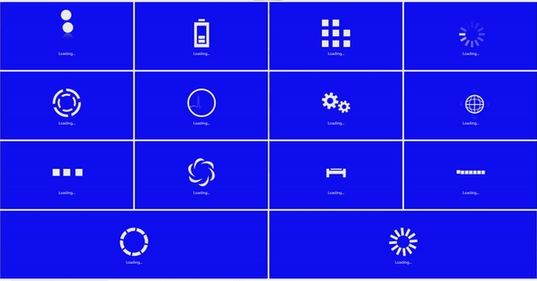

# Animation Type in SfBusyIndicator

## Animation Type in Xamarin BusyIndicator (SfBusyIndicator)

The `AnimationType` property for the SfBusyIndicator allows the users to set one of the 17 animations from the built-in animations. The different types of animations are `Ball`, `HorizontalPulsingBox`, `Rectangle`, `Battery`, `Globe`, `SingleCircle`, `SlicedCircle`, `DoubleCircle`, `ECG`, `Print`, `Box`, `Gear`, `Movie Timer`, `ZoomingTarget`, `RollingBall`, `Cupertino` and `Material`.

N> `Material` animation support has not been provided for UWP Platform.





<?xml version="1.0" encoding="utf-8" ?>
<ContentPage xmlns="http://xamarin.com/schemas/2014/forms"
             xmlns:x="http://schemas.microsoft.com/winfx/2009/xaml"
             xmlns:local="clr-namespace:GettingStarted"
             xmlns:busyindicator="clr-namespace:Syncfusion.SfBusyIndicator.XForms;assembly=Syncfusion.SfBusyIndicator.XForms"
             x:Class="GettingStarted.MainPage">
    <ContentPage.Content>
        <busyindicator:SfBusyIndicator x:Name="busyindicator" 
                                       Title="Ball"
                                       AnimationType="Ball" 
                                       BackgroundColor="LightGray"
                                       TextColor="Blue"/>
    </ContentPage.Content>
</ContentPage>





using Syncfusion.SfBusyIndicator.XForms;
using Xamarin.Forms;

namespace GettingStarted
{
    public partial class MainPage : ContentPage
    {
        public MainPage()
        {
            InitializeComponent();
            SfBusyIndicator busyIndicator = new SfBusyIndicator()
            {
                AnimationType = AnimationTypes.Ball,
                Title = "Ball",
                BackgroundColor="LightGray",
                TextColor = Color.Blue
            };

            this.Content = busyIndicator;
        }
    }
}





The following gif image contains the types of animation in BusyIndicator.

