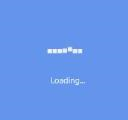
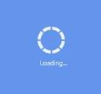
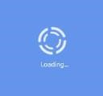

# Animation Type

## Animation Type in Xamarin BusyIndicator (SfBusyIndicator)

The `AnimationType` property for the SfBusyIndicator allows the user to set one of the 15 animations from the built-in animations. The different types of Animations are `Ball`, `HorizontalPulsingBox`, `Rectangle`, `Battery`, `Globe`, `SingleCircle`, `SlicedCircle`, `DoubleCircle`, `ECG`, `Print`, `Box`, `Gear`, `Movie Timer`, `ZoomingTarget`, `RollingBall`.





<?xml version="1.0" encoding="utf-8" ?>
<ContentPage xmlns="http://xamarin.com/schemas/2014/forms"
             xmlns:x="http://schemas.microsoft.com/winfx/2009/xaml"
             xmlns:local="clr-namespace:GettingStarted"
             xmlns:busyindicator="clr-namespace:Syncfusion.SfBusyIndicator.XForms;assembly=Syncfusion.SfBusyIndicator.XForms"
             x:Class="GettingStarted.MainPage">
    <ContentPage.Content>
        <busyindicator:SfBusyIndicator x:Name="busyindicator" 
                                       Title="Loading..."
                                       AnimationType="Ball" 
                                       ViewBoxHeight="100"
                                       ViewBoxWidth="100"
                                       BackgroundColor="Blue"
                                       TextColor="White"/>
    </ContentPage.Content>
</ContentPage>





using Syncfusion.SfBusyIndicator.XForms;
using Xamarin.Forms;

namespace GettingStarted
{
    public partial class MainPage : ContentPage
    {
        public MainPage()
        {
            InitializeComponent();
            SfBusyIndicator busyIndicator = new SfBusyIndicator()
            {
                AnimationType = AnimationTypes.Ball,
                ViewBoxWidth = 100,
                ViewBoxHeight = 100,
                Title = "Loading...",
                BackgroundColor="Blue",
                TextColor = Color.White
            };

            this.Content = busyIndicator;
        }
    }
}





Busy Indicator with Ball type animation 
{:.caption}

 

Busy Indicator with HorizontalPulsingBox type animation 
{:.caption}

 

Busy Indicator with Rectangle type animation 
{:.caption}
 
 

Busy Indicator with Battery type animation 
{:.caption}
 
 

Busy Indicator with Globe type animation 
{:.caption}
 
 

Busy Indicator with SingleCircle type animation 
{:.caption}

 

Busy Indicator with SlicedCircle type animation 
{:.caption}
 
 

Busy Indicator with DoubleCircle type animation 
{:.caption}
 
 

Busy Indicator with ECG type animation 
{:.caption}
 
 

Busy Indicator with Print type animation 
{:.caption}

 

Busy Indicator with Box type animation 
{:.caption}

 

Busy Indicator with Gear type animation 
{:.caption}

 

Busy Indicator with MovieTimer type animation 
{:.caption}

 

Busy Indicator with ZoomingTarget type animation 
{:.caption}

 

Busy Indicator with RollingBall type animation 
{:.caption}

 
