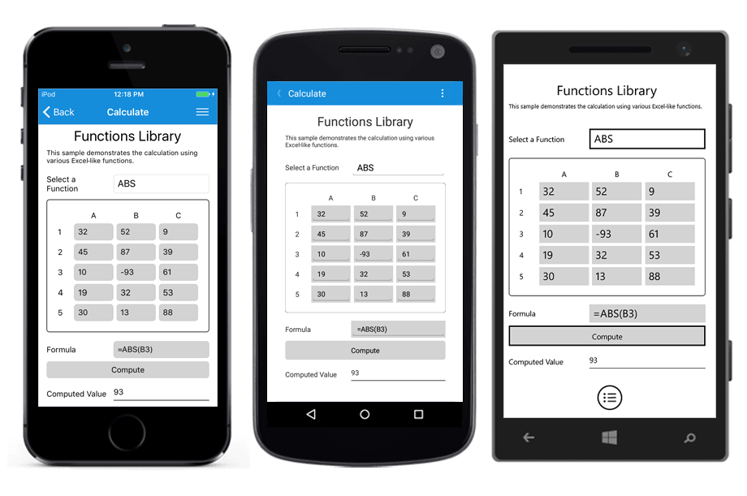
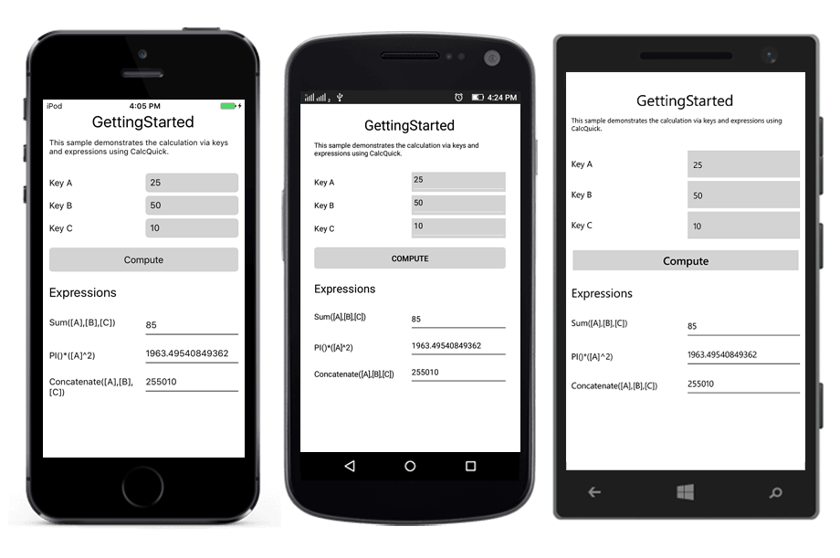

# Getting Started

This section provides a quick overview for working with Calculate for Xamarin.Forms.

## Assembly deployment

After installing **Essential Studio for Xamarin**, you can find all the required assemblies in the following installation folders,

{Syncfusion Essential Studio Installed location}\Essential Studio\{{ site.releaseversion }}\Xamarin\lib

Eg: C:\Program Files (x86)\Syncfusion\Essential Studio\{{ site.releaseversion }}\Xamarin\lib

N> Assemblies can be found in unzipped package location in Mac

Add the following assemblies to the pcl project as shown below:

**PCL project:**

<table>
<tr>
<td>
pcl\Syncfusion.Calculate.Portable.dll
</td>
</tr>
</table>

## Creating a simple application for Calculate

* Create new BlankApp (Xamarin.Forms.Portable) application in **Xamarin Studio** or **Visual Studio** for Xamarin.Forms.
* Add the required assembly references to the project as discussed in Assembly Deployment section.

### Calculate using CalcEngine

This section explains about calculating a simple equation (SQRT (25) * 2) using CalcEngine. The ParseAndComputeFormula method of CalcEngine will be used to parse and calculate the result of the formula or equation like below.



CalcEngine engine = new CalcEngine ();

string formula = "SQRT (25) *2";

string result;

// The result of below code is “10”

result = engine.ParseAndComputeFormula(formula);



### Calculate using ICalcData

ICalcData is used to get and set the values or references.  The values are stored into ICalcData based on cell reference. By using this, compute the expressions or equations using CalcEngine. Here, CalcData class is derived from ICalcData and refer the below code example,



public class CalcData : ICalcData

{
    
    Dictionary<string, object> values = new Dictionary<string, object>();
    
    public event ValueChangedEventHandler ValueChanged;

    public CalcData()
    {

    }

    /// 

    /// Get the value from CalcData by row and col index.
    /// 

    /// <param name="row">RowIndex</param>
    /// <param name="col">ColumnIndex</param>
    /// <returns>Returns the value from CalcData by row and col index</returns>
    public object GetValueRowCol(int row, int col)
    {
        object value = null;

        var key = RangeInfo.GetAlphaLabel(col) + row;

        this.values.TryGetValue(key, out value);

        return value;
    }

    /// 

    /// Store the value to CalcData by row and col index.
    /// 

    /// <param name="value">Value for store in CalcData</param>
    /// <param name="row">RowIndex</param>
    /// <param name="col">ColumnIndex</param>
    public void SetValueRowCol (object value, int row, int col)
    {
        var key = RangeInfo.GetAlphaLabel(col) + row;

        if (!values.ContainsKey(key))
           values.Add(key, value);
        else if (values.ContainsKey(key) && values[key] != value)
           values[key] = value;
    }

    public void WireParentObject()
    {
            
    }

    private void OnValueChanged(int row, int col, string value)
    {
        if (ValueChanged != null)
           ValueChanged(this, new ValueChangedEventArgs(row, col, value));
    }
}



#### Initializing a ICalcData

A ICalcData can be integrated into CalcEngine by passing it through constructor. Similarly, the ICalcData can be registered as a worksheet for identifying the cell references.



CalcData calcData = new CalcData ();

CalcEngine engine = new CalcEngine(calcData);

engine.UseNoAmpersandQuotes = true;



#### Setting value into ICalcData

The **SetValueRowCol** method is used to set the value to ICalcData. Please refer the below code example,



// Set value to CalcData.

calcData.SetValueRowCol(“10”, 1, 1);

calcData.SetValueRowCol(“20”, 1, 2);

calcData.SetValueRowCol(“30”, 2, 1);

calcData.SetValueRowCol(“40”, 2, 2);



The **GetValueRowCol** method is used to get the value from ICalcData. Please refer the below code example,



// Get value from CalcData

calcData.GetValueRowCol(1, 1);

calcData.GetValueRowCol(1, 2);

calcData.GetValueRowCol(2, 1);

calcData.GetValueRowCol(2, 2);



#### Performing calculation

The **ParseAndComputeFormula** is used to evaluate the formulas by get the values from ICalcData by references. Please refer the following code example,



string formula = “SUM (A1, A2, B1, B2)”;

// Result of below code is “100”

result = engine.ParseAndComputeFormula(formula);



#### Performing calculation between sheets

CalcEngine support to performing the calculation by accessing the values from the different sheets. First need to register the sheet with ICalcData and then you can access the values by sheet name like “**Sheet1****!****A1**”. Please refer the below code example,



int i = CalcEngine.CreateSheetFamilyID();

engine.RegisterGridAsSheet("Sheet1", calcData, i);

engine.RegisterGridAsSheet("Sheet2", calcData, i+1);

string formula = “SUM (Sheet1!A1, Sheet2!A1)”;

// Result of below code is “20” 

result = engine.ParseAndComputeFormula(formula);



This is sample output look like on iOS, Android and Windows Phone devices. You can also download the entire source code of this demo from [here](http://files2.syncfusion.com/Xamarin.Forms/Samples/Calculate_FunctionsLibrary.zip).

### Calculate using CalcQuickBase

The CalcQuickBase will provide options to directly parse and compute a formula, or register variable names that can later be used in more complex formulas involving these variables. CalcQuickBase is predefined derived class from ICalcData.

These registered variable names are keys. For example, [C] = [A] + [B] * 10, here the names A, B, C are keys. 

#### Register elements as keys

Create a CalcQuickBase object and registered the key or virtual references like below,



CalcQuickBase calcQuickBase = new CalcQuickBase ();

calcQuickBase[“A”] = “10”;

calcQuickBase[“B”] = “20”;

calcQuickBase[“C”] = “30”;

calcQuickBase[“Expression”] = “=SUM([A], [B], [C])”;



#### Evaluating keys

The evaluation of keys can be triggered using **SetDirty** method which will compute the formulas of the keys. The result will be taken by using the same keys,



string result;

calcQuickBase.SetDirty();

// Result of below code is “60”

result = calcQuickBase[“Expression”];



This is sample output will look like on iOS, Android and Windows Phone devices. You can also download the entire source code of this demo from [here](http://files2.syncfusion.com/Xamarin.Forms/Samples/Calculate_GettingStarted.zip).

