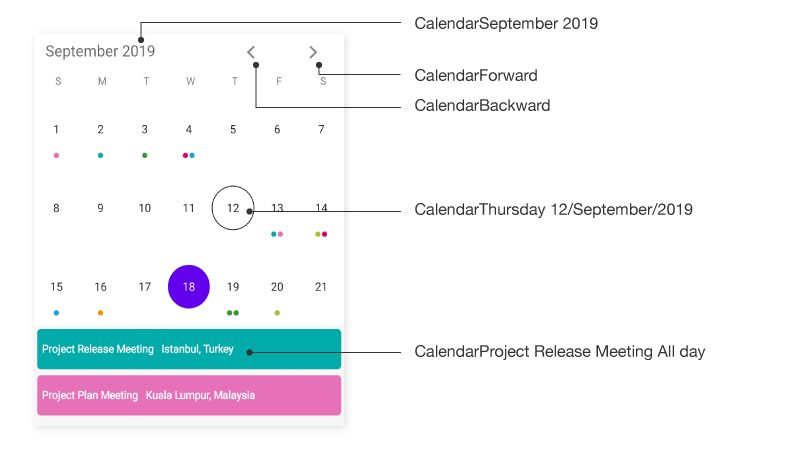
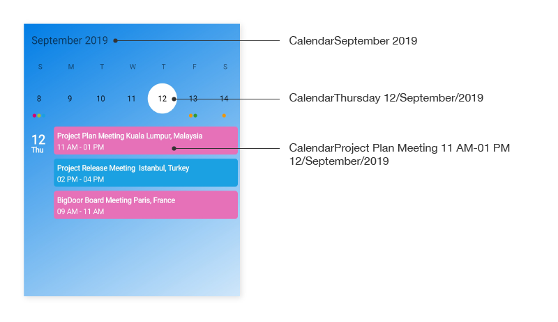
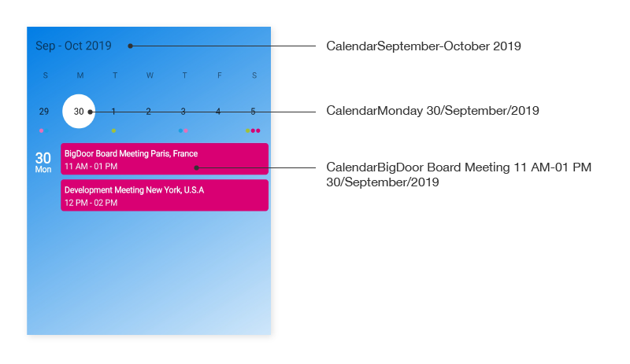
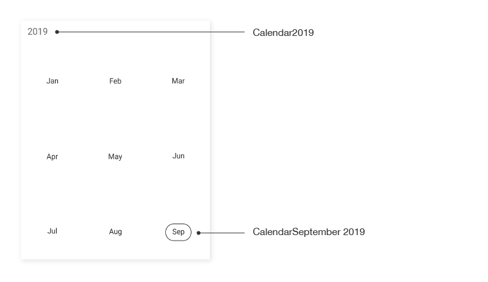
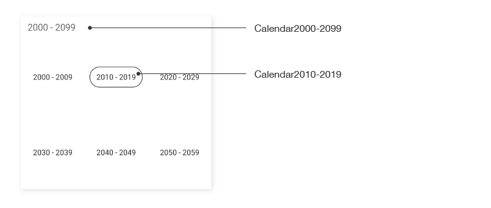

# AutomationId in Xamarin Calendar (SfCalendar)

The `SfCalendar` control has built-in `AutomationId` for inner elements. Please find the following table of Automation IDs for inner elements.

<table>
<tr>
<th align="center" >View</th>
<th align="center" >AutomationId Format</th>
<th align="center" >Example</th>
</tr>

<tr>
<td>MonthCell</td>
<td>dddd dd/MMMM/yyyy</td>
<td>Tuesday 27/May/2018   </td>
</tr>

<tr>
<td>Month Header - Month view</td>
<td>MMMM yyyy</td>
<td>May 2018</td>
</tr>

<tr>
<td>Month Header - Week view</td>
<td>MMMM – MMMM yyyy</td>
<td>November – December 2018 </td>
</tr>

<tr>
<td>Left Arrow</td>
<td>string</td>
<td>Backward</td>
</tr>

<tr>
<td>Right Arrow</td>
<td>string</td>
<td>Forward</td>
</tr>

<tr>
<td>Inline View , Agenda View appointment</td>
<td>Subject hh tt-hh tt dd/MMMM/yyyy</td>
<td>Consulting 10 AM-12 PM  01/July/2019</td>
</tr>

<tr>
<td>Inline View , Agenda View All day appointment</td>
<td>Subject All day</td>
<td>Consulting All day</td>
</tr>

<tr>
<td>Inline View , Agenda View Spanning appointment</td>
<td>Subject hh tt dd/MMMM/yyyy-hh tt dd/MMMM/yyyy</td>
<td>Planning 10 AM 12/August/2019-02 PM 18/August/2019</td>
</tr>

<tr>
<td>Year View - Header</td>
<td>yyyy</td>
<td>2018</td>
</tr>

<tr>
<td>Year View - Year Cell</td>
<td>MMMM yyyy</td>
<td>January 2018</td>
</tr>

<tr>
<td>Decade View - Header</td>
<td>yyyy - yyyy</td>
<td>2020 – 2029</td>
</tr>

<tr>
<td>Decade View - Year Cell</td>
<td>yyyy</td>
<td>2020</td>
</tr>

<tr>
<td>Century View - Header</td>
<td>yyyy - yyyy</td>
<td>2000 – 2099</td>
</tr>

<tr>
<td>Century View - Year Cell</td>
<td>yyyy</td>
<td>2070 – 2079</td>
</tr>

</table>

To keep unique `AutomationId`, these inner elements’ AutomationIds are updated based on the control’s `AutomationId`. For example, if you set `SfCalendar` AutomationId as `SfCalendar.AutomationId = Calendar`, then the Automation framework will interact with the `RightArrow` button as `CalendarForward`. The following screenshots denote the AutomationIds for inner elements.

### Month view

### Week view

### Year view

### Decade view

### Century view

## Keyboard
`SfCalendar` supports selection in `MonthView` using keyboard interactions. Keyboard interaction will not have any effect when the [SelectionMode](https://help.syncfusion.com/cr/xamarin/Syncfusion.SfCalendar.XForms.SfCalendar.html#Syncfusion_SfCalendar_XForms_SfCalendar_SelectionMode) is set to `SelectionMode.MultiRangeSelection`.

>**NOTE**
Keyboard interaction is applicable only for UWP platform.

<table>
<tr>
<th>
Key
</th>
<th>
Description
</th>
</tr>
<tr>
<td>
DownArrow
</td>
<td>
Moves selection to the date directly below the currently selected date on next row.
</td>
</tr>
<tr>
<td>
UpArrow
</td>
<td>
Moves selection to the date directly above the currently selected date on previous row.
</td>
</tr>
<tr>
<td>
RightArrow
</td>
<td>
Moves the selection to the next date of the date currently selected.
</td>
</tr>
<tr>
<td>
LeftArrow
</td>
<td>
Moves the selection to the previous date of the date currently selected.
</td>
</tr>
</table>

### Shift key combinations
<table>
<tr>
<th>
Key combinations
</th>
<th>
Description
</th>
</tr>
<tr>
<td>
Shift + DownArrow
</td>
<td>
If the SelectionMode is Multiple, the date directly below the last selected date on the next row will be selected along with the currently selected dates. 
If the SelectionMode is RangeSelection and selecting dates using the keyboard, the range will be extended to the date directly below the last selected date.
</td>
</tr>
<tr>
<td>
Shift + UpArrow
</td>
<td>
If the SelectionMode is Multiple, the date directly above the last selected date on the previous row will be selected along with the currently selected dates.
If the SelectionMode is RangeSelection and selecting dates using the keyboard, the range will be extended to the date directly above the last selected date.
</td>
</tr>
<tr>
<td>
Shift + RightArrow
</td>
<td>
If the SelectionMode is Multiple, the next date of the last selected date will be selected along with the currently selected dates. 
If the SelectionMode is RangeSelection and selecting dates using the keyboard, the range will be extended to the next date of the last selected date.
</td>
</tr>
<tr>
<td>
Shift + LeftArrow
</td>
<td>
If the SelectionMode is Multiple, the previous date of the last selected date will be selected along with the currently selected dates.
If the SelectionMode is RangeSelection and selecting dates using the keyboard, the range will be extended to the previous date of the last selected date.
</td>
</tr>
</table>

### View navigations
<table>
<tr>
<th>
Key combinations
</th>
<th>
Description
</th>
</tr>
<tr>
<td>
Ctrl + Plus
</td>
<td>
View mode changes in the order of Month, Year, Decade, and Century.
</td>
</tr>
<tr>
<td>
Ctrl + Minus
</td>
<td>
View mode changes in the order of Month, Century, Decade, and Year.
</td>
</tr>
</table>