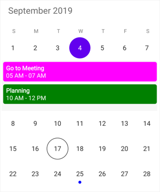
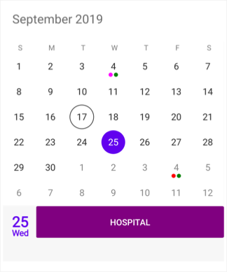
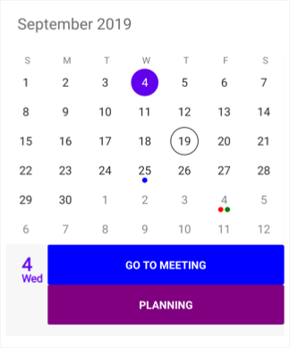
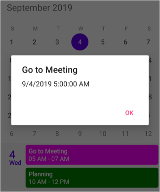

# Events (Appointments)

`SfCalendar` control provides support to add appointments on calendar's dates. By the way of adding collection of appointments, it will show the event with indicator on the desired dates.

Calendar's events can be added to `SfCalendar` using the following ways. [CalendarEventCollection](https://help.syncfusion.com/cr/xamarin/Syncfusion.SfCalendar.XForms.CalendarEventCollection.html) holds the details about the events to be rendered in calendar. Events contains the following attributes

1. [StartTime](https://help.syncfusion.com/cr/xamarin/Syncfusion.SfCalendar.XForms.CalendarInlineEvent.html#Syncfusion_SfCalendar_XForms_CalendarInlineEvent_StartTime)

2. [EndTime](https://help.syncfusion.com/cr/xamarin/Syncfusion.SfCalendar.XForms.CalendarInlineEvent.html#Syncfusion_SfCalendar_XForms_CalendarInlineEvent_EndTime)

3. [Subject](https://help.syncfusion.com/cr/xamarin/Syncfusion.SfCalendar.XForms.CalendarInlineEvent.html#Syncfusion_SfCalendar_XForms_CalendarInlineEvent_Subject)

4. [Color](https://help.syncfusion.com/cr/xamarin/Syncfusion.SfCalendar.XForms.CalendarInlineEvent.html#Syncfusion_SfCalendar_XForms_CalendarInlineEvent_Color)

Finally add this collection of `CalendarInlineEvents` into [DataSource](https://help.syncfusion.com/cr/xamarin/Syncfusion.SfCalendar.XForms.SfCalendar.html#Syncfusion_SfCalendar_XForms_SfCalendar_DataSource) of `SfCalendar`. The following code example will help to create an appointments on calendar's date. For events to be listed for a particular day, enable the inline feature in month view cell.

I> Inline event support can be toggled on or off with the [ShowInlineEvents](https://help.syncfusion.com/cr/xamarin/Syncfusion.SfCalendar.XForms.SfCalendar.html#Syncfusion_SfCalendar_XForms_SfCalendar_ShowInlineEvents) property.

## Month Appointment Display
 
You can handle the calendar month view appointment display by using [InlineViewMode](https://help.syncfusion.com/cr/xamarin/Syncfusion.SfCalendar.XForms.SfCalendar.html#Syncfusion_SfCalendar_XForms_SfCalendar_InlineViewMode) property of `SfCalendar`. By default, `InlineViewMode` is set as `Inline`. Using the `InlineViewMode`, you can set the month view appointments display as follows.
 
* Inline - Show the selected date’s events in-line. In this mode, two rows of calendar will be hidden to show the events.
 
* AgendaView - Show the selected date’s events below the month.


 
<?xml version="1.0" encoding="utf-8"?>
<ContentPage xmlns="http://xamarin.com/schemas/2014/forms" xmlns:x="http://schemas.microsoft.com/winfx/2009/xaml" xmlns:local="clr-namespace:CalendarSample" x:Class="CalendarSample.MainPage" xmlns:syncfusion="clr-namespace:Syncfusion.SfCalendar.XForms;assembly=Syncfusion.SfCalendar.XForms">
    <syncfusion:SfCalendar.BindingContext>
        <local:CalendarViewModel/>
    </syncfusion:SfCalendar.BindingContext>
    <syncfusion:SfCalendar x:Name="calendar" ViewMode="MonthView" ShowInlineEvents="True" InlineViewMode="Inline" MaximumEventIndicatorCount="1" DataSource="{Binding CalendarInlineEvents}">
    </syncfusion:SfCalendar>
</ContentPage>


using System;
using Syncfusion.SfCalendar.XForms;
using Xamarin.Forms;

namespace CalendarSample
{
    public class CalendarViewModel
    {
        public CalendarEventCollection CalendarInlineEvents { get; set; } = new CalendarEventCollection();
        public CalendarViewModel()
        {
            CalendarInlineEvent event1 = new CalendarInlineEvent();
            event1.StartTime = new DateTime(2017, 5, 1, 5, 0, 0);
            event1.EndTime = new DateTime(2017, 5, 1, 7, 0, 0);
            event1.Subject = "Go to Meeting";
            event1.Color = Color.Fuchsia;

            CalendarInlineEvent event2 = new CalendarInlineEvent();
            event2.StartTime = new DateTime(2017, 5, 1, 10, 0, 0);
            event2.EndTime = new DateTime(2017, 5, 1, 12, 0, 0);
            event2.Subject = "Planning";
            event2.Color = Color.Green;

            CalendarInlineEvents.Add(event1);
            CalendarInlineEvents.Add(event2);
        }
    }
}

 

You can download the entire source code of this demo for Xamarin.Forms from
here [CalendarEvents](https://github.com/SyncfusionExamples/creating-events-in-xamarin.forms-sfcalendar)

N> If there is no appointment for the selected day, `Inline` view and `AgendaView` displays the text as “No Appointments”.
N> The `Inline` view and `AgendaView` will be available only in month view with single selection mode.
 
## Month Appointment Indicator
 
You can customize the number of appointment indicators displayed in month cell using [MaximumEventIndicatorCount](https://help.syncfusion.com/cr/xamarin/Syncfusion.SfCalendar.XForms.SfCalendar.html#Syncfusion_SfCalendar_XForms_SfCalendar_MaximumEventIndicatorCount) property of ‘SfCalendar’. The default value of `MaximumEventIndicatorCount` is 5.

N> If appointments count are lesser than the Appointment Indicator count value in the particular day, then according to number of appointments available, indicator will be displayed in the month cell.
N> Appointment indicator will be shown on the basis of date meetings, usable month cell size and indicator count. For eg, if the month cell size is less (available for only 4 dots) and the indicator count is 10, then 4 indicators will be used.

## Customize inline/agenda view using DataTemplate

The default appearance of the appointment can be customized by using the [InlineItemTemplate](https://help.syncfusion.com/cr/xamarin/Syncfusion.SfCalendar.XForms.MonthViewSettings.html#Syncfusion_SfCalendar_XForms_MonthViewSettings_InlineItemTemplate) property of the [MonthViewSettings](https://help.syncfusion.com/cr/xamarin/Syncfusion.SfCalendar.XForms.MonthViewSettings.html).


    <syncfusion:SfCalendar x:Name="calendar" ShowInlineEvents="True">
        <syncfusion:SfCalendar.MonthViewSettings>
            <syncfusion:MonthViewSettings>
                <syncfusion:MonthViewSettings.InlineItemTemplate>
                    <DataTemplate>
                        <Button BackgroundColor="Purple" Text="{Binding Subject}" TextColor="White" />
                    </DataTemplate>
                </syncfusion:MonthViewSettings.InlineItemTemplate>
            </syncfusion:MonthViewSettings>
        </syncfusion:SfCalendar.MonthViewSettings>
    </syncfusion:SfCalendar> 

 

Inline view mode

Agenda view mode

## Customize inline/agenda view using Template Selector

Inline template selector can be used to choose a `DataTemplate` at runtime based on the value of a data-bound to inline appointment property through `InlineItemTemplate`. It lets you choose a different data template for each appointment, customizing the appearance of a particular inline appointment based on certain conditions. `DataTemplateSelector` for inline appointment as object and calendar as bindable object.



    <ContentPage.Resources>
        <ResourceDictionary>
            <local:AppointmentSelector x:Key="TemplateSelector" />
        </ResourceDictionary>
    </ContentPage.Resources>
    <syncfusion:SfCalendar x:Name="calendar"  ShowInlineEvents="True">
        <syncfusion:SfCalendar.MonthViewSettings>
            <syncfusion:MonthViewSettings InlineItemTemplate="{StaticResource TemplateSelector}" />
        </syncfusion:SfCalendar.MonthViewSettings>
    </syncfusion:SfCalendar> 

 

### Creating a DataTemplateSelector


    public class AppointmentSelector : DataTemplateSelector
    {
        public DataTemplate AppointmentTemplate { get; set; }
        public DataTemplate AllDayAppointmentTemplate { get; set; }
        public AppointmentSelector()
        {
            AppointmentTemplate = new DataTemplate(typeof(AppointmentTemplate));
            AllDayAppointmentTemplate = new DataTemplate(typeof(AllDayAppointmentTemplate));
        }
        protected override DataTemplate OnSelectTemplate(object item, BindableObject container)
        {
            var calendar = (container as SfCalendar);
            if (calendar == null)
            {
                return null;
            }
            if ((item as CalendarInlineEvent).IsAllDay)
            {
                return AllDayAppointmentTemplate;
            }
            else
            {
                return AppointmentTemplate;
            }
        }
    } 

 



    <!--<Button as Template for inline Appointment>-->
    <Button xmlns="http://xamarin.com/schemas/2014/forms" 
            xmlns:x="http://schemas.microsoft.com/winfx/2009/xaml" 
            x:Class="Calendar_Sample.AppointmentTemplate" 
            HorizontalOptions="FillAndExpand"
            VerticalOptions="FillAndExpand" 
            BackgroundColor="{Binding Color}" 
            Text="{Binding Subject}" 
            FontAttributes="Bold" 
            TextColor="White" /> 
            
    <!--<Button as Template for all day Appointment>-->
    <Button xmlns="http://xamarin.com/schemas/2014/forms"
            xmlns:x="http://schemas.microsoft.com/winfx/2009/xaml"
            x:Class="Calendar_Sample.AllDayAppointmentTemplate"
            HorizontalOptions="FillAndExpand" 
            VerticalOptions="FillAndExpand" 
            BackgroundColor="{Binding Color}" 
            Text="{Binding Subject}" 
            FontAttributes="Bold" 
            TextColor="Black" /> 

 

Inline view mode

Agenda view mode

## Getting inline/agenda view appointment details

Using  [InlineEvent](https://help.syncfusion.com/cr/xamarin/Syncfusion.SfCalendar.XForms.InlineItemTappedEventArgs.html#Syncfusion_SfCalendar_XForms_InlineItemTappedEventArgs_InlineEvent) argument in the [InlineItemTappedEventArgs](https://help.syncfusion.com/cr/xamarin/Syncfusion.SfCalendar.XForms.InlineItemTappedEventArgs.html) 
of [InlineItemTapped](https://help.syncfusion.com/cr/xamarin/Syncfusion.SfCalendar.XForms.SfCalendar.html)  event, you can get the month inline/agenda appointments details while tapping the specific appointment. You can do the required functions while tapping the inline/agenda appointment using this event.



calendar.InlineItemTapped+= Calendar_InlineItemTapped; 

private void Calendar_InlineItemTapped(object sender, InlineItemTappedEventArgs e)
    {
        var appointment = e.InlineEvent;
        DisplayAlert(appointment.Subject, appointment.StartTime.ToString(), "ok");
    } 

	

Inline view mode

Agenda view mode

## See also

[How to filter the events in the Xamarin.Forms Calendar by searching the subject?](https://www.syncfusion.com/kb/10324/how-to-filter-the-events-in-the-xamarin-forms-calendar-by-searching-the-subject)

[How to show events in custom agenda view using list view in Xamarin.Forms Calendar?](https://www.syncfusion.com/kb/10325/how-to-show-events-in-custom-agenda-view-using-list-view-in-xamarin-forms-calendar)

[How to show the calendar agenda view events using SfDataGrid in Xamarin.Forms?](https://www.syncfusion.com/kb/10323/how-to-show-the-calendar-agenda-view-events-using-sfdatagrid-in-xamarin-forms)

[How to load the data from SQLite offline database into SfCalendar?](https://www.syncfusion.com/kb/9380/how-to-load-the-data-from-sqlite-offline-database-into-sfcalendar)