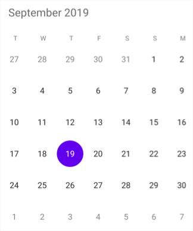

# Change First Day Of Week

By default, the starting day will be taken from the device culture. This can be modified using [FirstDayofWeek](https://help.syncfusion.com/cr/xamarin/Syncfusion.SfCalendar.XForms.SfCalendar.html#Syncfusion_SfCalendar_XForms_SfCalendar_FirstDayofWeek) property. Changing the first day of week will be applied to both month and year view.





<syncfusion:SfCalendar  x:Name="calendar" FirstDayofWeek="2"/>




	
SfCalendar  calendar = new SfCalendar();
calendar.FirstDayofWeek= 2;
this.Content = calendar;
	




N> The value will be provided as integers starting from 0 as Sunday.
	
