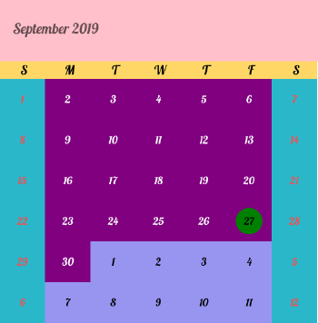
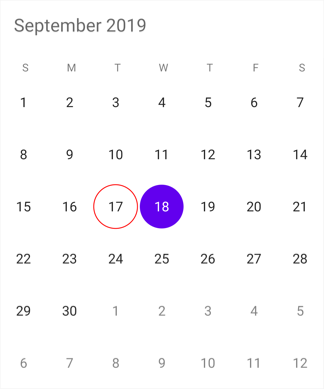
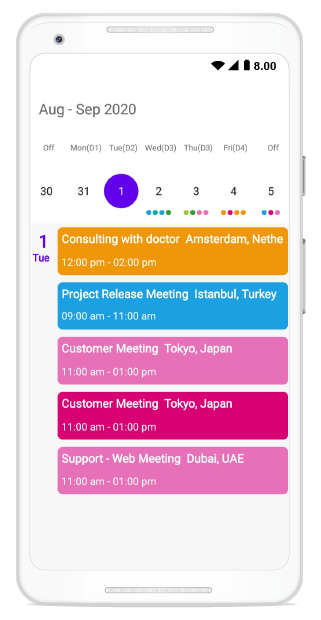
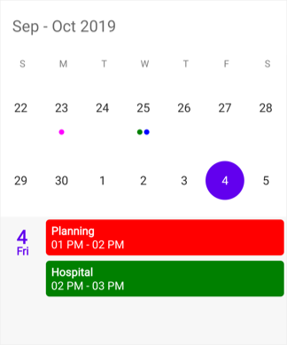
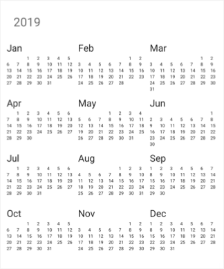
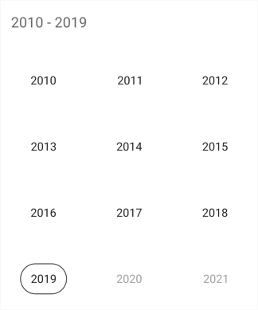
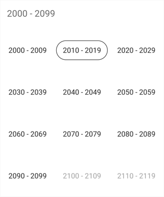

# Display Modes in Xamarin Calendar (SfCalendar)

Xamarin.Forms calendar control provides 4 different types of views such month, year, decade and century. It allows users to easily select and navigate between all built-in views. This can be achieved by using [ViewMode](https://help.syncfusion.com/cr/xamarin/Syncfusion.SfCalendar.XForms.SfCalendar.html#Syncfusion_SfCalendar_XForms_SfCalendar_ViewMode) property of SfCalendar.

N> By default calendar control is assigned with month view. 

## Month view

This displays entire dates of a particular month, by default current month will be displayed on loading. The current date is provided with separate color different from the rest of the dates color in a month. The events availability will be denoted within the cell based on its duration.

The dates in month view can be selected by four ways such as single, multiple, range and multi range selections which can be achieved using [SelectionMode](https://help.syncfusion.com/cr/xamarin/Syncfusion.SfCalendar.XForms.SfCalendar.html#Syncfusion_SfCalendar_XForms_SfCalendar_SelectionMode). Refer [here](https://help.syncfusion.com/xamarin/sfcalendar/select-multiple-dates).





<syncfusion:SfCalendar  x:Name="calendar" ViewMode="MonthView"/>





calendar.ViewMode = ViewMode.MonthView;
 




## Trailing and leading days

The `SfCalendar` allows you show/hide the days of the next month and previous month in calendar to enhance the appearance. This can be achieved by enabling the [ShowLeadingAndTrailingDays](https://help.syncfusion.com/cr/xamarin/Syncfusion.SfCalendar.XForms.SfCalendar.html#Syncfusion_SfCalendar_XForms_SfCalendar_ShowLeadingAndTrailingDays) property. The following code demonstrates how to hide the leading and trailing dates in calendar.





<syncfusion:SfCalendar  x:Name="calendar" ViewMode="MonthView" 
						ShowLeadingAndTrailingDays="False"/>





calendar.ViewMode = ViewMode.MonthView;
calendar.ShowLeadingAndTrailingDays = False; 
 




N>
* The OnMonthCellLoaded event is triggered for the current month dates.
* The VisibleDates in the MonthChanged event will return the current month dates.

## Enable and disable past dates

The `SfCalendar` allows you to enable/disable the past dates in MonthView. This can be achieved by changing the [EnableDatesInPast](https://help.syncfusion.com/cr/xamarin/Syncfusion.SfCalendar.XForms.SfCalendar.html#Syncfusion_SfCalendar_XForms_SfCalendar_EnableDatesInPast) property. By default, value of this property is set to true.





<syncfusion:SfCalendar  x:Name="calendar" ViewMode="MonthView" 
						EnableDatesInPast="False"/>





calendar.ViewMode = ViewMode.MonthView;
calendar.EnableDatesInPast = False; 
 




N>
 The `EnableDatesInPast` is not applicable for UWP.

## Month view customization

You can customize the calendar month view by using [MonthViewSettings](https://help.syncfusion.com/cr/xamarin/Syncfusion.SfCalendar.XForms.MonthViewSettings.html) of `SfCalendar`.

* Current day text color can be modified using [TodayTextColor](https://help.syncfusion.com/cr/xamarin/Syncfusion.SfCalendar.XForms.MonthViewSettings.html#Syncfusion_SfCalendar_XForms_MonthViewSettings_TodayTextColor).
* The day header format, day font size, day header font size, day header font family, header font family, day cell font family can be modified using [DayHeaderFormat](https://help.syncfusion.com/cr/xamarin/Syncfusion.SfCalendar.XForms.MonthViewSettings.html#Syncfusion_SfCalendar_XForms_MonthViewSettings_DayHeaderFormat), [DayFontSize](https://help.syncfusion.com/cr/xamarin/Syncfusion.SfCalendar.XForms.MonthViewSettings.html#Syncfusion_SfCalendar_XForms_MonthViewSettings_DayFontSize), [DayHeaderFontSize](https://help.syncfusion.com/cr/xamarin/Syncfusion.SfCalendar.XForms.MonthViewSettings.html#Syncfusion_SfCalendar_XForms_MonthViewSettings_DayHeaderFontSize), [DayHeaderFontFamily](https://help.syncfusion.com/cr/xamarin/Syncfusion.SfCalendar.XForms.MonthViewSettings.html#Syncfusion_SfCalendar_XForms_MonthViewSettings_DayHeaderFontFamily)
[HeaderFontFamily](https://help.syncfusion.com/cr/xamarin/Syncfusion.SfCalendar.XForms.MonthViewSettings.html#Syncfusion_SfCalendar_XForms_MonthViewSettings_HeaderFontFamily), [DayCellFontFamily](https://help.syncfusion.com/cr/xamarin/Syncfusion.SfCalendar.XForms.MonthViewSettings.html#Syncfusion_SfCalendar_XForms_MonthViewSettings_DayCellFontFamily),[DayHeight](https://help.syncfusion.com/cr/xamarin/Syncfusion.SfCalendar.XForms.MonthViewSettings.html#Syncfusion_SfCalendar_XForms_MonthViewSettings_DayHeight),[DayLabelTextAlignment](https://help.syncfusion.com/cr/xamarin/Syncfusion.SfCalendar.XForms.MonthViewSettings.html#Syncfusion_SfCalendar_XForms_MonthViewSettings_DayLabelTextAlignment),[DisabledTextColor](https://help.syncfusion.com/cr/xamarin/Syncfusion.SfCalendar.XForms.MonthViewSettings.html#Syncfusion_SfCalendar_XForms_MonthViewSettings_DisabledTextColor) Properties.
* The background color of the inline view can be modified using [InlineBackgroundColor](https://help.syncfusion.com/cr/xamarin/Syncfusion.SfCalendar.XForms.MonthViewSettings.html#Syncfusion_SfCalendar_XForms_MonthViewSettings_InlineBackgroundColor) property.
* The text color of the inline view can be modified using [InlineTexColor](https://help.syncfusion.com/cr/xamarin/Syncfusion.SfCalendar.XForms.MonthViewSettings.html#Syncfusion_SfCalendar_XForms_MonthViewSettings_InlineTextColor) property.
* In AgendaView the selected date color can be modified using [AgendaSelectedDateColor](https://help.syncfusion.com/cr/xamarin/Syncfusion.SfCalendar.XForms.MonthViewSettings.html#Syncfusion_SfCalendar_XForms_MonthViewSettings_AgendaSelectedDateColor)
* The Calendar Header text color, Background color and font can be modified using the [HeaderTextColor](https://help.syncfusion.com/cr/xamarin/Syncfusion.SfCalendar.XForms.MonthViewSettings.html#Syncfusion_SfCalendar_XForms_MonthViewSettings_HeaderTextColor), [HeaderBackgroundColor](https://help.syncfusion.com/cr/xamarin/Syncfusion.SfCalendar.XForms.MonthViewSettings.html#Syncfusion_SfCalendar_XForms_MonthViewSettings_HeaderBackgroundColor),[HeaderFont](https://help.syncfusion.com/cr/xamarin/Syncfusion.SfCalendar.XForms.MonthViewSettings.html#Syncfusion_SfCalendar_XForms_MonthViewSettings_HeaderFont) Properties.
* The date text can be Aligned using the [DateTextAlignment](https://help.syncfusion.com/cr/xamarin/Syncfusion.SfCalendar.XForms.MonthViewSettings.html#Syncfusion_SfCalendar_XForms_MonthViewSettings_DateTextAlignment).
* The Radius of the Selection shape can be modified by [SelectionRadius](https://help.syncfusion.com/cr/xamarin/Syncfusion.SfCalendar.XForms.MonthViewSettings.html#Syncfusion_SfCalendar_XForms_MonthViewSettings_SelectionRadius).





<syncfusion:SfCalendar x:Name="calendar">
	<syncfusion:SfCalendar.MonthViewSettings>
<syncfusion:MonthViewSettings 
		CurrentMonthBackgroundColor="#800080"
		CurrentMonthTextColor="#ffffff"
		PreviousMonthBackgroundColor="#9895F0"
		PreviousMonthTextColor="#000000"
		DateSelectionColor="#ffffff"
		SelectedDayTextColor="#000000"
		DayHeaderFormat="EEEEE"
		DayFontSize="12"
		DayHeaderFontSize="14"
		DayHeaderBackgroundColor="#fed766"
		SelectionRadius="15"
		TodaySelectionTextColor="Black"
		TodaySelectionBackgroundColor="Green"
		DayHeaderTextColor="Black"
		HeaderBackgroundColor="Pink"
		HeaderFontAttributes="Italic"
		HeaderFontSize="16"
		WeekEndTextColor="#fe4a49"
		WeekEndBackgroundColor="#2ab7ca">
			<syncfusion:MonthViewSettings.HeaderFontFamily>
				<OnPlatform x:TypeArguments="x:String" iOS="Lobster-Regular" Android="Lobster-Regular.ttf" WinPhone="Assets/Lobster-Regular.ttf#Lobster" />
			</syncfusion:MonthViewSettings.HeaderFontFamily>
			<syncfusion:MonthViewSettings.DayHeaderFontFamily>
				<OnPlatform x:TypeArguments="x:String" iOS="Lobster-Regular" Android="Lobster-Regular.ttf" WinPhone="Assets/Lobster-Regular.ttf#Lobster" />
			</syncfusion:MonthViewSettings.DayHeaderFontFamily>
			<syncfusion:MonthViewSettings.DayCellFontFamily>
				<OnPlatform x:TypeArguments="x:String" iOS="Lobster-Regular" Android="Lobster-Regular.ttf" WinPhone="Assets/Lobster-Regular.ttf#Lobster" />
			</syncfusion:MonthViewSettings.DayCellFontFamily>
		</syncfusion:MonthViewSettings>
   </syncfusion:SfCalendar.MonthViewSettings>
</syncfusion:SfCalendar>  




	
SfCalendar calendar = new SfCalendar();    

MonthViewSettings monthViewSettings = new MonthViewSettings();
monthViewSettings.CurrentMonthBackgroundColor = Color.FromHex("#800080");
monthViewSettings.CurrentMonthTextColor = Color.FromHex("#ffffff");
monthViewSettings.PreviousMonthBackgroundColor = Color.FromHex("#9895F0");
monthViewSettings.PreviousMonthTextColor = Color.FromHex("#000000");
monthViewSettings.DateSelectionColor = Color.FromHex("#ffffff");
monthViewSettings.SelectedDayTextColor = Color.FromHex("#000000");
monthViewSettings.DayHeaderFormat = "EEEEE";
monthViewSettings.DayFontSize = 12;
monthViewSettings.DayHeaderFontSize = 14;
monthViewSettings.DayHeaderBackgroundColor = Color.FromHex("#fed766");
monthViewSettings.SelectionRadius = 15;
monthViewSettings.TodaySelectionTextColor = Color.Black;
monthViewSettings.TodaySelectionBackgroundColor = Color.Green;
monthViewSettings.DayHeaderTextColor = Color.Black;
monthViewSettings.DayHeaderFontFamily = Device.OnPlatform("Lobster-Regular", "Lobster-Regular.ttf", "Assets/Lobster-Regular.ttf#Lobster");
monthViewSettings.HeaderBackgroundColor = Color.Pink;
monthViewSettings.HeaderFontAttributes = FontAttributes.Italic;
monthViewSettings.HeaderFontFamily = Device.OnPlatform("Lobster-Regular", "Lobster-Regular.ttf", "Assets/Lobster-Regular.ttf#Lobster");
monthViewSettings.HeaderFontSize = 16;
monthViewSettings.DayCellFontFamily = Device.OnPlatform("Lobster-Regular", "Lobster-Regular.ttf", "Assets/Lobster-Regular.ttf#Lobster");
monthViewSettings.WeekEndTextColor = Color.FromHex("#fe4a49");
monthViewSettings.WeekEndBackgroundColor = Color.FromHex("#2ab7ca");
monthViewSettings.AgendaSelectedDateColor = Color.Blue;

calendar.MonthViewSettings = monthViewSettings;
this.Content = calendar;





N>
* To disable the current day selection, use `TodaySelectionBackgroundColor` color as Transparent.
* [DisabledBackgroundColor](https://help.syncfusion.com/cr/xamarin/Syncfusion.SfCalendar.XForms.MonthViewSettings.html#Syncfusion_SfCalendar_XForms_MonthViewSettings_DisabledBackgroundColor) added while calendar using MinDate, MaxDate and EnableDatesInPast properties.

### Month view border color customization

You can customize the border color of calendar month view using [MonthViewSettings](https://help.syncfusion.com/cr/xamarin/Syncfusion.SfCalendar.XForms.MonthViewSettings.html). The border color of month view can be customized using the [BorderColor](https://help.syncfusion.com/cr/xamarin/Syncfusion.SfCalendar.XForms.MonthViewSettings.html#Syncfusion_SfCalendar_XForms_MonthViewSettings_BorderColor) property and the lines of month cells can be enabled using the [CellGridOptions](https://help.syncfusion.com/cr/xamarin/Syncfusion.SfCalendar.XForms.MonthViewSettings.html#Syncfusion_SfCalendar_XForms_MonthViewSettings_CellGridOptions) property.

	
	


<syncfusion:SfCalendar x:Name="calendar">
	<syncfusion:SfCalendar.MonthViewSettings>
		  <syncfusion:MonthViewSettings BorderColor ="#ff0000" CellGridOptions="Both"/>                      
   </syncfusion:SfCalendar.MonthViewSettings>
</syncfusion:SfCalendar>  




	
SfCalendar calendar = new SfCalendar();    
MonthViewSettings monthViewSettings = new MonthViewSettings();
monthViewSettings.BorderColor = Color.FromHex("#ff0000");
monthViewSettings.CellGridOptions = CellGridOptions.Both;
calendar.MonthViewSettings = monthViewSettings;
this.Content = calendar;





### Today border color customization

You can customize the today border color of calendar month cell using [MonthViewSettings](https://help.syncfusion.com/cr/xamarin/Syncfusion.SfCalendar.XForms.MonthViewSettings.html). The border color of current day can be customized using the [TodayBorderColor](https://help.syncfusion.com/cr/xamarin/Syncfusion.SfCalendar.XForms.MonthViewSettings.html#Syncfusion_SfCalendar_XForms_MonthViewSettings_TodayBorderColor) property and it is applicable for both `Fill` and `Circle` [SelectionShape](https://help.syncfusion.com/cr/xamarin/Syncfusion.SfCalendar.XForms.SelectionShape.html). 

	
	


<syncfusion:SfCalendar x:Name="calendar">
	<syncfusion:SfCalendar.MonthViewSettings>
		  <syncfusion:MonthViewSettings TodayBorderColor="#ff0000"/>
   </syncfusion:SfCalendar.MonthViewSettings>
</syncfusion:SfCalendar>  




	
SfCalendar calendar = new SfCalendar();    
MonthViewSettings monthViewSettings = new MonthViewSettings();
monthViewSettings.TodayBorderColor = Color.FromHex("#ff0000");
calendar.MonthViewSettings = monthViewSettings;
this.Content = calendar;





## Customize day header text

You can customize the day header text by adding the custom day labels in the `CustomDayLabels` collection by using the [CustomDayLabels](https://help.syncfusion.com/cr/xamarin/Syncfusion.SfCalendar.XForms~Syncfusion.SfCalendar.XForms.SfCalendar~CustomDayLabels.html) collection of SfCalendar.



List<string> customDayLabels = new List<string>() 
{ 
    "Off", 
    "Mon(D1)", 
    "Tue(D2)", 
    "Wed(D3)", 
    "Thu(D3)", 
    "Fri(D4)", 
    "Off", 
}; 
 
calendar.CustomDayLabels = customDayLabels; 



## Week view

The number of weeks in the month view can be changed by setting the [NumberOfWeeksInView](https://help.syncfusion.com/cr/xamarin/Syncfusion.SfCalendar.XForms.SfCalendar.html#Syncfusion_SfCalendar_XForms_SfCalendar_NumberOfWeeksInView) property in SfCalendar. By default, `NumberOfWeeksInView` starts from current week, and this can be modified using the [MoveToDate](https://help.syncfusion.com/cr/xamarin/Syncfusion.SfCalendar.XForms.SfCalendar.html#Syncfusion_SfCalendar_XForms_SfCalendar_MoveToDate) property of calendar. It also supports all existing features such as [FirstDayOfWeek](https://help.syncfusion.com/cr/xamarin/Syncfusion.SfCalendar.XForms.SfCalendar.html#Syncfusion_SfCalendar_XForms_SfCalendar_FirstDayofWeek), [MinDate](https://help.syncfusion.com/cr/xamarin/Syncfusion.SfCalendar.XForms.SfCalendar.html#Syncfusion_SfCalendar_XForms_SfCalendar_MinDate), [MaxDate](https://help.syncfusion.com/cr/xamarin/Syncfusion.SfCalendar.XForms.SfCalendar.html#Syncfusion_SfCalendar_XForms_SfCalendar_MaxDate), and [SelectionMode](https://help.syncfusion.com/cr/xamarin/Syncfusion.SfCalendar.XForms.SfCalendar.html#Syncfusion_SfCalendar_XForms_SfCalendar_SelectionMode).

N>
* Week number ranges from 1 to 6. If lesser or greater than these range is considered, `NumberOfWeeksInView` will be displayed as 6.
* Inline view considers  `NumberOfWeeksInView` as only 6. For other count, only agenda view will be displayed in calendar.
* Dynamically changing `NumberOfWeeksInView` shows the first row of month view dates. It can be handled using the `MoveToDate` property of calendar
* [ShowLeadingAndTrailingDays](https://help.syncfusion.com/cr/xamarin/Syncfusion.SfCalendar.XForms.SfCalendar.html#Syncfusion_SfCalendar_XForms_SfCalendar_ShowLeadingAndTrailingDays) is not applicable if the `NumberOfWeeksInView` is lesser than 6.





<syncfusion:SfCalendar x:Name="calendar" NumberOfWeeksInView="2"/>





SfCalendar calendar = new SfCalendar();
calendar.NumberOfWeeksInView = 2;





## Year view

This displays entire dates/month of a particular year, by default current year will be displayed on loading. The Years can be changed by swiping back and forth or [Forward](https://help.syncfusion.com/cr/xamarin/Syncfusion.SfCalendar.XForms.SfCalendar.html#Syncfusion_SfCalendar_XForms_SfCalendar_Forward) and [Backward](https://help.syncfusion.com/cr/xamarin/Syncfusion.SfCalendar.XForms.SfCalendar.html#Syncfusion_SfCalendar_XForms_SfCalendar_Backward) methods. The Months can be navigated quickly by selecting on the particular month in year view.





<syncfusion:SfCalendar  x:Name="calendar" ViewMode="YearView"/>





SfCalendar calendar = new SfCalendar();
calendar.ViewMode=ViewMode.YearView;
this.Content = calendar;
 



 

## Year view mode

You can set the year view as either date or month using [YearViewMode](https://help.syncfusion.com/cr/xamarin/Syncfusion.SfCalendar.XForms.SfCalendar.html#Syncfusion_SfCalendar_XForms_SfCalendar_YearViewMode). By default, current year and months will be displayed. 

* If the `YearViewMode` is date, it will be displays all the months with dates in a particular year view.
* If the `YearViewMode` is month, it will be displays all the months in a particular year view.





<syncfusion:SfCalendar  x:Name="calendar" ViewMode="YearView" YearViewMode="Date" NavigationDirection="Vertical"/>





SfCalendar calendar = new SfCalendar();
calendar.ViewMode=ViewMode.YearView;
calendar.YearViewMode = YearViewMode.Date;
this.Content = calendar;
 




 
N>
* The `YearViewMode` property is only applicable for calendar in Android and iOS platforms.

## Year view customization

We can customize the calendar view in yearView mode by using [YearViewSettings](https://help.syncfusion.com/cr/xamarin/Syncfusion.SfCalendar.XForms.YearViewSettings.html) property of SfCalendar. Date text color can be modified using [DateTextColor](https://help.syncfusion.com/cr/xamarin/Syncfusion.SfCalendar.XForms.YearViewSettings.html#Syncfusion_SfCalendar_XForms_YearViewSettings_DateTextColor). You can also customize the header, month layout in year view's text color and background color and LabelAlignment by using the [HeaderBackground](https://help.syncfusion.com/cr/xamarin/Syncfusion.SfCalendar.XForms.YearViewSettings.html#Syncfusion_SfCalendar_XForms_YearViewSettings_HeaderBackground), [LayoutBackground](https://help.syncfusion.com/cr/xamarin/Syncfusion.SfCalendar.XForms.YearViewSettings.html#Syncfusion_SfCalendar_XForms_YearViewSettings_LayoutBackground), [YearHeaderTextColor](https://help.syncfusion.com/cr/xamarin/Syncfusion.SfCalendar.XForms.YearViewSettings.html#Syncfusion_SfCalendar_XForms_YearViewSettings_YearHeaderTextColor),[MonthHeaderBackground](https://help.syncfusion.com/cr/xamarin/Syncfusion.SfCalendar.XForms.YearViewSettings.html#Syncfusion_SfCalendar_XForms_YearViewSettings_MonthHeaderBackground) and [LabelAlignment](https://help.syncfusion.com/cr/xamarin/Syncfusion.SfCalendar.XForms.LabelAlignment.html) properties.





<syncfusion:SfCalendar x:Name="calendar">
	<syncfusion:SfCalendar.YearViewSettings>
		<syncfusion:YearViewSettings 
			LayoutBackground="#ffe4b5"
			DateTextColor="#E6E6FA"
			HeaderBackground="#8B4513"
			YearHeaderTextColor="#FFFFFF"
			MonthHeaderBackground="#bfff00"
			LabelAlignment="Centre"
			/>
	</syncfusion:SfCalendar.YearViewSettings>
</syncfusion:SfCalendar>    




	
SfCalendar calendar = new SfCalendar();        
YearViewSettings yearViewSettings = new YearViewSettings();
yearViewSettings.LayoutBackground = Color.FromHex("#ffe4b5");
yearViewSettings.DateTextColor = Color.FromHex("#008000");
yearViewSettings.YearHeaderTextColor = Color.FromHex("#ff0000");
yearViewSettings.MonthHeaderBackground = Color.FromHex("#bfff00");
yearViewSettings.LabelAlignment = LabelAlignment.Centre;
calendar.YearViewSettings = yearViewSettings;
this.Content = calendar;





## Decade view

This view displays the period of 10 years. By default, current year range of 10 years will be displayed on loading. You can easily navigate between month/year view to decade view by tapping the calendar header. The year can be navigated quickly by selecting a particular year from decade view.





<syncfusion:SfCalendar  x:Name="calendar" ViewMode="Decade" ShowNavigationButtons="True" NavigationDirection="Vertical">
</syncfusion:SfCalendar>





SfCalendar calendar = new SfCalendar();
calendar.ViewMode=ViewMode.Decade;
calendar.ShowNavigationButtons=true;
calendar.NavigationDirection = NavigationDirection.Vertical;
this.Content = calendar;
 
	



 
## Decade view customization

You can customize the decade view of calendar by using [YearViewSettings](https://help.syncfusion.com/cr/xamarin/Syncfusion.SfCalendar.XForms.YearViewSettings.html). 

* Year text color can be modified using [MonthHeaderTextColor](https://help.syncfusion.com/cr/xamarin/Syncfusion.SfCalendar.XForms.YearViewSettings.html#Syncfusion_SfCalendar_XForms_YearViewSettings_MonthHeaderTextColor).
* You can customize the decade view header text and background color by using the [YearHeaderTextColor](https://help.syncfusion.com/cr/xamarin/Syncfusion.SfCalendar.XForms.YearViewSettings.html#Syncfusion_SfCalendar_XForms_YearViewSettings_YearHeaderTextColor) and [HeaderBackground](https://help.syncfusion.com/cr/xamarin/Syncfusion.SfCalendar.XForms.YearViewSettings.html#Syncfusion_SfCalendar_XForms_YearViewSettings_HeaderBackground) property.
* You can customize the background of decade view by using [LayoutBackground](https://help.syncfusion.com/cr/xamarin/Syncfusion.SfCalendar.XForms.YearViewSettings.html#Syncfusion_SfCalendar_XForms_YearViewSettings_LayoutBackground) and [MonthLayoutBackground](https://help.syncfusion.com/cr/xamarin/Syncfusion.SfCalendar.XForms.YearViewSettings.html#Syncfusion_SfCalendar_XForms_YearViewSettings_MonthLayoutBackground).





<syncfusion:SfCalendar x:Name="calendar" ShowNavigationButtons="True" NavigationDirection="Vertical">
<syncfusion:SfCalendar.YearViewSettings>
	<syncfusion:YearViewSettings 
		LayoutBackground ="#D3D3D3"
		HeaderBackground = "#F2F2F2"
		MonthHeaderTextColor ="#0000FF"
		YearHeaderTextColor="#ff0000"
		MonthLayoutBackground  ="#F2F2F2"/>
</syncfusion:SfCalendar.YearViewSettings>
</syncfusion:SfCalendar>    




	
SfCalendar calendar = new SfCalendar();    
calendar.ShowNavigationButtons=true;   
calendar.NavigationDirection = NavigationDirection.Vertical;    
YearViewSettings yearViewSettings = new YearViewSettings();
yearViewSettings.LayoutBackground = Color.FromHex("#D3D3D3");
yearViewSettings.MonthHeaderTextColor = Color.FromHex("#0000FF");
yearViewSettings.MonthLayoutBackground = Color.FromHex("#F2F2F2"); 
yearViewSettings.YearHeaderTextColor = Color.FromHex("#ff0000");
yearViewSettings.HeaderBackground = Color.FromHex("#F2F2F2");
calendar.YearViewSettings = yearViewSettings;
this.Content = calendar;





## Century view

This view displays the period of 100 years. By default, current year range of 100 years will be displayed on loading. You can easily navigate between month/year/decade view to century view by tapping the calendar header. You can easily navigate to decade view by selecting decade years in century view.





<syncfusion:SfCalendar  x:Name="calendar" ViewMode="Century" ShowNavigationButtons="True" NavigationDirection="Vertical">
</syncfusion:SfCalendar>





SfCalendar calendar = new SfCalendar();
calendar.ViewMode=ViewMode.Century;
calendar.ShowNavigationButtons=true;
calendar.NavigationDirection = NavigationDirection.Vertical;
this.Content = calendar;
 




 
## Century view customization

You can customize the century view of calendar using [YearViewSettings](https://help.syncfusion.com/cr/xamarin/Syncfusion.SfCalendar.XForms.YearViewSettings.html). 

* Year text color can be modified using [MonthHeaderTextColor](https://help.syncfusion.com/cr/xamarin/Syncfusion.SfCalendar.XForms.YearViewSettings.html#Syncfusion_SfCalendar_XForms_YearViewSettings_MonthHeaderTextColor).
* You can customize the century view header text and background color by using the [YearHeaderTextColor](https://help.syncfusion.com/cr/xamarin/Syncfusion.SfCalendar.XForms.YearViewSettings.html#Syncfusion_SfCalendar_XForms_YearViewSettings_YearHeaderTextColor) and [HeaderBackground](https://help.syncfusion.com/cr/xamarin/Syncfusion.SfCalendar.XForms.YearViewSettings.html#Syncfusion_SfCalendar_XForms_YearViewSettings_HeaderBackground) property.
* You can customize the background of century view by using [LayoutBackground](https://help.syncfusion.com/cr/xamarin/Syncfusion.SfCalendar.XForms.YearViewSettings.html#Syncfusion_SfCalendar_XForms_YearViewSettings_LayoutBackground) and [MonthLayoutBackground](https://help.syncfusion.com/cr/xamarin/Syncfusion.SfCalendar.XForms.YearViewSettings.html#Syncfusion_SfCalendar_XForms_YearViewSettings_MonthLayoutBackground).





<syncfusion:SfCalendar x:Name="calendar" ShowNavigationButtons="True" NavigationDirection="Vertical">
	<syncfusion:SfCalendar.YearViewSettings>
		<syncfusion:YearViewSettings 
			LayoutBackground ="#D3D3D3"
			HeaderBackground = "#F2F2F2"
			MonthHeaderTextColor ="#0000FF"
			YearHeaderTextColor="#ff0000"
			MonthLayoutBackground  ="#F2F2F2"/>
	</syncfusion:SfCalendar.YearViewSettings>
</syncfusion:SfCalendar>   




	
SfCalendar calendar = new SfCalendar();   
calendar.ShowNavigationButtons = true;     
calendar.NavigationDirection = NavigationDirection.Vertical;
YearViewSettings yearViewSettings = new YearViewSettings();
yearViewSettings.LayoutBackground = Color.FromHex("#D3D3D3");
yearViewSettings.MonthHeaderTextColor = Color.FromHex("#0000FF");
yearViewSettings.MonthLayoutBackground = Color.FromHex("#F2F2F2"); 
yearViewSettings.YearHeaderTextColor = Color.FromHex("#ff0000");
yearViewSettings.HeaderBackground = Color.FromHex("#F2F2F2");
calendar.YearViewSettings = yearViewSettings;
this.Content = calendar;





## Programmatically expand the InlineView

You can Programmatically Expand the InlineView using [ExpandInlineView](https://help.syncfusion.com/cr/xamarin/Syncfusion.SfCalendar.XForms.SfCalendar.html#Syncfusion_SfCalendar_XForms_SfCalendar_ExpandInlineView_System_DateTime_) method which Expands the Appointment details of the corresponding date. 




	
calendar.ExpandInlineView(DateTime.Now.Date);





## Programmatically collapse the InlineView

You can Programmatically Collapsed the InlineView Using [CollapseInlineView](https://help.syncfusion.com/cr/xamarin/Syncfusion.SfCalendar.XForms.SfCalendar.html#Syncfusion_SfCalendar_XForms_SfCalendar_CollapseInlineView_System_DateTime_) method which collapsed the Appointment details of the corresponding date. 
 



	
calendar.CollapseInlineView(DateTime.Now.Date);





## See also

[How to Identify the current month day cell in SfCalendar?](https://www.syncfusion.com/kb/8563/how-to-identify-the-current-month-day-cell-in-sfcalendar)

[How to customize the month cell of SfCalendar?](https://www.syncfusion.com/kb/8583/how-to-customize-the-month-cell-of-sfcalendar)

[How to customize the month cell of SfCalendar with custom object?](https://www.syncfusion.com/kb/8588/how-to-customize-the-month-cell-of-sfcalendar-with-custom-object)

[How to customize the month cell border lines of SfCalendar?](https://www.syncfusion.com/kb/8595/how-to-customize-the-month-cell-border-lines-of-sfcalendar)

[How to restrict the year view move while tapping calendar’s month header?](https://www.syncfusion.com/kb/8607/how-to-restrict-the-year-view-move-while-tapping-calendars-month-header)

[How to change the selection shape of calendar’s date cell selection?](https://www.syncfusion.com/kb/8610/how-to-change-the-selection-shape-of-calendars-date-cell-selection)

[How to customize the selected month cell in Xamarin.Forms Calendar (SfCalendar)](https://www.syncfusion.com/kb/11202/how-to-customize-the-selected-month-cell-in-xamarin-forms-calendar-sfcalendar)