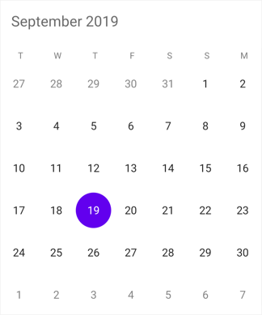

# Getting Started with Xamarin Calendar (SfCalendar)

This section explains how to implement simple holiday indicator application which allows user to select working days using [SfCalendar](https://help.syncfusion.com/cr/xamarin/Syncfusion.SfCalendar.XForms.SfCalendar.html) control.

## Adding SfCalendar reference

You can add SfCalendar reference using one of the following methods:

**Method 1: Adding SfCalendar reference from nuget.org**

Syncfusion Xamarin components are available in [nuget.org](https://www.nuget.org/). To add SfCalendar to your project, open the NuGet package manager in Visual Studio, search for [Syncfusion.Xamarin.SfCalendar](https://www.nuget.org/packages/Syncfusion.Xamarin.SfCalendar), and then install it.

N> Install the same version of SfCalendar NuGet in all the projects.

**Method 2: Adding SfCalendar reference from toolbox**

Syncfusion also provides Xamarin Toolbox. Using this toolbox, you can drag the SfCalendar control to the XAML page. It will automatically install the required NuGet packages and add the namespace to the page. To install Syncfusion Xamarin Toolbox, refer to [Toolbox](https://help.syncfusion.com/xamarin/utility#toolbox).

**Method 3: Adding SfCalendar assemblies manually from the installed location**

If you prefer to manually reference the assemblies instead referencing from NuGet, add the following assemblies in respective projects.

Location: {Installed location}/{version}/Xamarin/lib

<table>
<tr>
<td>PCL</td>
<td>Syncfusion.SfCalendar.XForms.dll Syncfusion.Core.XForms.dll Syncfusion.Licensing.dll </td>
</tr>
<tr>
<td>Android</td>
<td>Syncfusion.SfCalendar.XForms.Android.dll Syncfusion.SfCalendar.XForms.dll Syncfusion.Core.XForms.dll Syncfusion.Core.XForms.Android.dll Syncfusion.Licensing.dll </td>
</tr>
<tr>
<td>iOS</td>
<td>Syncfusion.SfCalendar.XForms.iOS.dll Syncfusion.SfCalendar.XForms.dll Syncfusion.Core.XForms.dll Syncfusion.Core.XForms.iOS.dll Syncfusion.Licensing.dll </td>
</tr>
<tr>
<td>UWP</td>
<td>Syncfusion.SfCalendar.XForms.UWP.dll Syncfusion.SfCalendar.XForms.dll Syncfusion.Core.XForms.dll Syncfusion.Core.XForms.UWP.dll Syncfusion.Licensing.dll </td>
</tr>
</table>

N> To know more about obtaining our components, refer to these links for [Mac](https://help.syncfusion.com/xamarin/introduction/download-and-installation/mac/) and [Windows](https://help.syncfusion.com/xamarin/introduction/download-and-installation/windows/).

I> Starting with v16.2.0.x, if you reference Syncfusion assemblies from the trial setup or from the NuGet feed, you also have to include a license key in your projects. Please refer to [Syncfusion license key](https://help.syncfusion.com/common/essential-studio/licensing/license-key/) to know about registering Syncfusion license key in your Xamarin application to use our components.

## Launching the SfCalendar on each platform

To use `SfCalendar` inside an application, each platform application must initialize the `SfCalendar` renderer. This initialization step varies from platform to platform and is discussed in the following sections.

### Android and  UWP

The Android and UWP launches the `SfCalendar` without any initialization and is enough to only initialize the Xamarin.Forms Framework to launch the application

N> If you are adding the references from toolbox, this step is not needed.

### iOS

To launch `SfCalendar` in iOS, need to create an instance of SfCalendarRenderer in FinishedLaunching overridden method of AppDelegate class in iOS Project as shown below.



using Syncfusion.SfCalendar.XForms.iOS;

public override bool FinishedLaunching(UIApplication app, NSDictionary options)
{
	global::Xamarin.Forms.Forms.Init();
	SfCalendarRenderer.Init();
	LoadApplication(new App());
	return base.FinishedLaunching(app, options);
}



### ReleaseMode issue in UWP platform

There is a known Framework issue in UWP platform. The custom controls will not render when deployed the application in `Release Mode`.

The above problem can be resolved by initializing the `SfCalendar` assemblies in `App.xaml.cs` in UWP project as like in below code snippet.



// In App.xaml.cs

protected override void OnLaunched(LaunchActivatedEventArgs e)
{
	rootFrame.NavigationFailed += OnNavigationFailed;	
	// you'll need to add `using System.Reflection;`
	List<Assembly> assembliesToInclude = new List<Assembly>();
	//Now, add all the assemblies your app uses
	assembliesToInclude.Add(typeof(SfCalendarRenderer).GetTypeInfo().Assembly);
	// replaces Xamarin.Forms.Forms.Init(e);        
	Xamarin.Forms.Forms.Init(e, assembliesToInclude);  
}


## Supported platforms

* Android
* iOS
* Windows (UWP)

## Create a Simple SfCalendar

The `SfCalendar` control is configured entirely in C# code or by using XAML markup. The following steps explain on how to create a `SfCalendar` and configure its elements,

* Adding namespace for the added assemblies. 





xmlns:syncfusion="clr-namespace:Syncfusion.SfCalendar.XForms;assembly=Syncfusion.SfCalendar.XForms"
	




using Syncfusion.SfCalendar.XForms;





* Now add the SfCalendar control with a required optimal name by using the included namespace.





<?xml version="1.0" encoding="utf-8"?>
<ContentPage xmlns="http://xamarin.com/schemas/2014/forms" xmlns:x="http://schemas.microsoft.com/winfx/2009/xaml"
xmlns:local="clr-namespace:GettingStarted" 
xmlns:syncfusion="clr-namespace:Syncfusion.SfCalendar.XForms;assembly=Syncfusion.SfCalendar.XForms"
x:Class="GettingStarted.CalendarPage">
<ContentPage.Content>
 <syncfusion:SfCalendar x:Name="calendar" />	
</ContentPage.Content>
</ContentPage>
	




using Syncfusion.SfCalendar.XForms;
using Xamarin.Forms;

namespace GettingStarted
{
public partial class CalendarPage : ContentPage
{
	public CalendarPage()
	{
		InitializeComponent();
		SfCalendar calendar = new SfCalendar();
		this.Content = calendar;
	}
}
}




## Set Blackout Dates

`SfCalendar` control provides option to black out the desired date which is in disabled state among the visible dates. Here, holidays are blacked out in the form which cannot be selected by the user. To black out the holiday, add them into [BlackoutDates](https://help.syncfusion.com/cr/xamarin/Syncfusion.SfCalendar.XForms.SfCalendar.html#Syncfusion_SfCalendar_XForms_SfCalendar_BlackoutDates) list. 



SfCalendar  calendar = new SfCalendar();
List<DateTime> black_dates = new List<DateTime>();
for (int i = 0; i < 5; i++)
{
	DateTime date = new DateTime(2018,4,1+i);
	black_dates.Add(date);
}
calendar.BlackoutDates = black_dates;



## Enable Multiple Selection

`SfCalendar` control allows user to select one or more dates at a time among the non black out dates.

To enable it set `MultiSelection` option in SelectionMode enumeration property.





<syncfusion:SfCalendar x:Name="calendar" SelectionMode="MultiSelection" />





SfCalendar calendar = new SfCalendar();
calendar.SelectionMode=SelectionMode.MultiSelection;





## Restrict Dates

`SfCalendar` allows to select dates that falls between certain range of dates. Here, restrict user to select dates only in current year.

N> To specify the range, set start date and end date to [MinDate](https://help.syncfusion.com/cr/xamarin/Syncfusion.SfCalendar.XForms.SfCalendar.html#Syncfusion_SfCalendar_XForms_SfCalendar_MinDate) and [MaxDate](https://help.syncfusion.com/cr/xamarin/Syncfusion.SfCalendar.XForms.SfCalendar.html#Syncfusion_SfCalendar_XForms_SfCalendar_MaxDate) properties respectively.



SfCalendar  calendar = new SfCalendar();
calendar.MinDate = new DateTime(2019,9,1);
calendar.MaxDate = new DateTime(2019,9,30);
this.Content = calendar;
	


You can download the entire source code of this demo for Xamarin.Forms from
here [CalendarGettingStarted](https://github.com/SyncfusionExamples/xamarin-calendar-getting-started)

## See also

[Feature comparison between Calendar and Schedule control](https://www.syncfusion.com/kb/6976/feature-comparison-between-calendar-and-schedule-control)

[How to customize the Header view of SfCalendar control?](https://www.syncfusion.com/kb/8609/how-to-customize-the-header-view-of-sfcalendar-control)

[How to refresh the Xamarin.Forms Calendar using MVVM pattern?](https://www.syncfusion.com/kb/9754/how-to-refresh-the-xamarin-forms-calendar-using-mvvm-pattern)

[How to restrict the year view move while tapping calendar’s month header?](https://www.syncfusion.com/kb/8607/how-to-restrict-the-year-view-move-while-tapping-calendars-month-header)
