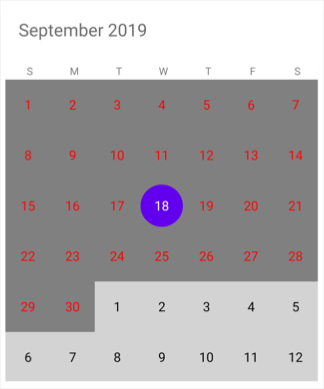
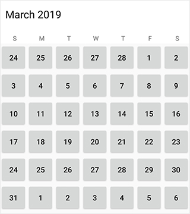
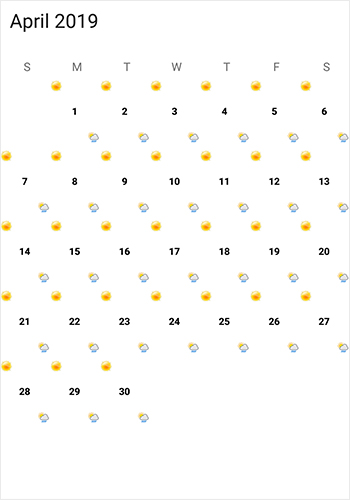
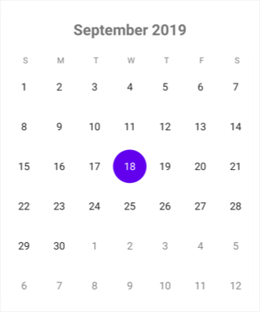

# Customization of Calendar (SfCalendar) control in Xamarin 

## How to Perform an Operation while a Calendar Cell is Tapped?

We can perform operation while the Calendar cell is Tapped using [CalendarTapped](https://help.syncfusion.com/cr/xamarin/Syncfusion.SfCalendar.XForms.SfCalendar.html) event. CalendarTapped event returns the date selected and the Appointments that are associated with the date selected.

<table>
<tr>
<th>Members</th>
<th>Description</th>
</tr>
<tr>
<td>(sender as SfCalendar)</td>
<td>Carries details about native control</td>
</tr>
<tr>
<td>DateTime</td>
<td>It shows the datetime in Calendar</td>
</tr>
</table>





<syncfusion:SfCalendar  x:Name="calendar" OnCalendarTapped="Handle_OnCalendarTapped" />




	
void Handle_OnCalendarTapped(object sender, CalendarTappedEventArgs e)
{
	SfCalendar calendar = (sender as SfCalendar);
	DateTime date = e.datetime;		
}
	




## How to get the selected date range from the calendar?

We can perform an operation when the selected date get changed using [SelectionChanged](https://help.syncfusion.com/cr/xamarin/Syncfusion.SfCalendar.XForms.SfCalendar.html) event which returns the dates selected and dates deselected from the `SfCalendar`.

<table>
<tr>
<th>Members</th>
<th>Description</th>
</tr>
<tr>
<td>(sender as SfCalendar)</td>
<td>Carries details about native control</td>
</tr>
<tr>
<td>DateAdded</td>
<td>Date selected from the calendar</td>
</tr>
<tr>
<td>DateRemoved</td>
<td>Date deselected from the calendar</td>
</tr>
<tr>
<td>NewRangeAdded</td>
<td>Carries details about the selected multi range </td>
</tr>
</table>





<syncfusion:SfCalendar  x:Name="calendar" ViewMode="MonthView"  SelectionChanged="Handle_SelectionChanged" />




	
void Handle_SelectionChanged(object sender, SelectionChangedEventArgs e)
{
	 //// Get added and removed dates in Single, Multi and Range selection modes.
     IList<DateTime> selectedDates = e.DateAdded;
     IList<DateTime> deselectedDates = e.DateRemoved;
	 
	 //// Gets the added date range in Multi-range selection mode.
     IList<SelectionRange> selectionRange = e.NewRangeAdded;
	 
	 // You can get the SelectedRange Start date and End date
     var selectedRange = calendar.SelectedRange;
}
	




## How to Perform an Operation when Navigate to Next Month?

User defined operation can be performed using [MonthChanged](https://help.syncfusion.com/cr/xamarin/Syncfusion.SfCalendar.XForms.SfCalendar.html) event when navigating to next month. This event returns the details about current value and previous value of month.

<table>
<tr>
<th>Members</th>
<th>Description</th>
</tr>
<tr>
<td>(sender as SfCalendar)</td>
<td>Carries details about native control</td>
</tr>
<tr>
<td>Args</td>
<td>Carries details about MonthEventParameters</td>
</tr>
</table>
                                    




<syncfusion:SfCalendar  x:Name="calendar" ViewMode="MonthView" MonthChanged="Handle_MonthChanged" />




	
void Handle_MonthChanged(object sender, MonthChangedEventArgs e)
{
	 SfCalendar calendar = (sender as SfCalendar);
     DateTime oldMonth = e.PreviousValue;
     DateTime currentMonth = e.CurrentValue;
}
	




## How to Perform an Operation while Dealing with Appointments?

[InlineToggled](https://help.syncfusion.com/cr/xamarin/Syncfusion.SfCalendar.XForms.SfCalendar.html) event returns the selected date along with the appointments it carries. Using this event user can perform operation while dealing with appointments.

<table>
<tr>
<th>Members</th>
<th>Description</th>
</tr>
<tr>
<td>(sender as SfCalendar)</td>
<td>Carries details about native control</td>
</tr>
<tr>
<td>SelectedAppointment</td>
<td>Appointments from the selected date</td>
</tr>
</table>

                                    




<syncfusion:SfCalendar  x:Name="calendar" InlineToggled="Handle_InlineToggled" />




	
void Handle_InlineToggled(object sender, InlineToggledEventArgs e)
{
	if ((args.SelectedAppointment as CalendarEventCollection).Count != 0)
        {
            string subject = (e.SelectedAppointment as CalendarEventCollection)[0].Subject;
            DateTime startTime = (e.SelectedAppointment as CalendarEventCollection)[0].StartTime;
            DateTime endTime = (e.SelectedAppointment as CalendarEventCollection)[0].EndTime;
        }
}
	




## How to Customize Cell or Month View?

[OnMonthCellLoaded](https://help.syncfusion.com/cr/xamarin/Syncfusion.SfCalendar.XForms.SfCalendar.html) event allows us to customize `SfCalendar` control. It returns MonthCell args

<table>
<tr>
<th>Members</th>
<th>Description</th>
</tr>
<tr>
<td>Args</td>
<td>Carries details about MonthCell</td>
</tr>
</table>





<syncfusion:SfCalendar  x:Name="calendar" ViewMode="MonthView"  OnMonthCellLoaded="Handle_OnMonthCellLoaded"  />





void Handle_OnMonthCellLoaded(object sender, MonthCellLoadedEventArgs e)
{
     if (e.IsCurrentMonth)
        {
            e.BackgroundColor = Color.Gray;
            e.TextColor = Color.Red;
        }
        else
        {
            e.BackgroundColor = Color.LightGray;
            e.TextColor = Color.Black;
        }
}





## Create your own custom calendar month cell view
You can customize the month view with custom view using the `View` property of `MonthCellLoadedEventArgs` in the `OnMonthCellLoaded` event `SfCalendar` control.


private void Calendar_OnMonthCellLoaded(object sender, MonthCellLoadedEventArgs e)
{
    var button = new Button();
    button.Text = e.Date.Day.ToString();
    e.View = button;        
}



## How to customize month view cell using a template?

You can customize the month cell of the `SfCalendar` using [CellTemplate](https://help.syncfusion.com/cr/xamarin/Syncfusion.SfCalendar.XForms.MonthViewSettings.html#Syncfusion_SfCalendar_XForms_MonthViewSettings_CellTemplate) property of [MonthViewSettings](https://help.syncfusion.com/cr/xamarin/Syncfusion.SfCalendar.XForms.MonthViewSettings.html).





<?xml version="1.0" encoding="utf-8"?>
<ContentPage xmlns="http://xamarin.com/schemas/2014/forms"
xmlns:x="http://schemas.microsoft.com/winfx/2009/xaml"
xmlns:local="clr-namespace:MonthCellCustomization"
x:Class="MonthCellCustomization.MainPage"
xmlns:calendar="clr-namespace:Syncfusion.SfCalendar.XForms;assembly=Syncfusion.SfCalendar.XForms">
<ContentPage.Content>
        <calendar:SfCalendar x:Name="calendar" ShowLeadingAndTrailingDays="true" BackgroundColor="White">
            <calendar:SfCalendar.MonthViewSettings>
                <calendar:MonthViewSettings>
                    <calendar:MonthViewSettings.CellTemplate>
                <DataTemplate>
                <Grid BackgroundColor="White">
                    <Grid.RowDefinitions> 
                        <RowDefinition Height="*"/> 
                        <RowDefinition Height="*"/> 
                        <RowDefinition Height="*"/>  
                    </Grid.RowDefinitions>
                                <Grid.ColumnDefinitions>
                                    <ColumnDefinition Width="*"/>
                                     <ColumnDefinition Width="*"/>
                                     <ColumnDefinition Width="*"/>
                                </Grid.ColumnDefinitions>
                    <Image HorizontalOptions="Center" Source="Weather1.png" Grid.Row="0" Grid.Column="0"/>
                    <Label Text="{Binding Day}" FontAttributes="Bold" TextColor="Black" Grid.Row="1" HorizontalTextAlignment="Center" VerticalTextAlignment="Center" Grid.Column="1" FontSize="10"/>
                    <Image HorizontalOptions="Center" Grid.Row="2" Source="Weather2.png" Grid.Column="2"/> 
                </Grid>
                </DataTemplate>
                </calendar:MonthViewSettings.CellTemplate>
                </calendar:MonthViewSettings>
            </calendar:SfCalendar.MonthViewSettings>
            </calendar:SfCalendar>
    </ContentPage.Content>
    </ContentPage>





## How to Perform the Operation while long pressing the dateCell?

[OnDateCellHolding](https://help.syncfusion.com/cr/xamarin/Syncfusion.SfCalendar.XForms.SfCalendar.html) event returns the long pressed date along with the `SfCalendar` it carries. Using this event user can perform operation while long pressing the date.

<table>
<tr>
<th>Members</th>
<th>Description</th>
</tr>
<tr>
<td>Args</td>
<td>Carries details with long pressed date and Calendar</td>
</tr>
</table>





<syncfusion:SfCalendar x:Name="sfcalendar" OnDateCellHolding="Handle_OnDateCellHolding" />





   void Handle_OnDateCellHolding(object sender, Syncfusion.SfCalendar.XForms.DayCellHoldingEventArgs e)
    {
       // do the operation while long pressing the date cell     
    }





## How to Resize the SfCalendar Control?

`SfCalendar` control can be resized using `WidthRequest` and `HeightRequest` properties in `SfCalendar`control.



SfCalendar calendar = new SfCalendar();
calendar.WidthRequest = 200;
calendar.HeightRequest = 200;
	


## How to Customize the SfCalendar Header?

[HeaderView](https://help.syncfusion.com/cr/xamarin/Syncfusion.SfCalendar.XForms.SfCalendar.html#Syncfusion_SfCalendar_XForms_SfCalendar_HeaderView) property of SfCalendar allows us to customize `SfCalendar` Header. It returns custom view for SfCalendarHeader

<table>
<tr>
<th>Members</th>
<th>Description</th>
</tr>
<tr>
<td>HeaderView</td>
<td>Carries custom view for Calendar Header</td>
</tr>
</table>





 <syncfusion:SfCalendar  x:Name="calendar">
         <syncfusion:SfCalendar.HeaderView>
                <Label Text="{binding CalendarDate}" HorizontalTextAlignment="Center" VerticalTextAlignment="Center" FontAttributes="Bold" FontSize="Large"/>
        </syncfusion:SfCalendar.HeaderView>
    </syncfusion:SfCalendar>





## How to enable or disable the YearView in SfCalendar?

[ShowYearView](https://help.syncfusion.com/cr/xamarin/Syncfusion.SfCalendar.XForms.SfCalendar.html#Syncfusion_SfCalendar_XForms_SfCalendar_ShowYearView) property of `SfCalendar` allows us to enable and disable the  YearView of `SfCalendar`. The default value of ShowYearView is true.

<table>
<tr>
<th>Members</th>
<th>Description</th>
</tr>
<tr>
<td>ShowYearView</td>
<td>Carries boolean value which is used to enable or disable the YearView in SfCalendar</td>
</tr>
</table>





<syncfusion:SfCalendar Grid.Row="1" ShowYearView="false" x:Name="calendar"  / >





## How to enable or disable the Horizontal and Vertical cell grid lines in SfCalendar?

[CellGridOptions](https://help.syncfusion.com/cr/xamarin/Syncfusion.SfCalendar.XForms.MonthViewSettings.html#Syncfusion_SfCalendar_XForms_MonthViewSettings_CellGridOptions) property of MonthViewSettings allows us to enable and disable the horizontal and vertical border lines of `SfCalendar`. 

<table>
<tr>
<th>Members</th>
<th>Description</th>
</tr>
<tr>
<td>CellGridOptions</td>
<td>Carries enum value which is used to enable or disable the vertical and horizontal border lines in SfCalendar</td>
</tr>
<tr>
<td>VerticalLines</td>
<td>This enum value of CellGridOptions is used to enable the vertical border lines in SfCalendar</td>
</tr>
<tr>
<td>HorizontalLines</td>
<td>This enum value of CellGridOptions is used to enable the horizontal border lines in SfCalendar</td>
</tr>
<tr>
<td>Both</td>
<td>This enum value of CellGridOptions is used to enable the vertical and horizontal border lines in SfCalendar</td>
</tr>
<tr>
<td>None</td>
<td>This enum value of CellGridOptions is used to disable the vertical and horizontal border lines in SfCalendar</td>
</tr>

</table>





 <syncfusion:SfCalendar x:Name="calendar"   >
    <syncfusion:SfCalendar.MonthViewSettings>
        <syncfusion:MonthViewSettings CellGridOptions="Both" />
    </syncfusion:SfCalendar.MonthViewSettings>
</syncfusion:SfCalendar>





## Customize the year cell or year view
You can customize the year cell of the `SfCalendar` control using the [OnYearCellLoaded](https://help.syncfusion.com/cr/xamarin/Syncfusion.SfCalendar.XForms.SfCalendar.html) event, which returns `YearCellLoadedEventArgs`. The [YearCellLoadedEventArgs](https://help.syncfusion.com/cr/xamarin/Syncfusion.SfCalendar.XForms.YearCellLoadedEventArgs.html) has the following properties to customize the year view: [BackgroundColor](https://help.syncfusion.com/cr/xamarin/Syncfusion.SfCalendar.XForms.YearCell.html#Syncfusion_SfCalendar_XForms_YearCell_BackgroundColor), [Font](https://help.syncfusion.com/cr/xamarin/Syncfusion.SfCalendar.XForms.YearCell.html#Syncfusion_SfCalendar_XForms_YearCell_Font), [FontFamily](https://help.syncfusion.com/cr/xamarin/Syncfusion.SfCalendar.XForms.YearCell.html#Syncfusion_SfCalendar_XForms_YearCell_FontAttribute), [Month](https://help.syncfusion.com/cr/xamarin/Syncfusion.SfCalendar.XForms.YearCell.html#Syncfusion_SfCalendar_XForms_YearCell_Month), [MonthHeaderBackgroundColor](https://help.syncfusion.com/cr/xamarin/Syncfusion.SfCalendar.XForms.YearCell.html#Syncfusion_SfCalendar_XForms_YearCell_MonthHeaderBackgroundColor), [MonthHeaderTextColor](https://help.syncfusion.com/cr/xamarin/Syncfusion.SfCalendar.XForms.YearCell.html#Syncfusion_SfCalendar_XForms_YearCell_MonthHeaderTextColor), [MonthLayoutBackgroundColor](https://help.syncfusion.com/cr/xamarin/Syncfusion.SfCalendar.XForms.YearCell.html#Syncfusion_SfCalendar_XForms_YearCell_MonthLayoutBackgroundColor), [TextColor](https://help.syncfusion.com/cr/xamarin/Syncfusion.SfCalendar.XForms.YearCell.html#Syncfusion_SfCalendar_XForms_YearCell_TextColor), and [View](https://help.syncfusion.com/cr/xamarin/Syncfusion.SfCalendar.XForms.YearCell.html#Syncfusion_SfCalendar_XForms_YearCell_View).



private void Calendar_OnYearCellLoaded(object sender, YearCellLoadedEventArgs e)
{
    e.BackgroundColor = Color.Red;
    e.Font = Font.SystemFontOfSize(12, FontAttributes.Italic);
    e.FontFamily = "Times New Roman";
    e.MonthHeaderBackgroundColor = Color.Blue;
    e.MonthHeaderTextColor = Color.Black;
    e.MonthLayoutBackgroundColor = Color.Gray;
    e.TextColor = Color.Green;  
}



## Customize the year view with custom UI	
You can customize the YearView with Custom UI in the `SfCalendar` control using the `View` property of `YearCellLoadedEventArgs` in the `OnYearCellLoaded` event.


private void Calendar_OnYearCellLoaded(object sender, YearCellLoadedEventArgs e)
{
    var button = new Button();
    button.Text = e.Month.ToString("MMMM");
    e.View = button;        
}



## Deselect today selection on initial load
Initially, the calendar is loaded with the current day as selected date in `MonthView` when the SelectionMode is set to SingleSelection, but you can deselect the date on initial loading in `SfCalendar` by set the [SelectedDate](https://help.syncfusion.com/cr/xamarin/Syncfusion.SfCalendar.XForms.SfCalendar.html#Syncfusion_SfCalendar_XForms_SfCalendar_SelectedDate) property as null.



calendar.SelectedDate = null;



## How to perform an operation when navigating to next month?

User-defined operation can be performed using the [MonthChanging](https://help.syncfusion.com/cr/xamarin/Syncfusion.SfCalendar.XForms.SfCalendar.html) event when navigating to the next month. This event returns the details about the current value and the previous value of the month using the property of [MonthChangingEventArgs](https://help.syncfusion.com/cr/xamarin/Syncfusion.SfCalendar.XForms.MonthChangingEventArgs.html) .

<table>
<tr>
<th>Members</th>
<th>Description</th>
</tr>
<tr>
<td>(sender as SfCalendar)</td>
<td>Carries details about native control</td>
</tr>
<tr>
<td>Args</td>
<td>Carries details about MonthEventParameters</td>
</tr>
</table>
                                    




<syncfusion:SfCalendar  x:Name="calendar" ViewMode="MonthView" MonthChanging="Calendar_MonthChanging"/>




	
void Calendar_MonthChanging(object sender, MonthChangingEventArgs e)
{
	 SfCalendar calendar = (sender as SfCalendar);
     DateTime oldMonth = e.PreviousValue;
     DateTime currentMonth = e.CurrentValue;
}
	




## How to perform an operation when changing the ViewMode?

User-Defined Operation can be performed using the [OnViewModeChanged](https://help.syncfusion.com/cr/xamarin/Syncfusion.SfCalendar.XForms.SfCalendar.html#Syncfusion_SfCalendar_XForms_SfCalendar_OnViewModeChanged) event when changing the `ViewMode`. This event returns the details about the different ViewMode of the `Calendar` using the Property of [ViewModeChangedEventArgs](https://help.syncfusion.com/cr/xamarin/Syncfusion.SfCalendar.XForms.ViewModeChangedEventArgs.html).
<table>
<tr>
<th>Members</th>
<th>Description</th>
</tr>
<tr>
<td>(sender as SfCalendar)</td>
<td>Carries details about native control</td>
</tr>
<tr>
<td>Args</td>
<td>Carries details with ViewMode and Calendar</td>
</tr>
</table>
                                    




<syncfusion:SfCalendar  x:Name="calendar" ViewMode="MonthView" OnViewModeChanged="Handle_OnViewModeChanged"/>




	
void Handle_OnViewModeChanged(object sender, ViewModeChangedArgs e)
{
   // Do operation when ViewMode is changed.
}
	




## How to perform an operation when InlineAppointments are loaded ? 

The [OnInlineLoaded](https://help.syncfusion.com/cr/xamarin/Syncfusion.SfCalendar.XForms.SfCalendar.html#Syncfusion_SfCalendar_XForms_SfCalendar_OnInlineLoaded) event returns the selected date along with the inline Appointments it holds. Using this you can perform an operation related to Appointments in the Property of [InlineEventArgs](https://help.syncfusion.com/cr/xamarin/Syncfusion.SfCalendar.XForms.InlineEventArgs.html) .

<table>
<tr>
<th>Members</th>
<th>Description</th>
</tr>
<tr>
<td>Args</td>
<td>Carries details about InlineEventArgs</td>
</tr>
</table>





<syncfusion:SfCalendar  x:Name="calendar" ViewMode="MonthView"  OnInlineLoaded="Handle_OnInlineLoaded" />





void Handle_OnInlineLoaded(object sender, InlineEventArgs e)
{
     var date = e.DateTime.ToString();
     var appointmentsCount = e.Appointments.Count();
}





## How to customize the calendar header using the OnHeaderLoaded event ?

The [OnHeaderLoaded](https://help.syncfusion.com/cr/xamarin/Syncfusion.SfCalendar.XForms.SfCalendar.html#Syncfusion_SfCalendar_XForms_SfCalendar_OnHeaderLoaded) event allows you to customize the HeaderView using the view Property of [CalendarHeaderEventArgs](https://help.syncfusion.com/cr/xamarin/Syncfusion.SfCalendar.XForms.CalendarHeaderEventArgs.html).
<table>
<tr>
<th>Members</th>
<th>Description</th>
</tr>
<tr>
<td>Args</td>
<td>Carries details about CalendarHeaderEventArgs</td>
</tr>
</table>





<syncfusion:SfCalendar  x:Name="calendar" ViewMode="MonthView"  OnHeaderLoaded="Handle_OnHeaderLoaded"/>





void Handle_OnHeaderLoaded(object sender, CalendarHeaderEventArgse)
{
     var button = new Button();
     button.Text = "Header";
     e.View = button;
}



