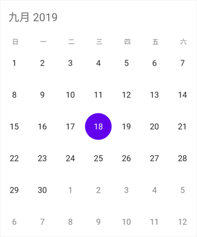

# Localization in Xamarin Calendar (SfCalendar)

`SfCalendar` control is available with complete localization support. Localization can be specified by setting the [Locale](https://help.syncfusion.com/cr/xamarin/Syncfusion.SfCalendar.XForms.SfCalendar.html#Syncfusion_SfCalendar_XForms_SfCalendar_Locale) property of the control using the format of Language code followed by Country code. 

## Change default control language

Based on the locale specified, the strings in the control are localized accordingly.
    


SfCalendar  calendar = new SfCalendar ();
calendar.Locale= new System.Globalization.CultureInfo("zh-CN");
this.Content = calendar;



N> By default, SfCalendar control is available with en-US locale.  

 

## Localizing custom strings from PCL
You can localize the custom strings (All Day, No Events) used in the calendar control from PCL. It can be achieved by providing the custom strings to the specific language resx file and handling the required culture with the locale. In the below code, we have set Portugal as Calendar locale as well as custom strings.




  calendar.Locale = new System.Globalization.CultureInfo("pt-PT");
  CalendarResourceManager.Manager = new System.Resources.ResourceManager("Sample name.Resources.Syncfusion.SfCalendar.XForms", GetType().GetTypeInfo().Assembly);
  CultureInfo.CurrentUICulture = new CultureInfo("pt");




### Adding resx file
You need to add the required resx files under the Resources folder in the PCL project and the filename should be `Syncfusion.SfCalendar.Forms.LanguageCode.resx`.

Example: For Portuguese, `Syncfusion.SfCalendar.Forms.pt.resx`

  
Now, set the Build Action as EmbeddedResource for `Syncfusion.SfCalendar.Forms.pt.resx` file and Build Action as Compile for `Syncfusion.SfCalendar.Forms.pt.Designer.cs` file.

You can download the entire source code of this demo for Xamarin.Forms from
here [LocaleFromPCL](https://github.com/SyncfusionExamples/Localizing-the-custom-texts-in-Xamarin.Forms-Calendar).

## Localizing the custom texts using platform renderer

You can localize the custom strings used in the calendar control. For that you need to configure it for each platform separately.

*	Localizing custom text in Android renderer.
*	Localizing custom text in iOS renderer.

### Localizing custom text in Android renderer

You can localize custom text available in the control by adding equivalent localized string in the string.xml file.



<resources>
  <string name="sfcalendar_inlineviewnoappointmenttext">Aucun événement</string>
  <string name="sfcalendar_inlineviewalldaytext">Toute la journée</string>
</resources> 
  
 

Android can select and load resources from different directories, based on the current device configuration and locale, refer [here](https://developer.xamarin.com/guides/android/advanced_topics/localization/). For an example, if an application requires multiple languages you can follow the below steps.

The procedure for creating strings.xml files is as follows:

*	Translate the strings.xml file to each language.
*	Create new folders under resource as values-`ar`, values-`de`, values-`en` and values-`fr` (The original values folder already exists).
*	Place the translated strings.xml files in the respective folders.
 
  

>**NOTE** 
The corresponding Locale values folder updates only when the device language changes.

### Localizing custom text in iOS renderer

You can localize custom text available in the control by adding equivalent localized string in the Localizable.strings file, refer [here](https://developer.xamarin.com/guides/ios/advanced_topics/localization_and_internationalization/).

 

If an application requires multiple languages you can follow the below steps:

*	Translate the Localizable.Strings file to each language. 
*	Create new `<Language>.lproj` folders under resource as `en.lproj`, `fr.lproj`, `de.lproj`.
*	Place the `Localizable.Strings` file in the respective `<Language>.lproj` folders.

>**NOTE** 
The corresponding `<Language>.lproj` folder updates only when the device language changes.

You can download the entire source code of this demo for Xamarin.Forms from
here [Localization](https://github.com/SyncfusionExamples/Localizing-the-custom-texts-using-platform-renderer-in-Xamarin.Forms-Calendar).

## See also

[How to add new languages in SfCalendar control](https://www.syncfusion.com/kb/7121/how-to-add-new-languages-in-sfcalendar-control)
