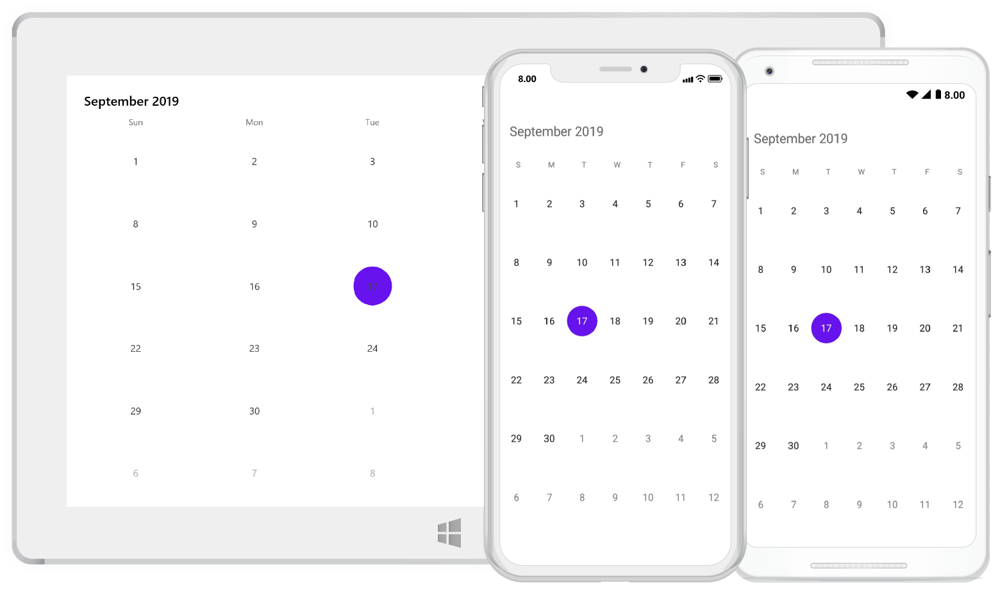

# Xamarin Calendar (SfCalendar) Overview

The Essential Xamarin Calendar widget provides the multi-view representation to display and select one or more dates within specified ranges. Also provides a gesture friendly UI to perform operations like navigations, events, etc.
Calendar supports addition of events for specific dates.It also shows event details of the selected date in inline or agenda view.The Xamarin.Forms Calendar supports right to left (RTL) direction for users working in right-to-left languages like Hebrew, Arabic, or Persian.

Essential Calendar can be used in various scenarios like ticket booking, events notifying, display working days etc.

## Key Features

* `Built-in Views` – A multi-view representation to display dates in month,year,decade,century view based on the view mode.

* `Selection` – Enables users to select one or multiple dates.

* `Min Max dates` – Visible dates can be limited using the specified Minimum and Maximum dates.

* `Blackout dates` – A collection of dates with cross mark representation that cannot be interacted.

* `Globalization` - Displays date-time formats and headers in different cultures. Thus, it meets the needs of different regions.

* `Localization` - Localizes all static text in the calendar. It is useful to meet the need of a particular language.

