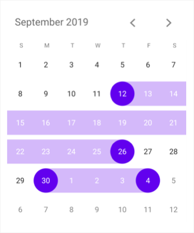

# Select Multiple Dates

Dates can be selected by making a touch on month view cells. The default [SelectionMode](https://help.syncfusion.com/cr/xamarin/Syncfusion.SfCalendar.XForms.SfCalendar.html#Syncfusion_SfCalendar_XForms_SfCalendar_SelectionMode) is Single which allows user to select one date at a time. `SfCalendar` provides support to select dates in two modes such as Single and Multiple selection.

* `SingleSelection` – A single date can be selected in a month view which can be equipped when user needs to select one date at a time / to view events.

* `MultiSelection` – More than one date can be selected in a random manner. Clicking again on selected dates can do deselection.

* `RangeSelection` – It allows us to select a single date range in `SfCalendar` month view.

* `MultiRangeSelection` – More than one date range can be selected in a month view.

The selected dates can be retrieved through `OnSelectionChanged` event which is raised on selecting.

## Multi selection mode





<syncfusion:SfCalendar  x:Name="calendar" SelectionMode="MultiSelection"/>




	
SfCalendar calendar = new SfCalendar();	
calendar.SelectionMode=SelectionMode.MultiSelection;
List<DateTime> selectedDates = new List<DateTime>();
selectedDates.Add(new DateTime(2019, 3, 06));
selectedDates.Add(new DateTime(2019, 3, 11));
selectedDates.Add(new DateTime(2019, 3, 15));
selectedDates.Add(new DateTime(2019, 3, 19));
selectedDates.Add(new DateTime(2019, 3, 21));
selectedDates.Add(new DateTime(2019, 3, 25));
selectedDates.Add(new DateTime(2019, 3, 27));
calendar.SelectedDates = selectedDates;
this.Content = calendar;
	




Download the entire source code from GitHub [here](https://github.com/SyncfusionExamples/multi-selection-calendar-xamarin).

N> In range selection, navigation through swipe will be restricted and moving between months can be done by clicking on navigation button available at the top corner of `SfCalendar` control.

## Range selection mode





<syncfusion:SfCalendar  x:Name="calendar" SelectionMode="RangeSelection"/>





calendar.SelectionMode=SelectionMode.RangeSelection;
	




Download the entire source code from GitHub [here](https://github.com/SyncfusionExamples/range-selection-calendar-xamarin).

## Multi range selection mode





<syncfusion:SfCalendar  x:Name="calendar" SelectionMode="MultiRangeSelection"/>





calendar.SelectionMode=SelectionMode.MultiRangeSelection;
	




Download the entire source code from GitHub [here](https://github.com/SyncfusionExamples/multirange-selection-sample-calendar-xamarin).

## Single selection mode
 




<syncfusion:SfCalendar  x:Name="calendar" SelectionMode="SingleSelection"/>




	
calendar.SelectionMode = SelectionMode.SingleSelection;





Download the entire source code from GitHub [here](https://github.com/SyncfusionExamples/single-selection-calendar-xamarin).

## Programmatically clear the selected dates
      
You can clear the calendar selected dates programmatically by using the [ClearSelection](https://help.syncfusion.com/cr/xamarin/Syncfusion.SfCalendar.XForms.SfCalendar.html#Syncfusion_SfCalendar_XForms_SfCalendar_ClearSelection) method that is applicable for the calendar [SelectionMode](https://help.syncfusion.com/cr/xamarin/Syncfusion.SfCalendar.XForms.SfCalendar.html#Syncfusion_SfCalendar_XForms_SfCalendar_SelectionMode) such as `SingleSelection`, `MultiSelection`, `RangeSelection`, and `MultiRangeSelection`.




	
calendar.ClearSelection();
	




## Programmatically refresh the calendar view
      
You can Refresh the calendar View programmatically by using the [Refresh](https://help.syncfusion.com/cr/xamarin/Syncfusion.SfCalendar.XForms.SfCalendar.html#Syncfusion_SfCalendar_XForms_SfCalendar_Refresh) method that is applicable for all the `ViewModes` such as `MonthView`,and `YearView`.




	
calendar.Refresh();
	




## Programmatically dispose of the calendar view
      
You can dispose of the calendar View programmatically by using the [Dispose](https://help.syncfusion.com/cr/xamarin/Syncfusion.SfCalendar.XForms.SfCalendar.html#Syncfusion_SfCalendar_XForms_SfCalendar_Dispose) method that is applicable for all the `ViewModes` such as `MonthView`, and `YearView`.




	
calendar.Dispose();
	




## See also

[How to use range selection on SfCalendar by using MVVM pattern](https://www.syncfusion.com/kb/8591/how-to-use-range-selection-on-sfcalendar-by-using-mvvm-pattern)

[How to handle the long press action on date selection in SfCalendar?](https://www.syncfusion.com/kb/8608/how-to-handle-the-long-press-action-on-date-selection-in-sfcalendar)

[How to select week in calendar Xamarin.Forms?](https://www.syncfusion.com/kb/10600/how-to-select-week-in-calendar-xamarin-forms)