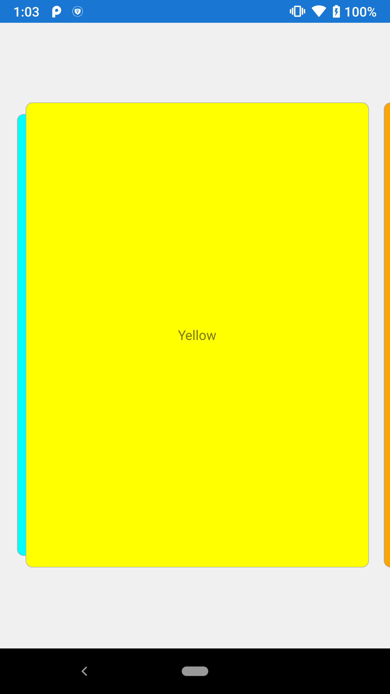
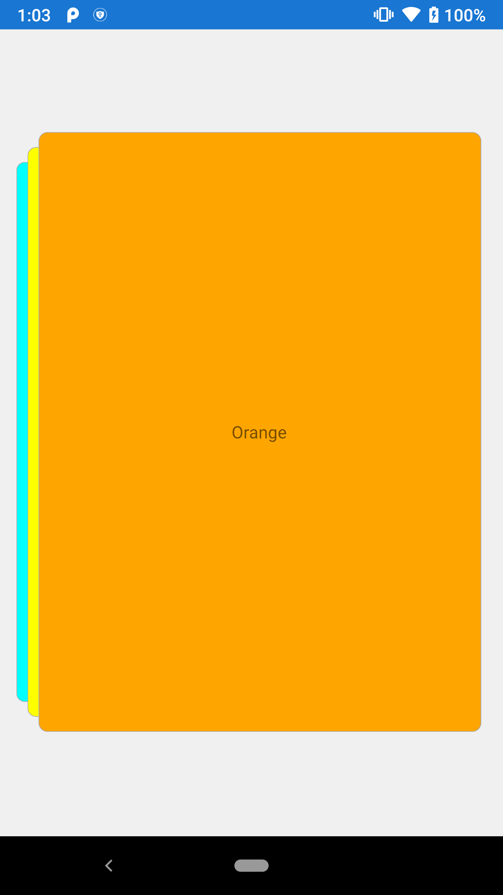
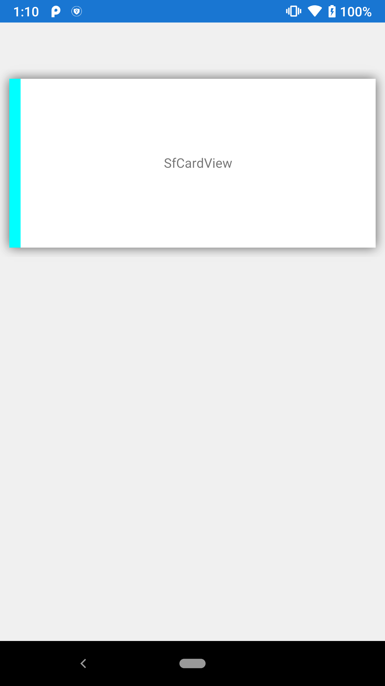

# Customization in CardLayout

### ShowSwipedCard

ShowSwipedCard can be enabled to show the swiped cards at the edge of card layout.

 



<cards:SfCardLayout ShowSwipedCard="true">
</cards:SfCardLayout>
 




SfCardLayout cardLayout = new SfCardLayout()
{
  ShowSwipedCard = true
};





### VisibleCardIndex

VisibleCardIndex is used when given index of the card to be displayed in front of the card layout.

 



<cards:SfCardLayout VisibleCardIndex="1">
</cards:SfCardLayout>
 




SfCardLayout cardLayout = new SfCardLayout()
{
  VisibleCardIndex = 1
};





### SwipeDirection

The SwipeDirection property indicates the swiping direction (left or right).

 



<cards:SfCardLayout SwipeDirection="Right">
</cards:SfCardLayout>
 




SfCardLayout cardLayout = new SfCardLayout()
{
    SwipeDirection = CardSwipeDirection.Right
};





You can find the complete getting started sample from this [link](https://github.com/SyncfusionExamples/xamarin.forms-cards).

## Customization in CardView

### Indicator customization

Indicators are used to indicate the state or level of something.

 



    <cards:SfCardView IndicatorColor="Cyan" HeightRequest="300" IndicatorThickness="12" IndicatorPosition="Left" >
            <Label  Text="SfCardView" VerticalTextAlignment="Center" HorizontalTextAlignment="Center"/>
        </cards:SfCardView>





SfCardView cardView = new SfCardView() 
{     
    Content = new Label() 
    { 
        Text = "SfCardView", 
        HorizontalTextAlignment = TextAlignment.Center, 
        VerticalTextAlignment =  TextAlignment.Center
    },
    IndicatorThickness = 12,
    HeightRequest = 300,
    IndicatorPosition = IndicatorPosition.Left,
    IndicatorColor = Color.Cyan
};
           





### FadeOutOnSwiping

FadeOutOnSwiping can be enabled when the card view needs to be faded with respect to swiping.

 



    <cards:SfCardView FadeOutOnSwiping="true"/>
 




SfCardView cardView = new SfCardView()
{
  FadeOutOnSwiping = true
};





N> This property won't work when adding the SfCardView as a child of SfCardLayout.

## Shadow Effect

The `CardView` control provides shadow effect support. To enable shadow effect, set the `HasShadow` property to `true`.

You can customize the color of shadow using the `ShadowColor` property.

 



<cards:SfCardView HeightRequest="300" HasShadow="True" ShadowColor="Red">
    <Label  Text="LightGray" BackgroundColor="LightGray"/>
</cards:SfCardView>





 SfCardView sfCardView = new SfCardView() 
 { 
   Content = new Label() { Text = "LightGray", BackgroundColor = Color.LightGray },
   HasShadow = true,
   ShadowColor = Color.Red
 };





N> This property will not work when adding the `SfCardView` as a child of `SfCardLayout`.

## See also

[How to remove cards from card view collection in Xamarin.Forms](https://www.syncfusion.com/kb/11655/how-to-remove-cards-from-card-view-collection-in-xamarin-forms)

[How to add multicolored stack of cards in Xamarin.Forms](https://www.syncfusion.com/kb/11660/how-to-add-multicolored-stack-of-cards-in-xamarin-forms)

[How to set shadow effect to the cards in Xamarin.Forms](https://www.syncfusion.com/kb/11651/how-to-set-shadow-effect-to-the-cards-in-xamarin-forms)

[How to add cards to the ListView in Xamarin.Forms](https://www.syncfusion.com/kb/11650/how-to-add-cards-to-the-listview-in-xamarin-forms)

[How to set the border color and width of a card within the SfCardLayout](https://www.syncfusion.com/kb/11634/how-to-set-the-border-color-and-width-of-a-card-within-the-cardlayout)

[How to reuse the dismissed cards in Xamarin.Forms SfCardView](https://www.syncfusion.com/kb/11648/how-to-reuse-the-dismissed-cards-in-xamarin-forms-sfcardview)
