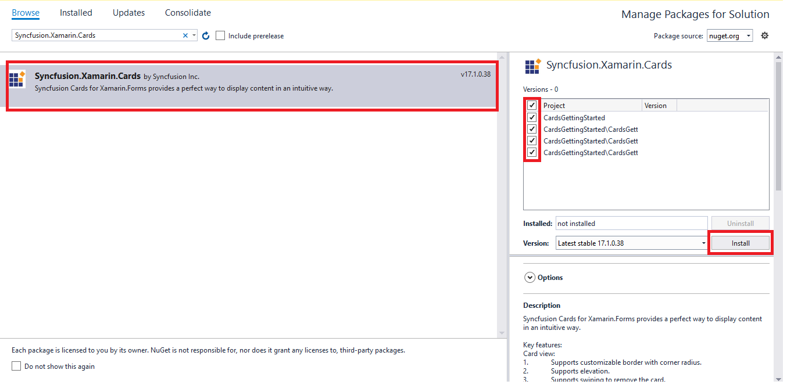
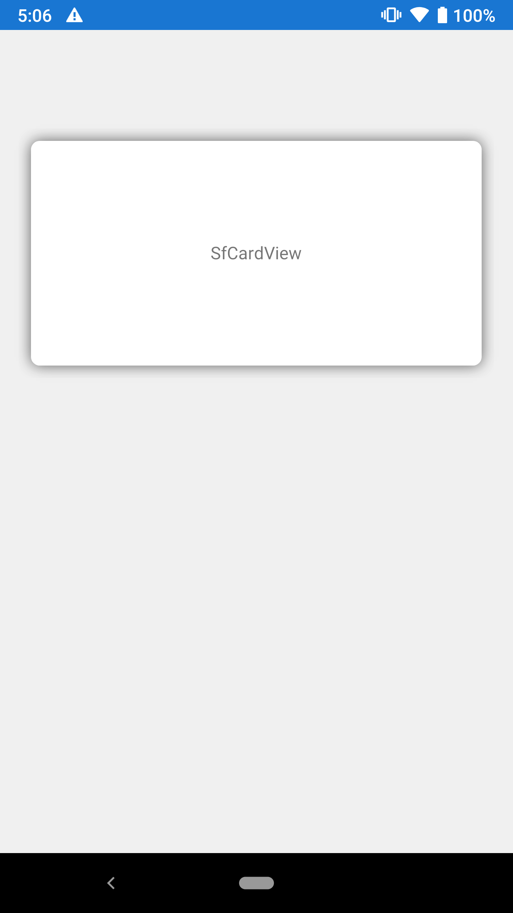
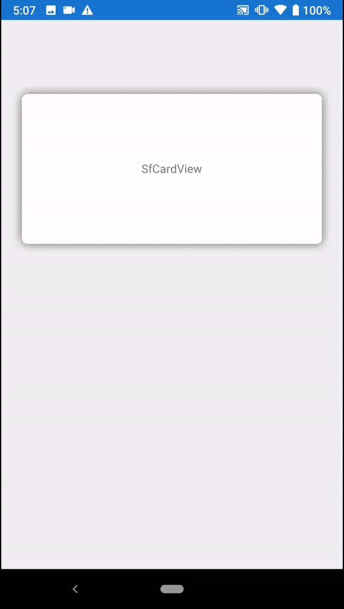
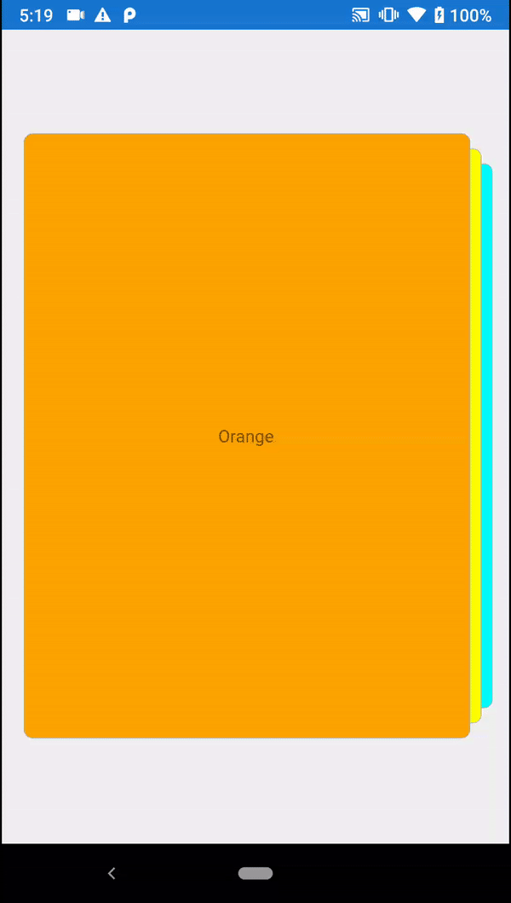

# Getting Started with Xamarin Cards

This section explains you the steps required to add content to SfCardView with indicator and add SfCardView to SCardLayout. This section covers only the minimal features needed to get started with the cards.

## Adding cards reference

You can add cards reference using one of the following methods:

**Method 1: Adding cards reference from nuget.org**

Syncfusion Xamarin components are available in [nuget.org](https://www.nuget.org/). To add cards to your project, open the NuGet package manager in Visual Studio, search for [Syncfusion.Xamarin.Cards](https://www.nuget.org/packages/Syncfusion.Xamarin.Cards/), and then install it.

N> Install the same version of the cards NuGet in all the projects.

**Method 2: Adding cards reference from toolbox**

Syncfusion provides Xamarin Toolbox. Using this toolbox, you can drag the SfCardView and SfCardLayout to the XAML page. It will automatically install the required NuGet packages and add the namespace to the page. To install Syncfusion Xamarin Toolbox, refer to [Toolbox](https://help.syncfusion.com/xamarin/utility#toolbox).

**Method 3: Adding Cards assemblies manually from the installed location**

If you prefer to manually reference the assemblies instead of referencing from NuGet, add the following assemblies in respective projects.

Location : {Installed location}/{version}/Xamarin/lib

<table>
<tr>
<td>PCL</td>
<td>Syncfusion.Cards.XForms.dll Syncfusion.Core.XForms.dll Syncfusion.Licensing.dll </td>
</tr>
<tr>
<td>Android</td>
<td>Syncfusion.Cards.XForms.Android.dll Syncfusion.Cards.XForms.dll Syncfusion.Core.XForms.dll Syncfusion.Core.XForms.Android.dll Syncfusion.Licensing.dll </td>
</tr>
<tr>
<td>iOS</td>
<td>Syncfusion.Cards.XForms.iOS.dll Syncfusion.Cards.XForms.dll Syncfusion.Core.XForms.dll Syncfusion.Core.XForms.iOS.dll Syncfusion.Licensing.dll </td>
</tr>
<tr>
<td>UWP</td>
<td>Syncfusion.Cards.XForms.UWP.dll Syncfusion.Cards.XForms.dll Syncfusion.Core.XForms.dll Syncfusion.Core.XForms.UWP.dll Syncfusion.Licensing.dll </td>
</tr>
</table>

N> To know more about obtaining our components, refer to these links for [Mac](https://help.syncfusion.com/xamarin/introduction/download-and-installation/mac/) and [Windows](https://help.syncfusion.com/xamarin/introduction/download-and-installation/windows/).

I> Starting with v16.2.0.x, if you reference Syncfusion assemblies from the trial setup or from the NuGet feed, you also have to include a license key in your projects. Please refer to [Syncfusion license key](https://help.syncfusion.com/common/essential-studio/licensing/license-key/) to know about registering Syncfusion license key in your Xamarin application to use our components.

## Launching the application on each platform with cards

To use the cards inside an application, each platform application requires some additional configurations. The configurations vary from platform to platform and are discussed in the following sections:

N> If you are adding the references from toolbox, below steps are not needed.

### iOS

To launch the cards in iOS, call the SfCardViewRenderer.Init() method in the FinishedLaunching overridden method of the AppDelegate class after the Xamarin.Forms framework has been initialized and before the LoadApplication method is called as demonstrated in the following code sample:

 

public override bool FinishedLaunching(UIApplication app, NSDictionary options) 
{ 
	… 
	global::Xamarin.Forms.Forms.Init();
	Syncfusion.XForms.iOS.Cards.SfCardViewRenderer.Init();
	LoadApplication(new App()); 
	…
}



### Universal Windows Platform (UWP)

To deploy the cards in `Release` mode, you need to initialize the cards assemblies in App.xaml.cs in the UWP project as shown in the below code snippets.

 

// In App.xaml.cs 
protected override void OnLaunched(LaunchActivatedEventArgs e)
{ 
	… 
	if (rootFrame == null) 
	{ 
		List<Assembly> assembliesToInclude = new List<Assembly>();
		assembliesToInclude.Add(typeof(Syncfusion.XForms.UWP.Cards.SfCardViewRenderer).GetTypeInfo().Assembly);
		Xamarin.Forms.Forms.Init(e, assembliesToInclude);
	} 
    … 
}



### Android

The Android platform does not require any additional configuration to render the cards.

## Initialize cards

Import the [`Cards`](https://help.syncfusion.com/cr/xamarin/Syncfusion.XForms.Cards.SfCardView.html) namespace as shown in the following code in your respective page.

 

 

    xmlns:cards="clr-namespace:Syncfusion.XForms.Cards;assembly=Syncfusion.Cards.XForms" 



 

    using Syncfusion.Cards.XForms;



 

### SfCardView

Initialize a card view with [`Content`](https://help.syncfusion.com/cr/xamarin/Syncfusion.XForms.Cards.SfCardView.html#Syncfusion_XForms_Cards_SfCardView_Content) as shown in the following code.

 

 

<cards:SfCardView>

	<Label Text="SfCardView"/>

</cards:SfCardView>



 

SfCardView cardView = new SfCardView();

//set Content for card view
cardView.Content = new Label(){ Text="SfCardView" };

this.Content = cardView;



 

Run the project and check if you get following output to make sure that you have configured your project properly to add [`Cards`](https://help.syncfusion.com/cr/xamarin/Syncfusion.XForms.Cards.SfCardLayout.html).

## SwipeToDismiss

The [`SwipeToDismiss`](https://help.syncfusion.com/cr/xamarin/) property is used to enable or disable swiping in SfCardView.

 



<cards:SfCardView SwipeToDismiss="true">
	<Label Text="SfCardView"/>
</cards:SfCardView>





SfCardView cardView = new SfCardView();
cardView.SwipeToDismiss = true;
cardView.Content = new Label(){ Text="SfCardView" };
this.Content = cardView;





N> This property won't work when adding the SfCardView as a child of SfCardLayout.

## Dismiss the card programmatically

We can get a view state of the card using the `IsDismissed` property, which also allows the user to programmatically alter the view state of the card.

 



<cards:SfCardView IsDismissed="true">
     <Label Text="SfCardView"/>
</cards:SfCardView>





SfCardView cardView = new SfCardView();
cardView.IsDismissed = true;
cardView.Content = new Label() { Text="SfCardView" };





N> This property won't work when adding the SfCardView as a child of SfCardLayout.

### SfCardLayout

Initialize a card layout with card view as shown in the following code.

 

 

<cards:SfCardLayout SwipeDirection="Left" HeightRequest="500" BackgroundColor="#F0F0F0">

	<cards:SfCardView>
		<Label  Text="Cyan" BackgroundColor="Cyan"/>
	</cards:SfCardView>

	<cards:SfCardView>
		<Label  Text="Yellow" BackgroundColor="Yellow"/>
	</cards:SfCardView>

	<cards:SfCardView>
		<Label  Text="Orange" BackgroundColor="Orange"/>
	</cards:SfCardView>  

</cards:SfCardLayout>



 

SfCardLayout cardLayout = new SfCardLayout();

//Add children for card layout 
cardLayout.Children.Add(new SfCardView(){Content = new Label(){ Text="Cyan", BackgroundColor=Color.Cyan }});

cardLayout.Children.Add(new SfCardView(){Content = new Label(){ Text="Yellow", BackgroundColor=Color.Yellow }});

cardLayout.Children.Add(new SfCardView(){Content = new Label(){ Text="Orange", BackgroundColor=Color.Orange }});

this.Content = cardLayout;



 

N> You can find the complete getting started sample from this [link](https://github.com/SyncfusionExamples/Getting-started-sample-of-cards).

## See also

[[How to remove cards from card view collection in Xamarin.Forms](https://www.syncfusion.com/kb/11655/how-to-remove-cards-from-card-view-collection-in-xamarin-forms)

[How to set shadow effect to the cards in Xamarin.Forms](https://www.syncfusion.com/kb/11651/how-to-set-shadow-effect-to-the-cards-in-xamarin-forms)

[How to add cards to the ListView in Xamarin.Forms](https://www.syncfusion.com/kb/11650/how-to-add-cards-to-the-listview-in-xamarin-forms)
	
[How to reuse the dismissed cards in Xamarin.Forms SfCardView](https://www.syncfusion.com/kb/11648/how-to-reuse-the-dismissed-cards-in-xamarin-forms-sfcardview)

