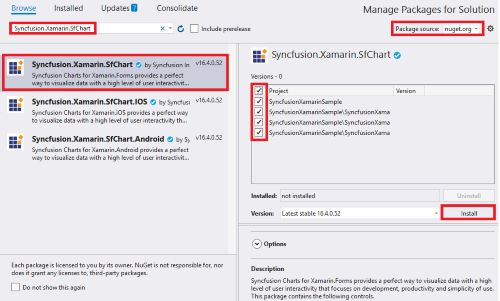
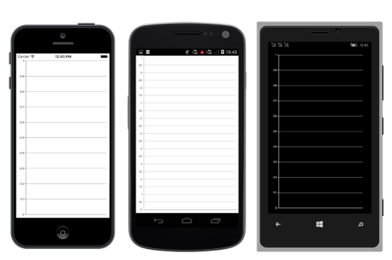
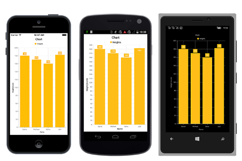

# Getting Started with Xamarin Charts (SfChart)

This section explains you the steps required to populate the Chart with data, title, add data labels and tooltips to the Chart. This section covers only the minimal features that you need to know to get started with the Chart.

To get start quickly with Xamarin.Forms SfChart, you can check on this video:

<iframe id='XamarinChartVideoTutorial' src='https://www.youtube.com/embed/CLE6qhIS9vM'></iframe>

## Adding SfChart reference

You can add SfChart reference using one of the following methods:

**Method 1: Adding SfChart reference from nuget.org**

Syncfusion Xamarin components are available in [nuget.org](https://www.nuget.org/). To add chart to your project, open the NuGet package manager in Visual Studio, search for [Syncfusion.Xamarin.SfChart](https://www.nuget.org/packages/Syncfusion.Xamarin.SfChart/), and then install it.

N> 
* Install the same version of the chart NuGet in all the projects.
* In addition, you need to install the [Syncfusion.Xamarin.SfChart.WPF](https://www.nuget.org/packages/Syncfusion.Xamarin.SfChart.WPF) package for Xamarin.Forms WPF platform only.

**Method 2: Adding SfChart reference from toolbox**

Syncfusion provides Xamarin Toolbox. Using this toolbox, you can drag the SfChart control to the XAML page. It will automatically install the required NuGet packages and add the namespace to the page. To install Syncfusion Xamarin Toolbox, refer to [Toolbox](https://help.syncfusion.com/xamarin/utility#toolbox).

**Method 3: Adding SfChart assemblies manually from the installed location**

If you prefer to manually reference the assemblies instead referencing from NuGet, add the following assemblies in respective projects.

Location : {Installed location}/{version}/Xamarin/lib

<table>
<tr>
<td>
PCL
</td>
<td>
Syncfusion.SfChart.XForms.dll 
Syncfusion.Core.XForms.dll 
Syncfusion.Licensing.dll 
</td>
</tr>
<tr>
<td>
Android
</td>
<td>
Syncfusion.SfChart.XForms.Android.dll 
Syncfusion.SfChart.XForms.dll 
Syncfusion.Core.XForms.dll 
Syncfusion.Core.XForms.Android.dll 
Syncfusion.Licensing.dll 
</td>
</tr>
<tr>
<td>
iOS
</td>
<td>
Syncfusion.SfChart.XForms.iOS.dll 
Syncfusion.SfChart.XForms.dll 
Syncfusion.Core.XForms.dll 
Syncfusion.Core.XForms.iOS.dll 
Syncfusion.Licensing.dll 
</td>
</tr>
<tr>
<td>
macOS
</td>
<td>
Syncfusion.SfChart.XForms.macOS.dll 
Syncfusion.SfChart.XForms.dll 
Syncfusion.Core.XForms.dll 
Syncfusion.Core.XForms.macOS.dll 
Syncfusion.Licensing.dll 
</td>
</tr>
<tr>
<td>
UWP
</td>
<td>
Syncfusion.SfChart.UWP.dll 
Syncfusion.SfChart.XForms.UWP.dll 
Syncfusion.SfChart.XForms.dll 
Syncfusion.Core.XForms.dll 
Syncfusion.Core.XForms.UWP.dll 
Syncfusion.Licensing.dll 
</td>
</tr>
<tr>
<td>
WPF
</td>
<td>
Syncfusion.SfChart.WPF.dll 
Syncfusion.SfChart.XForms.WPF.dll 
Syncfusion.SfChart.XForms.dll 
Syncfusion.Core.XForms.dll 
Syncfusion.Core.XForms.WPF.dll 
Syncfusion.Licensing.dll 
</td>
</tr>
</table>

N> To know more about obtaining our components, refer to these links for [Mac](https://help.syncfusion.com/xamarin/introduction/download-and-installation/mac/) and [Windows](https://help.syncfusion.com/xamarin/introduction/download-and-installation/windows/).

I> Starting with v16.2.0.x, if you reference Syncfusion assemblies from the trial setup or from the NuGet feed, you also have to include a license key in your projects. Please refer to [Syncfusion license key](https://help.syncfusion.com/common/essential-studio/licensing/license-key/) to know about registering Syncfusion license key in your Xamarin application to use our components.

## Launching the application on each platform with chart

To use the chart inside an application, each platform application requires some additional configurations. The configurations vary from platform to platform and is discussed in the following sections:

### iOS

To launch the chart in iOS, call the SfChartRenderer.Init() method in the FinishedLaunching overridden method of the AppDelegate class after the Xamarin.Forms framework initialization and before the LoadApplication method is called as demonstrated in the following code sample:

N> If you are adding the references from toolbox, this step is not needed.

 

public override bool FinishedLaunching(UIApplication app, NSDictionary options) 
{ 
    … 
    global::Xamarin.Forms.Forms.Init();

    Syncfusion.SfChart.XForms.iOS.Renderers.SfChartRenderer.Init();

    LoadApplication(new App()); 
    …
}



### macOS

To launch the chart in macOS, call the SfChartRenderer.Init() method in the DidFinishLaunching overridden method of the AppDelegate class after the Xamarin.Forms framework initialization and before the LoadApplication method is called as demonstrated in the following code sample:

 

public override void DidFinishLaunching(NSNotification notification)
{ 
    … 
    Forms.Init();

    Syncfusion.SfChart.XForms.MacOS.SfChartRenderer.Init();

    LoadApplication(new App());          
    …
}



### Windows Presentation Foundation (WPF)

To launch the chart in WPF, call the SfChartRenderer.Init() method in the MainWindow constructor of the MainWindow class after the Xamarin.Forms framework has been initialized and before the LoadApplication method is called as demonstrated in the following code sample.

 

public partial class MainWindow : FormsApplicationPage
{
     public MainWindow()
     { 
            InitializeComponent();

            Forms.Init();

            Syncfusion.SfChart.XForms.WPF.SfChartRenderer.Init();

            LoadApplication(new App());
     }
}



### Universal Windows Platform (UWP)

To deploy the chart in `Release` mode, you need to initialize the chart assemblies in App.xaml.cs in UWP project as shown in the below code snippets.

 

// In App.xaml.cs 
protected override void OnLaunched(LaunchActivatedEventArgs e)
{ 
   … 
   if (rootFrame == null) 
   { 
      List<Assembly> assembliesToInclude = new List<Assembly>();

      assembliesToInclude.Add(typeof(Syncfusion.SfChart.XForms.UWP.SfChartRenderer).GetTypeInfo().Assembly);

      Xamarin.Forms.Forms.Init(e, assembliesToInclude); 
   } 
… 
}



### Android

The Android platform does not require any additional configuration to render the chart.

## Initialize Chart

Import the [`SfChart`](https://help.syncfusion.com/cr/xamarin/Syncfusion.SfChart.XForms.SfChart.html) namespace as shown below in your respective Page,

 

 

xmlns:chart="clr-namespace:Syncfusion.SfChart.XForms;assembly=Syncfusion.SfChart.XForms" 



 

using Syncfusion.SfChart.XForms;



 

I>To render chart inside the StackLayout/ScrollView, please refer this [KB](https://www.syncfusion.com/kb/5722/how-to-add-the-chart-inside-stacklayout-scrollview).

Then initialize an empty chart with [`PrimaryAxis`](https://help.syncfusion.com/cr/xamarin/Syncfusion.SfChart.XForms.SfChart.html#Syncfusion_SfChart_XForms_SfChart_PrimaryAxis) and [`SecondaryAxis`](https://help.syncfusion.com/cr/xamarin/Syncfusion.SfChart.XForms.SfChart.html#Syncfusion_SfChart_XForms_SfChart_SecondaryAxis) as shown below,

 

 
<chart:SfChart>

    <chart:SfChart.PrimaryAxis>

        <chart:CategoryAxis>
 
        </chart:CategoryAxis>

    </chart:SfChart.PrimaryAxis>

    <chart:SfChart.SecondaryAxis>

        <chart:NumericalAxis>

        </chart:NumericalAxis>

    </chart:SfChart.SecondaryAxis>
		  
</chart:SfChart>


 
SfChart chart = new SfChart();

 //Initializing Primary Axis
CategoryAxis primaryAxis = new CategoryAxis();

chart.PrimaryAxis = primaryAxis;

//Initializing Secondary Axis
NumericalAxis secondaryAxis  =  new NumericalAxis  ();

chart.SecondaryAxis = secondaryAxis;

this.Content = chart;


 

Run the project and check if you get following output to make sure you have configured your project properly to add [`SfChart`.](https://help.syncfusion.com/cr/xamarin/Syncfusion.SfChart.XForms.SfChart.html)

## Initialize view model

Now, let us define a simple data model that represents a data point in [`SfChart`.](https://help.syncfusion.com/cr/xamarin/Syncfusion.SfChart.XForms.SfChart.html)


public class Person   
{   
    public string Name { get; set; }

    public double Height { get; set; }
}
 

Next, create a view model class and initialize a list of `Person` objects as shown below,


public class ViewModel  
{
      public List<Person> Data { get; set; }      

      public ViewModel()       
      {
            Data = new List<Person>()
            {
                new Person { Name = "David", Height = 180 },
                new Person { Name = "Michael", Height = 170 },
                new Person { Name = "Steve", Height = 160 },
                new Person { Name = "Joel", Height = 182 }
            }; 
       }
 }
 

Set the `ViewModel` instance as the `BindingContext` of your Page; this is done to bind properties of `ViewModel` to [`SfChart`.](https://help.syncfusion.com/cr/xamarin/Syncfusion.SfChart.XForms.SfChart.html)
 
N> Add namespace of `ViewModel` class in your XAML page if you prefer to set `BindingContext` in XAML.

 

 
<ContentPage xmlns="http://xamarin.com/schemas/2014/forms"

             xmlns:x="http://schemas.microsoft.com/winfx/2009/xaml"

             x:Class="ChartDemo.MainPage"

             xmlns:chart="clr-namespace:Syncfusion.SfChart.XForms;assembly=Syncfusion.SfChart.XForms"

             xmlns:local="clr-namespace:ChartDemo"> 
   
    <ContentPage.BindingContext>
       
	    <local:ViewModel></local:ViewModel>
   
    </ContentPage.BindingContext>
 
</ContentPage>


 
this.BindingContext = new ViewModel();


 

## Populate Chart with data

As we are going to visualize the comparison of heights in the data model, add [`ColumnSeries`](https://help.syncfusion.com/cr/xamarin/Syncfusion.SfChart.XForms.ColumnSeries.html) to [`SfChart.Series`](https://help.syncfusion.com/cr/xamarin/Syncfusion.SfChart.XForms.SfChart.html#Syncfusion_SfChart_XForms_SfChart_Series) property, and then bind the Data property of the above `ViewModel` to the [`ColumnSeries.ItemsSource`](https://help.syncfusion.com/cr/xamarin/Syncfusion.SfChart.XForms.ChartSeries.html#Syncfusion_SfChart_XForms_ChartSeries_ItemsSource) property as shown below.

N> You need to set [`XBindingPath`](https://help.syncfusion.com/cr/xamarin/Syncfusion.SfChart.XForms.ChartSeries.html#Syncfusion_SfChart_XForms_ChartSeries_XBindingPath) and [`YBindingPath`](https://help.syncfusion.com/cr/xamarin/Syncfusion.SfChart.XForms.XyDataSeries.html#Syncfusion_SfChart_XForms_XyDataSeries_YBindingPath) properties, so that [`SfChart`](https://help.syncfusion.com/cr/xamarin/Syncfusion.SfChart.XForms.SfChart.html) would fetch values from the respective properties in the data model to plot the series.

   


<chart:SfChart>
   
   <chart:SfChart.PrimaryAxis>
    
        <chart:CategoryAxis>

            <chart:CategoryAxis.Title>

                  <chart:ChartAxisTitle Text="Name"> </chart:ChartAxisTitle>

            </chart:CategoryAxis.Title>

         </chart:CategoryAxis>
   
   </chart:SfChart.PrimaryAxis>

   <chart:SfChart.SecondaryAxis>
  
       <chart:NumericalAxis>
            
           <chart:NumericalAxis.Title>
           
                 <chart:ChartAxisTitle Text="Height (in cm)"></chart:ChartAxisTitle>
           
          </chart:NumericalAxis.Title>      
       
      </chart:NumericalAxis>   

     </chart:SfChart.SecondaryAxis>
    
      <chart:SfChart.Series>
              
         <chart:ColumnSeries ItemsSource="{Binding Data}" XBindingPath="Name" YBindingPath="Height">
		 
		 </chart:ColumnSeries>
    
      </chart:SfChart.Series>

 </chart:SfChart> 



//Initializing primary axis
CategoryAxis primaryAxis = new CategoryAxis();

primaryAxis.Title.Text = "Name";

chart.PrimaryAxis = primaryAxis;

//Initializing secondary Axis
NumericalAxis secondaryAxis = new NumericalAxis();

secondaryAxis.Title.Text = "Height (in cm)";

chart.SecondaryAxis = secondaryAxis;

//Initializing column series
ColumnSeries series = new ColumnSeries();

series.SetBinding(ChartSeries.ItemsSourceProperty, "Data");

series.XBindingPath = "Name";

series.YBindingPath = "Height";

chart.Series.Add(series);


 

## Add Title

You can add title to chart to provide quick information to the user about the data being plotted in the chart. You can set title using [`SfChart.Title`](https://help.syncfusion.com/cr/xamarin/Syncfusion.SfChart.XForms.SfChart.html#Syncfusion_SfChart_XForms_SfChart_Title) property as shown below.

 


<chart:SfChart>

	...

   <chart:SfChart.Title>

        <chart:ChartTitle Text="Chart"/>  

   </chart:SfChart.Title>

	...

</chart:SfChart>


 
chart.Title.Text = "Chart";


  

Refer this [link](https://help.syncfusion.com/xamarin/sfchart/charttitle) to learn more about the options available in [`SfChart`](https://help.syncfusion.com/cr/xamarin/Syncfusion.SfChart.XForms.SfChart.html) to customize chart title.

## Enable data labels

You can add data labels to improve the readability of the chart. This can be achieved using [`ChartSeries.DataMarkers`](https://help.syncfusion.com/cr/xamarin/Syncfusion.SfChart.XForms.ChartSeries.html#Syncfusion_SfChart_XForms_ChartSeries_DataMarker) property as shown below.

 


<chart:SfChart>

	...

        <chart:ColumnSeries>

	     <chart:ColumnSeries.DataMarker>

		 <chart:ChartDataMarker/>

	     </chart:ColumnSeries.DataMarker>

       </chart:ColumnSeries>

	...

</chart:SfChart>


 
series.DataMarker = new ChartDataMarker();


  

Refer this [link](https://help.syncfusion.com/xamarin/sfchart/datamarker) to learn more about the options available in [`SfChart`](https://help.syncfusion.com/cr/xamarin/Syncfusion.SfChart.XForms.SfChart.html) to customize data markers.

## Enable legend

You can enable legend using [`SfChart.Legend`](https://help.syncfusion.com/cr/xamarin/Syncfusion.SfChart.XForms.SfChart.html#Syncfusion_SfChart_XForms_SfChart_Legend) property as shown below,

 


<chart:SfChart>

	...

    <chart:SfChart.Legend>

        <chart:ChartLegend/>

    </chart:SfChart.Legend>

    ...

</chart:SfChart>


 
chart.Legend = new ChartLegend (); 


  

Additionally, you need to set label for each series using [`ChartSeries.Label`](https://help.syncfusion.com/cr/xamarin/Syncfusion.SfChart.XForms.ChartSeries.html#Syncfusion_SfChart_XForms_ChartSeries_Label) property, which will be displayed in corresponding legend.

 


<chart:SfChart>

	...

      <chart:SfChart.Series>
              
         <chart:ColumnSeries Label="Heights" ItemsSource="{Binding Data}" XBindingPath="Name" YBindingPath="Height">
		 
		 </chart:ColumnSeries>
         
       </chart:SfChart.Series>

	...

</chart:SfChart>


 
series.Label = "Heights";


  

Refer this [link](https://help.syncfusion.com/xamarin/sfchart/legend) to learn more about the options available in [`SfChart`](https://help.syncfusion.com/cr/xamarin/Syncfusion.SfChart.XForms.SfChart.html) to customize legend.

## Enable tooltip

Tooltips are used to show information about the segment, when you tap on the segment. You can enable tooltip by setting [`ChartSeries.EnableTooltip`](https://help.syncfusion.com/cr/xamarin/Syncfusion.SfChart.XForms.ChartSeries.html#Syncfusion_SfChart_XForms_ChartSeries_EnableTooltip) property to true.

 


<chart:SfChart>

	...

   <chart:SfChart.Series>
       
        <chart:ColumnSeries ItemsSource="{Binding Data}" XBindingPath="Name" YBindingPath="Height" EnableTooltip ="True">
		
		</chart:ColumnSeries>
   
   </chart:SfChart.Series>

	...

 </chart:SfChart> 


 
series.EnableTooltip = true;




Refer this [link](https://help.syncfusion.com/xamarin/sfchart/tooltip) to learn more about the options available in [`SfChart`](https://help.syncfusion.com/cr/xamarin/Syncfusion.SfChart.XForms.SfChart.html) to customize tooltip.

The following code example gives you the complete code of above configurations.

 


<ContentPage xmlns:chart="clr-namespace:Syncfusion.SfChart.XForms;assembly=Syncfusion.SfChart.XForms"
             xmlns="http://xamarin.com/schemas/2014/forms"
             xmlns:local="clr-namespace: ChartGettingStarted;assembly=ChartGettingStarted"
             xmlns:x="http://schemas.microsoft.com/winfx/2009/xaml"
             x:Class="ChartGettingStarted.ChartSample">

  <chart:SfChart x:Name="Chart" HorizontalOptions="FillAndExpand" VerticalOptions="FillAndExpand">

    <chart:SfChart.BindingContext>
      <local:ViewModel/>
    </chart:SfChart.BindingContext>

    <chart:SfChart.Legend>
      <chart:ChartLegend />
    </chart:SfChart.Legend>

    <chart:SfChart.Title>
      <chart:ChartTitle Text="Chart"/>
    </chart:SfChart.Title>

    <chart:SfChart.PrimaryAxis>
      <chart:CategoryAxis>
        <chart:CategoryAxis.Title>
          <chart:ChartAxisTitle Text="Name"/>
        </chart:CategoryAxis.Title>
      </chart:CategoryAxis>
    </chart:SfChart.PrimaryAxis>

    <chart:SfChart.SecondaryAxis>
      <chart:NumericalAxis>
        <chart:NumericalAxis.Title>
          <chart:ChartAxisTitle Text="Height (in cm)"/>
        </chart:NumericalAxis.Title>
      </chart:NumericalAxis>
    </chart:SfChart.SecondaryAxis>

    <chart:SfChart.Series>
      <chart:ColumnSeries ItemsSource="{Binding Data}" Label="Heights" XBindingPath="Name" YBindingPath="Height" EnableTooltip="True">
        <chart:ColumnSeries.DataMarker>
          <chart:ChartDataMarker/>
        </chart:ColumnSeries.DataMarker>
      </chart:ColumnSeries>
    </chart:SfChart.Series>
  </chart:SfChart>

</ContentPage>
 


 

using Syncfusion.SfChart.XForms;

namespace ChartGettingStarted
{
    public partial class ChartSample : ContentPage
    {
        public ChartSample()
        {
            InitializeComponent();
            SfChart chart = new SfChart();
            chart.Title.Text = "Chart";

            //Initializing primary axis
            CategoryAxis primaryAxis = new CategoryAxis();
            primaryAxis.Title.Text = "Name";
            chart.PrimaryAxis = primaryAxis;

            //Initializing secondary Axis
            NumericalAxis secondaryAxis = new NumericalAxis();
            secondaryAxis.Title.Text = "Height (in cm)";
            chart.SecondaryAxis = secondaryAxis;

            //Initializing column series
            ColumnSeries series = new ColumnSeries();
            series.ItemsSource = viewModel.Data;
            series.XBindingPath = "Name";
            series.YBindingPath = "Height";
            series.Label = "Heights";

            series.DataMarker = new ChartDataMarker();
            series.EnableTooltip = true;
            chart.Legend = new ChartLegend();

            chart.Series.Add(series);
            this.Content = chart;

        }
    }
}




The following chart is created as a result of the above codes.

You can find the complete getting started sample from this [link.](https://github.com/SyncfusionExamples/xamarin.forms-sfchart)

## See also

[How to resolve the rendering issue with chart in iOS and macOS](https://www.syncfusion.com/kb/7144/how-to-resolve-chart-not-rendering-issue-in-ios-and-macos)

[How to make Syncfusion Xamarin.Forms chart to work in UWP in release mode when .NET Native tool chain is enabled](https://www.syncfusion.com/kb/7149/how-to-make-syncfusion-xamarin-forms-chart-to-work-in-uwp-in-release-mode-when-net-native)

[How to solve application crashes due to privacy violation in iOS 10+ devices](https://www.syncfusion.com/kb/9300/how-to-solve-application-crashes-due-to-privacy-violation-in-ios-10-devices)

[How to add the Xamarin.Forms chart in a ListView](https://www.syncfusion.com/kb/11341/how-to-add-the-xamarin-forms-chart-in-a-listview)

[How to remove the default padding of Xamarin.Forms chart](https://www.syncfusion.com/kb/9606/how-to-remove-the-default-padding-of-xamarin-forms-chart)

[How to make animation work on Android chart in release mode](https://www.syncfusion.com/kb/10729/how-to-make-animation-work-on-chart-in-release-mode-with-android-proguard)

[How to add the chart inside StackLayout/ScrollView](https://www.syncfusion.com/kb/5722/how-to-add-the-chart-inside-stacklayout-scrollview)

[How to upgrade to newer versions of NuGet Package](https://www.syncfusion.com/kb/6939/upgrading-to-newer-versions-of-nuget-package)

[How to view corner segments without cutting in edge of Xamarin.Forms chart](https://www.syncfusion.com/kb/10785/how-to-view-corner-segments-without-cutting-in-edge-of-xamarin-forms-chart)
