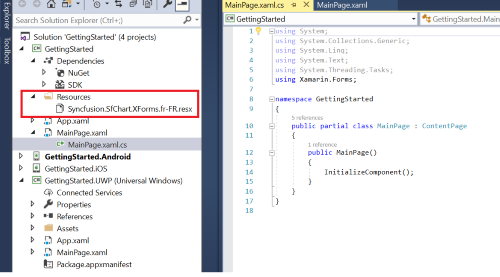
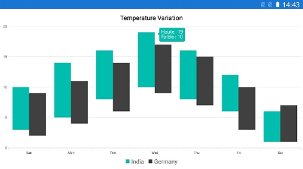

## Localization 

You can localize [`SfChart`](https://help.syncfusion.com/cr/xamarin/Syncfusion.SfChart.XForms.SfChart.html) in all the platforms by adding a .resx file in a .NET Standard project alone. The following steps describe how to localize SfChart in a project and you can download the complete sample from this [`link`](https://github.com/SyncfusionExamples/how-to-localize-the-labels-in-xamarin-forms-sfchart).

N> Here, the resources have been already created for some cultures and shared them on [`Syncfusion GitHub`](https://github.com/syncfusion/xamarin-localized-texts) for your convenience.

1. Add a new folder in the .NET Standard project named Resources.

2. Add resource files for the languages you wish to support, and set their Build Action to EmbeddedResource. The name of the resource file should be $name of the Syncfusion component$+$language code$+.resx. For example, if you add a resource file for the French culture, add the Syncfusion.SfChart.XForms.fr-FR.resx file to Resources folder as illustrated in the following screenshot.

3. Provide the French values for each key in the respective .resx files. Here, “Close” and “High” are the keys, and “Fermer” and “Haute” are their respective French values.



<data name="Close" xml:space="preserve">
  <value>Fermer</value>
</data>
<data name="High" xml:space="preserve">
  <value>Haute</value>
</data>  

 

4. Set the resource manager to [‘ChartResourceManager.Manager’](https://help.syncfusion.com/cr/xamarin/Syncfusion.SfChart.XForms.ChartResourceManager.html#Syncfusion_SfChart_XForms_ChartResourceManager_Manager) as demonstrated in the following code to get the resource manager from the users. For more details, refer [`Localization`](https://blog.syncfusion.com/post/localization-made-easy-for-syncfusion-xamarin-forms-components.aspx).



ChartResourceManager.Manager = new ResourceManager("GettingStarted.Resources.Syncfusion.SfChart.XForms", Application.Current.GetType().Assembly);

 

## Localize at application level

You can also localize the text at application-level regardless of the language selected on the device. The following platform-specific codes are needed to localize the text at application-level. Use the [`DependencyServices`](https://docs.microsoft.com/en-us/xamarin/xamarin-forms/app-fundamentals/dependency-service/introduction) to set this from .NET Standard project.



//For Android and iOS,
Thread.CurrentThread.CurrentUICulture = new CultureInfo("fr-FR");

//For UWP,
CultureInfo.CurrentUICulture = new CultureInfo("fr-FR");

 

## See also

[How to localize the labels in Xamarin.Forms Chart](https://www.syncfusion.com/kb/9415/how-to-localize-the-labels-in-xamarin-forms-chart)