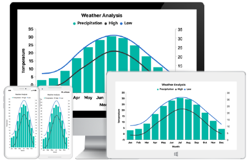

# Overview

Essential Chart for Xamarin.Forms provide a perfect way to visualize data with a high level of user interactivity that focuses on development, productivity and simplicity of use. Essential Chart also provides a wide variety of charting features that are used to visualize large quantities of data, flexible data binding and user customization.

## Key features

* Chart supports more than 25 different types of series, ranging from simple bar series to complex financial charts. Each type of chart represents a unique style of representing data that is more user friendly and has greater UI visualization.
* Data can be plotted against multiple scales that helps to visualize the mixed types of data in a single chart.
* Chart provides support to render multiple series at the same time, with options to compare and visualize two different chart series, simultaneously.
* User friendly customization support.[`SfChart`](https://help.syncfusion.com/cr/xamarin/Syncfusion.SfChart.XForms.SfChart.html) provides various options for you to customize chart features, axis, labels, legends, series, etc., and visualize them accordingly. 
