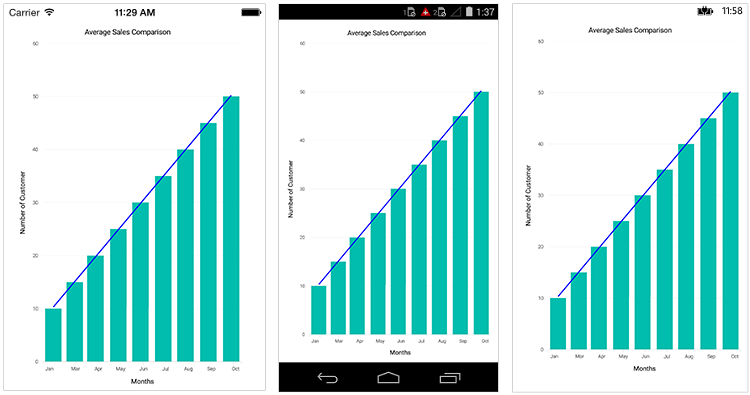
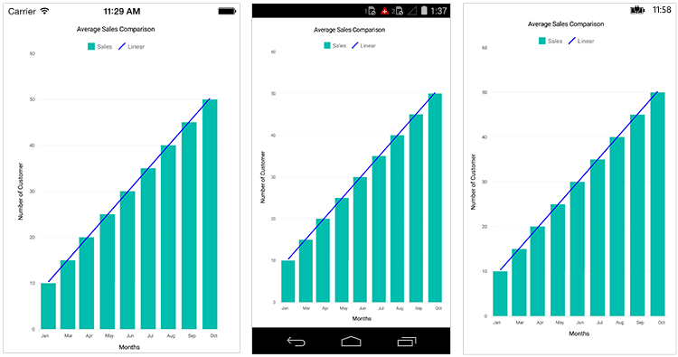
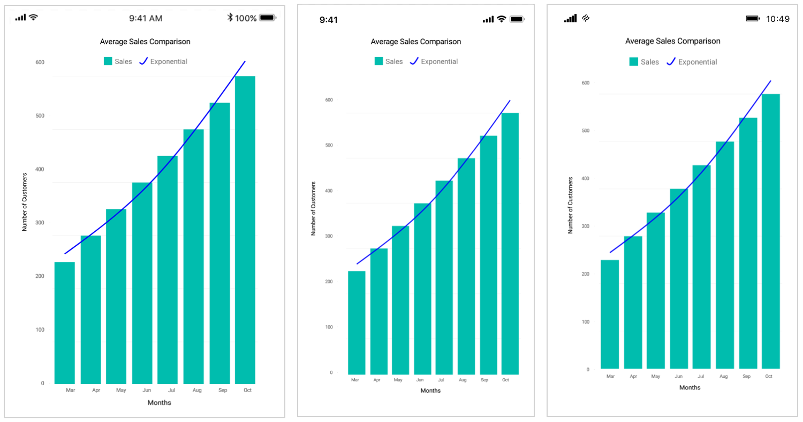
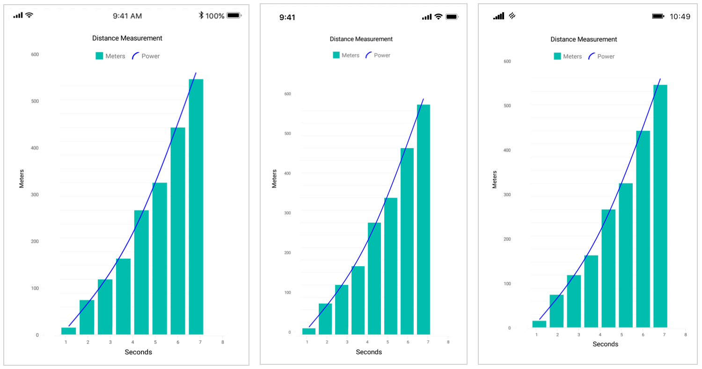
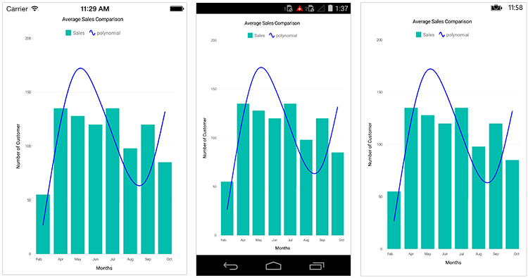
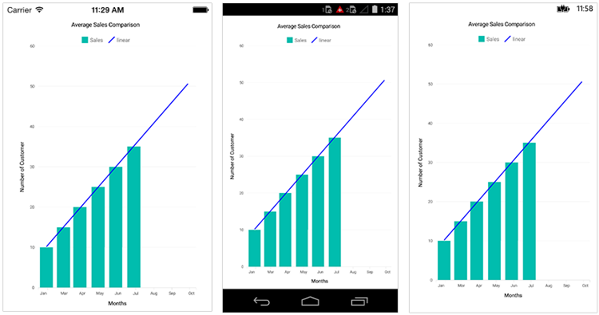
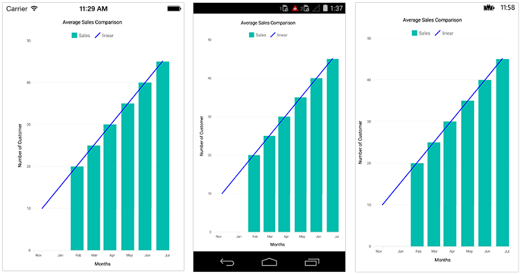
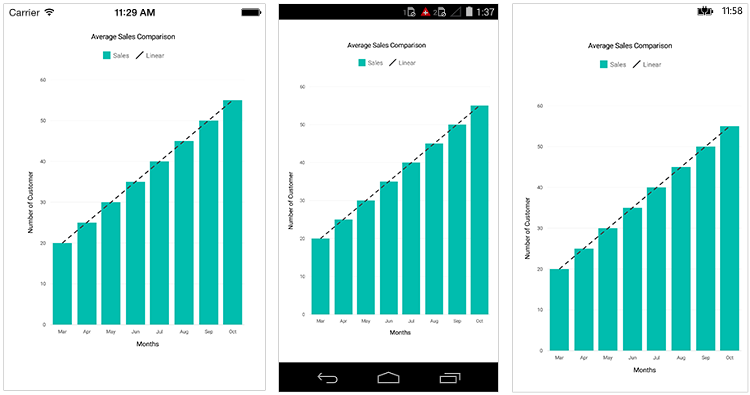

# Trendlines in Xamarin Charts (SfChart)

The [`Trendline`](https://help.syncfusion.com/cr/xamarin/Syncfusion.SfChart.XForms.ChartTrendline.html) is a line drawn over the chart to display the overall direction of the results. And it built on the assumption based on current and past beliefs. 

N> We can draw trendlines for all type of Cartesian series except bar type.

The following code examples shows how to add trendlines in Xamarin.Forms Chart.

 



<chart:ColumnSeries ItemsSource="{Binding DataCollection}">
    
    <chart:ColumnSeries.Trendlines>
        <chart:ChartTrendlineCollection>
            <chart:ChartTrendline/>
        </chart:ChartTrendlineCollection>
    </chart:ColumnSeries.Trendlines>
    
</chart:ColumnSeries>





ColumnSeries columnSeries = new ColumnSeries() { ...};

. . .

columnSeries.Trendlines = new ChartTrendlineCollection();

columnSeries.Trendlines.Add(new ChartTrendline());





## Types of Trendline

SfChart support following types of [`Trendlines`](https://help.syncfusion.com/cr/xamarin/Syncfusion.SfChart.XForms.ChartTrendline.html).

* [`Linear`](https://help.syncfusion.com/xamarin/charts/trendlines#linear)
* [`Exponential`](https://help.syncfusion.com/xamarin/charts/trendlines#exponential)
* [`Logarithmic`](https://help.syncfusion.com/xamarin/charts/trendlines#logarithmic)
* [`Power`](https://help.syncfusion.com/xamarin/charts/trendlines#power)
* [`Polynomial`](https://help.syncfusion.com/xamarin/charts/trendlines#polynomial)

### Linear

[`Linear`](https://help.syncfusion.com/cr/xamarin/Syncfusion.SfChart.XForms.ChartTrendlineType.html) trendline was best-fit straight line for simple linear datasets. A linear trend line usually shows that something is increasing or decreasing at a steady rate. This is the default trendline to be drawn for the SfChart.

The following is the code example of linear trend line.

 



<chart:ColumnSeries  ItemsSource="{Binding linearData}">

    <chart:ColumnSeries.Trendlines>
        <chart:ChartTrendlineCollection>
            <chart:ChartTrendline Type="Linear" Label="Linear"/>
        </chart:ChartTrendlineCollection>
    </chart:ColumnSeries.Trendlines>
</chart:ColumnSeries>





ColumnSeries columnSeries = new ColumnSeries() { ...};
columnSeries.Trendlines = new ChartTrendlineCollection();

ChartTrendline linearTrendline = new ChartTrendline()
{
    Type = ChartTrendlineType.Linear,
    Label = "Linear"
};

columnSeries.Trendlines.Add(linearTrendline);
Chart.Series.Add(columnSeries);





### Logarithmic

A [`Logarithmic`](https://help.syncfusion.com/cr/xamarin/Syncfusion.SfChart.XForms.ChartTrendlineType.html) trendline is the strongest-fit curved line, that is most effective when the data change rate increases or decreases rapidly. Logarithmic trends may use negative and/or positive values as well. 

The following is the code example of logarithmic trend line.

 



<chart:ColumnSeries  ItemsSource="{Binding linearData}">
    <chart:ColumnSeries.Trendlines>
        <chart:ChartTrendlineCollection>
            <chart:ChartTrendline Type="Logarithmic" Label="Logarithmic"/>
        </chart:ChartTrendlineCollection>
    </chart:ColumnSeries.Trendlines>
</chart:ColumnSeries>





ColumnSeries columnSeries = new ColumnSeries() { ...};
columnSeries.Trendlines = new ChartTrendlineCollection();

ChartTrendline linearTrendline = new ChartTrendline()
{
    Type = ChartTrendlineType.Logarithmic,
    Label = "Logarithmic"
};

columnSeries.Trendlines.Add(new ChartTrendline());
Chart.Series.Add(columnSeries);





### Exponential

The [`Exponential`](https://help.syncfusion.com/cr/xamarin/Syncfusion.SfChart.XForms.ChartTrendlineType.html) trendline is the curved line most useful for data values rise or fall at increasingly higher rates.

N> SfChart will not generate Exponential trendline when your data contains zero or negative values. 

 



<chart:ColumnSeries  ItemsSource="{Binding linearData}">

    <chart:ColumnSeries.Trendlines>
        <chart:ChartTrendlineCollection>
            <chart:ChartTrendline Type="Exponential" Label="Exponential"/>
        </chart:ChartTrendlineCollection>
    </chart:ColumnSeries.Trendlines>
</chart:ColumnSeries>





ColumnSeries columnSeries = new ColumnSeries() { ...};
columnSeries.Trendlines = new ChartTrendlineCollection();

ChartTrendline linearTrendline = new ChartTrendline()
{
    Type = ChartTrendlineType.Exponential,
    Label = "Exponential"
};

columnSeries.Trendlines.Add(new ChartTrendline());
Chart.Series.Add(columnSeries);





### Power

The [`Power`](https://help.syncfusion.com/cr/xamarin/Syncfusion.SfChart.XForms.ChartTrendlineType.html) trendline is typically used with data sets to compare measurements that grow at a specific rate.

The following is the code example of power trend line.

 



<chart:ColumnSeries  ItemsSource="{Binding linearData}">

    <chart:ColumnSeries.Trendlines>
        <chart:ChartTrendlineCollection>
            <chart:ChartTrendline Type="Power" Label="Power"/>
        </chart:ChartTrendlineCollection>
    </chart:ColumnSeries.Trendlines>
</chart:ColumnSeries>





ColumnSeries columnSeries = new ColumnSeries() { ...};
columnSeries.Trendlines = new ChartTrendlineCollection();

ChartTrendline linearTrendline = new ChartTrendline()
{
    Type = ChartTrendlineType.Power,
    Label = "Power"
};

columnSeries.Trendlines.Add(new ChartTrendline());
Chart.Series.Add(columnSeries);





### Polynomial

The [`polynomial`](https://help.syncfusion.com/cr/xamarin/Syncfusion.SfChart.XForms.ChartTrendlineType.html) trendline is a curved line that is used when there are more data fluctuations. By default, this trendline calculated with order of 2, it will be override by the property [`PolynomialOrder`](https://help.syncfusion.com/cr/xamarin/Syncfusion.SfChart.XForms.ChartTrendline.html#Syncfusion_SfChart_XForms_ChartTrendline_PolynomialOrder).

The following is the code example of polynomial trend line.

 



<chart:ColumnSeries  ItemsSource="{Binding linearData}">

     <chart:ColumnSeries.Trendlines>
         <chart:ChartTrendlineCollection>
             <chart:ChartTrendline Type="Polynomial" PolynomialOrder="3"/>
         </chart:ChartTrendlineCollection>
     </chart:ColumnSeries.Trendlines>
 </chart:ColumnSeries>





ColumnSeries columnSeries = new ColumnSeries() { ...};
columnSeries.Trendlines = new ChartTrendlineCollection();

ChartTrendline linearTrendline = new ChartTrendline()
{
    Type = ChartTrendlineType.Polynomial,
    PolynomialOrder = 3,
};

columnSeries.Trendlines.Add(new ChartTrendline());
Chart.Series.Add(columnSeries);





## Forecasting

Forecasting is used to display trends about the future and the past beliefs.

The following two types of forecasting are available in SfChart:

* Forward Forecasting
* Backward Forecasting

### Forward Forecasting

For determining the future trends (in forward direction). The 
following code example explains the how to set the value for [`ForwardForecast`](https://help.syncfusion.com/cr/xamarin/Syncfusion.SfChart.XForms.ChartTrendline.html#Syncfusion_SfChart_XForms_ChartTrendline_ForwardForecast).

 



<chart:ColumnSeries  ItemsSource="{Binding linearData}">

    <chart:ColumnSeries.Trendlines>
        <chart:ChartTrendlineCollection>
            <chart:ChartTrendline Type="Linear" ForwardForecast="3"/>
        </chart:ChartTrendlineCollection>
    </chart:ColumnSeries.Trendlines>
</chart:ColumnSeries>





columnSeries.Trendlines = new ChartTrendlineCollection();

ChartTrendline linearTrendline = new ChartTrendline()
{
    Type = ChartTrendlineType.Linear,
    ForwardForecast = 3,
};

columnSeries.Trendlines.Add(new ChartTrendline());





### Backward Forecasting

For determining the future trends (in backward direction). The following code example explains the how to set the value for [`BackwardForecast`](https://help.syncfusion.com/cr/xamarin/Syncfusion.SfChart.XForms.ChartTrendline.html#Syncfusion_SfChart_XForms_ChartTrendline_BackwardForecast).

 



<chart:ColumnSeries  ItemsSource="{Binding linearData}">

    <chart:ColumnSeries.Trendlines>
        <chart:ChartTrendlineCollection>
            <chart:ChartTrendline Type="Linear" BackwardForecast="3"/>
        </chart:ChartTrendlineCollection>
    </chart:ColumnSeries.Trendlines>
</chart:ColumnSeries>





columnSeries.Trendlines = new ChartTrendlineCollection();
ChartTrendline linearTrendline = new ChartTrendline()
{
    Type = ChartTrendlineType.Linear,
    BackwardForecast = 3,
};

columnSeries.Trendlines.Add(new ChartTrendline());
Chart.Series.Add(columnSeries);





## Customization

We can customize the trendline appearance using [`StrokeWidth`](https://help.syncfusion.com/cr/xamarin/Syncfusion.SfChart.XForms.ChartTrendline.html#Syncfusion_SfChart_XForms_ChartTrendline_StrokeWidth), [`StrokeColor`](https://help.syncfusion.com/cr/xamarin/Syncfusion.SfChart.XForms.ChartTrendline.html#Syncfusion_SfChart_XForms_ChartTrendline_StrokeColor) and [`StrokeDashArray`](https://help.syncfusion.com/cr/xamarin/Syncfusion.SfChart.XForms.ChartTrendline.html#Syncfusion_SfChart_XForms_ChartTrendline_StrokeDashArray) properties. 

 



<chart:ColumnSeries.Trendlines>

    <chart:ChartTrendlineCollection>
        <chart:ChartTrendline StrokeWidth="3" StrokeColor="#404041">
            <chart:ChartTrendline.StrokeDashArray>
                <x:Array Type="{x:Type x:Double}">
                    <sys:Double>5</sys:Double>
                    <sys:Double>6</sys:Double>
                </x:Array>
            </chart:ChartTrendline.StrokeDashArray>
        </chart:ChartTrendline>
    </chart:ChartTrendlineCollection>
</chart:ColumnSeries.Trendlines>





columnSeries.Trendlines = new ChartTrendlineCollection();

ChartTrendline linearTrendline = new ChartTrendline()
{
   StrokeColor = Color.FromHex("#404041"),
   StrokeWidth = 3,
   StrokeDashArray = new double[] {5,6},
};

columnSeries.Trendlines.Add(new ChartTrendline());





## Legend Item Visibility

We can able to control the visibility of the trendline legend items using [`IsVisibleOnLegend`](https://help.syncfusion.com/cr/xamarin/Syncfusion.SfChart.XForms.ChartTrendline.html#Syncfusion_SfChart_XForms_ChartTrendline_IsVisibleOnLegend) property of the Trendline.

 



<chart:ColumnSeries.Trendlines>
    <chart:ChartTrendlineCollection>
        <chart:ChartTrendline IsVisibleOnLegend="True" >
        </chart:ChartTrendline>
    </chart:ChartTrendlineCollection>
</chart:ColumnSeries.Trendlines>





columnSeries.Trendlines = new ChartTrendlineCollection();

ChartTrendline linearTrendline = new ChartTrendline()
{
    IsVisibleOnLegend = true;
};

columnSeries.Trendlines.Add(new ChartTrendline());




