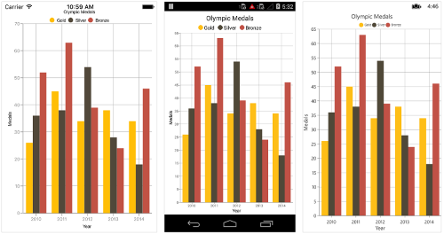
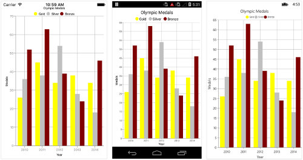
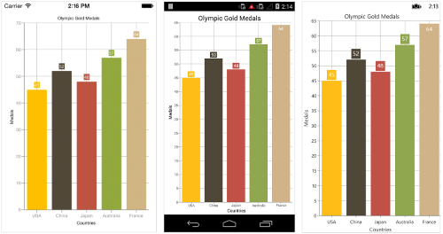
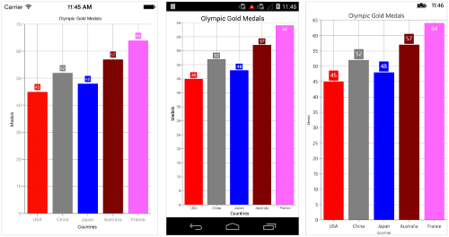
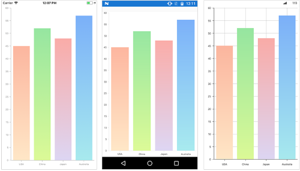
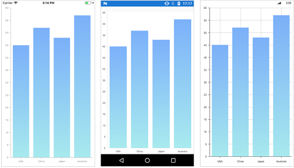

# Color Palette of Xamarin.Forms Chart (SfChart)

## Apply palette for Chart

[`ColorModel`](https://help.syncfusion.com/cr/xamarin/Syncfusion.SfChart.XForms.SfChart.html#Syncfusion_SfChart_XForms_SfChart_ColorModel) property of [`SfChart`](https://help.syncfusion.com/cr/xamarin/Syncfusion.SfChart.XForms.SfChart.html) is used to define the colors for each series. [`ColorModel`](https://help.syncfusion.com/cr/xamarin/Syncfusion.SfChart.XForms.ChartColorModel.html) contains the following color palettes.

**Predefined Palettes**

Currently, Chart supports only [`Metro`](https://help.syncfusion.com/cr/xamarin/Syncfusion.SfChart.XForms.ChartColorPalette.html) palette and it is the default palette for [`SfChart`](https://help.syncfusion.com/cr/xamarin/Syncfusion.SfChart.XForms.SfChart.html). The following screenshot shows the default appearance of multiple series.

**Custom Palette**

Chart will use the colors from [`CustomBrushes`](https://help.syncfusion.com/cr/xamarin/Syncfusion.SfChart.XForms.ChartColorModel.html#Syncfusion_SfChart_XForms_ChartColorModel_CustomBrushes) property if [`ColorModel.Palette`](https://help.syncfusion.com/cr/xamarin/Syncfusion.SfChart.XForms.ChartColorModel.html#Syncfusion_SfChart_XForms_ChartColorModel_Palette) is set to [`Custom`](https://help.syncfusion.com/cr/xamarin/Syncfusion.SfChart.XForms.ChartColorPalette.html).

Following code illustrates how to set the custom colors.

 



<ContentPage.Resources>
    <ResourceDictionary>
        <chart:ChartColorCollection x:Key="Colors">
                <Color>Yellow</Color>
                <Color>Gray</Color>
                <Color>Maroon</Color>
            </chart:ChartColorCollection>
    </ResourceDictionary>
</ContentPage.Resources>

<chart:SfChart>
    <chart:SfChart.ColorModel>
        <chart:ChartColorModel Palette="Custom" CustomBrushes="{StaticResource Colors}"/>
    </chart:SfChart.ColorModel>

    ...
</chart:SfChart>





SfChart chart = new SfChart()
{
     ColorModel = new ChartColorModel()
     {
         Palette = ChartColorPalette.Custom,
         CustomBrushes = new ChartColorCollection()
         {
             Color.Yellow,
             Color.Gray,
             Color.Maroon
         }
     },
	 ...
}; 





**None Palette**

[`None`](https://help.syncfusion.com/cr/xamarin/Syncfusion.SfChart.XForms.ChartColorPalette.html) palette will not apply any color to the series. So in order to define the color for any series, you can use the [`Color`](https://help.syncfusion.com/cr/xamarin/Syncfusion.SfChart.XForms.ChartSeries.html#Syncfusion_SfChart_XForms_ChartSeries_Color) property or the [`ColorModel`](https://help.syncfusion.com/cr/xamarin/Syncfusion.SfChart.XForms.SfChart.html#Syncfusion_SfChart_XForms_SfChart_ColorModel) property of [`ChartSeries`](https://help.syncfusion.com/cr/xamarin/Syncfusion.SfChart.XForms.ChartSeries.html) (The ColorModel of Series will be explained later in this document).

## Apply palette for Series

[`ColorModel`](https://help.syncfusion.com/cr/xamarin/Syncfusion.SfChart.XForms.ChartSeries.html#Syncfusion_SfChart_XForms_ChartSeries_ColorModel) property of [`ChartSeries`](https://help.syncfusion.com/cr/xamarin/Syncfusion.SfChart.XForms.ChartSeries.html) is used to define the colors for each data point. Following palettes are used to define the colors.

**Predefined Palettes**

Currently, Chart supports only [`Metro`](https://help.syncfusion.com/cr/xamarin/Syncfusion.SfChart.XForms.ChartColorPalette.html) palette.

 



<chart:SfChart>
...

	<chart:ColumnSeries ItemsSource ="{Binding Data}" XBindingPath="Country" YBindingPath="Value">

		<chart:ColumnSeries.ColorModel>

			<chart:ChartColorModel Palette="Metro"/>

		</chart:ColumnSeries.ColorModel>

	</chart:ColumnSeries>

</chart:SfChart>





SfChart chart = new SfChart();
...

ColumnSeries columnSeries = new ColumnSeries() { 

	ItemsSource = Data, 
	XBindingPath = "Country", 
	YBindingPath = "Value" 
	
};

columnSeries.ColorModel.Palette = ChartColorPalette.Metro;

chart.Series.Add(columnSeries);





N> The single line segment rendered based on the two data points. Since, each color in the ColorModel has been applied to their segments by combining it with two data points for all types of line series.

**Custom Palette**

Series will use the colors from [`CustomBrushes`](https://help.syncfusion.com/cr/xamarin/Syncfusion.SfChart.XForms.ChartColorModel.html#Syncfusion_SfChart_XForms_ChartColorModel_CustomBrushes) property if the [`ColorModel.Palette`](https://help.syncfusion.com/cr/xamarin/Syncfusion.SfChart.XForms.ChartColorModel.html#Syncfusion_SfChart_XForms_ChartColorModel_Palette) property of series is set to [`Custom`](https://help.syncfusion.com/cr/xamarin/Syncfusion.SfChart.XForms.ChartColorPalette.html).

Following code illustrates how to set the custom colors.

 



<ContentPage.Resources>
    <ResourceDictionary>
        <chart:ChartColorCollection x:Key="Colors">
             <Color>Red</Color>
             <Color>Gray</Color>
             <Color>Blue</Color>
             <Color>Maroon</Color>
             <Color>Pink</Color>
        </chart:ChartColorCollection>
    </ResourceDictionary>
</ContentPage.Resources>

<chart:SfChart>
    ...
    <chart:SfChart.Series>
        <chart:ColumnSeries ItemsSource="{Binding Data}" XBindingPath="Name" YBindingPath="Height">
            <chart:ColumnSeries.ColorModel>
                <chart:ChartColorModel Palette="Custom" CustomBrushes="{StaticResource Colors}"/>
            </chart:ColumnSeries.ColorModel>
        </chart:ColumnSeries>
    </chart:SfChart.Series>
</chart:SfChart>





SfChart chart = new SfChart()
{
    ...
    Series =
    {
       new ColumnSeries()
       {
             ItemsSource = viewModel.Data,
             XBindingPath = "Name",
             YBindingPath = "Height",
             ColorModel = new ChartColorModel()
             {
                 Palette = ChartColorPalette.Custom,
                 CustomBrushes = new ChartColorCollection()
                 {
                    Color.Red,
                    Color.Gray,
                    Color.Blue,
                    Color.Maroon,
                    Color.Pink,
                 }
             }
        }
    }
};





**None Palette**

[`None`](https://help.syncfusion.com/cr/xamarin/Syncfusion.SfChart.XForms.ChartColorPalette.html) palette will not apply any color to the data points. So in order to define the color for the data points, you can use the [`Color`](https://help.syncfusion.com/cr/xamarin/Syncfusion.SfChart.XForms.ChartSeries.html#Syncfusion_SfChart_XForms_ChartSeries_ColorProperty) property of [`ChartSeries`](https://help.syncfusion.com/cr/xamarin/Syncfusion.SfChart.XForms.ChartSeries.html).

## Gradient Colors

The [`CustomGradientColors`](https://help.syncfusion.com/cr/xamarin/Syncfusion.SfChart.XForms.ChartColorModel.html#Syncfusion_SfChart_XForms_ChartColorModel_CustomGradientColors) property of [`ChartColorModel`](https://help.syncfusion.com/cr/xamarin/Syncfusion.SfChart.XForms.ChartColorModel.html) is used to define the gradient colors, the colors from this property is used for series or chart if the [`Palette`](https://help.syncfusion.com/cr/xamarin/Syncfusion.SfChart.XForms.ChartColorModel.html#Syncfusion_SfChart_XForms_ChartColorModel_Palette) property of ChartColorModel is [`Custom`](https://help.syncfusion.com/cr/xamarin/Syncfusion.SfChart.XForms.ChartColorPalette.html) and the [`CustomBrushes`](https://help.syncfusion.com/cr/xamarin/Syncfusion.SfChart.XForms.ChartColorModel.html#Syncfusion_SfChart_XForms_ChartColorModel_CustomBrushes) property is null. The following properties are used to define the gradient color for the chart.

The [`StartPoint`](https://help.syncfusion.com/cr/xamarin/Syncfusion.SfChart.XForms.ChartGradientColor.html#Syncfusion_SfChart_XForms_ChartGradientColor_StartPoint) and [`EndPoint`](https://help.syncfusion.com/cr/xamarin/Syncfusion.SfChart.XForms.ChartGradientColor.html#Syncfusion_SfChart_XForms_ChartGradientColor_EndPoint)  properties of [`ChartGradientColor`](https://help.syncfusion.com/cr/xamarin/Syncfusion.SfChart.XForms.ChartGradientColor.html) is used to configure the direction of gradient color, [`GradientStops`](https://help.syncfusion.com/cr/xamarin/Syncfusion.SfChart.XForms.ChartGradientColor.html#Syncfusion_SfChart_XForms_ChartGradientColor_GradientStops)  property is used to set the color based on the offset.

The [`Color`](https://help.syncfusion.com/cr/xamarin/Syncfusion.SfChart.XForms.ChartGradientStop.html#Syncfusion_SfChart_XForms_ChartGradientStop_Color) and [`Offset`](https://help.syncfusion.com/cr/xamarin/Syncfusion.SfChart.XForms.ChartGradientStop.html#Syncfusion_SfChart_XForms_ChartGradientStop_Offset) properties of [`ChartGradientStop`](https://help.syncfusion.com/cr/xamarin/Syncfusion.SfChart.XForms.ChartGradientStop.html) is used to configure the color and offset position of each color. 

Following code snippets and screenshot illustrates how to apply the gradient color to the chart series.

 



 <chart:ColumnSeries.ColorModel>
          <chart:ChartColorModel Palette="Custom">
            <chart:ChartColorModel.CustomGradientColors>
              <chart:ChartGradientColor StartPoint="0.5,1" EndPoint="0.5, 0">
                <chart:ChartGradientColor.GradientStops>
                  <chart:ChartGradientStop Color="#FFE7C7" Offset= "0"/>
                  <chart:ChartGradientStop Color="#FCB69F" Offset= "1"/>
                </chart:ChartGradientColor.GradientStops>
              </chart:ChartGradientColor>
              <chart:ChartGradientColor StartPoint="0.5,1" EndPoint="0.5, 0">
                <chart:ChartGradientColor.GradientStops>
                  <chart:ChartGradientStop Color="#DCFA97" Offset= "0"/>
                  <chart:ChartGradientStop Color="#96E6A1" Offset= "1"/>
                </chart:ChartGradientColor.GradientStops>
              </chart:ChartGradientColor>
              <chart:ChartGradientColor StartPoint="0.5,1" EndPoint="0.5, 0">
                <chart:ChartGradientColor.GradientStops>
                  <chart:ChartGradientStop Color="#DDD6F3" Offset= "0"/>
                  <chart:ChartGradientStop Color="#FAACA8" Offset= "1"/>
                </chart:ChartGradientColor.GradientStops>
              </chart:ChartGradientColor>
              <chart:ChartGradientColor StartPoint="0.5,1" EndPoint="0.5, 0">
                <chart:ChartGradientColor.GradientStops>
                  <chart:ChartGradientStop Color="#A8EAEE" Offset= "0"/>
                  <chart:ChartGradientStop Color="#7BB0F9" Offset= "1"/>
                </chart:ChartGradientColor.GradientStops>
              </chart:ChartGradientColor>
            </chart:ChartColorModel.CustomGradientColors>
          </chart:ChartColorModel>
    </chart:ColumnSeries.ColorModel>





           series.ColorModel.Palette = ChartColorPalette.Custom;

            ChartGradientColor gradientColor1 = new ChartGradientColor() { StartPoint = new Point(0.5, 1), EndPoint = new Point(0.5, 0) };
            ChartGradientStop stop1 = new ChartGradientStop() { Color = Color.FromHex("#FFE7C7"), Offset = 0 };
            ChartGradientStop stop2 = new ChartGradientStop() { Color = Color.FromHex("#FCB69F"), Offset = 1 };
            gradientColor1.GradientStops.Add(stop1);
            gradientColor1.GradientStops.Add(stop2);

            ChartGradientColor gradientColor2 = new ChartGradientColor() { StartPoint = new Point(0.5, 1), EndPoint = new Point(0.5, 0) };
            ChartGradientStop stop21 = new ChartGradientStop() { Color = Color.FromHex("#DCFA97"), Offset = 0 };
            ChartGradientStop stop22 = new ChartGradientStop() { Color = Color.FromHex("#96E6A1"), Offset = 1 };
            gradientColor2.GradientStops.Add(stop21);
            gradientColor2.GradientStops.Add(stop22);

            ChartGradientColor gradientColor3 = new ChartGradientColor() { StartPoint = new Point(0.5, 1), EndPoint = new Point(0.5, 0) };
            ChartGradientStop stop31 = new ChartGradientStop() { Color = Color.FromHex("#DDD6F3"), Offset = 0 };
            ChartGradientStop stop32 = new ChartGradientStop() { Color = Color.FromHex("#FAACA8"), Offset = 1 };
            gradientColor3.GradientStops.Add(stop31);
            gradientColor3.GradientStops.Add(stop32);

            ChartGradientColor gradientColor4 = new ChartGradientColor() { StartPoint = new Point(0.5, 1), EndPoint = new Point(0.5, 0) };
            ChartGradientStop stop41 = new ChartGradientStop() { Color = Color.FromHex("#A8EAEE"), Offset = 0 };
            ChartGradientStop stop42 = new ChartGradientStop() { Color = Color.FromHex("#7BB0F9"), Offset = 1 };
            gradientColor4.GradientStops.Add(stop41);
            gradientColor4.GradientStops.Add(stop42);

            ChartGradientColorCollection gradientColors = new ChartGradientColorCollection()
            {
                gradientColor1,
                gradientColor2,
                gradientColor3,
                gradientColor4
            };
 
            series.ColorModel.CustomGradientColors = gradientColors;





Following code snippet and screenshot illustrates how to apply the gradient color to the chart area.

 



 <chart:SfChart.ColorModel>
      <chart:ChartColorModel Palette="Custom">
        <chart:ChartColorModel.CustomGradientColors>
          <chart:ChartGradientColor StartPoint="0.5,1" EndPoint="0.5,0">
            <chart:ChartGradientColor.GradientStops>
              <chart:ChartGradientStop Color="#FFE7C7" Offset= "0"/>
              <chart:ChartGradientStop Color="#FCB69F" Offset= "1"/>
            </chart:ChartGradientColor.GradientStops>
          </chart:ChartGradientColor>
        </chart:ChartColorModel.CustomGradientColors>
      </chart:ChartColorModel>
    </chart:SfChart.ColorModel>





    chart.ColorModel.Palette = ChartColorPalette.Custom;
 
    ChartGradientColor gradientColor = new ChartGradientColor() { StartPoint = new Point(0.5, 1), EndPoint = new Point(0.5, 0) };
    ChartGradientStop stop1 = new ChartGradientStop() { Color = Color.FromHex("#FFE7C7"), Offset = 0 };
    ChartGradientStop stop2 = new ChartGradientStop() { Color = Color.FromHex("#FCB69F"), Offset = 1 };
    gradientColor.GradientStops.Add(stop1);
    gradientColor.GradientStops.Add(stop2);

    chart.ColorModel.CustomGradientColors.Add(gradientColor);





## Plotting Area Customization

[`SfChart`](https://help.syncfusion.com/cr/xamarin/Syncfusion.SfChart.XForms.SfChart.html) provides the [`AreaBorderColor`](https://help.syncfusion.com/cr/xamarin/Syncfusion.SfChart.XForms.SfChart.html#Syncfusion_SfChart_XForms_SfChart_AreaBorderColor), [`AreaBorderWidth`](https://help.syncfusion.com/cr/xamarin/Syncfusion.SfChart.XForms.SfChart.html#Syncfusion_SfChart_XForms_SfChart_AreaBorderWidth), and [`AreaBackgroundColor`](https://help.syncfusion.com/cr/xamarin/Syncfusion.SfChart.XForms.SfChart.html#Syncfusion_SfChart_XForms_SfChart_AreaBackgroundColor) properties to customize the plot area.

The following code samples demonstrate the usage of these properties:

 



<chart:SfChart  

AreaBackgroundColor="Cyan"  

AreaBorderColor="Gray" 

AreaBorderWidth="3"/>





SfChart chart = new SfChart();
chart.AreaBackgroundColor = Color.Cyan;
chart.AreaBorderColor = Color.Gray;
chart.AreaBorderWidth = 3;





## See also

[How to apply custom fonts in Xamarin.Forms Chart](https://www.syncfusion.com/kb/9388/how-to-apply-custom-fonts-in-xamarin-forms-chart)
