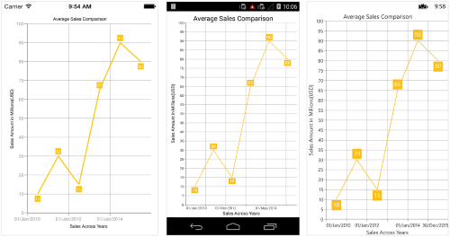
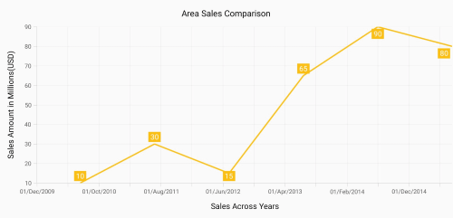

# Axis in Xamarin Charts (SfChart)

Charts typically have two axes that are used to measure and categorize data: a vertical (Y) axis, and a horizontal (X) axis.

Vertical(Y) axis always uses numerical scale. Horizontal(X) axis supports the following types of scale:

* Category
* Numeric
* Date time
* Logarithmic Axis

## Category Axis

Category axis displays text labels instead of numbers. 

 



<chart:SfChart.PrimaryAxis >

	<chart:CategoryAxis />

</chart:SfChart.PrimaryAxis>





chart.PrimaryAxis = new CategoryAxis();





### Placing labels between ticks

Labels in category axis can be placed between the ticks by setting [`LabelPlacement`](https://help.syncfusion.com/cr/xamarin/Syncfusion.SfChart.XForms.CategoryAxis.html#Syncfusion_SfChart_XForms_CategoryAxis_LabelPlacement) to [`BetweenTicks`](https://help.syncfusion.com/cr/xamarin/Syncfusion.SfChart.XForms.LabelPlacement.html). Default value of [`LabelPlacement`](https://help.syncfusion.com/cr/xamarin/Syncfusion.SfChart.XForms.CategoryAxis.html#Syncfusion_SfChart_XForms_CategoryAxis_LabelPlacement) property is [`OnTicks`](https://help.syncfusion.com/cr/xamarin/Syncfusion.SfChart.XForms.LabelPlacement.html) i.e. labels will be placed on the ticks by default.

 



<chart:SfChart.PrimaryAxis >

	<chart:CategoryAxis LabelPlacement="BetweenTicks"/>

</chart:SfChart.PrimaryAxis>





chart.PrimaryAxis = new CategoryAxis() { LabelPlacement = LabelPlacement.BetweenTicks };





### Displaying labels after a fixed interval

To display labels after a fixed interval n, you can set [`Interval`](https://help.syncfusion.com/cr/xamarin/Syncfusion.SfChart.XForms.CategoryAxis.html#Syncfusion_SfChart_XForms_CategoryAxis_Interval) property of [`ChartAxis`](https://help.syncfusion.com/cr/xamarin/Syncfusion.SfChart.XForms.ChartAxis.html) as n. Default value of interval is 1 i.e. all the labels will be displayed by default.

 



<chart:SfChart.PrimaryAxis >

	<chart:CategoryAxis Interval="2" LabelPlacement="BetweenTicks"/>

</chart:SfChart.PrimaryAxis>





chart.PrimaryAxis = new CategoryAxis() { Interval = 2, LabelPlacement = LabelPlacement.BetweenTicks };





### Indexed category axis

Category axis can also be rendered based on the index values of data source by setting the [`ArrangeByIndex`]() property to true in the axis.

 



<chart:SfChart.PrimaryAxis>

	  <chart:CategoryAxis ArrangeByIndex="False" />

</chart:SfChart.PrimaryAxis>

<chart:SfChart.Series>

      <chart:ColumnSeries ItemsSource="{Binding Data1}"  XBindingPath="Country" YBindingPath="Year2016"/>
       
      <chart:ColumnSeries ItemsSource="{Binding Data2}"  XBindingPath="Country" YBindingPath="Year2016"/>

</chart:SfChart.Series>





chart.PrimaryAxis = new CategoryAxis() 
{ 
	ArrangeByIndex = false 
};

ColumnSeries series1 = new ColumnSeries()
 {
        ItemsSource = viewmodel.Data1,
        XBindingPath = "Country",
        YBindingPath = "Year2016"
 };
 ColumnSeries series2 = new ColumnSeries()
 {
        ItemsSource = viewmodel.Data2,
        XBindingPath = "Country",
        YBindingPath = "Year2016",
 };

chart.Series.Add(series1);
chart.Series.Add(series2);





## Numeric Axis

Numeric axis uses numerical scale and displays numbers as labels. 

 



<chart:SfChart.PrimaryAxis >

	<chart:NumericalAxis/>

</chart:SfChart.PrimaryAxis>





chart.PrimaryAxis = new NumericalAxis();





### Customizing numeric range

To customize the range of an axis, you can use the [`Minimum`](https://help.syncfusion.com/cr/xamarin/Syncfusion.SfChart.XForms.NumericalAxis.html#Syncfusion_SfChart_XForms_NumericalAxis_Minimum) and [`Maximum`](https://help.syncfusion.com/cr/xamarin/Syncfusion.SfChart.XForms.NumericalAxis.html#Syncfusion_SfChart_XForms_NumericalAxis_Maximum) properties of [`NumericalAxis`](https://help.syncfusion.com/cr/xamarin/Syncfusion.SfChart.XForms.NumericalAxis.html). By default, nice range will be calculated automatically based on the provided data.

 



<chart:SfChart.SecondaryAxis >

	<chart:NumericalAxis Minimum="10" Maximum="50"/>

</chart:SfChart.SecondaryAxis >





chart.SecondaryAxis = new NumericalAxis() { Minimum = 10, Maximum = 50 };





### Customizing numeric interval

Axis interval can be customized using the [`Interval`](https://help.syncfusion.com/cr/xamarin/Syncfusion.SfChart.XForms.NumericalAxis.html#Syncfusion_SfChart_XForms_NumericalAxis_Interval) property of [`ChartAxis`](https://help.syncfusion.com/cr/xamarin/Syncfusion.SfChart.XForms.ChartAxis.html). By default, nice interval will be calculated based on the minimum and maximum value of the provided data.

 



<chart:SfChart.SecondaryAxis >

	<chart:NumericalAxis Interval="10"/>

</chart:SfChart.SecondaryAxis >





chart.SecondaryAxis = new NumericalAxis() { Interval = 10 };





### Apply padding to the range

Padding can be applied to the minimum and maximum extremes of the axis range by using [`RangePadding`](https://help.syncfusion.com/cr/xamarin/Syncfusion.SfChart.XForms.NumericalAxis.html#Syncfusion_SfChart_XForms_NumericalAxis_RangePadding) property. Numeric axis supports the following types of padding.

* None
* Round
* Additional
* Normal
* RoundStart
* RoundEnd
* PrependInterval
* AppendInterval

**None**

When the value of [`RangePadding`](https://help.syncfusion.com/cr/xamarin/Syncfusion.SfChart.XForms.NumericalAxis.html#Syncfusion_SfChart_XForms_NumericalAxis_RangePadding) property is [`None`](https://help.syncfusion.com/cr/xamarin/Syncfusion.SfChart.XForms.NumericalPadding.html), padding will not be applied to the axis. This is also the default value of [`RangePadding`](https://help.syncfusion.com/cr/xamarin/Syncfusion.SfChart.XForms.NumericalAxis.html#Syncfusion_SfChart_XForms_NumericalAxis_RangePadding) for horizontal axis.

 



<chart:SfChart.SecondaryAxis>

	<chart:NumericalAxis RangePadding="None"/>

</chart:SfChart.SecondaryAxis>





chart.SecondaryAxis = new NumericalAxis() { RangePadding = NumericalPadding.None };





**Round**

When the value of [`RangePadding`](https://help.syncfusion.com/cr/xamarin/Syncfusion.SfChart.XForms.NumericalAxis.html#Syncfusion_SfChart_XForms_NumericalAxis_RangePadding) property is [`Round`](https://help.syncfusion.com/cr/xamarin/Syncfusion.SfChart.XForms.NumericalPadding.html), axis range will be rounded to the nearest possible value by the interval.

 



<chart:SfChart.SecondaryAxis>

	<chart:NumericalAxis RangePadding="Round"/>

</chart:SfChart.SecondaryAxis>





chart.SecondaryAxis = new NumericalAxis() { RangePadding = NumericalPadding.Round };





**Additional**

When the value of [`RangePadding`](https://help.syncfusion.com/cr/xamarin/Syncfusion.SfChart.XForms.NumericalAxis.html#Syncfusion_SfChart_XForms_NumericalAxis_RangePadding) property is [`Additional`](https://help.syncfusion.com/cr/xamarin/Syncfusion.SfChart.XForms.NumericalPadding.html), axis range will be rounded and an interval of the axis will be added as padding to the minimum and maximum values of the range.

 



<chart:SfChart.SecondaryAxis>

	<chart:NumericalAxis RangePadding="Additional"/>

</chart:SfChart.SecondaryAxis>





chart.SecondaryAxis = new NumericalAxis() { RangePadding = NumericalPadding.Additional };





**Normal**

When the value of [`RangePadding`](https://help.syncfusion.com/cr/xamarin/Syncfusion.SfChart.XForms.NumericalAxis.html#Syncfusion_SfChart_XForms_NumericalAxis_RangePadding) property is [`Normal`](https://help.syncfusion.com/cr/xamarin/Syncfusion.SfChart.XForms.NumericalPadding.html), nice range will be calculated for the axis based on the best readability of the data. This is also the default for vertical axis.

 



<chart:SfChart.SecondaryAxis>

	<chart:NumericalAxis RangePadding="Normal"/>

</chart:SfChart.SecondaryAxis>





chart.SecondaryAxis = new NumericalAxis() { RangePadding = NumericalPadding.Normal };





**RoundStart**

When the value of [`RangePadding`](https://help.syncfusion.com/cr/xamarin/Syncfusion.SfChart.XForms.NumericalAxis.html#Syncfusion_SfChart_XForms_NumericalAxis_RangePadding) property is [`RoundStart`](https://help.syncfusion.com/cr/xamarin/Syncfusion.SfChart.XForms.NumericalPadding.html), axis range will be rounded in the start to the nearest possible value by the interval.

 



<chart:SfChart.SecondaryAxis>

	<chart:NumericalAxis RangePadding="RoundStart"/>

</chart:SfChart.SecondaryAxis>





chart.SecondaryAxis = new NumericalAxis() { RangePadding = NumericalPadding.RoundStart };





**RoundEnd**

When the value of [`RangePadding`](https://help.syncfusion.com/cr/xamarin/Syncfusion.SfChart.XForms.NumericalAxis.html#Syncfusion_SfChart_XForms_NumericalAxis_RangePadding) property is [`RoundEnd`](https://help.syncfusion.com/cr/xamarin/Syncfusion.SfChart.XForms.NumericalPadding.html), axis range will be rounded in the end to the nearest possible value by the interval.

 



<chart:SfChart.SecondaryAxis>

	<chart:NumericalAxis RangePadding="RoundEnd"/>

</chart:SfChart.SecondaryAxis>





chart.SecondaryAxis = new NumericalAxis() { RangePadding = NumericalPadding.RoundEnd };





**PrependInterval**

When the value of [`RangePadding`](https://help.syncfusion.com/cr/xamarin/Syncfusion.SfChart.XForms.NumericalAxis.html#Syncfusion_SfChart_XForms_NumericalAxis_RangePadding) property is [`PrependInterval`](https://help.syncfusion.com/cr/xamarin/Syncfusion.SfChart.XForms.NumericalPadding.html), axis range will be rounded and an interval of the axis will be added in the start as padding to the minimum values of the range.

 



<chart:SfChart.SecondaryAxis>

	<chart:NumericalAxis RangePadding="PrependInterval"/>

</chart:SfChart.SecondaryAxis>





chart.SecondaryAxis = new NumericalAxis() { RangePadding = NumericalPadding.PrependInterval };





**AppendInterval**

When the value of [`RangePadding`](https://help.syncfusion.com/cr/xamarin/Syncfusion.SfChart.XForms.NumericalAxis.html#Syncfusion_SfChart_XForms_NumericalAxis_RangePadding) property is [`AppendInterval`](https://help.syncfusion.com/cr/xamarin/Syncfusion.SfChart.XForms.NumericalPadding.html), axis range will be rounded and an interval of the axis will be added in the end as padding to the maximum values of the range.

 



<chart:SfChart.SecondaryAxis>

	<chart:NumericalAxis RangePadding="AppendInterval"/>

</chart:SfChart.SecondaryAxis>





chart.SecondaryAxis = new NumericalAxis() { RangePadding = NumericalPadding.AppendInterval };





## Date Time Axis

Date time axis uses date time scale and displays date time values as axis labels in specified format. 

 



<chart:SfChart.PrimaryAxis >

	<chart:DateTimeAxis/>

</chart:SfChart.PrimaryAxis>





chart.PrimaryAxis = new DateTimeAxis();





### Customizing date time range

To customize the range of an axis, you can use the [`Minimum`](https://help.syncfusion.com/cr/xamarin/Syncfusion.SfChart.XForms.DateTimeAxis.html#Syncfusion_SfChart_XForms_DateTimeAxis_Minimum) and [`Maximum`](https://help.syncfusion.com/cr/xamarin/Syncfusion.SfChart.XForms.DateTimeAxis.html#Syncfusion_SfChart_XForms_DateTimeAxis_Maximum) properties of [`DateTimeAxis`](https://help.syncfusion.com/cr/xamarin/Syncfusion.SfChart.XForms.DateTimeAxis.html). By default, nice range will be calculated automatically based on the provided data.

 



Namespace:

xmlns:sys="clr-namespace:System;assembly=mscorlib"
...
<chart:SfChart.PrimaryAxis  >

	<chart:DateTimeAxis>

		<chart:DateTimeAxis.Minimum>

			<sys:DateTime x:FactoryMethod="Parse">

				<x:Arguments>

					<x:String>Jan 1 2010</x:String>

				</x:Arguments>

			</sys:DateTime>

		</chart:DateTimeAxis.Minimum>

		<chart:DateTimeAxis.Maximum>

			<sys:DateTime x:FactoryMethod="Parse">

				<x:Arguments>

					<x:String>Dec 30 2015</x:String>

				</x:Arguments>

			</sys:DateTime>

		</chart:DateTimeAxis.Maximum>

	</chart:DateTimeAxis>

</chart:SfChart.PrimaryAxis>





chart.PrimaryAxis = new DateTimeAxis() { 

	Minimum = new DateTime(2010, 1, 1), 
	Maximum = new DateTime(2015, 12, 30) 
	
};





### Date time intervals

Date time intervals can be customized using [`Interval`](https://help.syncfusion.com/cr/xamarin/Syncfusion.SfChart.XForms.DateTimeAxis.html#Syncfusion_SfChart_XForms_DateTimeAxis_Interval) and [`IntervalType`](https://help.syncfusion.com/cr/xamarin/Syncfusion.SfChart.XForms.DateTimeAxis.html#Syncfusion_SfChart_XForms_DateTimeAxis_IntervalType) properties of the [`DateTimeAxis`](https://help.syncfusion.com/cr/xamarin/Syncfusion.SfChart.XForms.DateTimeAxis.html). For example, setting [`Interval`](https://help.syncfusion.com/cr/xamarin/Syncfusion.SfChart.XForms.DateTimeAxis.html#Syncfusion_SfChart_XForms_DateTimeAxis_Interval) as 2 and [`IntervalType`](https://help.syncfusion.com/cr/xamarin/Syncfusion.SfChart.XForms.DateTimeAxis.html#Syncfusion_SfChart_XForms_DateTimeAxis_IntervalType) as [`Years`](https://help.syncfusion.com/cr/xamarin/Syncfusion.SfChart.XForms.DateTimeIntervalType.html) will consider 2 years as interval.

Essential Chart supports the following types of interval for date time axis

* Years
* Months
* Days
* Hours
* Minutes
* Seconds
* Milliseconds

 



<chart:SfChart.PrimaryAxis>

	<chart:DateTimeAxis IntervalType="Months">

		<chart:DateTimeAxis.Interval>

			<Double>6</Double>

		</chart:DateTimeAxis.Interval>

	</chart:DateTimeAxis>

</chart:SfChart.PrimaryAxis>





chart.PrimaryAxis = new DateTimeAxis() { 

	IntervalType = DateTimeIntervalType.Months, 
	Interval = 6 
	
};





### Get actual interval type

The [`GetActualIntervalType`](https://help.syncfusion.com/cr/xamarin/Syncfusion.SfChart.XForms.DateTimeAxis.html#Syncfusion_SfChart_XForms_DateTimeAxis_GetActualIntervalType) method is used to get the interval that is calculated from actual data in [`DataTimeAxis`](https://help.syncfusion.com/cr/xamarin/Syncfusion.SfChart.XForms.DateTimeAxis.html).



var intervalType = dateTimeAxis.GetActualIntervalType();



### Apply padding to range

Padding can be applied to the minimum and maximum extremes of range by using the [`RangePadding`](https://help.syncfusion.com/cr/xamarin/Syncfusion.SfChart.XForms.DateTimeAxis.html#Syncfusion_SfChart_XForms_DateTimeAxis_RangePadding) property. Date-time axis supports the following types of padding:

* None
* Round
* Additional
* RoundStart
* RoundEnd
* PrependInterval
* AppendInterval

**None**

When the value of [`RangePadding`](https://help.syncfusion.com/cr/xamarin/Syncfusion.SfChart.XForms.DateTimeAxis.html#Syncfusion_SfChart_XForms_DateTimeAxis_RangePadding) property is [`None`](https://help.syncfusion.com/cr/xamarin/Syncfusion.SfChart.XForms.DateTimeRangePadding.html), padding will not be applied to the axis. This is also the default value of [`RangePadding`](https://help.syncfusion.com/cr/xamarin/Syncfusion.SfChart.XForms.DateTimeAxis.html#Syncfusion_SfChart_XForms_DateTimeAxis_RangePadding).

 



<chart:SfChart.PrimaryAxis>

	<chart:DateTimeAxis RangePadding="None"/>

</chart:SfChart.PrimaryAxis >





chart.PrimaryAxis = new DateTimeAxis() { RangePadding = DateTimeRangePadding.None };





**Round**

When the value of [`RangePadding`](https://help.syncfusion.com/cr/xamarin/Syncfusion.SfChart.XForms.DateTimeAxis.html#Syncfusion_SfChart_XForms_DateTimeAxis_RangePadding) property is [`Round`](https://help.syncfusion.com/cr/xamarin/Syncfusion.SfChart.XForms.DateTimeRangePadding.html), axis range will be rounded to the nearest possible date time value.

 



<chart:SfChart.PrimaryAxis >

	<chart:DateTimeAxis RangePadding="Round"/>

</chart:SfChart.PrimaryAxis >





chart.PrimaryAxis = new DateTimeAxis() { RangePadding = DateTimeRangePadding.Round };





**Additional**

When the value of [`RangePadding`](https://help.syncfusion.com/cr/xamarin/Syncfusion.SfChart.XForms.DateTimeAxis.html#Syncfusion_SfChart_XForms_DateTimeAxis_RangePadding) property is [`Additional`](https://help.syncfusion.com/cr/xamarin/Syncfusion.SfChart.XForms.DateTimeRangePadding.html), range will be rounded and date time interval of the axis will be added as padding to the minimum and maximum extremes of the range.

 



<chart:SfChart.PrimaryAxis >

	<chart:DateTimeAxis RangePadding="Additional"/>

</chart:SfChart.PrimaryAxis >





chart.PrimaryAxis = new DateTimeAxis() { RangePadding = DateTimeRangePadding.Additional };





**RoundStart**

When the value of [`RangePadding`](https://help.syncfusion.com/cr/xamarin/Syncfusion.SfChart.XForms.DateTimeAxis.html#Syncfusion_SfChart_XForms_DateTimeAxis_RangePadding) property is [`RoundStart`](https://help.syncfusion.com/cr/xamarin/Syncfusion.SfChart.XForms.DateTimeRangePadding.html), axis range will be rounded in the start to the nearest possible date time value.

 



<chart:SfChart.PrimaryAxis >

	<chart:DateTimeAxis RangePadding="RoundStart"/>

</chart:SfChart.PrimaryAxis >





chart.PrimaryAxis = new DateTimeAxis() { RangePadding = DateTimeRangePadding.RoundStart };





**RoundEnd**

When the value of [`RangePadding`](https://help.syncfusion.com/cr/xamarin/Syncfusion.SfChart.XForms.DateTimeAxis.html#Syncfusion_SfChart_XForms_DateTimeAxis_RangePadding) property is [`RoundEnd`](https://help.syncfusion.com/cr/xamarin/Syncfusion.SfChart.XForms.DateTimeRangePadding.html), axis range will be rounded in the end to the nearest possible date time value.

 



<chart:SfChart.PrimaryAxis >

	<chart:DateTimeAxis RangePadding="RoundEnd"/>

</chart:SfChart.PrimaryAxis >





chart.PrimaryAxis = new DateTimeAxis() { RangePadding = DateTimeRangePadding.RoundEnd };





**PrependInterval**

When the value of [`RangePadding`](https://help.syncfusion.com/cr/xamarin/Syncfusion.SfChart.XForms.DateTimeAxis.html#Syncfusion_SfChart_XForms_DateTimeAxis_RangePadding) property is [`PrependInterval`](https://help.syncfusion.com/cr/xamarin/Syncfusion.SfChart.XForms.DateTimeRangePadding.html), range will be rounded and date time interval of the axis will be added in the start as padding to the minimum extremes of the range.

 



<chart:SfChart.PrimaryAxis >

	<chart:DateTimeAxis RangePadding="PrependInterval"/>

</chart:SfChart.PrimaryAxis >





chart.PrimaryAxis = new DateTimeAxis() { RangePadding = DateTimeRangePadding.PrependInterval };





**AppendInterval**

When the value of [`RangePadding`](https://help.syncfusion.com/cr/xamarin/Syncfusion.SfChart.XForms.DateTimeAxis.html#Syncfusion_SfChart_XForms_DateTimeAxis_RangePadding) property is [`AppendInterval`](https://help.syncfusion.com/cr/xamarin/Syncfusion.SfChart.XForms.DateTimeRangePadding.html), range will be rounded and date time interval of the axis will be added in the end as padding to the maximum extremes of the range.

 



<chart:SfChart.PrimaryAxis >

	<chart:DateTimeAxis RangePadding="AppendInterval"/>

</chart:SfChart.PrimaryAxis >





chart.PrimaryAxis = new DateTimeAxis() { RangePadding = DateTimeRangePadding.AppendInterval };





## Date-time category axis

The [`DateTimeCategoryAxis`](https://help.syncfusion.com/cr/xamarin/Syncfusion.SfChart.XForms.DateTimeCategoryAxis.html) is a unique type of axis used mainly with financial series. Like CategoryAxis, all the data points are plotted with equal spaces by removing space for missing dates. Intervals and ranges for the axis are calculated similar to DateTimeAxis. There will be no visual gaps between points even when the difference between two points is more than a year. The following APIs are used to customize the interval of DateTimeCategoryAxis.

• [`Interval`](https://help.syncfusion.com/cr/xamarin/Syncfusion.SfChart.XForms.DateTimeCategoryAxis.html#Syncfusion_SfChart_XForms_DateTimeCategoryAxis_Interval) - Gets or sets the double value that represents the interval between the labels.
• [`IntervalType`](https://help.syncfusion.com/cr/xamarin/Syncfusion.SfChart.XForms.DateTimeCategoryAxis.html#Syncfusion_SfChart_XForms_DateTimeCategoryAxis_IntervalType) - Gets or sets the DateTimeIntervalType that represents the type of the interval to be displayed.

 



<chart:SfChart.PrimaryAxis>
    <chart:DateTimeCategoryAxis Interval="1" IntervalType="Months" />
</chart:SfChart.PrimaryAxis>





DateTimeCategoryAxis xAxis = new DateTimeCategoryAxis();
xAxis.Interval = 1;
xAxis.IntervalType = DateTimeIntervalType.Months;
chart.PrimaryAxis = xAxis;





## Logarithmic axis

Logarithmic axis uses logarithmic scale and displays numbers as axis labels.

 



<chart:SfChart.SecondaryAxis>

	<chart:LogarithmicAxis />

</chart:SfChart.SecondaryAxis>





chart.SecondaryAxis = new LogarithmicAxis (); 





### Customizing the logarithmic range

To customize the range of log axis, you can use the [`Minimum`](https://help.syncfusion.com/cr/xamarin/Syncfusion.SfChart.XForms.LogarithmicAxis.html#Syncfusion_SfChart_XForms_LogarithmicAxis_Minimum), [`Maximum`](https://help.syncfusion.com/cr/xamarin/Syncfusion.SfChart.XForms.LogarithmicAxis.html#Syncfusion_SfChart_XForms_LogarithmicAxis_Maximum) and [`Interval`](https://help.syncfusion.com/cr/xamarin/Syncfusion.SfChart.XForms.LogarithmicAxis.html#Syncfusion_SfChart_XForms_LogarithmicAxis_Interval) properties of [`LogarithmicAxis`](https://help.syncfusion.com/cr/xamarin/Syncfusion.SfChart.XForms.LogarithmicAxis.html). By default, nice range will be calculated automatically based on the provided data.

 



<chart:SfChart.SecondaryAxis>

	<chart:LogarithmicAxis >
	
		<chart:LogarithmicAxis.Minimum>
			<x:Double>100</x:Double>
		</chart:LogarithmicAxis.Minimum>
		
		<chart:LogarithmicAxis.Maximum>
			<x:Double>10000</x:Double>
		</chart:LogarithmicAxis.Maximum>
		
	</chart:LogarithmicAxis>
	
</chart:SfChart.SecondaryAxis>





chart.SecondaryAxis = new LogarithmicAxis() { 

	Minimum = 100, 
	Maximum = 10000 

};





### Customizing the logarithmic base

To customize the log base value, you can use [`LogarithmicBase`](https://help.syncfusion.com/cr/xamarin/Syncfusion.SfChart.XForms.LogarithmicAxis.html#Syncfusion_SfChart_XForms_LogarithmicAxis_LogarithmicBase) property.

 



<chart:SfChart.SecondaryAxis>

	<chart:LogarithmicAxis LogarithmicBase="2" />

</chart:SfChart.SecondaryAxis>	





chart.SecondaryAxis = new LogarithmicAxis() { LogarithmicBase = 2 };





## Common axis features

Customization of features such as axis title, labels, grid lines and tick lines are common to all the axes. Each of these features are explained in this section.

### Axis Visibility

Axis visibility can be controlled using the [`IsVisible`](https://help.syncfusion.com/cr/xamarin/Syncfusion.SfChart.XForms.ChartAxis.html#Syncfusion_SfChart_XForms_ChartAxis_IsVisible) property of axis. Default value of [`IsVisible`](https://help.syncfusion.com/cr/xamarin/Syncfusion.SfChart.XForms.ChartAxis.html#Syncfusion_SfChart_XForms_ChartAxis_IsVisible) property is `True`.

 



<chart:SfChart.SecondaryAxis>

	<chart:NumericalAxis IsVisible="False"/>

</chart:SfChart.SecondaryAxis >





chart.SecondaryAxis.IsVisible = false;





### Axis title

The [`Title`](https://help.syncfusion.com/cr/xamarin/Syncfusion.SfChart.XForms.ChartAxis.html#Syncfusion_SfChart_XForms_ChartAxis_Title) property in axis provides options to customize the text and font of axis title. Axis does not display title by default. The title can be customized using following properties,

* [`Text`](https://help.syncfusion.com/cr/xamarin/Syncfusion.SfChart.XForms.ChartAxisTitle.html#Syncfusion_SfChart_XForms_ChartAxisTitle_Text) – used to set the title for axis.
* [`TextColor`](https://help.syncfusion.com/cr/xamarin/Syncfusion.SfChart.XForms.ChartAxisTitle.html#Syncfusion_SfChart_XForms_ChartAxisTitle_TextColor) – used to change the color of the label.
* [`BackgroundColor`](https://help.syncfusion.com/cr/xamarin/Syncfusion.SfChart.XForms.ChartAxisTitle.html#Syncfusion_SfChart_XForms_ChartAxisTitle_BackgroundColor) – used to change the label background color.
* [`BorderColor`](https://help.syncfusion.com/cr/xamarin/Syncfusion.SfChart.XForms.ChartAxisTitle.html#Syncfusion_SfChart_XForms_ChartAxisTitle_BorderColor) – used to change the border color.
* [`BorderWidth`](https://help.syncfusion.com/cr/xamarin/Syncfusion.SfChart.XForms.ChartAxisTitle.html#Syncfusion_SfChart_XForms_ChartAxisTitle_BorderWidth) – used to change the width of the border.
* [`Font`](https://help.syncfusion.com/cr/xamarin/Syncfusion.SfChart.XForms.ChartAxisTitle.html#Syncfusion_SfChart_XForms_ChartAxisTitle_Font) – used to change the text size, font family, and font weight. (This is deprecated API. Use FontSize, FontFamily, and FontAttributes properties instead of this.)
* [`FontFamily`](https://help.syncfusion.com/cr/xamarin/Syncfusion.SfChart.XForms.ChartAxisTitle.html#Syncfusion_SfChart_XForms_ChartAxisTitle_FontFamily) - used to change the font family for the axis title.
* [`FontAttributes`](https://help.syncfusion.com/cr/xamarin/Syncfusion.SfChart.XForms.ChartAxisTitle.html#Syncfusion_SfChart_XForms_ChartAxisTitle_FontAttributes) - used to change the font style for the axis title.
* [`FontSize`](https://help.syncfusion.com/cr/xamarin/Syncfusion.SfChart.XForms.ChartAxisTitle.html#Syncfusion_SfChart_XForms_ChartAxisTitle_FontSize) - used to change the font size for the axis title.
* [`Margin`](https://help.syncfusion.com/cr/xamarin/Syncfusion.SfChart.XForms.ChartAxisTitle.html#Syncfusion_SfChart_XForms_ChartAxisTitle_Margin) - used to change the margin size for labels.

Following code snippet illustrates how to enable and customize the axis title.

 



<chart:SfChart.PrimaryAxis>

	<chart:CategoryAxis  >

		<chart:CategoryAxis.Title>

			<chart:ChartAxisTitle Text="Month" TextColor="Blue" Font="Bold,20"/>

		</chart:CategoryAxis.Title>

	</chart:CategoryAxis  >

</chart:SfChart.PrimaryAxis >





chart.PrimaryAxis.Title.Text = "Month";

chart.PrimaryAxis.Title.TextColor = Color.Blue;

chart.PrimaryAxis.Title.Font = Font.SystemFontOfSize(20, FontAttributes.Bold);





### Axis label rotation

The [`LabelRotationAngle`](https://help.syncfusion.com/cr/xamarin/Syncfusion.SfChart.XForms.ChartAxis.html#Syncfusion_SfChart_XForms_ChartAxis_LabelRotationAngle) property of axis can be used to rotate the axis labels position. Default value of [`LabelRotationAngle`](https://help.syncfusion.com/cr/xamarin/Syncfusion.SfChart.XForms.ChartAxis.html#Syncfusion_SfChart_XForms_ChartAxis_LabelRotationAngle) property is 0d.

 



<chart:SfChart.PrimaryAxis> 
       
       <chart:CategoryAxis LabelRotationAngle="-45"/>       
    
</chart:SfChart.PrimaryAxis> 





CategoryAxis categoryAxis = new CategoryAxis(); 
  
categoryAxis.LabelRotationAngle = -45; 
  
chart.PrimaryAxis = categoryAxis; 





### Axis line customization

[`SfChart`](https://help.syncfusion.com/cr/xamarin/Syncfusion.SfChart.XForms.SfChart.html) provides support to customize the style of the axis line by defining the [`AxisLineStyle`](https://help.syncfusion.com/cr/xamarin/Syncfusion.SfChart.XForms.ChartAxis.html#Syncfusion_SfChart_XForms_ChartAxis_AxisLineStyle) property as shown in the below code snippet.

* [`StrokeColor`](https://help.syncfusion.com/cr/xamarin/Syncfusion.SfChart.XForms.ChartLineStyle.html#Syncfusion_SfChart_XForms_ChartLineStyle_StrokeColor) – used to change the stroke color of axis line.
* [`StrokeWidth`](https://help.syncfusion.com/cr/xamarin/Syncfusion.SfChart.XForms.ChartLineStyle.html#Syncfusion_SfChart_XForms_ChartLineStyle_StrokeWidth) – used to change the stroke width of axis line.
* [`StrokeDashArray`](https://help.syncfusion.com/cr/xamarin/Syncfusion.SfChart.XForms.ChartLineStyle.html#Syncfusion_SfChart_XForms_ChartLineStyle_StrokeDashArray) - used to render axis line series with dashes.

 



Namespace:

xmlns:sys="clr-namespace:System;assembly=mscorlib"
...
<chart:SfChart.PrimaryAxis>

    <chart:DateTimeAxis>

        <chart:DateTimeAxis.AxisLineStyle>

            <chart:ChartLineStyle StrokeWidth ="10" StrokeColor="Red">

                <chart:ChartLineStyle.StrokeDashArray>

                    <x:Array Type="{x:Type x:Double}">

                        <sys:Double>5</sys:Double>

                        <sys:Double>6</sys:Double>

                    </x:Array>

                </chart:ChartLineStyle.StrokeDashArray>

            </chart:ChartLineStyle>

        </chart:DateTimeAxis.AxisLineStyle>

    </chart:DateTimeAxis>

</chart:SfChart.PrimaryAxis>





CategoryAxis primaryAxis = new CategoryAxis();

ChartLineStyle axisLineStyle = new ChartLineStyle();

axisLineStyle.StrokeColor = Color.Red;

axisLineStyle.StrokeWidth = 10;

axisLineStyle.StrokeDashArray = new double[2] { 5,6 };

primaryAxis.AxisLineStyle = axisLineStyle;

chart.PrimaryAxis = primaryAxis;





### Axis line offset

The [`AxisLineOffset`](https://help.syncfusion.com/cr/xamarin/Syncfusion.SfChart.XForms.ChartAxis.html#Syncfusion_SfChart_XForms_ChartAxis_AxisLineOffset) property is used to offset the rendering of axis line.

 



<chart:SfChart.PrimaryAxis>

            <chart:CategoryAxis AxisLineOffset="20" PlotOffset="20">  
			             
                <chart:CategoryAxis.AxisLineStyle>

                    <chart:ChartLineStyle StrokeWidth="5"/>

                </chart:CategoryAxis.AxisLineStyle>

            </chart:CategoryAxis>
			
 </chart:SfChart.PrimaryAxis>





CategoryAxis primaryAxis = new CategoryAxis();

primaryAxis.PlotOffset = 20;

primaryAxis.AxisLineOffset = 20;

primaryAxis.AxisLineStyle.StrokeWidth = 5;

chart.PrimaryAxis = primaryAxis;





### Label customization

The [`LabelStyle`](https://help.syncfusion.com/cr/xamarin/Syncfusion.SfChart.XForms.ChartAxis.html#Syncfusion_SfChart_XForms_ChartAxis_LabelStyle) property of axis provides options to customize the font-family, color, size and font-weight of axis labels. The axis labels can be customized using following properties:

* [`TextColor`](https://help.syncfusion.com/cr/xamarin/Syncfusion.SfChart.XForms.ChartLabelStyle.html#Syncfusion_SfChart_XForms_ChartLabelStyle_TextColor) – used to change the color of the labels.
* [`BackgroundColor`](https://help.syncfusion.com/cr/xamarin/Syncfusion.SfChart.XForms.ChartLabelStyle.html#Syncfusion_SfChart_XForms_ChartLabelStyle_BackgroundColor) – used to change the label background color.
* [`BorderColor`](https://help.syncfusion.com/cr/xamarin/Syncfusion.SfChart.XForms.ChartLabelStyle.html#Syncfusion_SfChart_XForms_ChartLabelStyle_BorderColor) – used to change the border color.
* [`BorderThickness`](https://help.syncfusion.com/cr/xamarin/Syncfusion.SfChart.XForms.ChartLabelStyle.html#Syncfusion_SfChart_XForms_ChartLabelStyle_BorderThickness) – used to change the thickness of the border.
* [`Font`](https://help.syncfusion.com/cr/xamarin/Syncfusion.SfChart.XForms.ChartLabelStyle.html#Syncfusion_SfChart_XForms_ChartLabelStyle_Font) – used to change the text size, font family and font weight.
* [`Margin`](https://help.syncfusion.com/cr/xamarin/Syncfusion.SfChart.XForms.ChartLabelStyle.html#Syncfusion_SfChart_XForms_ChartLabelStyle_Margin) - used to change the margin size for labels.
* [`CornerRadius`](https://help.syncfusion.com/cr/xamarin/Syncfusion.SfChart.XForms.ChartAxisLabelStyle.html#Syncfusion_SfChart_XForms_ChartAxisLabelStyle_CornerRadius) - Used to change the corner radius of the background of labels.
* [`LabelAlignment`](https://help.syncfusion.com/cr/xamarin/Syncfusion.SfChart.XForms.ChartAxisLabelStyle.html#Syncfusion_SfChart_XForms_ChartAxisLabelStyle_LabelAlignment) - Used to align the label at the [`Start`](https://help.syncfusion.com/cr/xamarin/Syncfusion.SfChart.XForms.ChartAxisLabelAlignment.html), [`Center`](https://help.syncfusion.com/cr/xamarin/Syncfusion.SfChart.XForms.ChartAxisLabelAlignment.html), or [`End`](https://help.syncfusion.com/cr/xamarin/Syncfusion.SfChart.XForms.ChartAxisLabelAlignment.html).
* [`LabelFormat`](https://help.syncfusion.com/cr/xamarin/Syncfusion.SfChart.XForms.ChartLabelStyle.html#Syncfusion_SfChart_XForms_ChartLabelStyle_LabelFormat) -  used to set numeric or date time format to the chart axis label.
* [`MaxWidth`](https://help.syncfusion.com/cr/xamarin/Syncfusion.SfChart.XForms.ChartAxisLabelStyle.html#Syncfusion_SfChart_XForms_ChartAxisLabelStyle_MaxWidth) - Provides the maximum text width of the axis label and wraps into the next line when exceeds the maximum width.
* [`WrappedLabelAlignment`](https://help.syncfusion.com/cr/xamarin/Syncfusion.SfChart.XForms.ChartAxisLabelStyle.html#Syncfusion_SfChart_XForms_ChartAxisLabelStyle_WrappedLabelAlignment) - Positions the wrapped text at the start, center, or end. The default value of the [`WrappedLabelAlignment`](https://help.syncfusion.com/cr/xamarin/Syncfusion.SfChart.XForms.ChartAxisLabelStyle.html#Syncfusion_SfChart_XForms_ChartAxisLabelStyle_WrappedLabelAlignment) property is `Start`.

 



<chart:SfChart.PrimaryAxis>

	<chart:CategoryAxis >

		<chart:CategoryAxis.LabelStyle>

			<chart:ChartAxisLabelStyle TextColor="Red" Font="Bold,20"/>

		</chart:CategoryAxis.LabelStyle>

	</chart:CategoryAxis>

</chart:SfChart.PrimaryAxis>





chart.PrimaryAxis.LabelStyle.Font = Font.SystemFontOfSize(20, FontAttributes.Bold);

chart.PrimaryAxis.LabelStyle.TextColor = Color.Red;





### Label and tick positioning

Axis labels and ticks can be positioned [`Inside`](https://help.syncfusion.com/cr/xamarin/Syncfusion.SfChart.XForms.AxisElementPosition.html) or [`Outside`](https://help.syncfusion.com/cr/xamarin/Syncfusion.SfChart.XForms.AxisElementPosition.html) the chart area by using [`LabelStyle.LabelsPosition`](https://help.syncfusion.com/cr/xamarin/Syncfusion.SfChart.XForms.ChartAxisLabelStyle.html#Syncfusion_SfChart_XForms_ChartAxisLabelStyle_LabelsPosition) and [`TickPosition`](https://help.syncfusion.com/cr/xamarin/Syncfusion.SfChart.XForms.ChartAxis.html#Syncfusion_SfChart_XForms_ChartAxis_TickPosition) properties of ChartAxis. By default labels and ticks will be positioned outside the chart area.

 



<chart:SfChart.PrimaryAxis >

	<chart:DateTimeAxis TickPosition="Inside">

		<chart:DateTimeAxis.LabelStyle>

			<chart:ChartAxisLabelStyle LabelsPosition="Inside"/>
		
		</chart:DateTimeAxis.LabelStyle>

	</chart:DateTimeAxis>

</chart:SfChart.PrimaryAxis >





chart.PrimaryAxis.LabelStyle.LabelsPosition = AxisElementPosition.Inside;

chart.PrimaryAxis.TickPosition = AxisElementPosition.Inside;





### Edge labels placement

Labels with long text at the edges of an axis may appear partially outside the chart. The [`EdgeLabelsDrawingMode`](https://help.syncfusion.com/cr/xamarin/Syncfusion.SfChart.XForms.ChartAxis.html#Syncfusion_SfChart_XForms_ChartAxis_EdgeLabelsDrawingMode) property can be used to avoid the partial appearance of labels at the corners. Default value of this property is [`Center`](https://help.syncfusion.com/cr/xamarin/Syncfusion.SfChart.XForms.EdgeLabelsDrawingMode.html). Other available options of [`EdgeLabelsDrawingMode`](https://help.syncfusion.com/cr/xamarin/Syncfusion.SfChart.XForms.ChartAxis.html#Syncfusion_SfChart_XForms_ChartAxis_EdgeLabelsDrawingMode) are [`Fit`](https://help.syncfusion.com/cr/xamarin/Syncfusion.SfChart.XForms.EdgeLabelsDrawingMode.html), [`Shift`](https://help.syncfusion.com/cr/xamarin/Syncfusion.SfChart.XForms.EdgeLabelsDrawingMode.html) and [`Hide`](https://help.syncfusion.com/cr/xamarin/Syncfusion.SfChart.XForms.EdgeLabelsDrawingMode.html).

 



<chart:CategoryAxis EdgeLabelsDrawingMode="Shift"/>





chart.PrimaryAxis.EdgeLabelsDrawingMode = EdgeLabelsDrawingMode.Shift;





### Edge labels visibility

The visibility of the edge labels in an axis can be controlled using [`EdgeLabelsVisibilityMode`](https://help.syncfusion.com/cr/xamarin/Syncfusion.SfChart.XForms.RangeAxisBase.html#Syncfusion_SfChart_XForms_RangeAxisBase_EdgeLabelsVisibilityMode) property.
The following  options are available in [`EdgeLabelsVisibilityMode`](https://help.syncfusion.com/cr/xamarin/Syncfusion.SfChart.XForms.RangeAxisBase.html#Syncfusion_SfChart_XForms_RangeAxisBase_EdgeLabelsVisibilityMode),

* [`Default`](https://help.syncfusion.com/cr/xamarin/Syncfusion.SfChart.XForms.EdgeLabelsVisibilityMode.html) - used to display the edge label based on auto interval calculations
* [`Visible`](https://help.syncfusion.com/cr/xamarin/Syncfusion.SfChart.XForms.EdgeLabelsVisibilityMode.html) - used to display the edge labels (first and last label) irrespective of the auto interval calculation until zooming (i.e., in normal state).
* [`AlwaysVisible`](https://help.syncfusion.com/cr/xamarin/Syncfusion.SfChart.XForms.EdgeLabelsVisibilityMode.html) - used to always display the edge labels even while zooming the chart.

N> The Category and DateTimeCategory axis does not provide support for EdgeLabelsVisibilityMode.

The following code example demonstrates the AlwaysVisible option while zooming.

 



<chart:SfChart.PrimaryAxis>
      <chart:NumericalAxis  EdgeLabelsVisibilityMode="AlwaysVisible">     
      </chart:NumericalAxis>
 </chart:SfChart.PrimaryAxis>





Chart.PrimaryAxis = new NumericalAxis();
chart.SecondaryAxis.EdgeLabelsVisibilityMode = EdgeLabelsVisibilityMode.AlwaysVisible;





### Label extent

The [`LabelExtent`](https://help.syncfusion.com/cr/xamarin/Syncfusion.SfChart.XForms.ChartAxis.html#Syncfusion_SfChart_XForms_ChartAxis_LabelExtent) property allows to set the gap between axis labels and title. This is typically used to maintain the fixed gap between axis labels and title when the digits of the axis value changed in live update.

 



<chart:SfChart.PrimaryAxis>
      <chart:CategoryAxis LabelExtent="60" >
        <chart:CategoryAxis.Title>
          <chart:ChartAxisTitle Text="Month"/>
        </chart:CategoryAxis.Title>
      </chart:CategoryAxis>
 </chart:SfChart.PrimaryAxis>





Chart.PrimaryAxis = new CategoryAxis();
Chart.PrimaryAxis.LabelExtent = 60;
Chart.PrimaryAxis.Title.Text = "Month";





### LabelFormat

**Format numeric values**

The numeric values can be formatted by using the [`LabelFormat`](https://help.syncfusion.com/cr/xamarin/Syncfusion.SfChart.XForms.ChartLabelStyle.html#Syncfusion_SfChart_XForms_ChartLabelStyle_LabelFormat) property. Numeric values can be formatted with n (number with decimal points), c (Currency) and p (percentage) commands.

 



<chart:NumericalAxis >

    <chart:NumericalAxis.LabelStyle>
	
        <chart:ChartAxisLabelStyle LabelFormat="$##.##"/>
		
    </chart:NumericalAxis.LabelStyle>
	
</chart:NumericalAxis>





NumericalAxis numerical = new NumericalAxis();

numerical.LabelStyle = new ChartAxisLabelStyle { LabelFormat = "$##.##" };

chart.SecondaryAxis = numerical;





**Format date time values**

The date time values can be formatted by using the [`LabelFormat`](https://help.syncfusion.com/cr/xamarin/Syncfusion.SfChart.XForms.ChartLabelStyle.html#Syncfusion_SfChart_XForms_ChartLabelStyle_LabelFormat) property of the axis.

 



<chart:DateTimeAxis>

    <chart:DateTimeAxis.LabelStyle>
	
        <chart:ChartAxisLabelStyle LabelFormat="dd/MMM/yyyy"/>
		
    </chart:DateTimeAxis.LabelStyle>
	
</chart:DateTimeAxis>





DateTimeAxis primaryAxis = new DateTimeAxis();

primaryAxis.LabelStyle = new ChartAxisLabelStyle { LabelFormat = "dd/MMM/yyyy" };

chart.PrimaryAxis = primaryAxis;





### Grid lines customization

The [`ShowMajorGridLines`](https://help.syncfusion.com/cr/xamarin/Syncfusion.SfChart.XForms.ChartAxis.html#Syncfusion_SfChart_XForms_ChartAxis_ShowMajorGridLines) and [`ShowMinorGridLines`](https://help.syncfusion.com/cr/xamarin/Syncfusion.SfChart.XForms.RangeAxisBase.html#Syncfusion_SfChart_XForms_RangeAxisBase_ShowMinorGridLines) properties are used to control the visibility of grid lines. [`MajorGridLineStyle`](https://help.syncfusion.com/cr/xamarin/Syncfusion.SfChart.XForms.ChartAxis.html#Syncfusion_SfChart_XForms_ChartAxis_MajorGridLineStyle) and [`MinorGridLineStyle`](https://help.syncfusion.com/cr/xamarin/Syncfusion.SfChart.XForms.RangeAxisBase.html#Syncfusion_SfChart_XForms_RangeAxisBase_MinorGridLineStyle) properties in axis are used to customize the major grid lines and minor grid lines of an axis respectively. They provide options to change the width, dashes, color of grid lines. By default minor grid lines will not be visible. 

 



<chart:SfChart.SecondaryAxis >

	<chart:NumericalAxis ShowMajorGridLines="True" ShowMinorGridLines="True" 
						 MinorTicksPerInterval="1"/>

</chart:SfChart.SecondaryAxis >





chart. SecondaryAxis = new NumericalAxis ()

{

	ShowMajorGridLines = true,

	ShowMinorGridLines = true,

	MinorTicksPerInterval = 1

};





### Tick lines customization

The [`MajorTickStyle`](https://help.syncfusion.com/cr/xamarin/Syncfusion.SfChart.XForms.ChartAxis.html#Syncfusion_SfChart_XForms_ChartAxis_MajorTickStyle) and [`MinorTickStyle`](https://help.syncfusion.com/cr/xamarin/Syncfusion.SfChart.XForms.RangeAxisBase.html#Syncfusion_SfChart_XForms_RangeAxisBase_MinorTickStyle) properties in axis are used to customize the major tick lines of an axis and minor tick lines of an axis respectively. They provide options to change the [`StrokeWidth`](https://help.syncfusion.com/cr/xamarin/Syncfusion.SfChart.XForms.ChartAxisTickStyle.html#Syncfusion_SfChart_XForms_ChartAxisTickStyle_StrokeWidth), [`TickSize`](https://help.syncfusion.com/cr/xamarin/Syncfusion.SfChart.XForms.ChartAxisTickStyle.html#Syncfusion_SfChart_XForms_ChartAxisTickStyle_TickSize), [`StrokeColor`](https://help.syncfusion.com/cr/xamarin/Syncfusion.SfChart.XForms.ChartAxisTickStyle.html#Syncfusion_SfChart_XForms_ChartAxisTickStyle_StrokeColor) and [`MinorTicksPerInterval`](https://help.syncfusion.com/cr/xamarin/Syncfusion.SfChart.XForms.RangeAxisBase.html#Syncfusion_SfChart_XForms_RangeAxisBase_MinorTicksPerInterval) of tick lines. By default minor tick lines will not be visible.

 



<chart:SfChart.SecondaryAxis >

	<chart:NumericalAxis ShowMinorGridLines="True" MinorTicksPerInterval="1">

		<chart:NumericalAxis.MajorTickStyle >

			<chart:ChartAxisTickStyle TickSize="7" StrokeColor="Blue" StrokeWidth="3"/>

		</chart:NumericalAxis.MajorTickStyle>

		<chart:NumericalAxis.MinorTickStyle>

			<chart:ChartAxisTickStyle TickSize="5" StrokeColor="Green" StrokeWidth="2"/>

		</chart:NumericalAxis.MinorTickStyle>

	<chart:NumericalAxis/>

</chart:SfChart.SecondaryAxis >





NumericalAxis numerical = new NumericalAxis();

numerical.MajorTickStyle.TickSize = 7;

numerical.MajorTickStyle.StrokeWidth = 3;

numerical.MajorTickStyle.StrokeColor = Color.Red;

numerical.ShowMinorGridLines = true;

numerical.MinorTicksPerInterval = 1;

numerical.MinorTickStyle.TickSize = 5;

numerical.MinorTickStyle.StrokeWidth = 2;

numerical.MinorTickStyle.StrokeColor = Color.Green;

chart.SecondaryAxis = numerical;





### Customize individual axis elements

The [`RangeStyles`](https://help.syncfusion.com/cr/xamarin/Syncfusion.SfChart.XForms.ChartAxis.html#Syncfusion_SfChart_XForms_ChartAxis_RangeStyles) can be used to customize the gridlines, ticks and axis labels for a specific region of [`ChartAxis`](https://help.syncfusion.com/cr/xamarin/Syncfusion.SfChart.XForms.ChartAxis.html). The following properties are used to customize the specific range in an axis:

* [`Start`](https://help.syncfusion.com/cr/xamarin/Syncfusion.SfChart.XForms.ChartAxisRangeStyle.html#Syncfusion_SfChart_XForms_ChartAxisRangeStyle_Start) -  Sets the start range of an axis
* [`End`](https://help.syncfusion.com/cr/xamarin/Syncfusion.SfChart.XForms.ChartAxisRangeStyle.html#Syncfusion_SfChart_XForms_ChartAxisRangeStyle_End) - Sets the end range of an axis
* [`MajorGridLineStyle`](https://help.syncfusion.com/cr/xamarin/Syncfusion.SfChart.XForms.ChartAxisRangeStyle.html#Syncfusion_SfChart_XForms_ChartAxisRangeStyle_MajorGridLineStyle) - Customizes the major grid lines of an axis.
* [`MinorGridLineStyle`](https://help.syncfusion.com/cr/xamarin/Syncfusion.SfChart.XForms.ChartAxisRangeStyle.html#Syncfusion_SfChart_XForms_ChartAxisRangeStyle_MinorGridLineStyle) - Customizes the minor grid lines of an axis.
* [`MajorTickStyle`](https://help.syncfusion.com/cr/xamarin/Syncfusion.SfChart.XForms.ChartAxisRangeStyle.html#Syncfusion_SfChart_XForms_ChartAxisRangeStyle_MajorTickStyle) - Customizes the major tick lines of an axis.
* [`MinorTickStyle`](https://help.syncfusion.com/cr/xamarin/Syncfusion.SfChart.XForms.ChartAxisRangeStyle.html#Syncfusion_SfChart_XForms_ChartAxisRangeStyle_MinorTickStyle) - Customizes the minor tick lines of an axis.
* [`LabelStyle`](https://help.syncfusion.com/cr/xamarin/Syncfusion.SfChart.XForms.ChartAxisRangeStyle.html#Syncfusion_SfChart_XForms_ChartAxisRangeStyle_LabelStyle) -  Customizes the axis labels for a specific range.

N> Grid lines [`StrokeDashArray`](https://help.syncfusion.com/cr/xamarin/Syncfusion.SfChart.XForms.ChartLineStyle.html#Syncfusion_SfChart_XForms_ChartLineStyle_StrokeDashArray) is not supported if the [`RangeStyles`](https://help.syncfusion.com/cr/xamarin/Syncfusion.SfChart.XForms.ChartAxis.html#Syncfusion_SfChart_XForms_ChartAxis_RangeStyles) of axis is set in `UWP`.

 



<chart:NumericalAxis.RangeStyles>

	<chart:ChartAxisRangeStyleCollection>

		<chart:ChartAxisRangeStyle Start="15" End="21" >

			<chart:ChartAxisRangeStyle.MajorGridLineStyle>

				<chart:ChartLineStyle StrokeColor="#096EBF" StrokeWidth="3"/>

			</chart:ChartAxisRangeStyle.MajorGridLineStyle>
			<chart:ChartAxisRangeStyle.LabelStyle>

				<chart:ChartAxisLabelStyle  TextColor="#096EBF" FontAttributes="Bold"/>

			</chart:ChartAxisRangeStyle.LabelStyle>

		</chart:ChartAxisRangeStyle>

		....

	</chart:ChartAxisRangeStyleCollection>

</chart:NumericalAxis.RangeStyles>				





NumericalAxis numericalAxis = new NumericalAxis() { Minimum = 15, Maximum = 27 };

ChartAxisRangeStyleCollection axisRangeStyles = new ChartAxisRangeStyleCollection();

ChartAxisRangeStyle rangeStyle = new ChartAxisRangeStyle() { Start = 15, End = 21};

rangeStyle.MajorGridLineStyle = new ChartLineStyle() { StrokeColor = Color.FromHex("#096EBF"), StrokeWidth = 3 };

rangeStyle.LabelStyle = new ChartAxisLabelStyle() { TextColor = Color.FromHex("#096EBF"), FontAttributes = FontAttributes.Bold };

axisRangeStyles.Add(rangeStyle);

....

numericalAxis.RangeStyles = axisRangeStyles;





### Inversing axis

Axis can be inversed using the [`IsInversed`](https://help.syncfusion.com/cr/xamarin/Syncfusion.SfChart.XForms.ChartAxis.html#Syncfusion_SfChart_XForms_ChartAxis_IsInversed) property of axis. Default value of [`IsInversed`](https://help.syncfusion.com/cr/xamarin/Syncfusion.SfChart.XForms.ChartAxis.html#Syncfusion_SfChart_XForms_ChartAxis_IsInversed) property is `False`.

 



<chart:SfChart.SecondaryAxis >

	<chart:NumericalAxis IsInversed="True">

</chart:SfChart.SecondaryAxis >





chart.SecondaryAxis.IsInversed = true;





### Placing axes at the opposite side

The [`OpposedPosition`](https://help.syncfusion.com/cr/xamarin/Syncfusion.SfChart.XForms.ChartAxis.html#Syncfusion_SfChart_XForms_ChartAxis_OpposedPosition) property of axis can be used to place the axis at the opposite side of its default position. Default value of [`OpposedPosition`](https://help.syncfusion.com/cr/xamarin/Syncfusion.SfChart.XForms.ChartAxis.html#Syncfusion_SfChart_XForms_ChartAxis_OpposedPosition) property is `False`. 

 



<chart:SfChart.SecondaryAxis >

	<chart:NumericalAxis OpposedPosition="True">

</chart:SfChart.SecondaryAxis >





chart.SecondaryAxis.OpposedPosition = true;





### Offset the rendering
The [`PlotOffset`](https://help.syncfusion.com/cr/xamarin/Syncfusion.SfChart.XForms.ChartAxis.html#Syncfusion_SfChart_XForms_ChartAxis_PlotOffset) property is used to offset the rendering of the axis at start and end position. The following code snippet demonstrates to apply the plot offset to both x and y axes.
 



<chart:SfChart.PrimaryAxis>

      <chart:CategoryAxis PlotOffset="30" />

</chart:SfChart.PrimaryAxis>

<chart:SfChart.SecondaryAxis>

      <chart:NumericalAxis PlotOffset="30"/>

</chart:SfChart.SecondaryAxis>





Chart.PrimaryAxis = new CategoryAxis()
{

     PlotOffset = 30
};

Chart.SecondaryAxis = new NumericalAxis()
{

     PlotOffset = 30

};





#### PlotOffsetStart

The [`PlotOffsetStart`](https://help.syncfusion.com/cr/xamarin/Syncfusion.SfChart.XForms.ChartAxis.html#Syncfusion_SfChart_XForms_ChartAxis_PlotOffsetStart) property is used to offset the rendering of the axis at start position. The following code snippet demonstrates to apply the plot offset start to both x and y axes.

 



<chart:SfChart.PrimaryAxis>

      <chart:CategoryAxis PlotOffsetStart="30" />

</chart:SfChart.PrimaryAxis>

<chart:SfChart.SecondaryAxis>

      <chart:NumericalAxis PlotOffsetStart="30"/>

</chart:SfChart.SecondaryAxis>





Chart.PrimaryAxis = new CategoryAxis()
{

     PlotOffsetStart = 30
};

Chart.SecondaryAxis = new NumericalAxis()
{

     PlotOffsetStart = 30

};





#### PlotOffsetEnd

The [`PlotOffsetEnd`](https://help.syncfusion.com/cr/xamarin/Syncfusion.SfChart.XForms.ChartAxis.html#Syncfusion_SfChart_XForms_ChartAxis_PlotOffsetEnd) property is used to offset the rendering of the axis at end position. The following code snippet demonstrates to apply the plot offset end to both x and y axes.

 



<chart:SfChart.PrimaryAxis>

      <chart:CategoryAxis PlotOffsetEnd="30" />

</chart:SfChart.PrimaryAxis>

<chart:SfChart.SecondaryAxis>

      <chart:NumericalAxis PlotOffsetEnd="30"/>

</chart:SfChart.SecondaryAxis>





Chart.PrimaryAxis = new CategoryAxis()
{

     PlotOffsetEnd = 30
};

Chart.SecondaryAxis = new NumericalAxis()
{

     PlotOffsetEnd = 30

};





### Maximum number of labels per 100 pixels

By default, a maximum of 3 labels are displayed for each 100 pixels in axis. The maximum number of labels that should be present within 100 pixels length can be customized using the [`MaximumLabels`](https://help.syncfusion.com/cr/xamarin/Syncfusion.SfChart.XForms.ChartAxis.html#Syncfusion_SfChart_XForms_ChartAxis_MaximumLabels) property of an axis. This property is applicable only for automatic range calculation and will not work if you set value for [`Interval`](https://help.syncfusion.com/cr/xamarin/Syncfusion.SfChart.XForms.NumericalAxis.html#Syncfusion_SfChart_XForms_NumericalAxis_Interval) property of an axis.

 



<chart:SfChart.SecondaryAxis >

	<chart:NumericalAxis MaximumLabels="5"/>

</chart:SfChart.SecondaryAxis >





Chart.SecondaryAxis.MaximumLabels = 5;





### AutoScrollingDelta

[`AutoScrollingDelta`](https://help.syncfusion.com/cr/xamarin/Syncfusion.SfChart.XForms.ChartAxis.html#Syncfusion_SfChart_XForms_ChartAxis_AutoScrollingDelta) is used to ensure that the specified range of data is always visible in the chart. It always shows the recently added data points at the end and scrolling will be reset to the end of the range whenever a new point is added. 

By adding [`ChartZoomPanBehavior`](https://help.syncfusion.com/cr/xamarin/Syncfusion.SfChart.XForms.ChartZoomPanBehavior.html) to the chart, you can scroll to see the previous datapoints.

### AutoScrollingDeltaType

In [`DateTimeAxis`](https://help.syncfusion.com/cr/xamarin/Syncfusion.SfChart.XForms.DateTimeAxis.html), you can apply auto scrolling delta value in [`Years`](https://help.syncfusion.com/cr/xamarin/Syncfusion.SfChart.XForms.DateTimeDeltaType.html), [`Months`](https://help.syncfusion.com/cr/xamarin/Syncfusion.SfChart.XForms.DateTimeDeltaType.html), [`Days`](https://help.syncfusion.com/cr/xamarin/Syncfusion.SfChart.XForms.DateTimeDeltaType.html), [`Hours`](https://help.syncfusion.com/cr/xamarin/Syncfusion.SfChart.XForms.DateTimeDeltaType.html), [`Minutes`](https://help.syncfusion.com/cr/xamarin/Syncfusion.SfChart.XForms.DateTimeDeltaType.html), [`Seconds`](https://help.syncfusion.com/cr/xamarin/Syncfusion.SfChart.XForms.DateTimeDeltaType.html) and [`Milliseconds`](https://help.syncfusion.com/cr/xamarin/Syncfusion.SfChart.XForms.DateTimeDeltaType.html) by setting [`AutoScrollingDeltaType`](https://help.syncfusion.com/cr/xamarin/Syncfusion.SfChart.XForms.DateTimeAxis.html#Syncfusion_SfChart_XForms_DateTimeAxis_AutoScrollingDeltaType) property. Default value of this property is [`Auto`](https://help.syncfusion.com/cr/xamarin/Syncfusion.SfChart.XForms.DateTimeDeltaType.html) and the delta will be calculated automatically based on range.

 



<chart:SfChart.PrimaryAxis>

    <chart:DateTimeAxis AutoScrollingDelta="3" AutoScrollingDeltaType="Days">

</chart:SfChart.PrimaryAxis>





chart.PrimaryAxis = new DateTimeAxis()
{
      AutoScrollingDelta = 3,
	  
      AutoScrollingDeltaType = DateTimeDeltaType.Days
};





### AutoScrollingMode

[`AutoScrollingMode`](https://help.syncfusion.com/cr/xamarin/Syncfusion.SfChart.XForms.ChartAxis.html#Syncfusion_SfChart_XForms_ChartAxis_AutoScrollingMode) property can be used to determine whether the axis should be scrolled from start position or end position. The default value of [`AutoScrollingMode`](https://help.syncfusion.com/cr/xamarin/Syncfusion.SfChart.XForms.ChartAxis.html#Syncfusion_SfChart_XForms_ChartAxis_AutoScrollingMode) is [`End`](https://help.syncfusion.com/cr/xamarin/Syncfusion.SfChart.XForms.ChartAutoScrollingMode.html).

 



<chart:SfChart.PrimaryAxis>

    <chart:CategoryAxis AutoScrollingDelta = "3" AutoScrollingMode = "Start">

</chart:SfChart.PrimaryAxis>





chart.PrimaryAxis = new DateTimeAxis()
{
      AutoScrollingDelta = 3,
	  
      AutoScrollingMode = ChartAutoScrollingMode.Start
};





### VisibleMinimum

The [`VisibleMinimum`](https://help.syncfusion.com/cr/xamarin/Syncfusion.SfChart.XForms.ChartAxis.html#Syncfusion_SfChart_XForms_ChartAxis_VisibleMinimum) property of the chart axis can be used only to get the double value that represents the minimum observable value of the axis range in runtime.

### VisibleMaximum

The [`VisibleMaximum`](https://help.syncfusion.com/cr/xamarin/Syncfusion.SfChart.XForms.ChartAxis.html#Syncfusion_SfChart_XForms_ChartAxis_VisibleMaximum) property of the chart axis can be used only to get the double value that represents the maximum observable value of the axis range in runtime. 

## Axis Crossing

Axis can be positioned anywhere in the chart area by using [`CrossesAt`](https://help.syncfusion.com/cr/xamarin/Syncfusion.SfChart.XForms.ChartAxis.html#Syncfusion_SfChart_XForms_ChartAxis_CrossesAt) property. This property specifies where the horizontal axis should intersect or cross the vertical axis or vice-versa. Default value of [`CrossesAt`](https://help.syncfusion.com/cr/xamarin/Syncfusion.SfChart.XForms.ChartAxis.html#Syncfusion_SfChart_XForms_ChartAxis_CrossesAt) property is null.





<chart:SfChart.PrimaryAxis>

    <chart:CategoryAxis CrossesAt = “0” />

</chart:SfChart.PrimaryAxis>
 
<chart:SfChart.SecondaryAxis>

    <chart:NumericalAxis CrossesAt = “8” />

</chart:SfChart.SecondaryAxis >
 




chart.PrimaryAxis  = new CategoryAxis() { CrossesAt = 0 };

chart.SecondaryAxis =  new NumericalAxis() { CrossesAt  = 8 };





### Crossing in date time axis

For crossing in date time horizontal axis, date object should be provided as value for [`CrossesAt`](https://help.syncfusion.com/cr/xamarin/Syncfusion.SfChart.XForms.ChartAxis.html#Syncfusion_SfChart_XForms_ChartAxis_CrossesAt) property of vertical axis.





Namespace:

xmlns:sys="clr-namespace:System;assembly=mscorlib"
...
<chart:SfChart.PrimaryAxis>

    <chart:DateTimeAxis CrossesAt="0" />

</chart:SfChart.PrimaryAxis >
 
<chart:SfChart.SecondaryAxis>

    <chart:NumericalAxis>

        <chart:NumericalAxis.CrossesAt>

            <sys:Datetime x:FactoryMethod = “Parse”>

                <x:Arguments>

                    <x:String>Jan 1 2003</x:String>

                </x:Arguments>

            </sys:Datetime>

        </chart:NumericalAxis.CrossesAt>

    </chart:NumericalAxis>

</chart:SfChart.SecondaryAxis>
 




chart.PrimaryAxis  = new DateTimeAxis() { CrossesAt = 0 };

chart.SecondaryAxis =  new NumericalAxis() { CrossesAt  = new DateTime(2003, 1, 1) };





### Positioning the axis elements while crossing

[`RenderNextToCrossingValue`](https://help.syncfusion.com/cr/xamarin/Syncfusion.SfChart.XForms.ChartAxis.html#Syncfusion_SfChart_XForms_ChartAxis_RenderNextToCrossingValue) property is used to determine whether the crossing axis should be placed at crossing position or not. The default value of [`RenderNextToCrossingValue`](https://help.syncfusion.com/cr/xamarin/Syncfusion.SfChart.XForms.ChartAxis.html#Syncfusion_SfChart_XForms_ChartAxis_RenderNextToCrossingValue) property is true.





<chart:SfChart.PrimaryAxis>

    <chart:CategoryAxis CrossesAt="0" RenderNextToCrossingValue="False"/>

</chart:SfChart.PrimaryAxis>

<chart:SfChart.SecondaryAxis>

    <chart:NumericalAxis CrossesAt="5" />

</chart:SfChart.SecondaryAxis>
 




chart.PrimaryAxis = new CategoryAxis()
{
    CrossesAt = 0,

    RenderNextToCrossingValue = false
};

chart.SecondaryAxis = new NumericalAxis()
{
    CrossesAt = 5,
};





## Smart Axis Labels

Axis labels may overlap with each other based on chart dimensions and label size. The [`LabelsIntersectAction`](https://help.syncfusion.com/cr/xamarin/Syncfusion.SfChart.XForms.ChartAxis.html#Syncfusion_SfChart_XForms_ChartAxis_LabelsIntersectAction) property of axis is used to avoid overlapping of axis labels. The default value of the [`LabelsIntersectAction`](https://help.syncfusion.com/cr/xamarin/Syncfusion.SfChart.XForms.ChartAxis.html#Syncfusion_SfChart_XForms_ChartAxis_LabelsIntersectAction) is [`None`](https://help.syncfusion.com/cr/xamarin/Syncfusion.SfChart.XForms.AxisLabelsIntersectAction.html); other available values are [`MultipleRows`](https://help.syncfusion.com/cr/xamarin/Syncfusion.SfChart.XForms.AxisLabelsIntersectAction.html), [`Hide`](https://help.syncfusion.com/cr/xamarin/Syncfusion.SfChart.XForms.AxisLabelsIntersectAction.html), and [`Wrap`](https://help.syncfusion.com/cr/xamarin/Syncfusion.SfChart.XForms.AxisLabelsIntersectAction.html).

 



<chart:SfChart.PrimaryAxis >

	<chart:CategoryAxis LabelsIntersectAction="MultipleRows"/>

</chart:SfChart.PrimaryAxis >





chart.PrimaryAxis.LabelsIntersectAction = AxisLabelsIntersectAction.MultipleRows;





## Event

**ActualRangeChanged**

The [`ActualRangeChanged`](https://help.syncfusion.com/cr/xamarin/Syncfusion.SfChart.XForms.ChartAxis.html) event is triggered when the actual range of the axis is changed. The argument contains the following information.

* [`ActualMinimum`](https://help.syncfusion.com/cr/xamarin/Syncfusion.SfChart.XForms.ActualRangeChangedEventArgs.html#Syncfusion_SfChart_XForms_ActualRangeChangedEventArgs_ActualMinimum) - used to get or set the actual minimum value of the axis.
* [`ActualMaximum`](https://help.syncfusion.com/cr/xamarin/Syncfusion.SfChart.XForms.ActualRangeChangedEventArgs.html#Syncfusion_SfChart_XForms_ActualRangeChangedEventArgs_ActualMaximum) - used to get or set the actual maximum value of the axis.
* [`VisibleMinimum`](https://help.syncfusion.com/cr/xamarin/Syncfusion.SfChart.XForms.ActualRangeChangedEventArgs.html#Syncfusion_SfChart_XForms_ActualRangeChangedEventArgs_VisibleMinimum) - used to get or set the visible minimum value of the axis.
* [`VisibleMaximum`](https://help.syncfusion.com/cr/xamarin/Syncfusion.SfChart.XForms.ActualRangeChangedEventArgs.html#Syncfusion_SfChart_XForms_ActualRangeChangedEventArgs_VisibleMaximum) - used to get or set the visible maximum value of the axis.

N> Actual range and visible range are similar unless the range is changed by specifying the [`ZoomPosition`](https://help.syncfusion.com/cr/xamarin/Syncfusion.SfChart.XForms.ChartAxis.html#Syncfusion_SfChart_XForms_ChartAxis_ZoomPosition) and [`ZoomFactor`](https://help.syncfusion.com/cr/xamarin/Syncfusion.SfChart.XForms.ChartAxis.html#Syncfusion_SfChart_XForms_ChartAxis_ZoomFactor) properties or zoom the chart interactively. Visible range is always the range which you see visually in the screen.

**LabelCreated**

The [`LabelCreated`](https://help.syncfusion.com/cr/xamarin/Syncfusion.SfChart.XForms.ChartAxis.html) event is triggered when the axis label is created. The argument contains the following information.

* [`LabelContent`](https://help.syncfusion.com/cr/xamarin/Syncfusion.SfChart.XForms.ChartAxisLabelEventArgs.html#Syncfusion_SfChart_XForms_ChartAxisLabelEventArgs_LabelContent) - Used to get or set the text of axis label based on condition.
* [`Position`](https://help.syncfusion.com/cr/xamarin/Syncfusion.SfChart.XForms.ChartAxisLabelEventArgs.html#Syncfusion_SfChart_XForms_ChartAxisLabelEventArgs_Position) - Used to get the position of label.
* [`LabelStyle`](https://help.syncfusion.com/cr/xamarin/Syncfusion.SfChart.XForms.ChartAxisLabelEventArgs.html#Syncfusion_SfChart_XForms_ChartAxisLabelEventArgs_LabelStyle) - Used to customize the appearance of axis labels based on condition. The properties listed in [`label customization`](https://help.syncfusion.com/xamarin/sfchart/axis#label-customization) can be customized using LabelStyle property.

**LabelClicked**

The [`LabelClicked`](https://help.syncfusion.com/cr/xamarin/Syncfusion.SfChart.XForms.ChartAxis.html) event is triggered when the axis label is clicked. The argument contains the following informations:

* [`LabelContent`](https://help.syncfusion.com/cr/xamarin/Syncfusion.SfChart.XForms.LabelClickedEventArgs.html#Syncfusion_SfChart_XForms_LabelClickedEventArgs_LabelContent) - Used to get the text of label.
* [`Position`](https://help.syncfusion.com/cr/xamarin/Syncfusion.SfChart.XForms.LabelClickedEventArgs.html#Syncfusion_SfChart_XForms_LabelClickedEventArgs_Position) - Used to get the position of label.

## See also

[How to remove comma in CategoryAxis labels in Xamarin.Forms Chart](https://www.syncfusion.com/kb/11317/how-to-remove-comma-in-categoryaxis-labels-in-xamarin-forms-chart)

[How to customize the axis label format based on the culture in Xamarin.Forms SfChart](https://www.syncfusion.com/kb/11289/how-to-customize-the-axis-label-format-based-on-the-culture-in-xamarin-forms-chart-sfchart)

[How to view corner segments without cutting in edge of Xamarin.Forms Chart](https://www.syncfusion.com/kb/10785/how-to-view-corner-segments-without-cutting-in-edge-of-xamarin-forms-chart)

[How to replace the axis labels with image in Xamarin.Forms Chart](https://www.syncfusion.com/kb/10676/how-to-replace-the-axis-labels-with-image-in-xamarin-forms-chart)

[How to add prefix and suffix for axis labels in Chart](https://www.syncfusion.com/kb/5925/how-to-add-prefix-and-suffix-for-axis-labels-in-chart)

[How to show all the axis labels](https://www.syncfusion.com/kb/8242/how-to-show-all-the-axis-labels)

[How to customize each label of the axis in different format](https://www.syncfusion.com/kb/5560/how-to-customize-each-label-of-the-axis-in-different-format)

[How to change the position of the axis](https://www.syncfusion.com/kb/4814/how-to-change-the-position-of-the-axis)

[How to plot date-time values in vertical axes](https://www.syncfusion.com/kb/8732/how-to-plot-date-time-values-in-vertical-axes)

[How to show all the axis labels](https://www.syncfusion.com/kb/8242/how-to-show-all-the-axis-labels)

[How to change the color of axis elements](https://www.syncfusion.com/kb/5780/how-to-change-the-color-of-axis-elements)

[How to inverse the chart axis](https://www.syncfusion.com/kb/5742/how-to-inverse-the-chart-axis)

[How to add custom axis labels in numerical axis](https://www.syncfusion.com/kb/5926/how-to-add-custom-axis-labels-in-numerical-axis)

[How to zoom y axis or x axis alone](https://www.syncfusion.com/kb/5549/how-to-zoom-y-axis-or-x-axis-alone)

[How to customize the axis range based on condition](https://www.syncfusion.com/kb/5546/how-to-customize-the-axis-range-based-on-condition)

[How to customize the axis labels](https://www.syncfusion.com/kb/5545/how-to-customize-the-axis-labels)

[How to customize the range of chart axis](https://www.syncfusion.com/kb/4811/how-to-customize-the-range-of-chart-axis)

[How to display chart axis labels between the ticks](https://www.syncfusion.com/kb/5037/how-to-display-chart-axis-labels-between-the-ticks)

[How to show/hide grid lines](https://www.syncfusion.com/kb/5520/how-to-show-hide-grid-lines)

[How to customize the minor gridline style](https://www.syncfusion.com/kb/5720/how-to-customize-the-minor-gridline-style)