# Annotation in Xamarin Charts (SfChart)

[`SfChart`](https://help.syncfusion.com/cr/xamarin/Syncfusion.SfChart.XForms.SfChart.html) supports annotations which allows you to mark the specific area of interest in the chart area. You can add text, images, and custom views. 

The following annotations are supported in [`SfChart`](https://help.syncfusion.com/cr/xamarin/Syncfusion.SfChart.XForms.SfChart.html):

*   Text annotation
*   Shape annotation
*   View annotation

## Adding Annotations

You can create an instance for any type of annotations and it can be added to [`ChartAnnotations`](https://help.syncfusion.com/cr/xamarin/Syncfusion.SfChart.XForms.SfChart.html#Syncfusion_SfChart_XForms_SfChart_ChartAnnotations) collection. Here for an instance, the [`EllipseAnnotation`](https://help.syncfusion.com/cr/xamarin/Syncfusion.SfChart.XForms.EllipseAnnotation.html) is added.

 



<chart:SfChart>
...

    <chart:SfChart.ChartAnnotations>

        <chart:EllipseAnnotation X1="2" Y1="35" X2="6" Y2="40" Text="Ellipse" />

    </chart:SfChart.ChartAnnotations>

</chart:SfChart>





SfChart chart = new SfChart();
...

EllipseAnnotation annotation = new EllipseAnnotation()
{
    X1 = 2,

    Y1 = 35,

    X2 = 6,

    Y2 = 40,

    Text = "Ellipse"
};

chart.ChartAnnotations.Add(annotation);





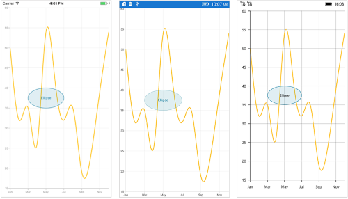

## Positioning the annotation

Annotations can be positioned in plot area based on [`X1`](https://help.syncfusion.com/cr/xamarin/Syncfusion.SfChart.XForms.ChartAnnotation.html#Syncfusion_SfChart_XForms_ChartAnnotation_X1) and [`Y1`](https://help.syncfusion.com/cr/xamarin/Syncfusion.SfChart.XForms.ChartAnnotation.html#Syncfusion_SfChart_XForms_ChartAnnotation_Y1) properties. For shape annotations, specify `X2` and `Y2` properties, if needed. The `X` and `Y` values can be specified with axis units or pixel units, and these can be identified by using [`CoordinateUnit`](https://help.syncfusion.com/cr/xamarin/Syncfusion.SfChart.XForms.ChartAnnotation.html#Syncfusion_SfChart_XForms_ChartAnnotation_CoordinateUnit) property.
 
### Positioning based on CoordinateUnit as axis

To position the annotation based on axis, set the [`X1`](https://help.syncfusion.com/cr/xamarin/Syncfusion.SfChart.XForms.ChartAnnotation.html#Syncfusion_SfChart_XForms_ChartAnnotation_X1) and [`Y1`](https://help.syncfusion.com/cr/xamarin/Syncfusion.SfChart.XForms.ChartAnnotation.html#Syncfusion_SfChart_XForms_ChartAnnotation_Y1), `X2` and `Y2` properties based on axis range values, if needed, set the [`CoordinateUnit`](https://help.syncfusion.com/cr/xamarin/Syncfusion.SfChart.XForms.ChartAnnotation.html#Syncfusion_SfChart_XForms_ChartAnnotation_CoordinateUnit) value as [`Axis`](https://help.syncfusion.com/cr/xamarin/Syncfusion.SfChart.XForms.ChartCoordinateUnit.html).

 



<chart:SfChart>
...

    <chart:SfChart.ChartAnnotations>

        <chart:RectangleAnnotation X1="4" Y1="40" X2="8" Y2="45" Text="Axis Value" CoordinateUnit="Axis" />

    </chart:SfChart.ChartAnnotations>

</chart:SfChart>





SfChart chart = new SfChart();
...

RectangleAnnotation annotation = new RectangleAnnotation()
{

    X1 = 4,

    Y1 = 40,

    X2 = 8,

    Y2 = 45,

    Text = "Axis Value",

    CoordinateUnit = ChartCoordinateUnit.Axis
};

chart.ChartAnnotations.Add(annotation);





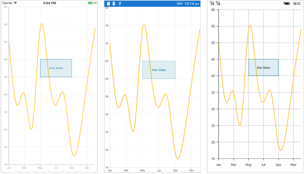

### Positioning based on CoordinateUnit as pixels

To position the annotation based on the pixel values, set the [`CoordinateUnit`](https://help.syncfusion.com/cr/xamarin/Syncfusion.SfChart.XForms.ChartAnnotation.html#Syncfusion_SfChart_XForms_ChartAnnotation_CoordinateUnit) value as [`Pixels`](https://help.syncfusion.com/cr/xamarin/Syncfusion.SfChart.XForms.ChartCoordinateUnit.html), and the pixel values in [`X1`](https://help.syncfusion.com/cr/xamarin/Syncfusion.SfChart.XForms.ChartAnnotation.html#Syncfusion_SfChart_XForms_ChartAnnotation_X1) and [`Y1`](https://help.syncfusion.com/cr/xamarin/Syncfusion.SfChart.XForms.ChartAnnotation.html#Syncfusion_SfChart_XForms_ChartAnnotation_Y1), `X2` and `Y2` properties of annotation are shown in the following code snippet,

 



<chart:SfChart>
...

    <chart:SfChart.ChartAnnotations>

        <chart:RectangleAnnotation X1="1" Y1="1" X2="150" Y2="150" Text="Pixel Value" CoordinateUnit="Pixels" />

    </chart:SfChart.ChartAnnotations>

</chart:SfChart>





SfChart chart = new SfChart();
...

RectangleAnnotation annotation = new RectangleAnnotation()
{

    X1 = 1,

    Y1 = 1,

    X2 = 150,

    Y2 = 150,

    Text = "Pixel Value",

    CoordinateUnit = ChartCoordinateUnit.Pixels
};

chart.ChartAnnotations.Add(annotation); 





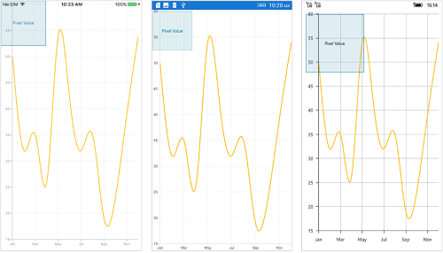

## Adding annotation for multiple axes

When there are multiple axes, annotation also can be added for a particular axis by using the [`XAxisName`](https://help.syncfusion.com/cr/xamarin/Syncfusion.SfChart.XForms.ChartAnnotation.html#Syncfusion_SfChart_XForms_ChartAnnotation_XAxisName) and [`YAxisName`](https://help.syncfusion.com/cr/xamarin/Syncfusion.SfChart.XForms.ChartAnnotation.html#Syncfusion_SfChart_XForms_ChartAnnotation_YAxisName) properties. It can be shown in the below code snippet,

 



<chart:SfChart>
...

    <chart:SfChart.ChartAnnotations>

        <chart:EllipseAnnotation X1="4" Y1="30" X2="8" Y2="35" YAxisName="Yaxis"/>

    </chart:SfChart.ChartAnnotations>

    <chart:SfChart.Series>

        <chart:SplineSeries ItemsSource="{Binding Data}" XBindingPath="Name" YBindingPath="Value">

            <chart:SplineSeries.YAxis>

                <chart:NumericalAxis Name="Yaxis" OpposedPosition="true"/>

            </chart:SplineSeries.YAxis>

        </chart:SplineSeries>

    </chart:SfChart.Series>

</chart:SfChart>





SfChart chart = new SfChart();
...

EllipseAnnotation annotation = new EllipseAnnotation()
{
    X1 = 4,

    Y1 = 30,

    X2 = 8,

    Y2 = 35,

    YAxisName = "YAxis"
};

chart.ChartAnnotations.Add(annotation);

SplineSeries series = new SplineSeries()
{
    ItemsSource = model.Data,

    XBindingPath = "Name",

    YBindingPath = "Value",

    YAxis = new NumericalAxis()
    {

        OpposedPosition = true,

        Name = "YAxis"
    }
};

chart.Series.Add(series);





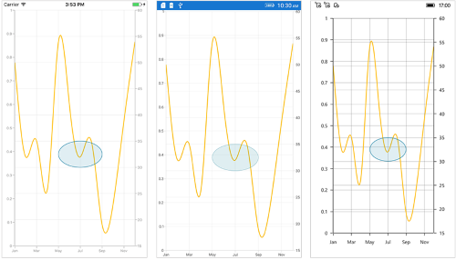

## Text annotation

The [`TextAnnotation`](https://help.syncfusion.com/cr/xamarin/Syncfusion.SfChart.XForms.TextAnnotation.html) is used to add simple text with the help of [`Text`](https://help.syncfusion.com/cr/xamarin/Syncfusion.SfChart.XForms.TextAnnotation.html#Syncfusion_SfChart_XForms_TextAnnotation_Text) property in specific points over the [`Chart`](https://help.syncfusion.com/cr/xamarin/Syncfusion.SfChart.XForms.ChartAnnotation.html#Syncfusion_SfChart_XForms_ChartAnnotation_Chart) area.

 



<chart:SfChart>
...

    <chart:SfChart.ChartAnnotations>

        <chart:TextAnnotation X1="7" Y1="35" Text="August" />

    </chart:SfChart.ChartAnnotations> 

</chart:SfChart>





SfChart chart = new SfChart();
...

TextAnnotation annotation = new TextAnnotation()
{
    X1 = 7,

    Y1 = 35,

    Text = "August"
};

chart.ChartAnnotations.Add(annotation);





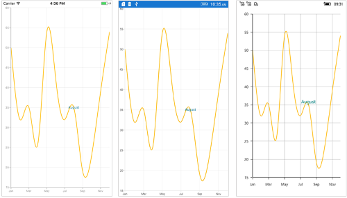

### Customizing text annotation

The [`TextAnnotation`](https://help.syncfusion.com/cr/xamarin/Syncfusion.SfChart.XForms.TextAnnotation.html) can be customized by using the [`LabelStyle`](https://help.syncfusion.com/cr/xamarin/Syncfusion.SfChart.XForms.TextAnnotation.html#Syncfusion_SfChart_XForms_TextAnnotation_LabelStyle) property. The following properties are used to customize the text:

*   [`TextColor`](https://help.syncfusion.com/cr/xamarin/Syncfusion.SfChart.XForms.ChartLabelStyle.html#Syncfusion_SfChart_XForms_ChartLabelStyle_TextColor) - Used to change the text color.
*   [`BackgroundColor`](https://help.syncfusion.com/cr/xamarin/Syncfusion.SfChart.XForms.ChartLabelStyle.html#Syncfusion_SfChart_XForms_ChartLabelStyle_BackgroundColor) - Used to change the background color of the text.
*   [`Margin`](https://help.syncfusion.com/cr/xamarin/Syncfusion.SfChart.XForms.ChartLabelStyle.html#Syncfusion_SfChart_XForms_ChartLabelStyle_Margin) - Used to set the margin for text.
*   [`BorderThickness`](https://help.syncfusion.com/cr/xamarin/Syncfusion.SfChart.XForms.ChartLabelStyle.html#Syncfusion_SfChart_XForms_ChartLabelStyle_BorderThickness) - Used to change the text border thickness.
*   [`BorderColor`](https://help.syncfusion.com/cr/xamarin/Syncfusion.SfChart.XForms.ChartLabelStyle.html#Syncfusion_SfChart_XForms_ChartLabelStyle_BorderColor) - Used to change the border color of the text.
*   [`Font`](https://help.syncfusion.com/cr/xamarin/Syncfusion.SfChart.XForms.ChartLabelStyle.html#Syncfusion_SfChart_XForms_ChartLabelStyle_Font) - Used to change text font size, family and weight.
*   [`HorizontalTextAlignment`](https://help.syncfusion.com/cr/xamarin/Syncfusion.SfChart.XForms.ChartAnnotationLabelStyle.html#Syncfusion_SfChart_XForms_ChartAnnotationLabelStyle_HorizontalTextAlignment) - Used to align the text horizontally at the [`Start`](https://help.syncfusion.com/cr/xamarin/Syncfusion.SfChart.XForms.ChartAnnotationAlignment.html), [`Center`](https://help.syncfusion.com/cr/xamarin/Syncfusion.SfChart.XForms.ChartAnnotationAlignment.html) and [`End`](https://help.syncfusion.com/cr/xamarin/Syncfusion.SfChart.XForms.ChartAnnotationAlignment.html).
*   [`VerticalTextAlignment`](https://help.syncfusion.com/cr/xamarin/Syncfusion.SfChart.XForms.ChartAnnotationLabelStyle.html#Syncfusion_SfChart_XForms_ChartAnnotationLabelStyle_VerticalTextAlignment) - Used to align the text vertically at the [`Start`](https://help.syncfusion.com/cr/xamarin/Syncfusion.SfChart.XForms.ChartAnnotationAlignment.html), [`Center`](https://help.syncfusion.com/cr/xamarin/Syncfusion.SfChart.XForms.ChartAnnotationAlignment.html) and [`End`](https://help.syncfusion.com/cr/xamarin/Syncfusion.SfChart.XForms.ChartAnnotationAlignment.html).

 



<chart:SfChart>
...

    <chart:SfChart.ChartAnnotations>

        <chart:TextAnnotation X1="7" Y1="35" Text="August">

            <chart:TextAnnotation.LabelStyle>

                <chart:ChartAnnotationLabelStyle Margin="5" Font="Italic,16" BorderColor="Red" BorderThickness="2" BackgroundColor="Teal" TextColor="White" VerticalTextAlignment="Start"/>

            </chart:TextAnnotation.LabelStyle>

        </chart:TextAnnotation>

    </chart:SfChart.ChartAnnotations> 

</chart:SfChart>





SfChart chart = new SfChart();
...

TextAnnotation annotation = new TextAnnotation()
{
    X1 = 7,

    Y1 = 35,

    Text = "August"
};

annotation.LabelStyle = new ChartAnnotationLabelStyle()
{
    Margin = new Thickness(5),

    Font = Font.SystemFontOfSize(16, FontAttributes.Italic),

    BorderColor = Color.Red,

    BorderThickness = new Thickness(2),

    BackgroundColor = Color.Teal,

    TextColor = Color.White,

    VerticalTextAlignment = ChartAnnotationAlignment.Start
}; 

chart.ChartAnnotations.Add(annotation); 





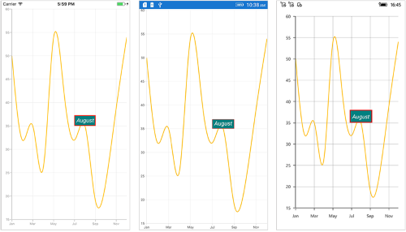

## Shape annotation

The [`ShapeAnnotation`](https://help.syncfusion.com/cr/xamarin/Syncfusion.SfChart.XForms.ShapeAnnotation.html) allows you to add annotations in the form of shapes such as rectangle, ellipse, horizontal line, vertical line, etc., at the specific area of interest in the chart area.

*   [`RectangleAnnotation`](https://help.syncfusion.com/cr/xamarin/Syncfusion.SfChart.XForms.RectangleAnnotation.html) - Used to draw a rectangle over the chart area.
*   [`EllipseAnnotation`](https://help.syncfusion.com/cr/xamarin/Syncfusion.SfChart.XForms.EllipseAnnotation.html) - Used to draw a circle or an ellipse over the chart area.
*   [`LineAnnotation`](https://help.syncfusion.com/cr/xamarin/Syncfusion.SfChart.XForms.LineAnnotation.html) - Used to draw a line over the chart area.
*   [`VerticalLineAnnotation`](https://help.syncfusion.com/cr/xamarin/Syncfusion.SfChart.XForms.VerticalLineAnnotation.html) - Used to draw a vertical line across the chart area.
*   [`HorizontalLineAnnotation`](https://help.syncfusion.com/cr/xamarin/Syncfusion.SfChart.XForms.HorizontalLineAnnotation.html) - Used to draw a horizontal line across the chart area.

The following APIs are commonly used in all [`ShapeAnnotation`](https://help.syncfusion.com/cr/xamarin/Syncfusion.SfChart.XForms.ShapeAnnotation.html):

*   [`X2`](https://help.syncfusion.com/cr/xamarin/Syncfusion.SfChart.XForms.ShapeAnnotation.html#Syncfusion_SfChart_XForms_ShapeAnnotation_X2) - Represents the X2 coordinate of the shape annotation.
*   [`Y2`](https://help.syncfusion.com/cr/xamarin/Syncfusion.SfChart.XForms.ShapeAnnotation.html#Syncfusion_SfChart_XForms_ShapeAnnotation_Y2) - Represents the Y2 coordinate of the shape annotation.
*   [`FillColor`](https://help.syncfusion.com/cr/xamarin/Syncfusion.SfChart.XForms.ShapeAnnotation.html#Syncfusion_SfChart_XForms_ShapeAnnotation_FillColor) - Represents the inside background color of the shape annotation.
*   [`StrokeColor`](https://help.syncfusion.com/cr/xamarin/Syncfusion.SfChart.XForms.ShapeAnnotation.html#Syncfusion_SfChart_XForms_ShapeAnnotation_StrokeColor) - Represents the stroke color of the shape annotation.
*   [`StrokeWidth`](https://help.syncfusion.com/cr/xamarin/Syncfusion.SfChart.XForms.ShapeAnnotation.html#Syncfusion_SfChart_XForms_ShapeAnnotation_StrokeWidth) - Represents the stroke width of the shape annotation.
*   [`StrokeDashArray`](https://help.syncfusion.com/cr/xamarin/Syncfusion.SfChart.XForms.ShapeAnnotation.html#Syncfusion_SfChart_XForms_ShapeAnnotation_StrokeDashArray) - Represents the stroke dashes of the shape annotation.
*   [`Text`](https://help.syncfusion.com/cr/xamarin/Syncfusion.SfChart.XForms.ShapeAnnotation.html#Syncfusion_SfChart_XForms_ShapeAnnotation_Text) - Represents the annotation text of the shape annotation.
*   [`LabelStyle`](https://help.syncfusion.com/cr/xamarin/Syncfusion.SfChart.XForms.ShapeAnnotation.html#Syncfusion_SfChart_XForms_ShapeAnnotation_LabelStyle) - Represents the style for customizing the annotation text of shape annotation.

### Rectangle annotation

The [`RectangleAnnotation`](https://help.syncfusion.com/cr/xamarin/Syncfusion.SfChart.XForms.RectangleAnnotation.html) is used to draw a rectangle or a square in specific points over the chart area.

 



<chart:SfChart>
...

    <chart:SfChart.ChartAnnotations>

        <chart:RectangleAnnotation X1="4" Y1="20" X2="6" Y2="55"/>

    </chart:SfChart.ChartAnnotations> 

</chart:SfChart>





SfChart chart = new SfChart();
...

RectangleAnnotation annotation = new RectangleAnnotation()
{
    X1 = 4,

    Y1 = 20,

    X2 = 6,

    Y2 = 55,
};

chart.ChartAnnotations.Add(annotation); 





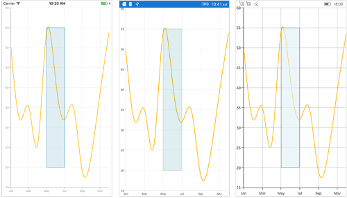

### Ellipse annotation

The [`EllipseAnnotation`](https://help.syncfusion.com/cr/xamarin/Syncfusion.SfChart.XForms.EllipseAnnotation.html) is used to draw an oval or a circle in specific points over the chart area. You can also specify the height and width of [`EllipseAnnotation`](https://help.syncfusion.com/cr/xamarin/Syncfusion.SfChart.XForms.EllipseAnnotation.html) by using the [`Height`](https://help.syncfusion.com/cr/xamarin/Syncfusion.SfChart.XForms.EllipseAnnotation.html#Syncfusion_SfChart_XForms_EllipseAnnotation_Height) and [`Width`](https://help.syncfusion.com/cr/xamarin/Syncfusion.SfChart.XForms.EllipseAnnotation.html#Syncfusion_SfChart_XForms_EllipseAnnotation_Width) properties respectively.

 



<chart:SfChart>
...

    <chart:SfChart.ChartAnnotations>

        <chart:EllipseAnnotation X1="6" Y1="32" Height="30" Width="30"/>

    </chart:SfChart.ChartAnnotations> 
     
</chart:SfChart>





SfChart chart = new SfChart();
...

EllipseAnnotation annotation = new EllipseAnnotation()
{
    X1 = 6,

    Y1 = 32,

    Height = 30,

    Width = 30
};

chart.ChartAnnotations.Add(annotation); 





N> When `X2` and `Y2` properties of `EllipseAnnotation` are set, the `Height` and `Width` properties do not work.

### Line annotation

The [`LineAnnotation`](https://help.syncfusion.com/cr/xamarin/Syncfusion.SfChart.XForms.LineAnnotation.html) is used to draw a line in specific points over the chart area. 

 



<chart:SfChart>
...

    <chart:SfChart.ChartAnnotations>

        <chart:LineAnnotation X1="2" Y1="35" X2="8" Y2="45" Text="Line"/>

    </chart:SfChart.ChartAnnotations>  
     
</chart:SfChart>





SfChart chart = new SfChart();
...

LineAnnotation annotation = new LineAnnotation()
{
    X1 = 2,

    Y1 = 35,

    X2 = 8,

    Y2 = 45,

    Text = "Line"
};

chart.ChartAnnotations.Add(annotation); 





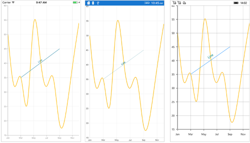

**Adding arrow to line annotation**

To display single headed arrow, set the [`LineCap`](https://help.syncfusion.com/cr/xamarin/Syncfusion.SfChart.XForms.LineAnnotation.html#Syncfusion_SfChart_XForms_LineAnnotation_LineCap) property to [`Arrow`](https://help.syncfusion.com/cr/xamarin/Syncfusion.SfChart.XForms.ChartLineCap.html). The default value of the [`LineCap`](https://help.syncfusion.com/cr/xamarin/Syncfusion.SfChart.XForms.LineAnnotation.html#Syncfusion_SfChart_XForms_LineAnnotation_LineCap) property is [`None`](https://help.syncfusion.com/cr/xamarin/Syncfusion.SfChart.XForms.ChartLineCap.html).

 



<chart:SfChart>
...

    <chart:SfChart.ChartAnnotations>

        <chart:LineAnnotation X1="2" Y1="40" X2="10" Y2="40" LineCap="Arrow"/>

    </chart:SfChart.ChartAnnotations> 
  
</chart:SfChart>





SfChart chart = new SfChart();
...

LineAnnotation annotation = new LineAnnotation()
{
    X1 = 2,

    Y1 = 40,

    X2 = 10,

    Y2 = 40,

    LineCap = ChartLineCap.Arrow
};

chart.ChartAnnotations.Add(annotation); 





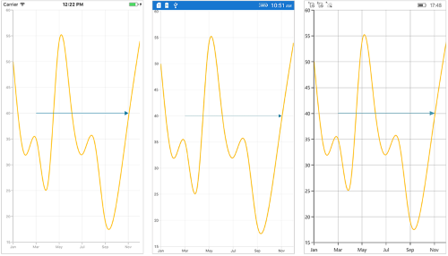

### Vertical and Horizontal line annotation

The [`VerticalLineAnnotation`](https://help.syncfusion.com/cr/xamarin/Syncfusion.SfChart.XForms.VerticalLineAnnotation.html) and [`HorizontalLineAnnotation`](https://help.syncfusion.com/cr/xamarin/Syncfusion.SfChart.XForms.HorizontalLineAnnotation.html) are used to draw vertical and horizontal lines in specific points over the chart area.

 



<chart:SfChart>
...

    <chart:SfChart.ChartAnnotations>

        <chart:VerticalLineAnnotation X1="6" />

        <chart:HorizontalLineAnnotation Y1="35" />

    </chart:SfChart.ChartAnnotations> 
  
</chart:SfChart>





SfChart chart = new SfChart();
...

VerticalLineAnnotation vertical = new VerticalLineAnnotation()
{
    X1 = 6,
};

chart.ChartAnnotations.Add(vertical);

HorizontalLineAnnotation horizontal = new HorizontalLineAnnotation()
{
    Y1 = 35
};

chart.ChartAnnotations.Add(horizontal);





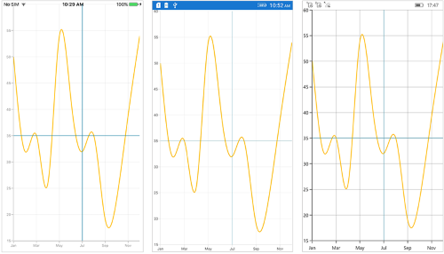

**Displaying axis label for vertical and horizontal line annotations**

The [`VerticalLineAnnotation`](https://help.syncfusion.com/cr/xamarin/Syncfusion.SfChart.XForms.VerticalLineAnnotation.html) and [`HorizontalLineAnnotation`](https://help.syncfusion.com/cr/xamarin/Syncfusion.SfChart.XForms.HorizontalLineAnnotation.html) display the axis labels in which the line is placed. This feature can be enabled by setting the [`ShowAxisLabel`](https://help.syncfusion.com/cr/xamarin/Syncfusion.SfChart.XForms.VerticalLineAnnotation.html#Syncfusion_SfChart_XForms_VerticalLineAnnotation_ShowAxisLabel) property to `true` as shown in the below code snippet,

 



<chart:SfChart>
...

    <chart:SfChart.ChartAnnotations>

        <chart:VerticalLineAnnotation X1="6" ShowAxisLabel="true"/>

        <chart:HorizontalLineAnnotation Y1="35" ShowAxisLabel="true"/>

    </chart:SfChart.ChartAnnotations> 
  
</chart:SfChart>





SfChart chart = new SfChart();
...

VerticalLineAnnotation vertical = new VerticalLineAnnotation()
{
    X1 = 6,

    ShowAxisLabel = true
};

chart.ChartAnnotations.Add(vertical );

HorizontalLineAnnotation horizontal = new HorizontalLineAnnotation()
{
    Y1 = 35,

    ShowAxisLabel = true
};

chart.ChartAnnotations.Add(horizontal);





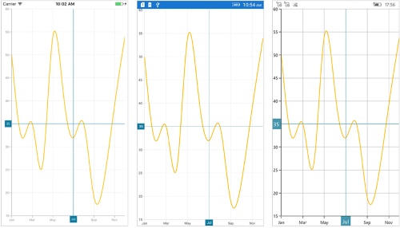

**Customizing axis label**

The default appearance of the axis label also can be customized by using the [`AxisLabelStyle`](https://help.syncfusion.com/cr/xamarin/Syncfusion.SfChart.XForms.VerticalLineAnnotation.html#Syncfusion_SfChart_XForms_VerticalLineAnnotation_AxisLabelStyle) property. The following properties are used to customize the axis label:

*   [`TextColor`](https://help.syncfusion.com/cr/xamarin/Syncfusion.SfChart.XForms.ChartLabelStyle.html#Syncfusion_SfChart_XForms_ChartLabelStyle_TextColor) - Used to change the text color.
*   [`BackgroundColor`](https://help.syncfusion.com/cr/xamarin/Syncfusion.SfChart.XForms.ChartLabelStyle.html#Syncfusion_SfChart_XForms_ChartLabelStyle_BackgroundColor) - Used to change the background color of the text.
*   [`Margin`](https://help.syncfusion.com/cr/xamarin/Syncfusion.SfChart.XForms.ChartLabelStyle.html#Syncfusion_SfChart_XForms_ChartLabelStyle_Margin) - Used to set the margin for text.
*   [`BorderThickness`](https://help.syncfusion.com/cr/xamarin/Syncfusion.SfChart.XForms.ChartLabelStyle.html#Syncfusion_SfChart_XForms_ChartLabelStyle_BorderThickness) - Used to change the text border thickness.
*   [`BorderColor`](https://help.syncfusion.com/cr/xamarin/Syncfusion.SfChart.XForms.ChartLabelStyle.html#Syncfusion_SfChart_XForms_ChartLabelStyle_BorderColor) - Used to change the border color of the text.
*   [`Font`](https://help.syncfusion.com/cr/xamarin/Syncfusion.SfChart.XForms.ChartLabelStyle.html#Syncfusion_SfChart_XForms_ChartLabelStyle_Font) - Used to change text font size, family, and weight.

 



<chart:SfChart>
...

    <chart:SfChart.ChartAnnotations>

        <chart:VerticalLineAnnotation X1="6" ShowAxisLabel="true">

            <chart:VerticalLineAnnotation.AxisLabelStyle>

                <chart:ChartLabelStyle Margin="5" Font="Italic,12" BorderColor="Blue" BorderThickness="2" BackgroundColor="Red" TextColor="White"/>

            </chart:VerticalLineAnnotation.AxisLabelStyle>

        </chart:VerticalLineAnnotation>
                
        <chart:HorizontalLineAnnotation Y1="35" ShowAxisLabel="true">

            <chart:HorizontalLineAnnotation.AxisLabelStyle>

                <chart:ChartLabelStyle Margin="5" Font="Italic,12" BorderColor="Blue" BorderThickness="2" BackgroundColor="Red" TextColor="White"/>

            </chart:HorizontalLineAnnotation.AxisLabelStyle>

        </chart:HorizontalLineAnnotation>

    </chart:SfChart.ChartAnnotations>
      
</chart:SfChart>





SfChart chart = new SfChart();
...

VerticalLineAnnotation vertical = new VerticalLineAnnotation()
{
    X1 = 6,

    ShowAxisLabel = true
};

vertical.AxisLabelStyle = new ChartLabelStyle()
{
    Margin = new Thickness(5),

    Font = Font.SystemFontOfSize(12, FontAttributes.Italic),

    BorderColor = Color.Blue,

    BorderThickness = new Thickness(2),

    BackgroundColor = Color.Red,

    TextColor = Color.White
};

chart.ChartAnnotations.Add(vertical);

HorizontalLineAnnotation horizontal = new HorizontalLineAnnotation()
{
    Y1 = 35,

    ShowAxisLabel = true
};

horizontal.AxisLabelStyle = new ChartLabelStyle()
{
    Margin = new Thickness(5),

    Font = Font.SystemFontOfSize(12, FontAttributes.Italic),

    BorderColor = Color.Blue,

    BorderThickness = new Thickness(2),

    BackgroundColor = Color.Red,

    TextColor = Color.White
};

chart.ChartAnnotations.Add(horizontal);





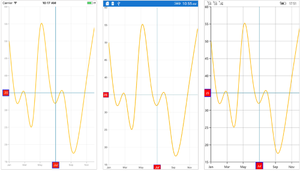

**Adding arrow to vertical and horizontal line annotations**

To display the single headed arrow, set the [`LineCap`](https://help.syncfusion.com/cr/xamarin/Syncfusion.SfChart.XForms.LineAnnotation.html#Syncfusion_SfChart_XForms_LineAnnotation_LineCap) property to `Arrow`. The default value of the [`LineCap`](https://help.syncfusion.com/cr/xamarin/Syncfusion.SfChart.XForms.LineAnnotation.html#Syncfusion_SfChart_XForms_LineAnnotation_LineCap) property is `None`.

 



<chart:SfChart>
...

    <chart:SfChart.ChartAnnotations>

        <chart: VerticalLineAnnotation X1="6" LineCap="Arrow"/>

        <chart:HorizontalLineAnnotation Y1="35" LineCap="Arrow"/>

    </chart:SfChart.ChartAnnotations> 
  
</chart:SfChart>





SfChart chart = new SfChart();
...

VerticalLineAnnotation vertical = new VerticalLineAnnotation()
{
    X1 = 6,

    LineCap = ChartLineCap.Arrow 
};

chart.ChartAnnotations.Add(vertical );

HorizontalLineAnnotation horizontal = new HorizontalLineAnnotation()
{
    Y1 = 35,

    LineCap = ChartLineCap.Arrow 
};

chart.ChartAnnotations.Add(horizontal);





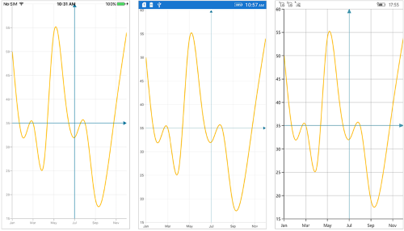

### Adding text in shape annotation 

For all the shape annotations, the text can be displayed by using the [`Text`](https://help.syncfusion.com/cr/xamarin/Syncfusion.SfChart.XForms.ShapeAnnotation.html#Syncfusion_SfChart_XForms_ShapeAnnotation_Text) property. 

**Customizing text in shape annotation**

The [`Text`](https://help.syncfusion.com/cr/xamarin/Syncfusion.SfChart.XForms.ShapeAnnotation.html#Syncfusion_SfChart_XForms_ShapeAnnotation_Text) in shape annotation also can be customized by using the [`LabelStyle`](https://help.syncfusion.com/cr/xamarin/Syncfusion.SfChart.XForms.ShapeAnnotation.html#Syncfusion_SfChart_XForms_ShapeAnnotation_LabelStyle) property. The following properties are used to customize the text:

*   [`TextColor`](https://help.syncfusion.com/cr/xamarin/Syncfusion.SfChart.XForms.ChartLabelStyle.html#Syncfusion_SfChart_XForms_ChartLabelStyle_TextColor) - Used to change the text color.
*   [`BackgroundColor`](https://help.syncfusion.com/cr/xamarin/Syncfusion.SfChart.XForms.ChartLabelStyle.html#Syncfusion_SfChart_XForms_ChartLabelStyle_BackgroundColor) - Used to change the background color of the text.
*   [`Margin`](https://help.syncfusion.com/cr/xamarin/Syncfusion.SfChart.XForms.ChartLabelStyle.html#Syncfusion_SfChart_XForms_ChartLabelStyle_Margin) - Used to set the margin for text.
*   [`BorderThickness`](https://help.syncfusion.com/cr/xamarin/Syncfusion.SfChart.XForms.ChartLabelStyle.html#Syncfusion_SfChart_XForms_ChartLabelStyle_BorderThickness) - Used to change the text border thickness.
*   [`BorderColor`](https://help.syncfusion.com/cr/xamarin/Syncfusion.SfChart.XForms.ChartLabelStyle.html#Syncfusion_SfChart_XForms_ChartLabelStyle_BorderColor) - Used to change the text border color.
*   [`Font`](https://help.syncfusion.com/cr/xamarin/Syncfusion.SfChart.XForms.ChartLabelStyle.html#Syncfusion_SfChart_XForms_ChartLabelStyle_Font) - Used to change text font size, family, and weight.
*   [`HorizontalTextAlignment`](https://help.syncfusion.com/cr/xamarin/Syncfusion.SfChart.XForms.ChartAnnotationLabelStyle.html#Syncfusion_SfChart_XForms_ChartAnnotationLabelStyle_HorizontalTextAlignment) - Used to align the text horizontally.
*   [`VerticalTextAlignment`](https://help.syncfusion.com/cr/xamarin/Syncfusion.SfChart.XForms.ChartAnnotationLabelStyle.html#Syncfusion_SfChart_XForms_ChartAnnotationLabelStyle_VerticalTextAlignment) - Used to align the text vertically.

 



<chart:SfChart>
...

    <chart:SfChart.ChartAnnotations>

        <chart:EllipseAnnotation X1="2" Y1="30" X2="6" Y2="35" Text="Ellipse" >

            <chart:EllipseAnnotation.LabelStyle>

                <chart:ChartAnnotationLabelStyle Margin="5" Font="Italic,16" BorderColor="Red" BorderThickness="2" BackgroundColor="Blue" TextColor="White"/>

            </chart:EllipseAnnotation.LabelStyle>

        </chart:EllipseAnnotation>

    </chart:SfChart.ChartAnnotations>
  
</chart:SfChart>





SfChart chart = new SfChart();
...

EllipseAnnotation annotation = new EllipseAnnotation()
{
    X1 = 2,

    Y1 = 30,

    X2 = 6,

    Y2 = 35,

    Text = "Ellipse"
};

annotation.LabelStyle = new ChartAnnotationLabelStyle()
{
    Margin = new Thickness(5),

    Font = Font.SystemFontOfSize(16, FontAttributes.Italic),

    BorderColor = Color.Red,

    BorderThickness = new Thickness(2),

    BackgroundColor = Color.Blue,

    TextColor = Color.White,
}; 

chart.ChartAnnotations.Add(annotation); 





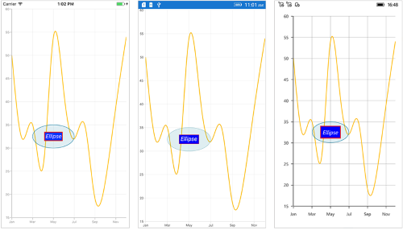

## View annotation

The [`ViewAnnotation`](https://help.syncfusion.com/cr/xamarin/Syncfusion.SfChart.XForms.ViewAnnotation.html) allows you to add annotations in the form of own custom view with the help of [`View`](https://help.syncfusion.com/cr/xamarin/Syncfusion.SfChart.XForms.ViewAnnotation.html#Syncfusion_SfChart_XForms_ViewAnnotation_View) property at the specific area of interest in the chart area. The [`ViewAnnotation`](https://help.syncfusion.com/cr/xamarin/Syncfusion.SfChart.XForms.ViewAnnotation.html) also can be aligned by using the [`VerticalAlignment`](https://help.syncfusion.com/cr/xamarin/Syncfusion.SfChart.XForms.ViewAnnotation.html#Syncfusion_SfChart_XForms_ViewAnnotation_VerticalAlignment) and [`HorizontalAlignment`](https://help.syncfusion.com/cr/xamarin/Syncfusion.SfChart.XForms.ViewAnnotation.html#Syncfusion_SfChart_XForms_ViewAnnotation_HorizontalAlignment) properties.

 



<chart:SfChart>
...

    <chart:SfChart.ChartAnnotations>

        <chart:ViewAnnotation X1="3" Y1="12" VerticalAlignment="Start" >

            <chart:ViewAnnotation.View>

                <StackLayout>

                    <Image Source="Graduate.png" WidthRequest="70" HeightRequest="70" />

                </StackLayout>

            </chart:ViewAnnotation.View>

        </chart:ViewAnnotation>

    </chart:SfChart.ChartAnnotations>
  
</chart:SfChart>





SfChart chart = new SfChart();
...

ViewAnnotation annotation = new ViewAnnotation()
{
    X1 = 3,

    Y1 = 12,

    VerticalAlignment = ChartAnnotationAlignment.Start
};

StackLayout layout = new StackLayout();

Image image = new Image();

image.Source = "Graduate.png";

image.HeightRequest = 70;

image.WidthRequest = 70;

layout.Children.Add(image);

annotation.View = layout;

chart.ChartAnnotations.Add(annotation); 





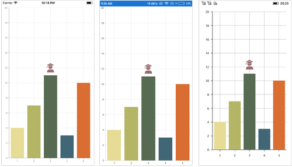

## Annotation Visibility

The [`IsVisible`](https://help.syncfusion.com/cr/xamarin/Syncfusion.SfChart.XForms.ChartAnnotation.html#Syncfusion_SfChart_XForms_ChartAnnotation_IsVisible) property of [`ChartAnnotation`](https://help.syncfusion.com/cr/xamarin/Syncfusion.SfChart.XForms.SfChart.html#Syncfusion_SfChart_XForms_SfChart_ChartAnnotations) is used to toggle the visibility of annotation.

 



<chart:SfChart.ChartAnnotations>
    <chart:VerticalLineAnnotation IsVisible="False" X1="2" LineCap="Arrow" ShowAxisLabel="true" Text="Vertical Line" x:Name="verticalLineAnnotation" />
</chart:SfChart.ChartAnnotations>





VerticalLineAnnotation verticalLineAnnotation = new VerticalLineAnnotation()
{
    IsVisible = false
};

chart.ChartAnnotations.Add(verticalLineAnnotation);





## Event

**AnnotationClicked**

The [`AnnotationClicked`](https://help.syncfusion.com/cr/xamarin/Syncfusion.SfChart.XForms.SfChart.html) event is triggered when the user has clicked the annotation. The argument contains the following information.

* [`Annotation`](https://help.syncfusion.com/cr/xamarin/Syncfusion.SfChart.XForms.ChartAnnotationClickedEventArgs.html#Syncfusion_SfChart_XForms_ChartAnnotationClickedEventArgs_Annotation) – used to get the instance of annotation which is clicked.
* [`X`](https://help.syncfusion.com/cr/xamarin/Syncfusion.SfChart.XForms.ChartAnnotationClickedEventArgs.html#Syncfusion_SfChart_XForms_ChartAnnotationClickedEventArgs_X) – used to get the x position of touch point on annotation.
* [`Y`](https://help.syncfusion.com/cr/xamarin/Syncfusion.SfChart.XForms.ChartAnnotationClickedEventArgs.html#Syncfusion_SfChart_XForms_ChartAnnotationClickedEventArgs_Y) – used to get the y position of touch point on annotation..

## Get the touch position in annotation

Following are the override methods that are available in annotation to send the information about touch interactions.

* [`OnTouchDown`](https://help.syncfusion.com/cr/xamarin/Syncfusion.SfChart.XForms.ChartAnnotation.html#Syncfusion_SfChart_XForms_ChartAnnotation_OnTouchDown_System_Single_System_Single_) – occurs when touch down inside the annotation.
* [`OnTouchMove`](https://help.syncfusion.com/cr/xamarin/Syncfusion.SfChart.XForms.ChartAnnotation.html#Syncfusion_SfChart_XForms_ChartAnnotation_OnTouchMove_System_Single_System_Single_) – occurs while moving the finger or mouse inside the annotation.
* [`OnTouchUp`](https://help.syncfusion.com/cr/xamarin/Syncfusion.SfChart.XForms.ChartAnnotation.html#Syncfusion_SfChart_XForms_ChartAnnotation_OnTouchUp_System_Single_System_Single_) – occurs when touch up inside the annotation.



public class TextAnnotationExt : TextAnnotation
{
    protected override void OnTouchDown(float pointX, float pointY)
    {
       base.OnTouchDown(pointX, pointY);
    }

    protected override void OnTouchMove(float pointX, float pointY)
    {
       base.OnTouchMove(pointX, pointY);
    }

    protected override void OnTouchUp(float pointX, float pointY)
    {
       base.OnTouchUp(pointX, pointY);
    }
}



## See also

[How to add benchmark line in Xamarin.Forms Chart](https://www.syncfusion.com/kb/9304/how-to-add-benchmark-line-in-xamarin-forms-chart)