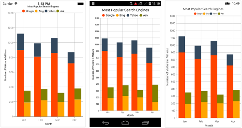

# Chart Series in Xamarin

[`ChartSeries`](https://help.syncfusion.com/cr/xamarin/Syncfusion.SfChart.XForms.ChartSeries.html) is the visual representation of the data. [`SfChart`](https://help.syncfusion.com/cr/xamarin/Syncfusion.SfChart.XForms.SfChart.html) offers many types of series ranging from line series to financial series like HiLo and Candle. Based on your requirements and specifications, any type of Series can be added for data visualization.
 
The following APIs are common for the most of the series types:
 
[`IsVisible`](https://help.syncfusion.com/cr/xamarin/Syncfusion.SfChart.XForms.ChartSeries.html#Syncfusion_SfChart_XForms_ChartSeries_IsVisible) - controls the visibility of the series.
[`ItemsSource`](https://help.syncfusion.com/cr/xamarin/Syncfusion.SfChart.XForms.ChartSeries.html#Syncfusion_SfChart_XForms_ChartSeries_ItemsSource) - used to set the data source for the series. Refer the [`Populating Data`](https://help.syncfusion.com/xamarin/sfchart/working-with-data) page to configure the items source and set the binding paths.
[`Color`](https://help.syncfusion.com/cr/xamarin/Syncfusion.SfChart.XForms.ChartSeries.html#Syncfusion_SfChart_XForms_ChartSeries_Color) - used to change the color of the series.
[`LegendIcon`](https://help.syncfusion.com/cr/xamarin/Syncfusion.SfChart.XForms.ChartSeries.html#Syncfusion_SfChart_XForms_ChartSeries_LegendIcon) - used to change the icon type in corresponding legend item.
[`Label`](https://help.syncfusion.com/cr/xamarin/Syncfusion.SfChart.XForms.ChartSeries.html#Syncfusion_SfChart_XForms_ChartSeries_Label) - used to set the label that displays in corresponding legend item.
[`IsVisibleOnLegend`](https://help.syncfusion.com/cr/xamarin/Syncfusion.SfChart.XForms.ChartSeries.html#Syncfusion_SfChart_XForms_ChartSeries_IsVisibleOnLegend) - used to control the visibility of the series in legend.
[`Opacity`](https://help.syncfusion.com/cr/xamarin/Syncfusion.SfChart.XForms.ChartSeries.html#Syncfusion_SfChart_XForms_ChartSeries_Opacity) - used to control the transparency of the series.

## Multiple Series

You can add multiple series to [`Series`](https://help.syncfusion.com/cr/xamarin/Syncfusion.SfChart.XForms.ChartSeries.html) property of [`SfChart`](https://help.syncfusion.com/cr/xamarin/Syncfusion.SfChart.XForms.SfChart.html) class. By default, all the series rendered based on the [`PrimaryAxis`](https://help.syncfusion.com/cr/xamarin/Syncfusion.SfChart.XForms.SfChart.html#Syncfusion_SfChart_XForms_SfChart_PrimaryAxis) and [`SecondaryAxis`](https://help.syncfusion.com/cr/xamarin/Syncfusion.SfChart.XForms.SfChart.html#Syncfusion_SfChart_XForms_SfChart_SecondaryAxis) of [`SfChart`](https://help.syncfusion.com/cr/xamarin/Syncfusion.SfChart.XForms.SfChart.html). But if you want to plot different unit or value that is specific to particular series, you can specify the separate axis for that series using [`XAxis`](https://help.syncfusion.com/cr/xamarin/Syncfusion.SfChart.XForms.CartesianSeries.html#Syncfusion_SfChart_XForms_CartesianSeries_XAxis) and [`YAxis`](https://help.syncfusion.com/cr/xamarin/Syncfusion.SfChart.XForms.CartesianSeries.html#Syncfusion_SfChart_XForms_CartesianSeries_YAxis) properties of [`ChartSeries`](https://help.syncfusion.com/cr/xamarin/Syncfusion.SfChart.XForms.ChartSeries.html).

 



<chart:SfChart>
...

	<chart:ColumnSeries ItemsSource ="{Binding Data }" XBindingPath="Country"
	 YBindingPath="Value"/>
 
	<chart:ColumnSeries ItemsSource ="{Binding Data1}" XBindingPath="Country"
	 YBindingPath="Value"/>

	<chart:ColumnSeries ItemsSource ="{Binding Data2}" XBindingPath="Country"
	 YBindingPath="Value"/>

</chart:SfChart>





SfChart chart = new SfChart();
...

ColumnSeries columnSeries = new ColumnSeries() { 
	
	ItemsSource = Data, 
	XBindingPath = "Country", 
	YBindingPath = "Value" 

};

ColumnSeries columnSeries1 = new ColumnSeries() { 

	ItemsSource = Data1, 
	XBindingPath = "Country", 
	YBindingPath = "Value" 
	
};

ColumnSeries columnSeries2 = new ColumnSeries() { 

	ItemsSource = Data2, 
	XBindingPath = "Country", 
	YBindingPath = "Value" 
	
};

chart.Series.Add(columnSeries);

chart.Series.Add(columnSeries1);

chart.Series.Add(columnSeries2);





Following code snippet and screenshot shows how to apply the Y axis to individual series to plot different values.

 



<chart:SfChart.Series>

    <chart:ColumnSeries Label="Revenue" ItemsSource="{Binding Demands}" XBindingPath="XValue" YBindingPath="YValue" />

    <chart:LineSeries Label="Customers" ItemsSource="{Binding Demands}" XBindingPath="XValue" YBindingPath="YValue" >

        <chart:LineSeries.YAxis>

            <chart:NumericalAxis OpposedPosition="true" >

                <chart:NumericalAxis.Title>

                    <chart:ChartAxisTitle Text = "Number of Customers" />

                </chart:NumericalAxis.Title>

            </chart:NumericalAxis>

        </chart:LineSeries.YAxis>

     </chart:LineSeries>

</chart:SfChart.Series>





ColumnSeries series = new ColumnSeries();

series.ItemsSource = model.Demands;

series.XBindingPath = "XValue";

series.YBindingPath = "YValue";

series.Label = "Revenue";

chart.Series.Add(series);

LineSeries lineSeries = new LineSeries();

lineSeries.ItemsSource = model.Demands;

lineSeries.XBindingPath = "XValue";

lineSeries.YBindingPath = "YValue";

lineSeries.Label = "Customers";

NumericalAxis yAxis = new NumericalAxis();

yAxis.OpposedPosition = true;

yAxis.Title.Text = "Number of Customers";

lineSeries.YAxis = yAxis;

chart.Series.Add(lineSeries);





## Combination Series

[`SfChart`](https://help.syncfusion.com/cr/xamarin/Syncfusion.SfChart.XForms.SfChart.html) allows you to render the combination of different types of series.

 



<chart:SfChart>
...

	<chart:ColumnSeries ItemsSource ="{Binding Data}" XBindingPath="Month" YBindingPath="Value"/>

	<chart:LineSeries ItemsSource ="{Binding Data1}" XBindingPath="Month" YBindingPath="Value"/>

</chart:SfChart>





SfChart chart = new SfChart();

...

ColumnSeries columnSeries = new ColumnSeries() { 
	
	ItemsSource = Data, 
	XBindingPath = "Month",
	YBindingPath = "Value" 
	
};

LineSeries lineSeries = new LineSeries() { 
	
	ItemsSource = Data1, 
	XBindingPath = "Month", 
	YBindingPath = "Value" 
	
}; 

chart.Series.Add(columnSeries);

chart.Series.Add(lineSeries);





**Limitation of Combination Chart**

* Bar, StackingBar, and StackingBar100 cannot be combined with the other Cartesian type series.
* Cartesian type series cannot be combined with Accumulation series (pie, doughnut, funnel, and pyramid).

When the combination of Cartesian and Accumulation series types are added to the [`Series`](https://help.syncfusion.com/cr/xamarin/Syncfusion.SfChart.XForms.ChartSeries.html) property, the series which are similar to the first series will be rendered and other series will be ignored. Following code snippet illustrates this.

 



<chart:SfChart>
...

	<chart:LineSeries ItemsSource ="{Binding Data}" XBindingPath="Month" 
	YBindingPath="Value"/>

	<chart:PieSeries ItemsSource ="{Binding Data1}" XBindingPath="Month" 
	YBindingPath="Value"/>

</chart:SfChart>





SfChart chart = new SfChart();
...

LineSeries lineSeries = new LineSeries() { 

	ItemsSource = Data, 
	XBindingPath = "Month", 
	YBindingPath = "Value" 
	
};

PieSeries pieSeries = new PieSeries() { 

	ItemsSource = Data1, 
	XBindingPath = "Month", 
	YBindingPath = "Value" 
	
};

chart.Series.Add(lineSeries);

chart.Series.Add(pieSeries);





## Grouping Stacked Series

You can group and stack the similar stacked series types using [`GroupingLabel`](https://help.syncfusion.com/cr/xamarin/Syncfusion.SfChart.XForms.StackingSeriesBase.html#Syncfusion_SfChart_XForms_StackingSeriesBase_GroupingLabel) property of stacked series. The stacked series which contains the same [`GroupingLabel`](https://help.syncfusion.com/cr/xamarin/Syncfusion.SfChart.XForms.StackingSeriesBase.html#Syncfusion_SfChart_XForms_StackingSeriesBase_GroupingLabel) will be stacked in a single group.

 



<chart:SfChart>
...

	<chart:StackingColumnSeries ItemsSource ="{Binding Data1}" GroupingLabel="GroupOne" 
	Label="Google" XBindingPath="Month" YBindingPath="Value"/>

	<chart:StackingColumnSeries ItemsSource ="{Binding Data2}" GroupingLabel="GroupTwo" 
	Label="Bing" XBindingPath="Month" YBindingPath="Value"/>

	<chart:StackingColumnSeries ItemsSource ="{Binding Data3}" GroupingLabel="GroupOne" 
	Label="Yahoo" XBindingPath="Month" YBindingPath="Value"/>
	
	<chart:StackingColumnSeries ItemsSource ="{Binding Data4}" GroupingLabel="GroupTwo" 
	Label="Ask" XBindingPath="Month" YBindingPath="Value"/>

</chart:SfChart>





SfChart chart = new SfChart();
...

StackingColumnSeries stackingColumnSeries1 = new StackingColumnSeries() 
{ 
	ItemsSource = Data1, 
	GroupingLabel = "GroupOne",
	Label = "Google",
	XBindingPath = "Month", 
	YBindingPath = "Value" 
};

StackingColumnSeries stackingColumnSeries2 = new StackingColumnSeries() 
{ 
	ItemsSource = Data2, 
	GroupingLabel = "GroupTwo",
	Label = "Bing",
	XBindingPath = "Month", 
	YBindingPath = "Value" 
};

StackingColumnSeries stackingColumnSeries3 = new StackingColumnSeries() 
{ 
	ItemsSource = Data3,
	GroupingLabel = "GroupOne",
	Label = "Yahoo",
	XBindingPath = "Month", 
	YBindingPath = "Value" 
};

StackingColumnSeries stackingColumnSeries4 = new StackingColumnSeries() 
{ 
	ItemsSource = Data4,
	GroupingLabel = "GroupTwo",
	Label = "Ask",
	XBindingPath = "Month", 
	YBindingPath = "Value" 
};

chart.Series.Add(stackingColumnSeries1);
chart.Series.Add(stackingColumnSeries2);
chart.Series.Add(stackingColumnSeries3);
chart.Series.Add(stackingColumnSeries4);





## Animation

[`SfChart`](https://help.syncfusion.com/cr/xamarin/Syncfusion.SfChart.XForms.SfChart.html) provides animation support for data series. [`Series`](https://help.syncfusion.com/cr/xamarin/Syncfusion.SfChart.XForms.SfChart.html#Syncfusion_SfChart_XForms_SfChart_Series) will be animated whenever the items source changes. Animation can be enabled by setting the [`EnableAnimation`](https://help.syncfusion.com/cr/xamarin/Syncfusion.SfChart.XForms.ChartSeries.html#Syncfusion_SfChart_XForms_ChartSeries_EnableAnimation) property to `true`. You can also control the duration of the animation using [`AnimationDuration`](https://help.syncfusion.com/cr/xamarin/Syncfusion.SfChart.XForms.ChartSeries.html#Syncfusion_SfChart_XForms_ChartSeries_AnimationDuration) property.

 



<chart:SfChart>
...

	<chart:ColumnSeries 
    	ItemsSource="{Binding ColumnData}" 
    	EnableAnimation = "true" 
    	AnimationDuration="0.8" 
   		XBindingPath="Name" 
    	YBindingPath="Value"  />

</chart:SfChart>





ColumnSeries column = new ColumnSeries ();
column.ItemsSource = viewModel.ColumnData;
column.XBindingPath = "Name";
column.YBindingPath = "Value";
column.EnableAnimation = true;
column.AnimationDuration = 0.8;





## Transpose the Series (Vertical Chart)
The [`IsTransposed`](https://help.syncfusion.com/cr/xamarin/Syncfusion.SfChart.XForms.CartesianSeries.html#Syncfusion_SfChart_XForms_CartesianSeries_IsTransposed) property of [`CartesianSeries`](https://help.syncfusion.com/cr/xamarin/Syncfusion.SfChart.XForms.CartesianSeries.html) is used to plot the chart vertically and view the data in a different perspective.

 



<chart:SfChart.Series>

	<chart:LineSeries ItemsSource="{Binding Data}" XBindingPath="Month"
					  YBindingPath="Value" IsTransposed="True"/>

</chart:SfChart.Series>





SfChart chart = new SfChart();
...	

LineSeries lineSeries = new LineSeries();
lineSeries.XBindingPath = "Month";
lineSeries.YBindingPath = "Value";
]lineSeries.ItemsSource = Data;
lineSeries.IsTransposed = true;
chart.Series.Add(lineSeries);





## Methods

### GetDataPointIndex(float pointX, float pointY)

The [`GetDataPointIndex`](https://help.syncfusion.com/cr/xamarin/Syncfusion.SfChart.XForms.ChartSeries.html#Syncfusion_SfChart_XForms_ChartSeries_GetDataPointIndex_System_Single_System_Single_) method is used to get the actual data point index for corresponding screen point.



ColumnSeries series = new ColumnSeries();
int index = series.GetDataPointIndex(400, 400);



N> The output of this method will be -1 if there is no data point under the given x and y positions.

### Animate()

The [`Animate`](https://help.syncfusion.com/cr/xamarin/Syncfusion.SfChart.XForms.ChartSeries.html#Syncfusion_SfChart_XForms_ChartSeries_Animate) is a built-in method and a short way to play animation on a chart series.



ColumnSeries series = new ColumnSeries();
series.Animate();



## See also

[How to group stacking series in the Xamarin.Forms Chart](https://www.syncfusion.com/kb/11724/how-to-group-stacking-series-in-the-xamarin-forms-chart)

[How to add content in the center of DoughnutSeries in Xamarin.Forms](https://www.syncfusion.com/kb/7778/how-to-add-content-in-the-center-of-doughnutseries)

[How to explode the pie series slice on touch](https://www.syncfusion.com/kb/5923/how-to-explode-the-pie-series-slice-on-touch)

[How to set the opacity of the chart series](https://www.syncfusion.com/kb/5741/how-to-set-the-opacity-of-the-chart-series)

[How to show indicator when loading the large number of data points to series in Xamarin.Forms Chart](https://www.syncfusion.com/kb/10680/how-to-show-indicator-when-loading-the-large-number-of-data-points-to-series-in-xamarin)

[How to increase or decrease the width of Column series](https://www.syncfusion.com/kb/5104/how-to-increase-or-decrease-the-width-of-column-series)

[How to visualize the Xamarin.Forms Pie Chart in linear form](https://www.syncfusion.com/kb/11285/how-to-visualize-the-xamarin-forms-pie-chart-in-linear-form)
