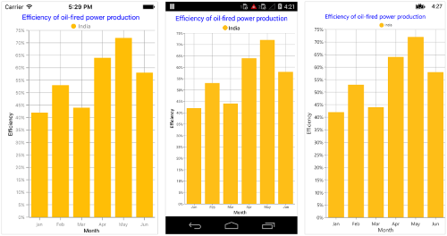
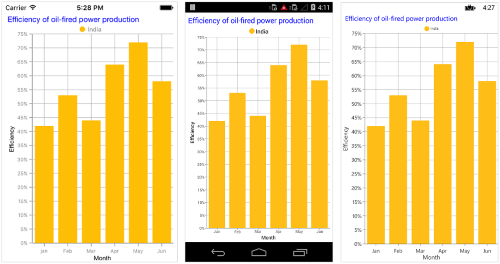
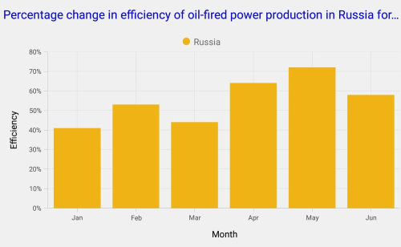

# Title in Xamarin Charts (SfChart)

You can define and customize the Chart title using [`Title`](https://help.syncfusion.com/cr/xamarin/Syncfusion.SfChart.XForms.SfChart.html#Syncfusion_SfChart_XForms_SfChart_Title) property of [`SfChart`](https://help.syncfusion.com/cr/xamarin/Syncfusion.SfChart.XForms.SfChart.html). The [`Text`](https://help.syncfusion.com/cr/xamarin/Syncfusion.SfChart.XForms.ChartTitle.html#Syncfusion_SfChart_XForms_ChartTitle_Text) property of [`ChartTitle`](https://help.syncfusion.com/cr/xamarin/Syncfusion.SfChart.XForms.ChartTitle.html) is used to set the text for the title. 

Following properties are used to customize its appearance.

* [`TextColor`](https://help.syncfusion.com/cr/xamarin/Syncfusion.SfChart.XForms.ChartTitle.html#Syncfusion_SfChart_XForms_ChartTitle_TextColor) – used to change the color of the text.
* [`BackgroundColor`](https://help.syncfusion.com/cr/xamarin/Syncfusion.SfChart.XForms.ChartTitle.html#Syncfusion_SfChart_XForms_ChartTitle_BackgroundColor) – used to change the background color.
* [`BorderColor`](https://help.syncfusion.com/cr/xamarin/Syncfusion.SfChart.XForms.ChartTitle.html#Syncfusion_SfChart_XForms_ChartTitle_BorderColor) – used to change the border color.
* [`BorderWidth`](https://help.syncfusion.com/cr/xamarin/Syncfusion.SfChart.XForms.ChartTitle.html#Syncfusion_SfChart_XForms_ChartTitle_BorderWidth) – used to change the border width.
* [`Font`](https://help.syncfusion.com/cr/xamarin/Syncfusion.SfChart.XForms.ChartTitle.html#Syncfusion_SfChart_XForms_ChartTitle_Font) – used to change the text size, font family, and font weight. (This is deprecated API. Use FontSize, FontFamily, and FontAttributes properties instead of this.)
* [`FontFamily`](https://help.syncfusion.com/cr/xamarin/Syncfusion.SfChart.XForms.ChartTitle.html#Syncfusion_SfChart_XForms_ChartTitle_FontFamily) - used to change the font family for chart title. 
* [`FontAttributes`](https://help.syncfusion.com/cr/xamarin/Syncfusion.SfChart.XForms.ChartTitle.html#Syncfusion_SfChart_XForms_ChartTitle_FontAttributes) – used to change the font style for the chart title.
* [`FontSize`](https://help.syncfusion.com/cr/xamarin/Syncfusion.SfChart.XForms.ChartTitle.html#Syncfusion_SfChart_XForms_ChartTitle_FontSize) - used to change the font size for the chart title.
* [`Margin`](https://help.syncfusion.com/cr/xamarin/Syncfusion.SfChart.XForms.ChartTitle.html#Syncfusion_SfChart_XForms_ChartTitle_Margin) - used to change the margin for title.

 



<chart:SfChart>

	<chart:SfChart.Title>

		<chart:ChartTitle Text="Efficiency of oil-fired power production" TextColor="Blue"/>

	</chart:SfChart.Title>  

</chart:SfChart>





SfChart sfChart = new SfChart();

sfChart.Title.Text = "Efficiency of oil-fired power production";

sfChart.Title.TextColor = Color.Blue;





## Text Alignment

You can align the title text content to the Start, Center or End of the title using the [`TextAlignment`](https://help.syncfusion.com/cr/xamarin/Syncfusion.SfChart.XForms.ChartTitle.html#Syncfusion_SfChart_XForms_ChartTitle_TextAlignment) property of the [`ChartTitle`](https://help.syncfusion.com/cr/xamarin/Syncfusion.SfChart.XForms.ChartTitle.html).

 



<chart:SfChart.Title>

	<chart:ChartTitle Text="Efficiency of oil-fired power production" TextAlignment="Start" TextColor="Blue"/>

</chart:SfChart.Title>  





sfChart.Title.Text = "Efficiency of oil-fired power production";

sfChart.Title.TextAlignment = TextAlignment.Start;

sfChart.Title.TextColor = Color.Blue;





## Text Wrap

By using the [`LineBreakMode`](https://help.syncfusion.com/cr/xamarin/Syncfusion.SfChart.XForms.ChartTitle.html#Syncfusion_SfChart_XForms_ChartTitle_LineBreakMode) property, You can wrap the chart title text content. The default value of this property is `NoWrap`.

 



<chart:SfChart>

	<chart:SfChart.Title>

	<chart:ChartTitle Text="Percentage change in efficiency of oil-fired power production in Russia for six months" TextColor="Blue" LineBreakMode="TailTruncation"/>

	</chart:SfChart.Title>  

</chart:SfChart>





SfChart sfChart = new SfChart();

sfChart.Title.Text = "Percentage change in efficiency of oil-fired power production in Russia for six months;

sfChart.Title.TextColor = Color.Blue;

sfChart.Title.LineBreakMode = LineBreakMode.TailTruncation;





N> HeadTruncation and MiddleTruncation is not supported in UWP and WPF platforms.

