# Data Markers in Xamarin Charts (SfChart) 

The data markers are used to provide information about the data points to the user. You can add a shape and label to adorn each data point. This can be enabled using the following code snippet,

 



<chart:LineSeries>

	<chart:LineSeries.DataMarker>

		<chart:ChartDataMarker/>

	</chart:LineSeries.DataMarker>

</chart:LineSeries>





lineSeries.DataMarker = new ChartDataMarker();





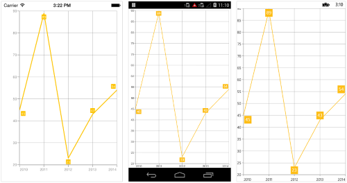

## Customizing labels

Data labels are enabled by default but you can also change the visibility of the labels using [`ShowLabel`](https://help.syncfusion.com/cr/xamarin/Syncfusion.SfChart.XForms.ChartDataMarker.html#Syncfusion_SfChart_XForms_ChartDataMarker_ShowLabel) property of [`ChartDataMarker`](https://help.syncfusion.com/cr/xamarin/Syncfusion.SfChart.XForms.ChartDataMarker.html). The label appearance can be customized using [`LabelStyle`](https://help.syncfusion.com/cr/xamarin/Syncfusion.SfChart.XForms.ChartDataMarker.html#Syncfusion_SfChart_XForms_ChartDataMarker_LabelStyle) property. 

* [`TextColor`](https://help.syncfusion.com/cr/xamarin/Syncfusion.SfChart.XForms.ChartLabelStyle.html#Syncfusion_SfChart_XForms_ChartLabelStyle_TextColor) – used to change the color of the label.
* [`BackgroundColor`](https://help.syncfusion.com/cr/xamarin/Syncfusion.SfChart.XForms.ChartLabelStyle.html#Syncfusion_SfChart_XForms_ChartLabelStyle_BackgroundColor) – used to change the label background color.
* [`BorderColor`](https://help.syncfusion.com/cr/xamarin/Syncfusion.SfChart.XForms.ChartLabelStyle.html#Syncfusion_SfChart_XForms_ChartLabelStyle_BorderColor) – used to change the border color.
* [`BorderThickness`](https://help.syncfusion.com/cr/xamarin/Syncfusion.SfChart.XForms.ChartLabelStyle.html#Syncfusion_SfChart_XForms_ChartLabelStyle_BorderThickness) – used to change the thickness of the border.
* [`Font`](https://help.syncfusion.com/cr/xamarin/Syncfusion.SfChart.XForms.ChartLabelStyle.html#Syncfusion_SfChart_XForms_ChartLabelStyle_Font) – used to change the text size, font family and font weight.
* [`Margin`](https://help.syncfusion.com/cr/xamarin/Syncfusion.SfChart.XForms.ChartLabelStyle.html#Syncfusion_SfChart_XForms_ChartLabelStyle_Margin) - used to change the margin size for labels.
* [`Angle`](https://help.syncfusion.com/cr/xamarin/Syncfusion.SfChart.XForms.DataMarkerLabelStyle.html#Syncfusion_SfChart_XForms_DataMarkerLabelStyle_Angle) – used to rotate the labels.
* [`LabelPadding`](https://help.syncfusion.com/cr/xamarin/Syncfusion.SfChart.XForms.DataMarkerLabelStyle.html#Syncfusion_SfChart_XForms_DataMarkerLabelStyle_LabelPadding) - used to move the data label in the respective direction. For example, the positive labels in column series will be moved upwards and negative labels in column series will be moved downwards.

Following code snippet illustrates the customization of label and its background,

 



<chart:LineSeries.DataMarker>

	<chart:ChartDataMarker ShowLabel="True">

		<chart:ChartDataMarker.LabelStyle>

			<chart:DataMarkerLabelStyle TextColor="Blue"
										BorderColor="Red" 
										BorderThickness="2"
										BackgroundColor="Aqua"
										Angle="315"
										Margin="5"
										Font="Italic,18"/>

		</chart:ChartDataMarker.LabelStyle>

	</chart:ChartDataMarker>

</chart:LineSeries.DataMarker>





lineSeries.DataMarker = new ChartDataMarker();

lineSeries.DataMarker.ShowLabel = true;

lineSeries.DataMarker.LabelStyle.TextColor = Color.Blue;

lineSeries.DataMarker.LabelStyle.BorderColor = Color.Red;

lineSeries.DataMarker.LabelStyle.BorderThickness = 2;

lineSeries.DataMarker.LabelStyle.BackgroundColor = Color.Aqua;

lineSeries.DataMarker.LabelStyle.Angle = 315;

lineSeries.DataMarker.LabelStyle.Margin = 5;

lineSeries.DataMarker.LabelStyle.Font = Font.SystemFontOfSize(18, FontAttributes.Italic);





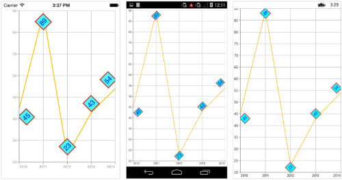

## Formatting label content

You can customize the content of the label using [`LabelContent`](https://help.syncfusion.com/cr/xamarin/Syncfusion.SfChart.XForms.ChartDataMarker.html#Syncfusion_SfChart_XForms_ChartDataMarker_LabelContent) property. Following are the two options that are supported now,

* [`Percentage`](https://help.syncfusion.com/cr/xamarin/Syncfusion.SfChart.XForms.LabelContent.html) – This will show the percentage value of corresponding data point Y value, this is often used in pie, doughnut, funnel and pyramid series types.
* [`YValue`](https://help.syncfusion.com/cr/xamarin/Syncfusion.SfChart.XForms.LabelContent.html) – This will show the corresponding Y value.

 



<chart:PieSeries>

	<chart:PieSeries.DataMarker>

		<chart:ChartDataMarker LabelContent="Percentage"/>

	</chart:PieSeries.DataMarker>

</chart:PieSeries>





pieSeries.DataMarker.LabelContent = LabelContent.Percentage;





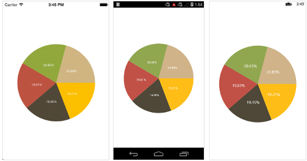

### DataMarker LabelFormat

Data marker labels can be formatted by using the [`LabelFormat`](https://help.syncfusion.com/cr/xamarin/Syncfusion.SfChart.XForms.ChartLabelStyle.html#Syncfusion_SfChart_XForms_ChartLabelStyle_LabelFormat) property. Data marker label values can be formatted with n (number with decimal points), c (Currency) and p (percentage) commands.

 



<chart:LineSeries.DataMarker>

    <chart:ChartDataMarker ShowLabel="True">
	
        <chart:ChartDataMarker.LabelStyle>
		
            <chart:DataMarkerLabelStyle LabelFormat="$##.##"/>
			
        </chart:ChartDataMarker.LabelStyle>
		
    </chart:ChartDataMarker>	
	
</chart:LineSeries.DataMarker>





ChartDataMarker chartDataMarker = new ChartDataMarker();
chartDataMarker.LabelStyle = new DataMarkerLabelStyle { LabelFormat = "$##.##" };
series.DataMarker = chartDataMarker;





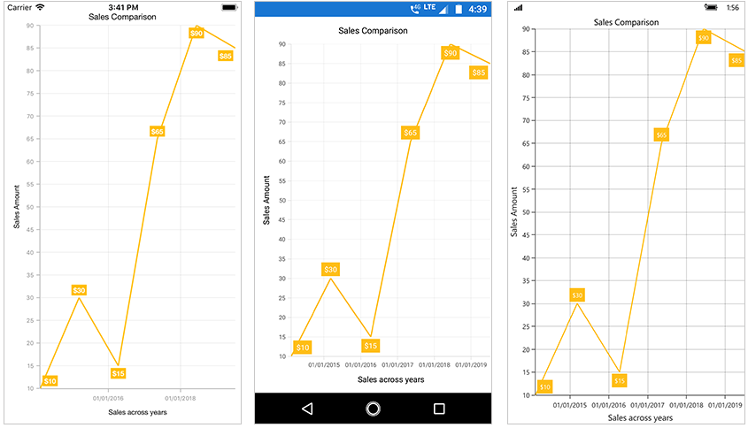

## Label position

The [`LabelPosition`](https://help.syncfusion.com/cr/xamarin/Syncfusion.SfChart.XForms.DataMarkerLabelStyle.html#Syncfusion_SfChart_XForms_DataMarkerLabelStyle_LabelPosition) property is used to position the data marker labels at [`Center`](https://help.syncfusion.com/cr/xamarin/Syncfusion.SfChart.XForms.DataMarkerLabelPosition.html), [`Inner`](https://help.syncfusion.com/cr/xamarin/Syncfusion.SfChart.XForms.DataMarkerLabelPosition.html) and [`Outer`](https://help.syncfusion.com/cr/xamarin/Syncfusion.SfChart.XForms.DataMarkerLabelPosition.html) position of the actual data point position. By default, labels are positioned based on the series types for better readability. You can move the labels horizontally and vertically using [`OffsetX`](https://help.syncfusion.com/cr/xamarin/Syncfusion.SfChart.XForms.DataMarkerLabelStyle.html#Syncfusion_SfChart_XForms_DataMarkerLabelStyle_OffsetX) and [`OffsetY`](https://help.syncfusion.com/cr/xamarin/Syncfusion.SfChart.XForms.DataMarkerLabelStyle.html#Syncfusion_SfChart_XForms_DataMarkerLabelStyle_OffsetY) properties respectively.

The following screenshot illustrates the default position of data marker labels,

The following code sample illustrates the center position of data marker labels,

 



<chart:ChartDataMarker>

	<chart:ChartDataMarker.LabelStyle>

		<chart:DataMarkerLabelStyle LabelPosition="Center"/>

	</chart:ChartDataMarker.LabelStyle>

</chart:ChartDataMarker>





series.DataMarker.LabelStyle.LabelPosition = DataMarkerLabelPosition.Center;





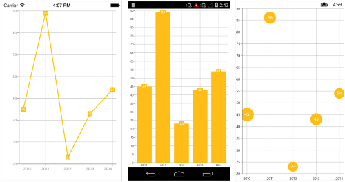

The following code sample illustrates the Inner position of data marker labels,

 



<chart:ChartDataMarker>

	<chart:ChartDataMarker.LabelStyle>

		<chart:DataMarkerLabelStyle LabelPosition="Inner"/>

	</chart:ChartDataMarker.LabelStyle>

</chart:ChartDataMarker>





series.DataMarker.LabelStyle.LabelPosition = DataMarkerLabelPosition.Inner;





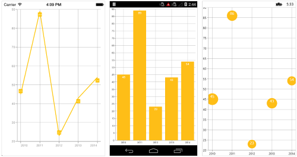

The following code sample illustrates the outer position of data marker labels, 

 



<chart:ChartDataMarker>

	<chart:ChartDataMarker.LabelStyle>

		<chart:DataMarkerLabelStyle LabelPosition="Outer"/>

	</chart:ChartDataMarker.LabelStyle>

</chart:ChartDataMarker>





series.DataMarker.LabelStyle.LabelPosition = DataMarkerLabelPosition.Outer;





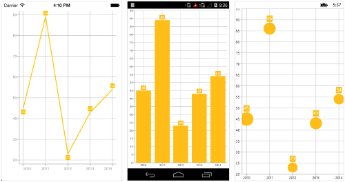

## Smart labels

This feature is used to arrange the data marker labels smartly and avoid the intersection when there is overlapping of labels. The property [`EnableSmartLabels`](https://help.syncfusion.com/cr/xamarin/Syncfusion.SfChart.XForms.CircularSeries.html#Syncfusion_SfChart_XForms_CircularSeries_EnableSmartLabels) in [`CircularSeries`](https://help.syncfusion.com/cr/xamarin/Syncfusion.SfChart.XForms.CircularSeries.html), is used to arrange the data marker labels smartly. By default, it is false, we need to enable this property.

The following code sample illustrates how to enable the smart labels.

 



<chart:SfChart.Series>

	<chart:PieSeries ItemsSource="{Binding Data}"
					 XBindingPath="Expense"
					 YBindingPath="Value" 
					 StartAngle="75"
					 EndAngle ="435"
					 EnableSmartLabels="True"
					 ConnectorLineType = "Bezier" 
					 DataMarkerPosition = "OutsideExtended">
	
		<chart:PieSeries.DataMarker>
			<chart:ChartDataMarker />
		</chart:PieSeries.DataMarker>
		
	</chart:PieSeries>
	
</chart:SfChart.Series> 



        

SfChart chart = new SfChart();
...

PieSeries pieSeries = new PieSeries()
{
	
	ItemsSource = Data,
	XBindingPath = "Expense",
	YBindingPath = "Value",
	EnableSmartLabels = true,
	DataMarkerPosition = CircularSeriesDataMarkerPosition.OutsideExtended,
	ConnectorLineType= ConnectorLineType.Bezier,
	StartAngle=75,
	EndAngle=435,
	DataMarker=new ChartDataMarker(),
	
};

chart.Series.Add(pieSeries);





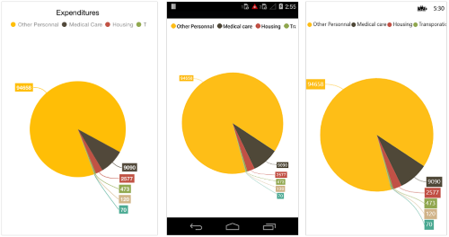

## Customizing marker shapes

Shapes can be added to chart data marker by setting the [`ShowMarker`](https://help.syncfusion.com/cr/xamarin/Syncfusion.SfChart.XForms.ChartDataMarker.html#Syncfusion_SfChart_XForms_ChartDataMarker_ShowMarker) property to `true`. There are different shapes you can set to the chart using [`MarkerType`](https://help.syncfusion.com/cr/xamarin/Syncfusion.SfChart.XForms.ChartDataMarker.html#Syncfusion_SfChart_XForms_ChartDataMarker_MarkerType) property such as [`Triangle`](https://help.syncfusion.com/cr/xamarin/Syncfusion.SfChart.XForms.DataMarkerType.html), [`Circle`](https://help.syncfusion.com/cr/xamarin/Syncfusion.SfChart.XForms.DataMarkerType.html), [`Diamond`](https://help.syncfusion.com/cr/xamarin/Syncfusion.SfChart.XForms.DataMarkerType.html) etc. Following properties are used to customize marker appearance,

* [`MarkerWidth`](https://help.syncfusion.com/cr/xamarin/Syncfusion.SfChart.XForms.ChartDataMarker.html#Syncfusion_SfChart_XForms_ChartDataMarker_MarkerWidth) - used to change the width of the marker
* [`MarkerHeight`](https://help.syncfusion.com/cr/xamarin/Syncfusion.SfChart.XForms.ChartDataMarker.html#Syncfusion_SfChart_XForms_ChartDataMarker_MarkerHeight) - used to change the height of the marker
* [`MarkerColor`](https://help.syncfusion.com/cr/xamarin/Syncfusion.SfChart.XForms.ChartDataMarker.html#Syncfusion_SfChart_XForms_ChartDataMarker_MarkerColor) - used to change the color of the marker
* [`MarkerBorderColor`](https://help.syncfusion.com/cr/xamarin/Syncfusion.SfChart.XForms.ChartDataMarker.html#Syncfusion_SfChart_XForms_ChartDataMarker_MarkerBorderColor) - used to change the border color of the shape
* [`MarkerBorderWidth`](https://help.syncfusion.com/cr/xamarin/Syncfusion.SfChart.XForms.ChartDataMarker.html#Syncfusion_SfChart_XForms_ChartDataMarker_MarkerBorderWidth) – used to change the marker border thickness

The following code example shows how to enable marker and specify its types,

 



<chart:LineSeries.DataMarker>

	<chart:ChartDataMarker ShowLabel="False" 
						   ShowMarker="True"
						   MarkerType="Hexagon"
						   MarkerWidth="20" 
						   MarkerHeight="20"
						   MarkerColor="Aqua" 
						   MarkerBorderColor="Red"
						   MarkerBorderWidth="2"/>

</chart:LineSeries.DataMarker>



  

lineSeries.DataMarker = new ChartDataMarker();

lineSeries.DataMarker.ShowLabel = false;

lineSeries.DataMarker.ShowMarker = true;

lineSeries.DataMarker.MarkerType = DataMarkerType.Hexagon;

lineSeries.DataMarker.MarkerWidth = 20;

lineSeries.DataMarker.MarkerHeight = 20;

lineSeries.DataMarker.MarkerColor = Color.Aqua;

lineSeries.DataMarker.MarkerBorderColor = Color.Red;

lineSeries.DataMarker.MarkerBorderWidth = 2;





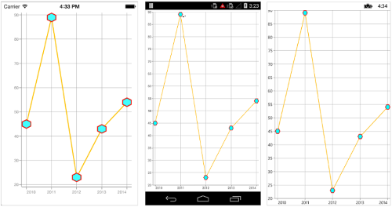

## Apply series color

The [`UseSeriesPalette`](https://help.syncfusion.com/cr/xamarin/Syncfusion.SfChart.XForms.ChartDataMarker.html#Syncfusion_SfChart_XForms_ChartDataMarker_UseSeriesPalette) property is used to apply the series color to background color of data marker labels. The default value of this property is true.

 



<chart:ColumnSeries>

	<chart:ColumnSeries.DataMarker>

		<chart:ChartDataMarker UseSeriesPalette="False"/>

	</chart:ColumnSeries.DataMarker>

</chart:ColumnSeries>





columnSeries.DataMarker = new ChartDataMarker();
columnSeries.DataMarker.UseSeriesPalette = false;





## Connector line

This feature is used to connect label and data point using a line. It can be enabled for any chart types but this is often used with Pie and Doughnut chart types. The [`ConnectorLineStyle`](https://help.syncfusion.com/cr/xamarin/Syncfusion.SfChart.XForms.ChartDataMarker.html#Syncfusion_SfChart_XForms_ChartDataMarker_ConnectorLineStyle) property used to customize the connector line.

* [`StrokeColor`](https://help.syncfusion.com/cr/xamarin/Syncfusion.SfChart.XForms.ChartLineStyle.html#Syncfusion_SfChart_XForms_ChartLineStyle_StrokeColor) – used to change the color of the line
* [`StrokeWidth`](https://help.syncfusion.com/cr/xamarin/Syncfusion.SfChart.XForms.ChartLineStyle.html#Syncfusion_SfChart_XForms_ChartLineStyle_StrokeWidth) – used to change the stroke thickness of the line
* [`StrokeDashArray`](https://help.syncfusion.com/cr/xamarin/Syncfusion.SfChart.XForms.ChartLineStyle.html#Syncfusion_SfChart_XForms_ChartLineStyle_StrokeDashArray) – used to set the dashes for the line
* [`ConnectorHeight`](https://help.syncfusion.com/cr/xamarin/Syncfusion.SfChart.XForms.ConnectorLineStyle.html#Syncfusion_SfChart_XForms_ConnectorLineStyle_ConnectorHeight) - used to set the height of the line.
* [`ConnectorRotationAngle`](https://help.syncfusion.com/cr/xamarin/Syncfusion.SfChart.XForms.ConnectorLineStyle.html#Syncfusion_SfChart_XForms_ConnectorLineStyle_ConnectorRotationAngle) - used to set the rotation angle of the line.

The following code illustrates how to specify the connector height and its angle,

 


      
<chart:LineSeries.DataMarker>

	<chart:ChartDataMarker>

		<chart:ChartDataMarker.ConnectorLineStyle>

			<chart:ConnectorLineStyle ConnectorHeight="50"
									  ConnectorRotationAngle="175" 
									  StrokeColor="Blue"
									  StrokeWidth="3"/>

		</chart:ChartDataMarker.ConnectorLineStyle>

	</chart:ChartDataMarker>

</chart:LineSeries.DataMarker>





lineSeries.DataMarker.ConnectorLineStyle.ConnectorHeight = 50;

lineSeries.DataMarker.ConnectorLineStyle.ConnectorRotationAngle = 175;

lineSeries.DataMarker.ConnectorLineStyle.StrokeColor = Color.Blue;

lineSeries.DataMarker.ConnectorLineStyle.StrokeWidth = 3;

lineSeries.DataMarker.ConnectorLineStyle.StrokeDashArray = new double[2] { 2, 3 };





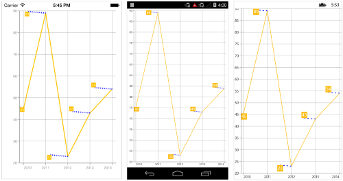

N> For Pie and Doughnut series, you can set different connector line types such as [`Line`](https://help.syncfusion.com/cr/xamarin/Syncfusion.SfChart.XForms.ConnectorLineType.html), [`StraightLine`](https://help.syncfusion.com/cr/xamarin/Syncfusion.SfChart.XForms.ConnectorLineType.html) and  [`Bezier`](https://help.syncfusion.com/cr/xamarin/Syncfusion.SfChart.XForms.ConnectorLineType.html) curve using the [`ConnectorType`](https://help.syncfusion.com/cr/xamarin/Syncfusion.SfChart.XForms.CircularSeries.html#Syncfusion_SfChart_XForms_CircularSeries_ConnectorLineType) property of pie and doughnut series.

## Label template

You can customize the appearance of the data marker label with your own template using the [`LabelTemplate`](https://help.syncfusion.com/cr/xamarin/Syncfusion.SfChart.XForms.ChartDataMarker.html#Syncfusion_SfChart_XForms_ChartDataMarker_LabelTemplate) property of [`ChartDataMarker`](https://help.syncfusion.com/cr/xamarin/Syncfusion.SfChart.XForms.ChartDataMarker.html).

N> The BindingContext of template is the corresponding underlying model provided in the items source of chart series.You can also bind the corresponding [`ChartDataMarkerLabel`](https://help.syncfusion.com/cr/xamarin/Syncfusion.SfChart.XForms.ChartDataMarkerLabel.html) class object using the [`LabelContent`](https://help.syncfusion.com/cr/xamarin/Syncfusion.SfChart.XForms.ChartDataMarker.html#Syncfusion_SfChart_XForms_ChartDataMarker_LabelContent) property set as [`DataMarkerLabel`](http://help.syncfusion.com/cr/xamarin/Syncfusion.SfChart.XForms.LabelContent.html).

 



<ContentPage.Resources>
    <ResourceDictionary>
        <DataTemplate x:Key="dataMarkerTemplate">
            <StackLayout Orientation="Horizontal">
                <Label Text="{Binding Value}" VerticalOptions="Center" FontSize = "15"/>
                <Image Source="Down.jpg" WidthRequest="30" HeightRequest="30"/>
            </StackLayout>
        </DataTemplate>    
    </ResourceDictionary>
</ContentPage.Resources>

<chart:SfChart.Series>
    <chart:BarSeries ItemsSource="{Binding Data}" XBindingPath="Name" YBindingPath="Value">
        <chart:BarSeries.DataMarker>
            <chart:ChartDataMarker ShowLabel="True" LabelTemplate="{StaticResource dataMarkerTemplate}">
                <chart:ChartDataMarker.LabelStyle>
                    <chart:DataMarkerLabelStyle LabelPosition="Outer" />
                </chart:ChartDataMarker.LabelStyle>  
            </chart:ChartDataMarker>
        </chart:BarSeries.DataMarker>
    </chart:BarSeries>
</chart:SfChart.Series>





SfChart chart = new SfChart ();
...

var barSeries = new BarSeries();
barSeries.Color = Color.FromRgb(231, 87, 89);
barSeries.ItemsSource = Data;
barSeries.XBindingPath = "Name";
barSeries.YBindingPath = "Value";
barSeries.DataMarker = new ChartDataMarker();
barSeries.DataMarker.ShowLabel = true;
barSeries.DataMarker.LabelStyle.LabelPosition = DataMarkerLabelPosition.Outer;

DataTemplate dataMarkerTemplate = new DataTemplate(() => 
{
    StackLayout stack = new StackLayout();
    stack.Orientation = StackOrientation.Horizontal;
    Label label = new Label();
    label.SetBinding(Label.TextProperty, "Value");
    label.FontSize = 15;
    label.VerticalOptions = LayoutOptions.Center;
    Image image = new Image();
    image.Source = "Down.jpg";
    image.WidthRequest = 30;
    image.HeightRequest = 30;
    stack.Children.Add(label);
    stack.Children.Add(image);
    return stack;
});

barSeries.DataMarker.LabelTemplate = dataMarkerTemplate;
chart.Series.Add(barSeries);





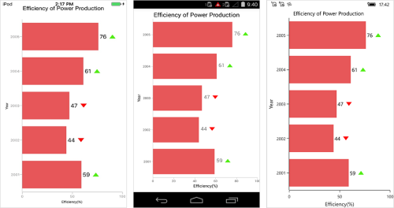

## Event

### DataMarkerLabelCreated

The [`DataMarkerLabelCreated`](https://help.syncfusion.com/cr/xamarin/Syncfusion.SfChart.XForms.ChartSeries.html) event occurs when the data marker label is created. This argument contains object of the [`ChartDataMarkerLabel`](https://help.syncfusion.com/cr/xamarin/Syncfusion.SfChart.XForms.ChartDataMarkerLabel.html). The following properties are available in [`DataMarkerLabel`](https://help.syncfusion.com/cr/xamarin/Syncfusion.SfChart.XForms.ChartDataMarkerLabelCreatedEventArgs.html#Syncfusion_SfChart_XForms_ChartDataMarkerLabelCreatedEventArgs_DataMarkerLabel) to customize the appearance of data markers based on condition.

* [`Label`](https://help.syncfusion.com/cr/xamarin/Syncfusion.SfChart.XForms.ChartDataMarkerLabel.html#Syncfusion_SfChart_XForms_ChartDataMarkerLabel_Label) – Gets or sets the text of data marker.
* [`BackgroundColor`](https://help.syncfusion.com/cr/xamarin/Syncfusion.SfChart.XForms.ChartDataMarkerLabel.html#Syncfusion_SfChart_XForms_ChartDataMarkerLabel_BackgroundColor) – Gets the background color of data marker label.
* [`Index`](https://help.syncfusion.com/cr/xamarin/Syncfusion.SfChart.XForms.ChartDataMarkerLabel.html#Syncfusion_SfChart_XForms_ChartDataMarkerLabel_Index) – Gets the data point index of data marker label.
* [`XPosition`](https://help.syncfusion.com/cr/xamarin/Syncfusion.SfChart.XForms.ChartDataMarkerLabel.html#Syncfusion_SfChart_XForms_ChartDataMarkerLabel_XPosition) – Gets the x-position of data marker label.
* [`YPosition`](https://help.syncfusion.com/cr/xamarin/Syncfusion.SfChart.XForms.ChartDataMarkerLabel.html#Syncfusion_SfChart_XForms_ChartDataMarkerLabel_YPosition) – Gets the y-position of data marker label.
* [`LabelStyle`](https://help.syncfusion.com/cr/xamarin/Syncfusion.SfChart.XForms.ChartDataMarkerLabel.html#Syncfusion_SfChart_XForms_ChartDataMarkerLabel_LabelStyle) – Gets or sets the label style to customize the appearance of individual data marker label.
* [`MarkerWidth`](https://help.syncfusion.com/cr/xamarin/Syncfusion.SfChart.XForms.ChartDataMarkerLabel.html#Syncfusion_SfChart_XForms_ChartDataMarkerLabel_MarkerWidth) – Gets or sets the marker width.
* [`MarkerHeight`](https://help.syncfusion.com/cr/xamarin/Syncfusion.SfChart.XForms.ChartDataMarkerLabel.html#Syncfusion_SfChart_XForms_ChartDataMarkerLabel_MarkerHeight) – Gets or sets the marker height.
* [`MarkerBorderWidth`](https://help.syncfusion.com/cr/xamarin/Syncfusion.SfChart.XForms.ChartDataMarkerLabel.html#Syncfusion_SfChart_XForms_ChartDataMarkerLabel_MarkerBorderWidth) – Gets or sets the border width of marker symbol.
* [`MarkerBorderColor`](https://help.syncfusion.com/cr/xamarin/Syncfusion.SfChart.XForms.ChartDataMarkerLabel.html#Syncfusion_SfChart_XForms_ChartDataMarkerLabel_MarkerBorderColor) – Gets or sets the border color of marker symbol.
* [`MarkerColor`](https://help.syncfusion.com/cr/xamarin/Syncfusion.SfChart.XForms.ChartDataMarkerLabel.html#Syncfusion_SfChart_XForms_ChartDataMarkerLabel_MarkerColor) – Gets or sets the marker color.
* [`MarkerType`](https://help.syncfusion.com/cr/xamarin/Syncfusion.SfChart.XForms.ChartDataMarkerLabel.html#Syncfusion_SfChart_XForms_ChartDataMarkerLabel_MarkerType) – Gets or sets the shape type of marker. The available shapes are ellipse, diamond, hexagon, cross, HorizontalLine, VerticalLine, InvertedTriangle, triangle, pentagon, plus, and square.
* [`Data`](https://help.syncfusion.com/cr/xamarin/Syncfusion.SfChart.XForms.ChartDataMarkerLabel.html#Syncfusion_SfChart_XForms_ChartDataMarkerLabel_Data) - Gets the underlying data of data marker label.

## See also

[How to add a custom data marker in Xamarin.Forms Chart](https://www.syncfusion.com/kb/10922/how-to-add-a-custom-data-marker-in-xamarin-forms-chart)

[How to rotate the data marker labels](https://www.syncfusion.com/kb/5740/how-to-rotate-the-data-marker-labels)

[How to change the data marker connector type of pie and doughnut series to Bezier](https://www.syncfusion.com/kb/5526/how-to-change-the-data-marker-connector-type-of-pie-and-doughnut-series-to-bezier)

[How to change the data marker symbol type in Chart](https://www.syncfusion.com/kb/5866/how-to-change-the-data-marker-symbol-type-in-chart)

[How to add the icons on top of each column/bar segment in Xamarin.Forms Chart](https://www.syncfusion.com/kb/9313/how-to-add-the-icons-on-top-of-each-column-bar-segment-in-xamarin-forms-chart)

[How to display underlying model values in Xamarin.Forms Chart data marker](https://www.syncfusion.com/kb/8714/how-to-display-underlying-model-values-in-xamarin-forms-chart-data-marker)

[How to place the Xamarin.Forms Chart DataMarker label at the top and bottom of the marker alternatively](https://www.syncfusion.com/kb/10683/how-to-place-the-xamarin-forms-chart-datamarker-label-at-the-top-and-bottom-of-the-marker)

