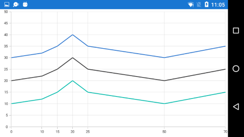

# Adding custom labels to SfChart axis

To add a custom label to chart axis, write a class derived from NumericalAxis class. You need to override the [`OnCreatedLabels`](https://help.syncfusion.com/cr/xamarin/Syncfusion.SfChart.XForms.ChartAxis.html#Syncfusion_SfChart_XForms_ChartAxis_OnCreateLabels) method, which will be called whenever new labels are generated, and add, remove, or modify the labels using the [`VisibleLabels`](https://help.syncfusion.com/cr/xamarin/Syncfusion.SfChart.XForms.ChartAxis.html#Syncfusion_SfChart_XForms_ChartAxis_VisibleLabels) property.

The following code sample demonstrates this.



public class NumericalAxisExt : NumericalAxis
{
    protected override void OnCreateLabels()
    {
        base.OnCreateLabels();
		
        //Using VisibleLabels collection you can define your custom labels
        VisibleLabels.Clear();
        ViewModel viewModel = BindingContext as ViewModel;

        for (int i = 0; i < viewModel.Data.Count; i++)
        {
            var data = viewModel.Data[i];
            VisibleLabels.Add(new ChartAxisLabel(data.XValue, data.XValue.ToString()));
        }
    }
}



N>
- This is applicable for all types of axis.
- Labels are rendered only if the label position presents within the visible range.
- The labels should be created only if users call the base of [`OnCreateLabels`](https://help.syncfusion.com/cr/xamarin/Syncfusion.SfChart.XForms.ChartAxis.html#Syncfusion_SfChart_XForms_ChartAxis_OnCreateLabels).