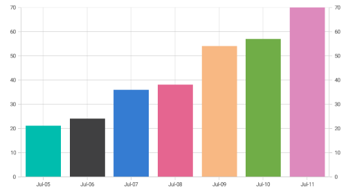

# Adding duplicate axis in SfChart

Duplicate axis can be added in the [`SfChart`](https://help.syncfusion.com/cr/xamarin/Syncfusion.SfChart.XForms.SfChart.html) using the chart [`Axes`](https://help.syncfusion.com/cr/xamarin/Syncfusion.SfChart.XForms.SfChart.html#Syncfusion_SfChart_XForms_SfChart_Axes) collection property. The axis added in the [`Axes`](https://help.syncfusion.com/cr/xamarin/Syncfusion.SfChart.XForms.SfChart.html#Syncfusion_SfChart_XForms_SfChart_Axes) collection will be aligned to the horizontal position by default. The axis position can be changed using the [`IsVertical`](https://help.syncfusion.com/cr/xamarin/Syncfusion.SfChart.XForms.ChartAxis.html#Syncfusion_SfChart_XForms_ChartAxis_IsVertical) bool property of [`ChartAxis`](https://help.syncfusion.com/cr/xamarin/Syncfusion.SfChart.XForms.ChartAxis.html). When the [`IsVertical`](https://help.syncfusion.com/cr/xamarin/Syncfusion.SfChart.XForms.ChartAxis.html#Syncfusion_SfChart_XForms_ChartAxis_IsVertical) property is set true, the axis will be placed vertically and vice versa.

The following code sample demonstrates this.



SfChart chart = new SfChart();

. . .

chart.Axes.Add(new NumericalAxis()
{
    Minimum = 0,
    Maximum = 70,
    IsVertical = true,
    OpposedPosition = true
});



N> 
- The [`ChartAxis`](https://help.syncfusion.com/cr/xamarin/Syncfusion.SfChart.XForms.ChartAxis.html) added in the [`Axes`](https://help.syncfusion.com/cr/xamarin/Syncfusion.SfChart.XForms.SfChart.html#Syncfusion_SfChart_XForms_SfChart_Axes) collection will not be removed until removing it from the [`Axes`](https://help.syncfusion.com/cr/xamarin/Syncfusion.SfChart.XForms.SfChart.html#Syncfusion_SfChart_XForms_SfChart_Axes) collection. 
- The [`Axes`](https://help.syncfusion.com/cr/xamarin/Syncfusion.SfChart.XForms.SfChart.html#Syncfusion_SfChart_XForms_SfChart_Axes) collection does not support the clear method. 
- Same axis cannot be added more than once in [`Axes`](https://help.syncfusion.com/cr/xamarin/Syncfusion.SfChart.XForms.SfChart.html#Syncfusion_SfChart_XForms_SfChart_Axes); only distinct axis will be added to the [`Axes`](https://help.syncfusion.com/cr/xamarin/Syncfusion.SfChart.XForms.SfChart.html#Syncfusion_SfChart_XForms_SfChart_Axes) collection.
