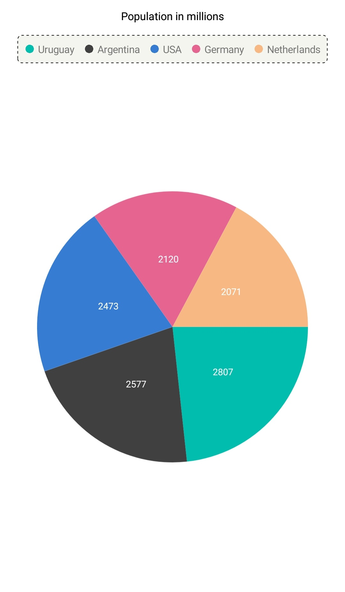
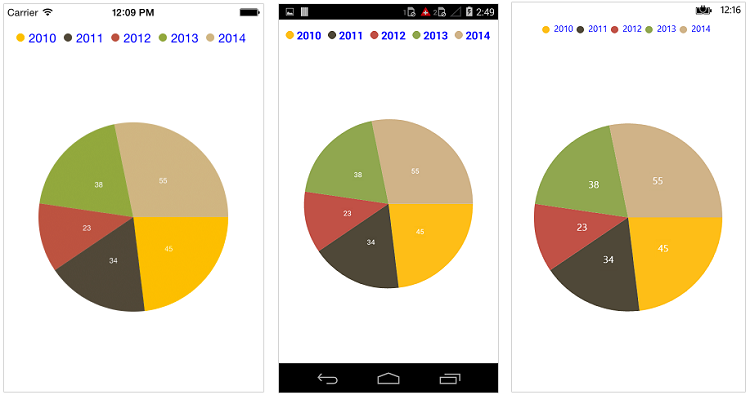
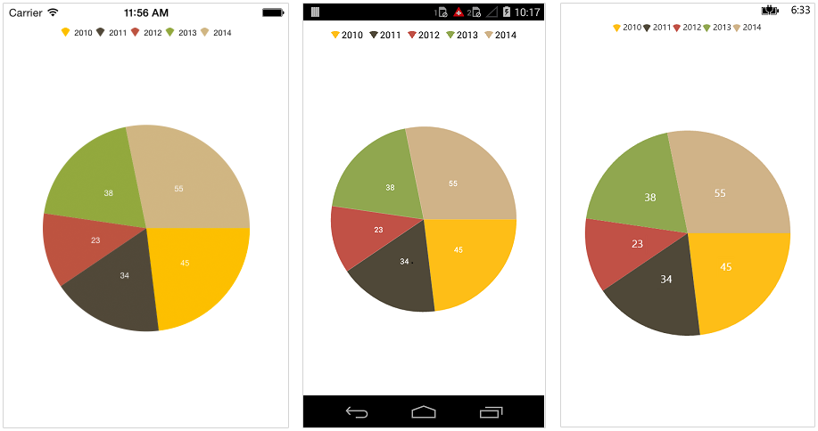
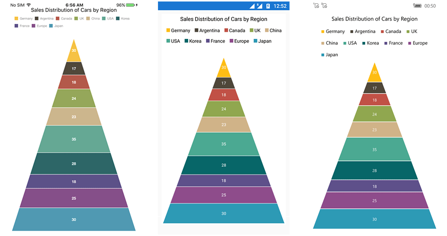
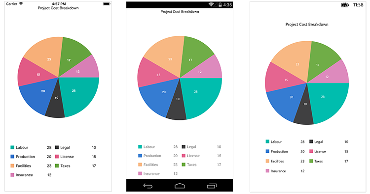

# Legend in Xamarin Charts (SfChart)

The [`Legend`](https://help.syncfusion.com/cr/xamarin/Syncfusion.SfChart.XForms.ChartLegend.html) contains list of chart series/data points in chart. The information provided in each legend item helps to identify the corresponding data series in chart.

The following code example shows how to enable legend in chart.

 



<chart:SfChart>

	<chart:SfChart.Legend>

		<chart:ChartLegend/>

	</chart:SfChart.Legend>

</chart:SfChart>





chart.Legend = new ChartLegend();





## Customizing background & border

The [`Legend`](https://help.syncfusion.com/cr/xamarin/Syncfusion.SfChart.XForms.ChartLegend.html) provides following properties to customize the legend area border and background. 

* [`BackgroundColor`](https://help.syncfusion.com/cr/xamarin/Syncfusion.SfChart.XForms.ChartLegend.html#Syncfusion_SfChart_XForms_ChartLegend_BackgroundColor) - used to change legend background color.
* [`StrokeColor`](https://help.syncfusion.com/cr/xamarin/Syncfusion.SfChart.XForms.ChartLegend.html#Syncfusion_SfChart_XForms_ChartLegend_StrokeColor) - used to change legend border color.
* [`StrokeWidth`](https://help.syncfusion.com/cr/xamarin/Syncfusion.SfChart.XForms.ChartLegend.html#Syncfusion_SfChart_XForms_ChartLegend_StrokeWidth) - used to change legend border width 
* [`StrokeDashArray`](https://help.syncfusion.com/cr/xamarin/Syncfusion.SfChart.XForms.ChartLegend.html#Syncfusion_SfChart_XForms_ChartLegend_StrokeDashArray) - used to render legend border line with dashes.
* [`Margin`](https://help.syncfusion.com/cr/xamarin/Syncfusion.SfChart.XForms.ChartLegend.html#Syncfusion_SfChart_XForms_ChartLegend_Margin) - used to change legend panel margin with legend border.
* [`CornerRadius`](https://help.syncfusion.com/cr/xamarin/Syncfusion.SfChart.XForms.ChartLegend.html#Syncfusion_SfChart_XForms_ChartLegend_CornerRadius) - used to add the rounded corners to the legend border rectangle. The TopLeft, TopRight, BottomLeft and BottomRight of ChartCornerRadius properties are used to set the radius value for each corner.

 



xmlns:sys="clr-namespace:System;assembly=mscorlib" 
xmlns:x="http://schemas.microsoft.com/winfx/2009/xaml"  
xmlns:chart="clr-namespace:Syncfusion.SfChart.XForms;assembly=Syncfusion.SfChart.XForms" 

...  

<chart:SfChart>

	<chart:SfChart.Legend>

		 <chart:ChartLegend StrokeColor="Black" CornerRadius="5" StrokeWidth="2"
                                    BackgroundColor="#f5f5f0" Margin="5">

                        <chart:ChartLegend.StrokeDashArray>
                            <x:Array Type="{x:Type sys:Double}">
                                <sys:Double>3</sys:Double>
                                <sys:Double>3</sys:Double>
                            </x:Array>
                        </chart:ChartLegend.StrokeDashArray>

                    </chart:ChartLegend>

	</chart:SfChart.Legend>

</chart:SfChart>





 ChartLegend legend = new ChartLegend();
 legend.BackgroundColor = Color.FromRgb(245, 245, 240);
 legend.Stroke = Color.Black;
 legend.StrokeWidth = 2;
 legend.Margin = new Thickness(5);
 legend.CornerRadius = new ChartCornerRadius(5);
 legend.StrokeDashArray = new double[] { 3, 3 };

 chart.Legend = legend;





## Customizing labels

The [`Label`](https://help.syncfusion.com/cr/xamarin/Syncfusion.SfChart.XForms.ChartSeries.html#Syncfusion_SfChart_XForms_ChartSeries_Label) property of [`ChartSeries`](https://help.syncfusion.com/cr/xamarin/Syncfusion.SfChart.XForms.ChartSeries.html) is used to define the label for the corresponding series legend item. The appearance of the label can be customized using the [`LabelStyle`](https://help.syncfusion.com/cr/xamarin/Syncfusion.SfChart.XForms.ChartLegend.html#Syncfusion_SfChart_XForms_ChartLegend_LabelStyle) property. 

* [`TextColor`](https://help.syncfusion.com/cr/xamarin/Syncfusion.SfChart.XForms.ChartLegendLabelStyle.html#Syncfusion_SfChart_XForms_ChartLegendLabelStyle_TextColor) – used to change the color of the label.
* [`Font`](https://help.syncfusion.com/cr/xamarin/Syncfusion.SfChart.XForms.ChartLegendLabelStyle.html#Syncfusion_SfChart_XForms_ChartLegendLabelStyle_Font) – used to change the text size, font family, and font weight.
* [`Margin`](https://help.syncfusion.com/cr/xamarin/Syncfusion.SfChart.XForms.ChartLegendLabelStyle.html#Syncfusion_SfChart_XForms_ChartLegendLabelStyle_Margin) - used to change the margin size of labels.

 



<chart:SfChart.Legend>

	<chart:ChartLegend>

		<chart:ChartLegend.LabelStyle>

			<chart:ChartLegendLabelStyle TextColor="Blue" Margin="5" Font="Bold,18"/>

		</chart:ChartLegend.LabelStyle>

	</chart:ChartLegend>

</chart:SfChart.Legend>





chart.Legend = new ChartLegend();

chart.Legend.LabelStyle.TextColor = Color.Blue;

chart.Legend.LabelStyle.Font = Font.SystemFontOfSize(18, FontAttributes.Bold);

chart.Legend.LabelStyle.Margin = 5;





## Legend icons

The legend icons are enabled by default. However, you can control its visibility using the [`IsIconVisible`](https://help.syncfusion.com/cr/xamarin/Syncfusion.SfChart.XForms.ChartLegend.html#Syncfusion_SfChart_XForms_ChartLegend_IsIconVisible) property. The icon type also can be specified using the [`LegendIcon`](https://help.syncfusion.com/cr/xamarin/Syncfusion.SfChart.XForms.ChartSeries.html#Syncfusion_SfChart_XForms_ChartSeries_LegendIcon) property such as [`Rectangle`](https://help.syncfusion.com/cr/xamarin/Syncfusion.SfChart.XForms.ChartLegendIcon.html), [`Circle`](https://help.syncfusion.com/cr/xamarin/Syncfusion.SfChart.XForms.ChartLegendIcon.html) and [`Diamond`](https://help.syncfusion.com/cr/xamarin/Syncfusion.SfChart.XForms.ChartLegendIcon.html), etc., The [`IconWidth`](https://help.syncfusion.com/cr/xamarin/Syncfusion.SfChart.XForms.ChartLegend.html#Syncfusion_SfChart_XForms_ChartLegend_IconWidth) and [`IconHeight`](https://help.syncfusion.com/cr/xamarin/Syncfusion.SfChart.XForms.ChartLegend.html#Syncfusion_SfChart_XForms_ChartLegend_IconHeight) properties are used to adjust the width and height of the legend icons, respectively.

 



<chart:SfChart>

	<chart:SfChart.Legend>

		<chart:ChartLegend IsIconVisible="True" IconHeight="20" IconWidth="20"/>

	</chart:SfChart.Legend>

	<chart:PieSeries ItemsSource ="{Binding Data1}" LegendIcon="SeriesType"/>

</chart:SfChart>





chart.Legend = new ChartLegend();

chart.Legend.IconHeight = 20;

chart.Legend.IconWidth = 20;

chart.Legend.IsIconVisible = true;

pieSeries.LegendIcon = ChartLegendIcon.SeriesType;





## Legend title

The following properties are used to define and customize the [`Title`](https://help.syncfusion.com/cr/xamarin/Syncfusion.SfChart.XForms.ChartLegend.html#Syncfusion_SfChart_XForms_ChartLegend_Title) of legend.

* [`Text`](https://help.syncfusion.com/cr/xamarin/Syncfusion.SfChart.XForms.ChartTitle.html#Syncfusion_SfChart_XForms_ChartTitle_Text) – used to change the text of the title.
* [`TextColor`](https://help.syncfusion.com/cr/xamarin/Syncfusion.SfChart.XForms.ChartTitle.html#Syncfusion_SfChart_XForms_ChartTitle_TextColor) – used to change the color of the title text.
* [`Font`](https://help.syncfusion.com/cr/xamarin/Syncfusion.SfChart.XForms.ChartTitle.html#Syncfusion_SfChart_XForms_ChartTitle_Font) – used to change the text size, font family, and font weight of the title. (This is deprecated API. Use FontSize, FontFamily, and FontAttributes properties instead of this.)
* [`FontFamily`](https://help.syncfusion.com/cr/xamarin/Syncfusion.SfChart.XForms.ChartLegendLabelStyle.html#Syncfusion_SfChart_XForms_ChartLegendLabelStyle_FontFamily) - used to change the font family for the legend label. 
* [`FontAttributes`](https://help.syncfusion.com/cr/xamarin/Syncfusion.SfChart.XForms.ChartLegendLabelStyle.html#Syncfusion_SfChart_XForms_ChartLegendLabelStyle_FontAttributes) - used to change the font style for the legend label. 
* [`FontSize`](https://help.syncfusion.com/cr/xamarin/Syncfusion.SfChart.XForms.ChartLegendLabelStyle.html#Syncfusion_SfChart_XForms_ChartLegendLabelStyle_FontSize) - used to change the font size for the legend label.
* [`Margin`](https://help.syncfusion.com/cr/xamarin/Syncfusion.SfChart.XForms.ChartTitle.html#Syncfusion_SfChart_XForms_ChartTitle_Margin) – used to change the margin size of title.
* [`TextAlignment`](https://help.syncfusion.com/cr/xamarin/Syncfusion.SfChart.XForms.ChartTitle.html#Syncfusion_SfChart_XForms_ChartTitle_TextAlignment) – used to change the alignment of the title text; it can be start, end, or center.
* [`BackgroundColor`](https://help.syncfusion.com/cr/xamarin/Syncfusion.SfChart.XForms.ChartTitle.html#Syncfusion_SfChart_XForms_ChartTitle_BackgroundColor) – used to change the title background color.
* [`BorderColor`](https://help.syncfusion.com/cr/xamarin/Syncfusion.SfChart.XForms.ChartTitle.html#Syncfusion_SfChart_XForms_ChartTitle_BorderColor) – used to change the border color.
* [`BorderWidth`](https://help.syncfusion.com/cr/xamarin/Syncfusion.SfChart.XForms.ChartTitle.html#Syncfusion_SfChart_XForms_ChartTitle_BorderWidth) – used to adjust the border width of title.

 



<chart:SfChart.Legend>

	<chart:ChartLegend>

		<chart:ChartLegend.Title >

			<chart:ChartTitle Text="Years" TextColor="Maroon" TextAlignment="Center" 
							  BackgroundColor="Silver" BorderWidth="3" BorderColor="Blue" Font="Bold,20"/>

			</chart:ChartTitle>

		</chart:ChartLegend.Title>

	</chart:ChartLegend>

</chart:SfChart.Legend>





chart.Legend = new ChartLegend();

chart.Legend.Title.Text = "Year";

chart.Legend.Title.TextColor = Color.Maroon;

chart.Legend.Title.Font = Font.SystemFontOfSize(20, FontAttributes.Bold);

chart.Legend.Title.TextAlignment = TextAlignment.Center;

chart.Legend.Title.BackgroundColor = Color.Silver;

chart.Legend.Title.BorderWidth = 3;

chart.Legend.Title.BorderColor = Color.Blue;





## Toggle the series visibility

You can control the visibility of the series by tapping the legend item. You can enable this feature by enabling the [`ToggleSeriesVisibility`](https://help.syncfusion.com/cr/xamarin/Syncfusion.SfChart.XForms.ChartLegend.html#Syncfusion_SfChart_XForms_ChartLegend_ToggleSeriesVisibility) property.

 



<chart:SfChart>

	<chart:SfChart.Legend>

		<chart:ChartLegend ToggleSeriesVisibility="True"/>

	</chart:SfChart.Legend>

</chart:SfChart>





chart.Legend = new ChartLegend();

chart.Legend.ToggleSeriesVisibility = true;





## Legend visibility

The [`IsVisible`](https://help.syncfusion.com/cr/xamarin/Syncfusion.SfChart.XForms.ChartLegend.html#Syncfusion_SfChart_XForms_ChartLegend_IsVisible) property of `ChartLegend` is used to toggle the visibility of legend.

 



<chart:SfChart>

	<chart:SfChart.Legend>

		<chart:ChartLegend IsVisible="False"/>

	</chart:SfChart.Legend>

</chart:SfChart>





chart.Legend = new ChartLegend();

chart.Legend.IsVisible = false;





## Legend item visibility

You can control the visibility of a particular series' legend item using the [`IsVisibleOnLegend`](https://help.syncfusion.com/cr/xamarin/Syncfusion.SfChart.XForms.ChartSeries.html#Syncfusion_SfChart_XForms_ChartSeries_IsVisibleOnLegend) property of series. The default value of the [`IsVisibleOnLegend`](https://help.syncfusion.com/cr/xamarin/Syncfusion.SfChart.XForms.ChartSeries.html#Syncfusion_SfChart_XForms_ChartSeries_IsVisibleOnLegend) property is true.

 



<chart:ColumnSeries ItemsSource="{Binding ColumnData}" XBindingPath="Name" 
				YBindingPath="Value" IsVisibleOnLegend="true" > 
</chart:ColumnSeries>





ColumnSeries column = new ColumnSeries();

column.XBindingPath = "Name";

column.YBindingPath = "Value";

column.ItemsSource = viewModel.ColumnData;

column.IsVisibleOnLegend = true;





### Item margin

The [`ItemMargin`](https://help.syncfusion.com/cr/xamarin/Syncfusion.SfChart.XForms.ChartLegend.html#Syncfusion_SfChart_XForms_ChartLegend_ItemMargin) property is used to set the spacing between the legend items.

 



<chart:SfChart.Legend>

    <chart:ChartLegend ItemMargin="20"/>

</chart:SfChart.Legend>





chart.Legend = new ChartLegend();

chart.Legend.ItemMargin = 20;





## Legend wrap

The legend items can be placed in multiple rows using the [`OverflowMode`](https://help.syncfusion.com/cr/xamarin/Syncfusion.SfChart.XForms.ChartLegend.html#Syncfusion_SfChart_XForms_ChartLegend_OverflowMode) property if size of the total legend exceeds the available size. The default value of the [`OverflowMode`](https://help.syncfusion.com/cr/xamarin/Syncfusion.SfChart.XForms.ChartLegend.html#Syncfusion_SfChart_XForms_ChartLegend_OverflowMode) property is [`Scroll`](https://help.syncfusion.com/cr/xamarin/Syncfusion.SfChart.XForms.ChartLegendOverflowMode.html).





<chart:SfChart.Legend>

    <chart:ChartLegend OverflowMode="Wrap"/>

</chart:SfChart.Legend>





chart.Legend = new ChartLegend()
{
    OverflowMode = ChartLegendOverflowMode.Wrap
};





### Legend width

The legend width can be specified using the [`MaxWidth`](https://help.syncfusion.com/cr/xamarin/Syncfusion.SfChart.XForms.ChartLegend.html#Syncfusion_SfChart_XForms_ChartLegend_MaxWidth) property. This property works only  when the [`OverflowMode`](https://help.syncfusion.com/cr/xamarin/Syncfusion.SfChart.XForms.ChartLegend.html#Syncfusion_SfChart_XForms_ChartLegend_OverflowMode) is [`Wrap`](https://help.syncfusion.com/cr/xamarin/Syncfusion.SfChart.XForms.ChartLegendOverflowMode.html). The default value of the [`MaxWidth`](https://help.syncfusion.com/cr/xamarin/Syncfusion.SfChart.XForms.ChartLegend.html#Syncfusion_SfChart_XForms_ChartLegend_MaxWidth) property is double.NAN.





<chart:SfChart>

    <chart:SfChart.Legend>

        <chart:ChartLegend OverflowMode = “Wrap”  MaxWidth = “750” />

    </chart:SfChart.Legend>

</chart:SfChart>





chart.Legend = new ChartLegend()
{
    OverflowMode = ChartLegendOverflowMode.Wrap,

    MaxWidth = 750
};





## Positioning the legend

You can position the legend anywhere inside the chart. The following properties are used to customize the position of legend:

* [`DockPosition`](https://help.syncfusion.com/cr/xamarin/Syncfusion.SfChart.XForms.ChartLegend.html#Syncfusion_SfChart_XForms_ChartLegend_DockPosition) – used to position the legend relatively. The available options are [`Left`](https://help.syncfusion.com/cr/xamarin/Syncfusion.SfChart.XForms.LegendPlacement.html), [`Right`](https://help.syncfusion.com/cr/xamarin/Syncfusion.SfChart.XForms.LegendPlacement.html), [`Top`](https://help.syncfusion.com/cr/xamarin/Syncfusion.SfChart.XForms.LegendPlacement.html), [`Bottom`](https://help.syncfusion.com/cr/xamarin/Syncfusion.SfChart.XForms.LegendPlacement.html), and [`Floating`](https://help.syncfusion.com/cr/xamarin/Syncfusion.SfChart.XForms.LegendPlacement.html). If the DockPosition is Floating, you can position the legend using the x and y-coordinates.
* [`OffsetX`](https://help.syncfusion.com/cr/xamarin/Syncfusion.SfChart.XForms.ChartLegend.html#Syncfusion_SfChart_XForms_ChartLegend_OffsetX) – used to move the legend on x-coordinate by the given offset value.
* [`OffsetY`](https://help.syncfusion.com/cr/xamarin/Syncfusion.SfChart.XForms.ChartLegend.html#Syncfusion_SfChart_XForms_ChartLegend_OffsetY) - used to move the legend on y-coordinate by the given offset value.
* [`Orientation`](https://help.syncfusion.com/cr/xamarin/Syncfusion.SfChart.XForms.ChartLegend.html#Syncfusion_SfChart_XForms_ChartLegend_Orientation) - used to change the orientation of the legend, the default value is Auto, orientation of the legend items will be changed based on its dock position. Also, you can manually set [`Horizontal`](https://help.syncfusion.com/cr/xamarin/Syncfusion.SfChart.XForms.ChartOrientation.html) or [`Vertical`](https://help.syncfusion.com/cr/xamarin/Syncfusion.SfChart.XForms.ChartOrientation.html).

 



<chart:SfChart>

	<chart:SfChart.Legend>

		<chart:ChartLegend DockPosition="Floating" OffsetX="70" OffsetY="90" 
						   Orientation="Vertical">        

	</chart:SfChart.Legend>           

</chart:SfChart>





chart.Legend = new ChartLegend();

chart.Legend.DockPosition = LegendPlacement.Floating;

chart.Legend.Orientation = ChartOrientation.Vertical;

chart.Legend.OffsetX = 70;

chart.Legend.OffsetY = 90;





## Populate the data based legend items for all series

The [`Series`](https://help.syncfusion.com/cr/xamarin/Syncfusion.SfChart.XForms.ChartLegend.html#Syncfusion_SfChart_XForms_ChartLegend_Series) property of [`ChartLegend`](https://help.syncfusion.com/cr/xamarin/Syncfusion.SfChart.XForms.ChartLegend.html) is used to populate the legend items based on the data points which are present in the assigned series. 

The following code example shows how to enable datapoint-based legend for Cartesian series.

 



<chart:SfChart>

…

<chart:ChartLegend x:Name="chartLegend" Series="{Binding Source={ x:Reference Series}}" />

…

<chart:SfChart.Series>
                <chart:ColumnSeries x:Name="Series"    ItemsSource="{Binding CategoryData}" XBindingPath="Name" YBindingPath="Value"/>
…

</chart:SfChart>





...  

ColumnSeries series = new ColumnSeries()
            {
                ItemsSource = model.CategoryData,
                XBindingPath = "XValue",
                YBindingPath = "YValue",
            };

            Chart.Legend = new ChartLegend();
            Chart.Legend.Series = series;
            Chart.Series.Add(series);
...





## ItemTemplate

You can customize the appearance of legend items with your template by using [`ItemTemplate`](https://help.syncfusion.com/cr/xamarin/Syncfusion.SfChart.XForms.ChartLegend.html#Syncfusion_SfChart_XForms_ChartLegend_ItemTemplate) property of [`ChartLegend`](https://help.syncfusion.com/cr/xamarin/Syncfusion.SfChart.XForms.ChartLegend.html).

N> The BindingContext of the template is the corresponding underlying legend item that provided in the ChartLegendItem class.
 
 



<chart:PieSeries ItemsSource="{Binding Data}" XBindingPath="Name" YBindingPath="Value">
    ....                 
</chart:PieSeries>

<chart:SfChart.Legend>

    ....
    <chart:ChartLegend.ItemTemplate>
                    
        <DataTemplate>
            
			<StackLayout Orientation="Horizontal" WidthRequest="143">

                <BoxView Color="{Binding IconColor}" HorizontalOptions="Center" VerticalOptions="Center" HeightRequest="13" WidthRequest="13" />

                <Label FontSize="13" VerticalTextAlignment="Center" Text="{Binding DataPoint.Name}"/>

                <Label HorizontalTextAlignment="End" VerticalTextAlignment="Center" HorizontalOptions="EndAndExpand" FontSize="13" Text="{Binding DataPoint.Value}"/>

            </StackLayout>

        </DataTemplate>
                    
    </chart:ChartLegend.ItemTemplate>

</chart:SfChart.Legend>
		




ChartLegend legend = new ChartLegend();
chart.Legend = legend;
legend.ItemTemplate = new DataTemplate ( () =>
{
    StackLayout stack = new StackLayout()
	{
		  Orientation = StackOrientation.Horizontal, WidthRequest = 143 
	};
   
    BoxView boxView = new BoxView() 
	{
		 HorizontalOptions = LayoutOptions.Center, VerticalOptions = LayoutOptions.Center, WidthRequest = 13, HeightRequest = 13 
	};
	boxView.SetBinding(BoxView.BackgroundColorProperty, "IconColor");

    Label name = new Label() 
	{
		 VerticalTextAlignment = TextAlignment.Center, FontSize = 13 
	};
	name.SetBinding(Label.TextProperty, "DataPoint.Name");

    Label value = new Label() 
	{
		 HorizontalTextAlignment = TextAlignment.End, VerticalTextAlignment = TextAlignment.Center, FontSize = 13 
	};
	value.HorizontalOptions = LayoutOptions.EndAndExpand;
	value.SetBinding(Label.TextProperty, "DataPoint.Value");

    stack.Children.Add(boxView);
    stack.Children.Add(name);
    stack.Children.Add(value);
    return stack;
});





## Event

 **LegendItemClicked**

The [`LegendItemClicked`](https://help.syncfusion.com/cr/xamarin/Syncfusion.SfChart.XForms.SfChart.html) event is triggered when the chart legend item is clicked. This argument contains the following information.

* [`LegendItem`](https://help.syncfusion.com/cr/xamarin/Syncfusion.SfChart.XForms.ChartLegendItemClickedEventArgs.html#Syncfusion_SfChart_XForms_ChartLegendItemClickedEventArgs_LegendItem) – Used to customize the label and appearance of individual legend item. 

**LegendItemCreated**

The [`LegendItemCreated`](https://help.syncfusion.com/cr/xamarin/Syncfusion.SfChart.XForms.SfChart.html) event is triggered when the chart legend item is created. This argument contains the following information.

* [`LegendItem`](https://help.syncfusion.com/cr/xamarin/Syncfusion.SfChart.XForms.ChartLegendItemCreatedEventArgs.html#Syncfusion_SfChart_XForms_ChartLegendItemCreatedEventArgs_LegendItem) – Used to customize the label and appearance of individual legend item.

You can customize the legend item using following properties of [`ChartLegendItem`](https://help.syncfusion.com/cr/xamarin/Syncfusion.SfChart.XForms.ChartLegendItem.html):

* [`Label`](https://help.syncfusion.com/cr/xamarin/Syncfusion.SfChart.XForms.ChartLegendItem.html#Syncfusion_SfChart_XForms_ChartLegendItem_Label) – Get or sets the legend item label.
* [`LabelStyle`](https://help.syncfusion.com/cr/xamarin/Syncfusion.SfChart.XForms.ChartLegendItem.html#Syncfusion_SfChart_XForms_ChartLegendItem_LabelStyle) – Customizes the appearance of legend labels. The properties listed in [`customizing label`](https://help.syncfusion.com/xamarin/sfchart/legend#customizing-labels) can be customized using the `LabelStyle` property.
* [`IconColor`](https://help.syncfusion.com/cr/xamarin/Syncfusion.SfChart.XForms.ChartLegendItem.html#Syncfusion_SfChart_XForms_ChartLegendItem_IconColor) – Gets or sets the legend icon color.
* [`Index`](https://help.syncfusion.com/cr/xamarin/Syncfusion.SfChart.XForms.ChartLegendItem.html#Syncfusion_SfChart_XForms_ChartLegendItem_Index) – Gets the legend item index.
* [`IsEnabled`](https://help.syncfusion.com/cr/xamarin/Syncfusion.SfChart.XForms.ChartLegendItem.html#Syncfusion_SfChart_XForms_ChartLegendItem_IsEnabled) – Gets the visibility of the series if the series is the type of [`CartesianSeries`](https://help.syncfusion.com/cr/xamarin/Syncfusion.SfChart.XForms.CartesianSeries.html) and get the visibility of the data point if the series is type of [`AccumulationSeries`](https://help.syncfusion.com/cr/xamarin/Syncfusion.SfChart.XForms.AccumulationSeries.html).
* [`DataPoint`](https://help.syncfusion.com/cr/xamarin/Syncfusion.SfChart.XForms.ChartLegendItem.html#Syncfusion_SfChart_XForms_ChartLegendItem_DataPoint) – Gets the legend item data point for accumulation series only.
* [`Series`](https://help.syncfusion.com/cr/xamarin/Syncfusion.SfChart.XForms.ChartLegendItem.html#Syncfusion_SfChart_XForms_ChartLegendItem_Series) – Gets respective chart series.

## See also

[How to apply custom fonts in Xamarin.Forms Chart](https://www.syncfusion.com/kb/9388/how-to-apply-custom-fonts-in-xamarin-forms-chart)

[How to customize the individual legend item based on a condition in Xamarin.Forms Chart](https://www.syncfusion.com/kb/9375/how-to-customize-the-individual-legend-item-based-on-a-condition-in-xamarin-forms-chart)

[How to collapse the series through legend](https://www.syncfusion.com/kb/5724/how-to-collapse-the-series-through-legend)

[How to float the legend on chart](https://www.syncfusion.com/kb/5723/how-to-float-the-legend-on-chart)

[How to change the legend icons](https://www.syncfusion.com/kb/5528/how-to-change-the-legend-icons)

[How to change the legend position](https://www.syncfusion.com/kb/5527/how-to-change-the-legend-position)
