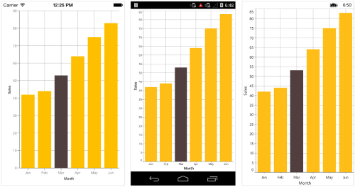
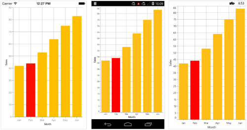
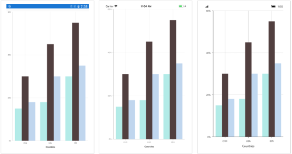

# Selection

[`SfChart`](https://help.syncfusion.com/cr/xamarin/Syncfusion.SfChart.XForms.SfChart.html) supports selection that enables you to select a segment in a series or series itself.

## Data Point Selection

You can select a data point by tapping on it. To enable the selection feature, set [`EnableDataPointSelection`](https://help.syncfusion.com/cr/xamarin/Syncfusion.SfChart.XForms.ChartSeries.html#Syncfusion_SfChart_XForms_ChartSeries_EnableDataPointSelection) property as `true` for [`Series`](https://help.syncfusion.com/cr/xamarin/Syncfusion.SfChart.XForms.ChartSeries.html). 

 



<chart:ColumnSeries EnableDataPointSelection="True" ItemsSource ="{Binding Data}" XBindingPath="Month" YBindingPath="Value"/>





ColumnSeries columnSeries = new ColumnSeries() 
{ 
	
	ItemsSource = Data, 
	XBindingPath = "Month", 
	YBindingPath = "Value" 

};

columnSeries.EnableDataPointSelection = true;





Following properties are used to configure the selection feature,

* [`SelectedDataPointIndex`](https://help.syncfusion.com/cr/xamarin/Syncfusion.SfChart.XForms.ChartSeries.html#Syncfusion_SfChart_XForms_ChartSeries_SelectedDataPointIndex) – used to programmatically select a data point.
* [`SelectedDataPointColor`](https://help.syncfusion.com/cr/xamarin/Syncfusion.SfChart.XForms.ChartSeries.html#Syncfusion_SfChart_XForms_ChartSeries_SelectedDataPointColor) – used to change the selected data point color.

 



<chart:ColumnSeries EnableDataPointSelection="True" SelectedDataPointIndex="2" SelectedDataPointColor="Red" ItemsSource ="{Binding Data}" />





ColumnSeries columnSeries = new ColumnSeries();

columnSeries.SelectedDataPointIndex = 2;

columnSeries.SelectedDataPointColor = Color.Red;





N> For Accumulation series like pie, doughnut, pyramid and funnel, when you select a data point, the corresponding legend item also will be selected.

## Series Selection

Series selection is used in case of multiple series when you want to highlight a particular series. Series Selection can be enabled by setting [`EnableSeriesSelection`](https://help.syncfusion.com/cr/xamarin/Syncfusion.SfChart.XForms.SfChart.html#Syncfusion_SfChart_XForms_SfChart_EnableSeriesSelection) property to True. The [`SeriesSelectionColor`](https://help.syncfusion.com/cr/xamarin/Syncfusion.SfChart.XForms.SfChart.html#Syncfusion_SfChart_XForms_SfChart_SeriesSelectionColor) property is used to set the color to highlight the series.

 



<chart:SfChart x:Name="Chart"  EnableSeriesSelection="True">

... 

<chart:SfChart.Series>
            <chart:ColumnSeries x:Name="series1" ItemsSource="{Binding Data}"  XBindingPath="XValue" YBindingPath="YValue" Color="#b2ebe7">
            </chart:ColumnSeries>
            <chart:ColumnSeries x:Name="series2" ItemsSource="{Binding Data1}" XBindingPath="XValue" YBindingPath="YValue" Color="#d3bee5">
            </chart:ColumnSeries>
			<chart:ColumnSeries x:Name="series2" ItemsSource="{Binding Data2}" XBindingPath="XValue" YBindingPath="YValue" Color="#c0d8f0">
            </chart:ColumnSeries>
</chart:SfChart.Series>





chart.EnableSeriesSelection = true;

ColumnSeries columnSeries = new ColumnSeries() 
{ 
	
	ItemsSource = Data, 
	XBindingPath = "XValue", 
	YBindingPath = "YValue" ,
	Color = Color.FromRgb(178, 235, 231);

};

ColumnSeries columnSeries1 = new ColumnSeries() 
{ 
	
	ItemsSource = Data1, 
	XBindingPath = "XValue", 
	YBindingPath = "YValue" ,
	Color = Color.FromRgb(211, 190, 229);

};

ColumnSeries columnSeries2 = new ColumnSeries() 
{ 
	
	ItemsSource = Data2, 
	XBindingPath = "XValue", 
	YBindingPath = "YValue" ,
	Color = Color.FromRgb(192, 216, 240);

};





To set the series selection color, 

 



<chart:SfChart x:Name="Chart"  EnableSeriesSelection="True" SeriesSelectionColor ="Red">
... 
</chart:SfChart>





chart.SeriesSelectionColor = Color.Red;





## Events

**SelectionChanging**

The [`SelectionChanging`](https://help.syncfusion.com/cr/xamarin/Syncfusion.SfChart.XForms.SfChart.html) event is triggered before the data point is selected. You can restrict a data point from being selected, by canceling this event, by setting [Cancel](https://help.syncfusion.com/cr/xamarin/Syncfusion.SfChart.XForms.ChartSelectionChangingEventArgs.html#Syncfusion_SfChart_XForms_ChartSelectionChangingEventArgs_Cancel) property in the event argument to true. The argument contains the following information,

* [`SelectedSeries`](https://help.syncfusion.com/cr/xamarin/Syncfusion.SfChart.XForms.ChartSelectionEventArgs.html#Syncfusion_SfChart_XForms_ChartSelectionEventArgs_SelectedSeries) – used to get the series of selected data point.
* [`SelectedDataPointIndex`](https://help.syncfusion.com/cr/xamarin/Syncfusion.SfChart.XForms.ChartSelectionEventArgs.html#Syncfusion_SfChart_XForms_ChartSelectionEventArgs_SelectedDataPointIndex) – used to get the selected data point index.
* [`PreviousSelectedIndex`](https://help.syncfusion.com/cr/xamarin/Syncfusion.SfChart.XForms.ChartSelectionEventArgs.html#Syncfusion_SfChart_XForms_ChartSelectionEventArgs_PreviousSelectedIndex) – used to get the previous selected data point index.
* [`PreviousSelectedSeries`](https://help.syncfusion.com/cr/xamarin/Syncfusion.SfChart.XForms.ChartSelectionEventArgs.html#Syncfusion_SfChart_XForms_ChartSelectionEventArgs_PreviousSelectedSeries) - used to get the previous selected series. 
* [`Cancel`](https://help.syncfusion.com/cr/xamarin/Syncfusion.SfChart.XForms.ChartSelectionChangingEventArgs.html#Syncfusion_SfChart_XForms_ChartSelectionChangingEventArgs_Cancel) – used to set the value indicating whether the selection should be canceled.

**SelectionChanged**

The [`SelectionChanged`](https://help.syncfusion.com/cr/xamarin/Syncfusion.SfChart.XForms.SfChart.html) event triggered after a data point is selected. The argument contains the following information,

* [`SelectedSeries`](https://help.syncfusion.com/cr/xamarin/Syncfusion.SfChart.XForms.ChartSelectionEventArgs.html#Syncfusion_SfChart_XForms_ChartSelectionEventArgs_SelectedSeries) - Gets the series of selected data point.
* [`SelectedDataPointIndex`](https://help.syncfusion.com/cr/xamarin/Syncfusion.SfChart.XForms.ChartSelectionEventArgs.html#Syncfusion_SfChart_XForms_ChartSelectionEventArgs_SelectedDataPointIndex) - Gets the selected data point index.
* [`PreviousSelectedIndex`](https://help.syncfusion.com/cr/xamarin/Syncfusion.SfChart.XForms.ChartSelectionEventArgs.html#Syncfusion_SfChart_XForms_ChartSelectionEventArgs_PreviousSelectedIndex) - Gets the previous selected data point index.
* [`PreviousSelectedSeries`](https://help.syncfusion.com/cr/xamarin/Syncfusion.SfChart.XForms.ChartSelectionEventArgs.html#Syncfusion_SfChart_XForms_ChartSelectionEventArgs_PreviousSelectedSeries) - Gets the previous selected series.

## Methods

**OnSelectionChanging**

The [`OnSelectionChanging`](https://help.syncfusion.com/cr/xamarin/Syncfusion.SfChart.XForms.ChartSelectionBehavior.html#Syncfusion_SfChart_XForms_ChartSelectionBehavior_OnSelectionChanging_Syncfusion_SfChart_XForms_ChartSelectionChangingEventArgs_) method of chart selection behavior is used to perform the operations, before the data point is selected, by extending the [`ChartSelectionBehavior`](https://help.syncfusion.com/cr/xamarin/Syncfusion.SfChart.XForms.ChartSelectionBehavior.html) class. This method argument contains the following information:

* [`SelectedSeries`](https://help.syncfusion.com/cr/xamarin/Syncfusion.SfChart.XForms.ChartSelectionEventArgs.html#Syncfusion_SfChart_XForms_ChartSelectionEventArgs_SelectedSeries) - Gets the series of selected data point.
* [`SelectedDataPointIndex`](https://help.syncfusion.com/cr/xamarin/Syncfusion.SfChart.XForms.ChartSelectionEventArgs.html#Syncfusion_SfChart_XForms_ChartSelectionEventArgs_SelectedDataPointIndex) - Gets the selected data point index.
* [`PreviousSelectedIndex`](https://help.syncfusion.com/cr/xamarin/Syncfusion.SfChart.XForms.ChartSelectionEventArgs.html#Syncfusion_SfChart_XForms_ChartSelectionEventArgs_PreviousSelectedIndex) - Gets the previous selected data point index.
* [`PreviousSelectedSeries`](https://help.syncfusion.com/cr/xamarin/Syncfusion.SfChart.XForms.ChartSelectionEventArgs.html#Syncfusion_SfChart_XForms_ChartSelectionEventArgs_PreviousSelectedSeries) - Gets the previous selected series.
* [`Cancel`](https://help.syncfusion.com/cr/xamarin/Syncfusion.SfChart.XForms.ChartSelectionChangingEventArgs.html#Syncfusion_SfChart_XForms_ChartSelectionChangingEventArgs_Cancel) -Sets the value that indicates whether the selection should be canceled.



public class ChartSelectionBehaviorExt : ChartSelectionBehavior
{
   protected override void OnSelectionChanging(ChartSelectionChangingEventArgs args)
   {
            var selectedSeres = args.SelectedSeries;
            var dataPointIndex = args.SelectedDataPointIndex;
            var previousSelectedIndex = args.PreviousSelectedIndex;
	    var previousSelectedSeries = args.PreviousSelectedSeries;			
   }
}



**OnSelectionChanged**

The [`OnSelectionChanged`](https://help.syncfusion.com/cr/xamarin/Syncfusion.SfChart.XForms.ChartSelectionBehavior.html#Syncfusion_SfChart_XForms_ChartSelectionBehavior_OnSelectionChanged_Syncfusion_SfChart_XForms_ChartSelectionEventArgs_) method of the[`ChartSelectionBehavior`](https://help.syncfusion.com/cr/xamarin/Syncfusion.SfChart.XForms.ChartSelectionBehavior.html) is used to perform the operations after a data point is selected. This method argument contains the following information:

* [`SelectedSeries`](https://help.syncfusion.com/cr/xamarin/Syncfusion.SfChart.XForms.ChartSelectionEventArgs.html#Syncfusion_SfChart_XForms_ChartSelectionEventArgs_SelectedSeries) - Gets the series of selected data point.
* [`SelectedDataPointIndex`](https://help.syncfusion.com/cr/xamarin/Syncfusion.SfChart.XForms.ChartSelectionEventArgs.html#Syncfusion_SfChart_XForms_ChartSelectionEventArgs_SelectedDataPointIndex) - Gets the selected data point index.
* [`PreviousSelectedIndex`](https://help.syncfusion.com/cr/xamarin/Syncfusion.SfChart.XForms.ChartSelectionEventArgs.html#Syncfusion_SfChart_XForms_ChartSelectionEventArgs_PreviousSelectedIndex) - Gets the previous selected data point index.
* [`PreviousSelectedSeries`](https://help.syncfusion.com/cr/xamarin/Syncfusion.SfChart.XForms.ChartSelectionEventArgs.html#Syncfusion_SfChart_XForms_ChartSelectionEventArgs_PreviousSelectedSeries) - Gets the previous selected series.



public class ChartSelectionBehaviorExt : ChartSelectionBehavior
{
        
        protected override void OnSelectionChanged(ChartSelectionEventArgs args)
        {
            var selectedSeries = args.SelectedSeries;
            var dataPointIndex = args.SelectedDataPointIndex;
            var previousSelectedIndex = args.PreviousSelectedIndex;
	    var previousSelectedSeries = args.PreviousSelectedSeries;	
        }
}


