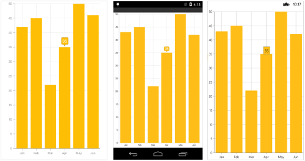
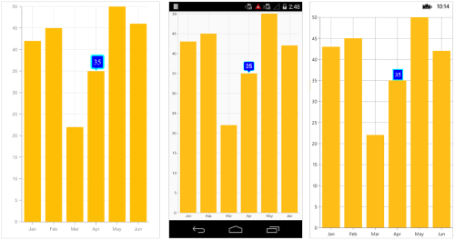
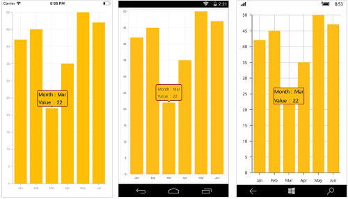

# Tooltip in Xamarin Charts (SfChart)

[`SfChart`](https://help.syncfusion.com/cr/xamarin/Syncfusion.SfChart.XForms.SfChart.html) provides tooltip support for all series. It is used to show information about the segment, when you tap on the segment. To enable the tooltip, you need to set [`EnableTooltip`](https://help.syncfusion.com/cr/xamarin/Syncfusion.SfChart.XForms.ChartSeries.html#Syncfusion_SfChart_XForms_ChartSeries_EnableTooltipProperty) property as `true`.

 



<chart:SfChart.Series>

	<chart:ColumnSeries ItemsSource="{Binding Data}" XBindingPath="Month" YBindingPath="Value" EnableTooltip="True"/>

</chart:SfChart.Series>





ColumnSeries column = new ColumnSeries ();

column.XBindingPath = "Month";

column.YBindingPath = "Value";

column.ItemsSource = Data;

column.EnableTooltip = true;

chart.Series.Add(column);	





## Customizing appearance

You can customize the tooltip label. For customizing, you need to add an instance of [`ChartTooltipBehavior`](https://help.syncfusion.com/cr/xamarin/Syncfusion.SfChart.XForms.ChartTooltipBehavior.html#) to the [`ChartBehaviors`](https://help.syncfusion.com/cr/xamarin/Syncfusion.SfChart.XForms.SfChart.html#Syncfusion_SfChart_XForms_SfChart_ChartBehaviors) collection property of [`SfChart`](https://help.syncfusion.com/cr/xamarin/Syncfusion.SfChart.XForms.SfChart.html). Following properties are used to customize the tooltip label which are available in [`ChartTooltipBehavior`](https://help.syncfusion.com/cr/xamarin/Syncfusion.SfChart.XForms.ChartTooltipBehavior.html#).

* [`BorderColor`](https://help.syncfusion.com/cr/xamarin/Syncfusion.SfChart.XForms.ChartTooltipBehavior.html#Syncfusion_SfChart_XForms_ChartTooltipBehavior_BorderColor) – used to change the label border color
* [`BorderWidth`](https://help.syncfusion.com/cr/xamarin/Syncfusion.SfChart.XForms.ChartTooltipBehavior.html#Syncfusion_SfChart_XForms_ChartTooltipBehavior_BorderWidth) – used to change the label border width
* [`BackgroundColor`](https://help.syncfusion.com/cr/xamarin/Syncfusion.SfChart.XForms.ChartTooltipBehavior.html#Syncfusion_SfChart_XForms_ChartTooltipBehavior_BackgroundColor) – used to change the label background color
* [`Margin`](https://help.syncfusion.com/cr/xamarin/Syncfusion.SfChart.XForms.ChartTooltipBehavior.html#Syncfusion_SfChart_XForms_ChartTooltipBehavior_Margin) – used to change label border thickness
* [`TextColor`](https://help.syncfusion.com/cr/xamarin/Syncfusion.SfChart.XForms.ChartTooltipBehavior.html#Syncfusion_SfChart_XForms_ChartTooltipBehavior_TextColor) – used to change the text color
* [`Font`](https://help.syncfusion.com/cr/xamarin/Syncfusion.SfChart.XForms.ChartTooltipBehavior.html#Syncfusion_SfChart_XForms_ChartTooltipBehavior_FontProperty) – used to change the label font size, family, and weight. (This is deprecated API. Use FontSize, FontFamily, and FontAttributes properties instead of this.)
* [`FontFamily`](https://help.syncfusion.com/cr/xamarin/Syncfusion.SfChart.XForms.ChartTooltipBehavior.html#Syncfusion_SfChart_XForms_ChartTooltipBehavior_FontFamily)- used to change the font family for the tooltip text.
* [`FontAttributes`](https://help.syncfusion.com/cr/xamarin/Syncfusion.SfChart.XForms.ChartTooltipBehavior.html#Syncfusion_SfChart_XForms_ChartTooltipBehavior_FontAttributes) - used to change the font style for the tooltip text.
* [`FontSize`](https://help.syncfusion.com/cr/xamarin/Syncfusion.SfChart.XForms.ChartTooltipBehavior.html#Syncfusion_SfChart_XForms_ChartTooltipBehavior_FontSize) - used to change the font size for the tooltip text.
* [`LabelFormat`](https://help.syncfusion.com/cr/xamarin/Syncfusion.SfChart.XForms.ChartTooltipBehavior.html#Syncfusion_SfChart_XForms_ChartTooltipBehavior_LabelFormat) – used to format the label
* [`Duration`](https://help.syncfusion.com/cr/xamarin/Syncfusion.SfChart.XForms.ChartTooltipBehavior.html#Syncfusion_SfChart_XForms_ChartTooltipBehavior_Duration) – used to set the visible duration of label
* [`OffsetX`](https://help.syncfusion.com/cr/xamarin/Syncfusion.SfChart.XForms.ChartTooltipBehavior.html#Syncfusion_SfChart_XForms_ChartTooltipBehavior_OffsetX) – used to move the label horizontally
* [`OffsetY`](https://help.syncfusion.com/cr/xamarin/Syncfusion.SfChart.XForms.ChartTooltipBehavior.html#Syncfusion_SfChart_XForms_ChartTooltipBehavior_OffsetY) – used to move the label vertically

 



<chart:SfChart.ChartBehaviors>

	<chart:ChartTooltipBehavior BackgroundColor="Blue" BorderWidth="3" BorderColor="Aqua" TextColor="White" Margin="5" Duration="10" Font="Times New Roman, 15"/>

	</chart:ChartTooltipBehavior>

</chart:SfChart.ChartBehaviors>





SfChart chart = new SfChart();
...

ChartTooltipBehavior tool = new ChartTooltipBehavior();
tool.BackgroundColor = Color.Blue;
tool.BorderWidth = 3;
tool.BorderColor = Color.Aqua;
tool.TextColor = Color.White;
tool.Margin = new Thickness(5, 5, 5, 5);
tool.Duration = 10;
tool.Font = Font.OfSize(“Times New Roman”,15);	
chart.ChartBehaviors.Add(tool);





## Tooltip Template

You can customize the appearance of the tooltip with your own template by using the [`TooltipTemplate`](https://help.syncfusion.com/cr/xamarin/Syncfusion.SfChart.XForms.ChartSeries.html#Syncfusion_SfChart_XForms_ChartSeries_TooltipTemplate) property of [`Series`](https://help.syncfusion.com/cr/xamarin/Syncfusion.SfChart.XForms.ChartSeries.html#). The BindingContext in the data template will be the respective underlying object from ItemsSource.

 



<chart:ColumnSeries ItemsSource="{Binding Data}" XBindingPath="Month" YBindingPath="Value" EnableTooltip="True">
                    <chart:ColumnSeries.TooltipTemplate>
                        <DataTemplate>
                            <StackLayout Orientation="Vertical">
                                <StackLayout Orientation="Horizontal">
                                    <Label Text="Month :" />
                                    <Label Text="{Binding Month}"/>
                                </StackLayout>
                                <StackLayout Orientation="Horizontal">
                                    <Label Text="Value   :" />
                                    <Label Text="{Binding Value}"/>
                                </StackLayout>
                            </StackLayout>
                        </DataTemplate>
                    </chart:ColumnSeries.TooltipTemplate>
</chart:ColumnSeries>
<chart:SfChart.ChartBehaviors>
   <chart:ChartTooltipBehavior BorderWidth="3" BorderColor="Maroon"/>
</chart:SfChart.ChartBehaviors>





ColumnSeries column = new ColumnSeries();
column.ItemsSource = viewModel.Data;
column.XBindingPath = "Month";
column.YBindingPath = "Value";
column.EnableTooltip = true;

ChartTooltipBehavior tooltip = new ChartTooltipBehavior();
tooltip.BorderColor = Color.Maroon;
tooltip.BorderWidth = 3 ;
chart.ChartBehaviors.Add(tooltip);

DataTemplate template = new DataTemplate(() =>
{
StackLayout stack = new StackLayout() { Orientation = StackOrientation.Vertical };
StackLayout first = new StackLayout() { Orientation = StackOrientation.Horizontal };
Label label = new Label() { Text = "Month:" };
Label xValue = new Label();
xValue.SetBinding(Label.TextProperty, new Binding("Month"));
first.Children.Add(label);
first.Children.Add(xValue);

StackLayout second = new StackLayout() { Orientation = StackOrientation.Horizontal };
Label label1 = new Label() { Text = "Value:" };
Label yValue = new Label();
yValue.SetBinding(Label.TextProperty, "Value");
second.Children.Add(label1);
second.Children.Add(yValue);

stack.Children.Add(first);
stack.Children.Add(second);
return stack;
});

column.TooltipTemplate = template;
chart.Series.Add(column);





## Methods

You can show or hide the chart tooltip programmatically by using the show or hide method. 

### Show method

The [`Show`](https://help.syncfusion.com/cr/xamarin/Syncfusion.SfChart.XForms.ChartTooltipBehavior.html#Syncfusion_SfChart_XForms_ChartTooltipBehavior_Show_System_Single_System_Single_System_Boolean_) method is used to activate the tooltip at the specified location.



<Button Text="Show tooltip" Clicked="ShowTooltip" />

. . .

<chart:SfChart.ChartBehaviors>
    <chart:ChartTooltipBehavior x:Name="tooltipBehavior" />
</chart:SfChart.ChartBehaviors>





public partial class MainPage : ContentPage
{    
    public MainPage()
    {
        InitializeComponent();
    }

    private void ShowTooltip(object sender, EventArgs e)
    {
        //pointX - determines the x position of tooltip, pointY - determines the y position of tooltip and bool value determines whether the tooltip should be animated while displaying.
        tooltipBehavior.Show(pointX, pointY, true);
    }
}



N>The tooltip will be activated at the specified location only if there is any data point under the specified location.

### Hide method

The [`Hide`](https://help.syncfusion.com/cr/xamarin/Syncfusion.SfChart.XForms.ChartTooltipBehavior.html#Syncfusion_SfChart_XForms_ChartTooltipBehavior_Hide_System_Boolean_) method is used to hide the tooltip programmatically.



//The argument determines whether the tooltip should be animated while hiding.

tooltip.Hide(true);



## See also

[How to bind the Xamarin.Forms pie chart tooltip to “Others” category values](https://www.syncfusion.com/kb/11861/how-to-bind-the-xamarin-forms-pie-chart-tooltip-to-others-category-values) 

[How to show tooltip on Xamarin.Forms Chart axis label click](https://www.syncfusion.com/kb/11644/how-to-show-tooltip-on-xamarin-forms-chart-axis-label-click) 