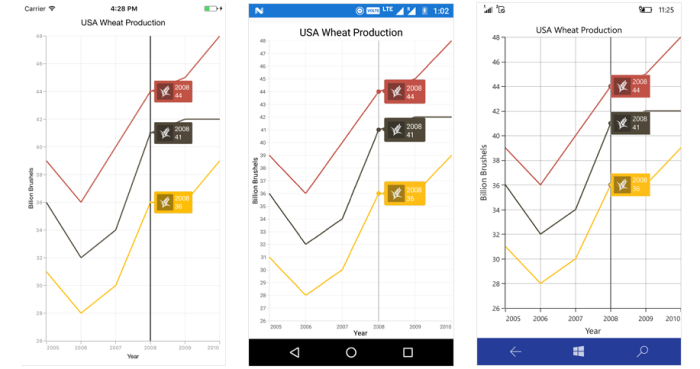

# Trackball in Xamarin Charts (SfChart)

Trackball feature displays the tooltip for the data points that are closer to the point where you touch on the chart area. This feature, especially, can be used instead of data label feature when you cannot show data labels for all data points due to space constraint. To enable this feature, add an instance of [`ChartTrackballBehavior`](https://help.syncfusion.com/cr/xamarin/Syncfusion.SfChart.XForms.ChartTrackballBehavior.html#) to the [`ChartBehaviors`](https://help.syncfusion.com/cr/xamarin/Syncfusion.SfChart.XForms.ChartBehavior.html#) collection property of [`SfChart`](https://help.syncfusion.com/cr/xamarin/Syncfusion.SfChart.XForms.SfChart.html#). Trackball will be activated once you long-press anywhere on the chart area. Once it is activated, it will appear in the UI and move based on your touch movement until you stop touching on the chart.

You can use the following properties to show/hide the line and labels.

* [`ShowLabel`](https://help.syncfusion.com/cr/xamarin/Syncfusion.SfChart.XForms.ChartTrackballBehavior.html#Syncfusion_SfChart_XForms_ChartTrackballBehavior_ShowLabel) – Shows/hides trackball label. Default value is true.

* [`ShowLine`](https://help.syncfusion.com/cr/xamarin/Syncfusion.SfChart.XForms.ChartTrackballBehavior.html#Syncfusion_SfChart_XForms_ChartTrackballBehavior_ShowLine) – Shows/hides the trackball line. Default value is true.

 



<chart:SfChart>
...

	<chart:SfChart.ChartBehaviors>

		<chart:ChartTrackballBehavior ShowLabel="True" ShowLine="True"/>

	</chart:SfChart.ChartBehaviors>

</chart:SfChart>





SfChart chart = new SfChart();
...

ChartTrackballBehavior trackballBehavior = new ChartTrackballBehavior();

trackballBehavior.ShowLabel = true;

trackballBehavior.ShowLine = true;

chart.ChartBehaviors.Add(trackballBehavior);





## Label Display Mode

[`TrackballLabelDisplayMode`](https://help.syncfusion.com/cr/xamarin/Syncfusion.SfChart.XForms.ChartTrackballBehavior.html#Syncfusion_SfChart_XForms_ChartTrackballBehavior_LabelDisplayMode) property is used to specify whether to display label for all the data points along the vertical line or display only single label. Following are the two options you can set to this property,

* [`FloatAllPoints`](https://help.syncfusion.com/cr/xamarin/Syncfusion.SfChart.XForms.TrackballLabelDisplayMode.html#) – Displays label for all the data points along the vertical line.
* [`NearestPoint`](https://help.syncfusion.com/cr/xamarin/Syncfusion.SfChart.XForms.TrackballLabelDisplayMode.html#) – Displays label for single data point that is nearer to the touch contact position.
* [`GroupAllPoints`](https://help.syncfusion.com/cr/xamarin/Syncfusion.SfChart.XForms.TrackballLabelDisplayMode.html#) – Displays label for all the data points grouped and positioned at the top of the chart area.

 



<chart:ChartTrackballBehavior LabelDisplayMode="NearestPoint" ShowLine="False"/>





ChartTrackballBehavior trackballBehavior = new ChartTrackballBehavior();

trackballBehavior.ShowLine = false;

trackballBehavior.LabelDisplayMode = TrackballLabelDisplayMode.NearestPoint;





In the following screenshot, trackball label is shown for only single data point,

## Activation mode

The [`ActivationMode`](https://help.syncfusion.com/cr/xamarin/Syncfusion.SfChart.XForms.ChartTrackballBehavior.html#Syncfusion_SfChart_XForms_ChartTrackballBehavior_ActivationMode) property is used to restrict the visibility of trackball based on the touch actions. The default value of this property is [`ChartTrackballActivationMode.LongPress`](https://help.syncfusion.com/cr/xamarin/Syncfusion.SfChart.XForms.ChartTrackballActivationMode.html).

The ChartTrackballActivationMode enum contains the following values:

* [`LongPress`](https://help.syncfusion.com/cr/xamarin/Syncfusion.SfChart.XForms.ChartTrackballActivationMode.html) – Activates trackball only when performing the long press action.
* [`TouchMove`](https://help.syncfusion.com/cr/xamarin/Syncfusion.SfChart.XForms.ChartTrackballActivationMode.html) – Activates trackball only when performing touch move action.
* [`None`](https://help.syncfusion.com/cr/xamarin/Syncfusion.SfChart.XForms.ChartTrackballActivationMode.html) – Hides the visibility of trackball when setting activation mode to [`None`](https://help.syncfusion.com/cr/xamarin/Syncfusion.SfChart.XForms.ChartTrackballActivationMode.html). It will be activated when calling the [`Show`](https://help.syncfusion.com/cr/xamarin/Syncfusion.SfChart.XForms.ChartTrackballBehavior.html#Syncfusion_SfChart_XForms_ChartTrackballBehavior_Show_System_Single_System_Single_) method.

N> The default value of [`ActivationMode`](https://help.syncfusion.com/cr/xamarin/Syncfusion.SfChart.XForms.ChartTrackballBehavior.html#Syncfusion_SfChart_XForms_ChartTrackballBehavior_ActivationMode) property is [`ChartTrackballActivationMode.LongPress`](https://help.syncfusion.com/cr/xamarin/Syncfusion.SfChart.XForms.ChartTrackballActivationMode.html) for Android and iOS platform and default value for MacOS and UWP platform is [`ChartTrackballActivationMode.TouchMove`](https://help.syncfusion.com/cr/xamarin/Syncfusion.SfChart.XForms.ChartTrackballActivationMode.html).

## Customizing appearance

**Customize Trackball Labels**

The [`LabelStyle`](https://help.syncfusion.com/cr/xamarin/Syncfusion.SfChart.XForms.ChartTrackballBehavior.html#Syncfusion_SfChart_XForms_ChartTrackballBehavior_LabelStyle) property provides options to  customize the trackball labels.

* [`BorderColor`](https://help.syncfusion.com/cr/xamarin/Syncfusion.SfChart.XForms.ChartLabelStyle.html#Syncfusion_SfChart_XForms_ChartLabelStyle_BorderColor) – used to change the label border color.
* [`BackgroundColor`](https://help.syncfusion.com/cr/xamarin/Syncfusion.SfChart.XForms.ChartLabelStyle.html#Syncfusion_SfChart_XForms_ChartLabelStyle_BackgroundColor) – used to change the label background color.
* [`BorderThickness`](https://help.syncfusion.com/cr/xamarin/Syncfusion.SfChart.XForms.ChartLabelStyle.html#Syncfusion_SfChart_XForms_ChartLabelStyle_BorderThickness) – used to change label border thickness.
* [`TextColor`](https://help.syncfusion.com/cr/xamarin/Syncfusion.SfChart.XForms.ChartLabelStyle.html#Syncfusion_SfChart_XForms_ChartLabelStyle_TextColor) – used to change the text color.
* [`Font`](https://help.syncfusion.com/cr/xamarin/Syncfusion.SfChart.XForms.ChartLabelStyle.html#Syncfusion_SfChart_XForms_ChartLabelStyle_Font) – used to change label font size, family and weight.

 



<chart:SfChart>
...

	<chart:SfChart.ChartBehaviors>

		<chart:ChartTrackballBehavior>

			<chart:ChartTrackballBehavior.LabelStyle>

				<chart:ChartTrackballLabelStyle BorderColor="Maroon" BackgroundColor="Aqua" BorderThickness="2" TextColor="Red" Font="Italic,18"/>

			</chart:ChartTrackballBehavior.LabelStyle>

		</chart:ChartTrackballBehavior>

	</chart:SfChart.ChartBehaviors>

</chart:SfChart>





SfChart chart = new SfChart();
...

ChartTrackballBehavior trackBallBehavior = new ChartTrackballBehavior();

trackBallBehavior.LabelStyle.BorderColor = Color.Maroon;

trackBallBehavior.LabelStyle.BorderThickness = 2;

trackBallBehavior.LabelStyle.Font = Font.SystemFontOfSize(18, FontAttributes.Italic);

trackBallBehavior.LabelStyle.BackgroundColor = Color.Aqua;

trackBallBehavior.LabelStyle.TextColor = Color.Red;

chart.ChartBehaviors.Add(trackballBehavior);





**Customize Trackball Marker**

The [`MarkerStyle`](https://help.syncfusion.com/cr/xamarin/Syncfusion.SfChart.XForms.ChartTrackballBehavior.html#Syncfusion_SfChart_XForms_ChartTrackballBehavior_MarkerStyle) property provides options to  customize the trackball markers.

Following properties are used to customize the trackball marker.

* [`ShowMarker`](https://help.syncfusion.com/cr/xamarin/Syncfusion.SfChart.XForms.ChartTrackballMarkerStyle.html#Syncfusion_SfChart_XForms_ChartTrackballMarkerStyle_ShowMarker) – used to enable / disable the marker. Default value is true.
* [`BorderColor`](https://help.syncfusion.com/cr/xamarin/Syncfusion.SfChart.XForms.ChartTrackballMarkerStyle.html#Syncfusion_SfChart_XForms_ChartTrackballMarkerStyle_BorderColor) – used to change the marker border color.
* [`Color`](https://help.syncfusion.com/cr/xamarin/Syncfusion.SfChart.XForms.ChartTrackballMarkerStyle.html#Syncfusion_SfChart_XForms_ChartTrackballMarkerStyle_Color) – used to change the marker background color.
* [`BorderWidth`](https://help.syncfusion.com/cr/xamarin/Syncfusion.SfChart.XForms.ChartTrackballMarkerStyle.html#Syncfusion_SfChart_XForms_ChartTrackballMarkerStyle_BorderWidth) – used to change the width of the marker border.
* [`Width`](https://help.syncfusion.com/cr/xamarin/Syncfusion.SfChart.XForms.ChartTrackballMarkerStyle.html#Syncfusion_SfChart_XForms_ChartTrackballMarkerStyle_Width) – used to change the width of the marker.
* [`Height`](https://help.syncfusion.com/cr/xamarin/Syncfusion.SfChart.XForms.ChartTrackballMarkerStyle.html#Syncfusion_SfChart_XForms_ChartTrackballMarkerStyle_Height) – used to change the height of the marker.

 



<chart:SfChart HorizontalOptions="FillAndExpand" VerticalOptions="FillAndExpand">
...

	<chart:SfChart.ChartBehaviors>

		<chart:ChartTrackballBehavior>

			<chart:ChartTrackballBehavior.MarkerStyle>

				<chart:ChartTrackballMarkerStyle BorderColor="Purple" ShowMarker="True" BorderWidth="1" Width="8" Height="8" Color="Green"/>

			</chart:ChartTrackballBehavior.MarkerStyle>

		</chart:ChartTrackballBehavior>

	</chart:SfChart.ChartBehaviors>

</chart:SfChart>





SfChart chart = new SfChart();
...

ChartTrackballBehavior trackBallBehavior = new ChartTrackballBehavior();

trackBallBehavior.MarkerStyle.BorderWidth = 1;

trackBallBehavior.MarkerStyle.BorderColor = Color.Purple;

trackBallBehavior.MarkerStyle.Width = 8;

trackBallBehavior.MarkerStyle.Height = 8;

trackBallBehavior.MarkerStyle.Color = Color.Green;

trackBallBehavior.MarkerStyle.ShowMarker = true;

chart.ChartBehaviors.Add(trackballBehavior);





**Customize Trackball Line**

The [`LineStyle`](https://help.syncfusion.com/cr/xamarin/Syncfusion.SfChart.XForms.ChartTrackballBehavior.html#Syncfusion_SfChart_XForms_ChartTrackballBehavior_LineStyle) property provides options to  customize the trackball line.

* [`ShowLine`](https://help.syncfusion.com/cr/xamarin/Syncfusion.SfChart.XForms.ChartTrackballBehavior.html#Syncfusion_SfChart_XForms_ChartTrackballBehavior_ShowLine) – used to enable / disable the line. Default value is true.
* [`StrokeWidth`](https://help.syncfusion.com/cr/xamarin/Syncfusion.SfChart.XForms.ChartLineStyle.html#Syncfusion_SfChart_XForms_ChartLineStyle_StrokeWidth) – used to change the stroke width of the line.
* [`StrokeColor`](https://help.syncfusion.com/cr/xamarin/Syncfusion.SfChart.XForms.ChartLineStyle.html#Syncfusion_SfChart_XForms_ChartLineStyle_StrokeColor) – used to change the stroke color of the line.
* [`StrokeDashArray`](https://help.syncfusion.com/cr/xamarin/Syncfusion.SfChart.XForms.ChartLineStyle.html#Syncfusion_SfChart_XForms_ChartLineStyle_StrokeDashArray) – Specifies the dashes to be applied on the line.

 



<chart:SfChart HorizontalOptions="FillAndExpand" VerticalOptions="FillAndExpand">
...

	<chart:SfChart.ChartBehaviors>

		<chart:ChartTrackballBehavior>

			<chart:ChartTrackballBehavior.LineStyle>

				<chart:ChartLineStyle StrokeColor="Blue" StrokeWidth="2"/>

			</chart:ChartTrackballBehavior.LineStyle>

		</chart:ChartTrackballBehavior>

	</chart:SfChart.ChartBehaviors>

</chart:SfChart>





SfChart chart = new SfChart();
...

ChartTrackballBehavior trackBallBehavior = new ChartTrackballBehavior();

trackBallBehavior.ShowLine = true;

trackBallBehavior.LineStyle.StrokeWidth = 2;

trackBallBehavior.LineStyle.StrokeColor = Color.Blue;

trackBallBehavior.LineStyle.StrokeDashArray = new double[2] { 2, 3 };

chart.ChartBehaviors.Add(trackballBehavior);





Following screenshot illustrates the customization of trackball elements.

## Show/hide the trackball label in axis

This feature is used to highlight the respective axis label when the trackball is moving across the axis. [`ChartAxis.ShowTrackballInfo`](https://help.syncfusion.com/cr/xamarin/Syncfusion.SfChart.XForms.ChartAxis.html#Syncfusion_SfChart_XForms_ChartAxis_ShowTrackballInfo) property is used show/hide the trackball label of the axis. [`ChartAxis.TrackballLabelStyle`](https://help.syncfusion.com/cr/xamarin/Syncfusion.SfChart.XForms.ChartAxis.html#Syncfusion_SfChart_XForms_ChartAxis_TrackballLabelStyle) property is used to customize its appearance. Default value of [`ChartAxis.ShowTrackballInfo`](https://help.syncfusion.com/cr/xamarin/Syncfusion.SfChart.XForms.ChartAxis.html#Syncfusion_SfChart_XForms_ChartAxis_ShowTrackballInfo) is `False`.

 



<chart:SfChart.PrimaryAxis >

    <chart:CategoryAxis ShowTrackballInfo = "true" />

</chart:SfChart.PrimaryAxis >





chart.PrimaryAxis.ShowTrackballInfo = true;





## Axis label alignment

The position of trackball's axis label can be changed using the [`AxisLabelAlignment`](https://help.syncfusion.com/cr/xamarin/Syncfusion.SfChart.XForms.ChartTrackballAxisLabelStyle.html#Syncfusion_SfChart_XForms_ChartTrackballAxisLabelStyle_AxisLabelAlignment) property of [`ChartTrackballAxisLabelStyle`](https://help.syncfusion.com/cr/xamarin/Syncfusion.SfChart.XForms.ChartTrackballAxisLabelStyle.html). The following options are available in [`AxisLabelAlignment`](https://help.syncfusion.com/cr/xamarin/Syncfusion.SfChart.XForms.ChartTrackballAxisLabelStyle.html#Syncfusion_SfChart_XForms_ChartTrackballAxisLabelStyle_AxisLabelAlignment).

*	[`Far`](https://help.syncfusion.com/cr/xamarin/Syncfusion.SfChart.XForms.ChartLabelAlignment.html) -  The label will be positioned below the tick in vertical axis and right of the tick in horizontal axis.
*	[`Near`](https://help.syncfusion.com/cr/xamarin/Syncfusion.SfChart.XForms.ChartLabelAlignment.html) -  The label will be positioned above the tick in vertical axis and left of the tick in horizontal axis.
*   [`Center`](https://help.syncfusion.com/cr/xamarin/Syncfusion.SfChart.XForms.ChartLabelAlignment.html) - The label will be positioned at the center of tick. This is the default value.

The following code snippet and screenshot demonstrate the placement of label at the left to tick line.

 



<chart:SfChart>
 ...
<chart:CategoryAxis.TrackballLabelStyle>

    <chart:ChartTrackballAxisLabelStyle AxisLabelAlignment="Near"/>

</chart:CategoryAxis.TrackballLabelStyle>
 ...
</chart:SfChart>





primaryAxis.TrackballLabelStyle.AxisLabelAlignment = ChartLabelAlignment.Near;





## Show/hide the series label

This feature is used to show/hide the trackball label of the series by using [`CartesianSeries.ShowTrackballInfo`](https://help.syncfusion.com/cr/xamarin/Syncfusion.SfChart.XForms.CartesianSeries.html#Syncfusion_SfChart_XForms_CartesianSeries_ShowTrackballInfo) property. Default value of [`CartesianSeries.ShowTrackballInfo`](https://help.syncfusion.com/cr/xamarin/Syncfusion.SfChart.XForms.CartesianSeries.html#Syncfusion_SfChart_XForms_CartesianSeries_ShowTrackballInfo) property is `True`.

 



<chart:SfChart>
...

    <chart:LineSeries ItemsSource ="{Binding Data}" XBindingPath="Year"
    YBindingPath="Value" ShowTrackballInfo = "false" />

</chart:SfChart>





SfChart chart = new SfChart();
...

LineSeries lineSeries = new LineSeries()
{
    ItemsSource = Data,
    XBindingPath = "Year",
    YBindingPath = "Value",
    ShowTrackballInfo = false

};
chart.Series.Add(lineSeries);





## Label Template

You can customize the appearance of the Trackball label with your own template by using [`TrackballLabelTemplate`](https://help.syncfusion.com/cr/xamarin/Syncfusion.SfChart.XForms.CartesianSeries.html#Syncfusion_SfChart_XForms_CartesianSeries_TrackballLabelTemplate) property of [`ChartSeries`](https://help.syncfusion.com/cr/xamarin/Syncfusion.SfChart.XForms.ChartSeries.html).

 



<ContentPage.Resources>
    <ResourceDictionary>
       <DataTemplate x:Key="trackballTemplate">
          <StackLayout  Orientation="Horizontal">
             <Label  Text="{Binding Value}" TextColor="White" FontSize ="15" VerticalTextAlignment="Center"/>
             <Image Source ="grain.jpg" WidthRequest="30" HeightRequest="30"/>
          </StackLayout>
       </DataTemplate>
    </ResourceDictionary>
</ContentPage.Resources>

<chart:SfChart.Series>
    <chart:LineSeries TrackballLabelTemplate="{StaticResource trackballTemplate}" ItemsSource="{Binding Data1}" XBindingPath="Name" YBindingPath="Value"/>
    <chart:LineSeries TrackballLabelTemplate="{StaticResource trackballTemplate}" ItemsSource="{Binding Data2}" XBindingPath="Name" YBindingPath="Value"/>
</chart:SfChart.Series>

<chart:SfChart.ChartBehaviors>
    <chart:ChartTrackballBehavior/>
</chart:SfChart.ChartBehaviors>





SfChart chart = new SfChart ();
...

var lineSeries1 = new LineSeries();
lineSeries1.ItemsSource = Data1;
lineSeries1.XBindingPath = "Name";
lineSeries1.YBindingPath = "Value";

var lineSeries2 = new LineSeries();
lineSeries2.ItemsSource = Data2;
lineSeries2.XBindingPath = "Name";
lineSeries2.YBindingPath = "Value";

DataTemplate trackBallTemplate = new DataTemplate(() =>
{
     StackLayout stack = new StackLayout();
     stack.Orientation = StackOrientation.Horizontal;
     Label label = new Label();
     label.SetBinding(Label.TextProperty, "Value");
     label.FontSize = 15;
     label.VerticalTextAlignment = TextAlignment.Center;
     label.TextColor = Color.White;
     Image image = new Image();
     image.Source = "grain.jpg";
     image.WidthRequest = 30;
     image.HeightRequest = 30;
     stack.Children.Add(label);
     stack.Children.Add(image);
     return stack;
});

lineSeries1.TrackballLabelTemplate = trackBallTemplate;
lineSeries2.TrackballLabelTemplate = trackBallTemplate;

chart.Series.Add(lineSeries1);
chart.Series.Add(lineSeries2);

chart.ChartBehaviors.Add(new ChartTrackballBehavior());





**Customize the Axis Label with DataTemplate**

Customize the appearance of axis label of trackball using [`TrackballLabelTemplate`](https://help.syncfusion.com/cr/xamarin/Syncfusion.SfChart.XForms.ChartAxis.html#Syncfusion_SfChart_XForms_ChartAxis_TrackballLabelTemplate) property of [`ChartAxis`](https://help.syncfusion.com/cr/xamarin/Syncfusion.SfChart.XForms.ChartAxis.html).

 


<ContentPage.Resources>
    <ResourceDictionary>
      <DataTemplate x:Key="axisLabelTemplate">
        <Label WidthRequest="50" HeightRequest="20" HorizontalTextAlignment="Center" BackgroundColor="Blue" Text="{Binding }" TextColor="White" FontSize ="15" />
      </DataTemplate>
    </ResourceDictionary>
</ContentPage.Resources>

 <chart:SfChart.PrimaryAxis>
       <chart:CategoryAxis  ShowTrackballInfo="True" TrackballLabelTemplate="{StaticResource axisLabelTemplate}">
        <chart:CategoryAxis.TrackballLabelStyle>
          <chart:ChartTrackballAxisLabelStyle   BackgroundColor="Transparent"/>
        </chart:CategoryAxis.TrackballLabelStyle>  
      </chart:CategoryAxis>  
</chart:SfChart.PrimaryAxis>

<chart:SfChart.ChartBehaviors>
     <chart:ChartTrackballBehavior />
</chart:SfChart.ChartBehaviors>





Chart.PrimaryAxis = new CategoryAxis(); 
Chart.PrimaryAxis.ShowTrackballInfo = true;
Chart.PrimaryAxis.TrackballLabelStyle.BackgroundColor = Color.Transparent;
DataTemplate axisLabelTemplate = new DataTemplate(() =>
{              
     Label label = new Label();
     label.SetBinding(Label.TextProperty, ".");
     label.FontSize = 15;
     label.HorizontalTextAlignment = TextAlignment.Center;
     label.TextColor = Color.White;
     label.BackgroundColor = Color.Blue;                       
     label.WidthRequest = 50;
     label.HeightRequest = 20;           
     return label;
});
Chart.PrimaryAxis.TrackballLabelTemplate = axisLabelTemplate;
Chart.ChartBehaviors.Add(new ChartTrackballBehavior());





## Methods

### Show method

The [`Show`](https://help.syncfusion.com/cr/xamarin/Syncfusion.SfChart.XForms.ChartTrackballBehavior.html#Syncfusion_SfChart_XForms_ChartTrackballBehavior_Show_System_Single_System_Single_) method is used to activate the trackball at the specified location.


	
trackball.Show(pointX, pointY);



### Hide method

The [`Hide`](https://help.syncfusion.com/cr/xamarin/Syncfusion.SfChart.XForms.ChartTrackballBehavior.html#Syncfusion_SfChart_XForms_ChartTrackballBehavior_Hide) method is used to hide the trackball programmatically.



trackball.Hide();



### HitTest method

The [`HitTest`](https://help.syncfusion.com/cr/xamarin/Syncfusion.SfChart.XForms.ChartTrackballBehavior.html#Syncfusion_SfChart_XForms_ChartTrackballBehavior_HitTest_System_Single_System_Single_) method is used to check whether the point is in trackball or not.

 
[C#]

trackball.HitTest(pointX, pointY);



## Events

### TrackballCreated

The [`TrackballCreated`](https://help.syncfusion.com/cr/xamarin/Syncfusion.SfChart.XForms~Syncfusion.SfChart.XForms.SfChart~TrackballCreated_EV.html) event occurs when the trackball moves from one data point to another. This argument contains object of [`ChartPointsInfo`](https://help.syncfusion.com/cr/xamarin/Syncfusion.SfChart.XForms.ChartTrackballCreatedEventArgs.html#Syncfusion_SfChart_XForms_ChartTrackballCreatedEventArgs_ChartPointsInfo). The following properties are available in ChartPointInfo class to customize the appearance of trackball label based on condition.

* [`Label`](https://help.syncfusion.com/cr/xamarin/Syncfusion.SfChart.XForms.ChartPointInfo.html#Syncfusion_SfChart_XForms_ChartPointInfo_Label) - Gets or sets the text of trackball label.
* [`IsVisible`](https://help.syncfusion.com/cr/xamarin/Syncfusion.SfChart.XForms.ChartPointInfo.html#Syncfusion_SfChart_XForms_ChartPointInfo_IsVisible) - Gets or sets the visibility of trackball.
* [`Series`](https://help.syncfusion.com/cr/xamarin/Syncfusion.SfChart.XForms.ChartPointInfo.html#Syncfusion_SfChart_XForms_ChartPointInfo_Series) - Gets the series of the data point in which trackball is activated.
* [`LabelStyle`](https://help.syncfusion.com/cr/xamarin/Syncfusion.SfChart.XForms.ChartPointInfo.html#Syncfusion_SfChart_XForms_ChartPointInfo_LabelStyle) - Customizes the appearance of trackball label.
* [`DataPoint`](https://help.syncfusion.com/cr/xamarin/Syncfusion.SfChart.XForms.ChartPointInfo.html#Syncfusion_SfChart_XForms_ChartPointInfo_DataPoint) - Gets the respective underlying object of the data in which trackball is activated.
* [`DataPointIndex`](https://help.syncfusion.com/cr/xamarin/Syncfusion.SfChart.XForms.ChartPointInfo.html#Syncfusion_SfChart_XForms_ChartPointInfo_DataPointIndex) - Gets the index of the selected data point.
* [`XPosition`](https://help.syncfusion.com/cr/xamarin/Syncfusion.SfChart.XForms.ChartPointInfo.html#Syncfusion_SfChart_XForms_ChartPointInfo_XPosition) -  Gets the x-position of trackball label.
* [`YPosition`](https://help.syncfusion.com/cr/xamarin/Syncfusion.SfChart.XForms.ChartPointInfo.html#Syncfusion_SfChart_XForms_ChartPointInfo_YPosition) - Gets the y-position of trackball label.
* [`BackgroundColor`](https://help.syncfusion.com/cr/xamarin/Syncfusion.SfChart.XForms.ChartPointInfo.html#Syncfusion_SfChart_XForms_ChartPointInfo_BackgroundColor) - Gets the default background color of trackball label.

## See also

[How to add multiple trackballs in Xamarin.Forms Chart](https://www.syncfusion.com/kb/10400/how-to-add-multiple-trackballs-in-xamarin-forms-chart)

[How to activate the trackball on touch in Xamarin.Forms](https://www.syncfusion.com/kb/8620/how-to-activate-the-trackball-on-touch)

[How to format the trackball labels](https://www.syncfusion.com/kb/5779/how-to-format-the-trackball-labels)

[How to set the milliseconds label format for axis and trackball label in Xamarin.Forms Chart](https://www.syncfusion.com/kb/10812/how-to-set-the-milliseconds-label-format-for-axis-and-trackball-label-in-xamarin-forms)
