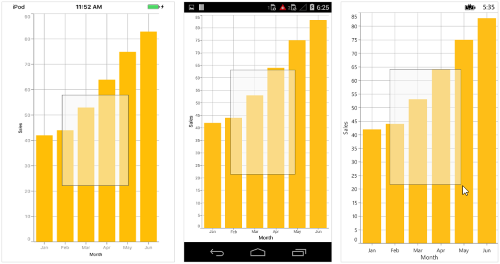
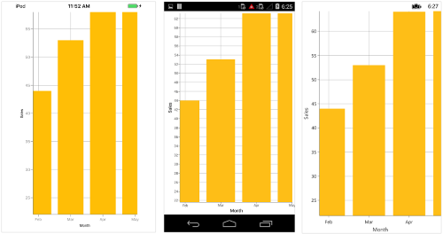
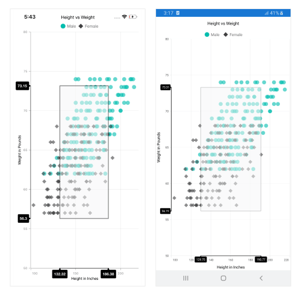
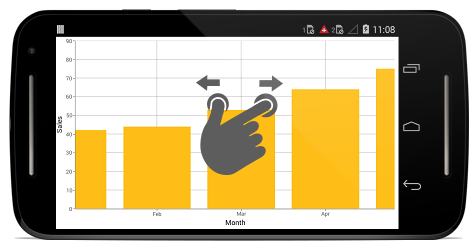

# Zooming and Panning in Xamarin Charts (SfChart)

## Enable Zooming

Chart allows you to zoom in to view the data clearly. To enable this feature, you need to add an instance of [`ChartZoomPanBehavior`](https://help.syncfusion.com/cr/xamarin/Syncfusion.SfChart.XForms.ChartZoomPanBehavior.html) to the [`ChartBehaviors`](https://help.syncfusion.com/cr/xamarin/Syncfusion.SfChart.XForms.ChartBehavior.html) collection property of [`SfChart`](https://help.syncfusion.com/cr/xamarin/Syncfusion.SfChart.XForms.SfChart.html).

Following properties are used to configure the zooming feature,

* [`EnableZooming`](https://help.syncfusion.com/cr/xamarin/Syncfusion.SfChart.XForms.ChartZoomPanBehavior.html#Syncfusion_SfChart_XForms_ChartZoomPanBehavior_EnableZooming) – used to enable/disable the pinch zooming. Default value is true. 
* [`EnableDirectionalZooming`](https://help.syncfusion.com/cr/xamarin/Syncfusion.SfChart.XForms.ChartZoomPanBehavior.html#Syncfusion_SfChart_XForms_ChartZoomPanBehavior_EnableDirectionalZooming) - Enables or disables the pinch zooming based on pinch gesture direction. The default value of this property is false.
* [`EnableDoubleTap`](https://help.syncfusion.com/cr/xamarin/Syncfusion.SfChart.XForms.ChartZoomPanBehavior.html#Syncfusion_SfChart_XForms_ChartZoomPanBehavior_EnableDoubleTap) – when you enable this property, you can double tap on the chart to reset it to the original size or zoom in by one level.
* [`EnablePanning`](https://help.syncfusion.com/cr/xamarin/Syncfusion.SfChart.XForms.ChartZoomPanBehavior.html#Syncfusion_SfChart_XForms_ChartZoomPanBehavior_EnablePanning) – used to enable/disable the panning. Default value is true.
* [`MaximumZoomLevel`](https://help.syncfusion.com/cr/xamarin/Syncfusion.SfChart.XForms.ChartZoomPanBehavior.html#Syncfusion_SfChart_XForms_ChartZoomPanBehavior_MaximumZoomLevel) - used to determine the maximum zoom level of the chart.

N> EnableDirectionalZooming is not supported in the macOS platform.

Following code snippet illustrates how to enable zooming.

 



<chart:SfChart>

	<chart:SfChart.ChartBehaviors>
	
		<chart:ChartZoomPanBehavior/>
		
	</chart:SfChart.ChartBehaviors>
	
</chart:SfChart>





SfChart chart = new SfChart();

ChartZoomPanBehavior zoomPanBehavior = new ChartZoomPanBehavior();

chart.ChartBehaviors.Add(zoomPanBehavior);





## Selection zooming

By specifying [`EnableSelectionZooming`](https://help.syncfusion.com/cr/xamarin/Syncfusion.SfChart.XForms.ChartZoomPanBehavior.html#Syncfusion_SfChart_XForms_ChartZoomPanBehavior_EnableSelectionZooming) property to true, you can double tap and drag to select a range on the chart to be zoomed in.

Following code snippet illustrates how to enable the box selection zooming,

 



<chart:SfChart>

	<chart:SfChart.ChartBehaviors>

		<chart:ChartZoomPanBehavior EnableSelectionZooming="True"/>

	</chart:SfChart.ChartBehaviors>

</chart:SfChart>





SfChart chart = new SfChart();

ChartZoomPanBehavior zoomPanBehavior = new ChartZoomPanBehavior();

zoomPanBehavior.EnableSelectionZooming = true;

chart.ChartBehaviors.Add(zoomPanBehavior);





Following screenshot shows the box selection on chart area,

Following screenshot shows the zoomed area,

### Selection rectangle customization

You can customize the selection rectangle using the below properties.

* [`SelectionRectStrokeWidth`](https://help.syncfusion.com/cr/xamarin/Syncfusion.SfChart.XForms.ChartZoomPanBehavior.html#Syncfusion_SfChart_XForms_ChartZoomPanBehavior_SelectionRectStrokeWidth) - used to change the stroke width of selection rectangle 
* [`SelectionRectStrokeColor`](https://help.syncfusion.com/cr/xamarin/Syncfusion.SfChart.XForms.ChartZoomPanBehavior.html#Syncfusion_SfChart_XForms_ChartZoomPanBehavior_SelectionRectStrokeColor) - used to change the stroke color of selection rectangle.  
* [`SelectionRectStrokeDashArray`](https://help.syncfusion.com/cr/xamarin/Syncfusion.SfChart.XForms.ChartZoomPanBehavior.html#Syncfusion_SfChart_XForms_ChartZoomPanBehavior_SelectionRectStrokeDashArray) - used to change the stroke dashes of selection rectangle. 
* [`SelectionRectFillColor`](https://help.syncfusion.com/cr/xamarin/Syncfusion.SfChart.XForms.ChartZoomPanBehavior.html#Syncfusion_SfChart_XForms_ChartZoomPanBehavior_SelectionRectFillColor) - used to change the fill color of selection rectangle. 

### Show axis tooltip

The axis tooltip on selection zooming can be enabled using the [`ChartAxis.ShowTrackballInfo`](https://help.syncfusion.com/cr/xamarin/Syncfusion.SfChart.XForms.ChartAxis.html#Syncfusion_SfChart_XForms_ChartAxis_ShowTrackballInfo) property. You can customize the appearance of the axis tooltip by the below properties of [`ChartAxis.TrackballLabelStyle`](https://help.syncfusion.com/cr/xamarin/Syncfusion.SfChart.XForms.ChartAxis.html#Syncfusion_SfChart_XForms_ChartAxis_TrackballLabelStyle).

* [`AxisLabelAlignment`](https://help.syncfusion.com/cr/xamarin/Syncfusion.SfChart.XForms.ChartTrackballAxisLabelStyle.html#Syncfusion_SfChart_XForms_ChartTrackballAxisLabelStyle_AxisLabelAlignment) - used to change the position of the axis label.
* [`TextColor`](https://help.syncfusion.com/cr/xamarin/Syncfusion.SfChart.XForms.ChartLabelStyle.html#Syncfusion_SfChart_XForms_ChartLabelStyle_TextColor) – used to change the label text color.
* [`BackgroundColor`](https://help.syncfusion.com/cr/xamarin/Syncfusion.SfChart.XForms.ChartLabelStyle.html#Syncfusion_SfChart_XForms_ChartLabelStyle_BackgroundColor) – used to change the label background color.
* [`BorderColor`](https://help.syncfusion.com/cr/xamarin/Syncfusion.SfChart.XForms.ChartLabelStyle.html#Syncfusion_SfChart_XForms_ChartLabelStyle_BorderColor) – used to change the label border color.
* [`BorderThickness`](https://help.syncfusion.com/cr/xamarin/Syncfusion.SfChart.XForms.ChartLabelStyle.html#Syncfusion_SfChart_XForms_ChartLabelStyle_BorderThickness) – used to change the border width.
* [`LabelFormat`](https://help.syncfusion.com/cr/xamarin/Syncfusion.SfChart.XForms.ChartLabelStyle.html#Syncfusion_SfChart_XForms_ChartLabelStyle_LabelFormat) - used to format the label.
* [`FontFamily`](https://help.syncfusion.com/cr/xamarin/Syncfusion.SfChart.XForms.ChartLabelStyle.html#Syncfusion_SfChart_XForms_ChartLabelStyle_FontFamily) - used to change the font family for the axis label.
* [`FontAttributes`](https://help.syncfusion.com/cr/xamarin/Syncfusion.SfChart.XForms.ChartLabelStyle.html#Syncfusion_SfChart_XForms_ChartLabelStyle_FontAttributes) - used to change the fontAttributes for the axis label.
* [`FontSize`](https://help.syncfusion.com/cr/xamarin/Syncfusion.SfChart.XForms.ChartLabelStyle.html#Syncfusion_SfChart_XForms_ChartLabelStyle_FontSize) - used to change the font size for the axis label.
* [`Margin`](https://help.syncfusion.com/cr/xamarin/Syncfusion.SfChart.XForms.ChartLabelStyle.html#Syncfusion_SfChart_XForms_ChartLabelStyle_Margin) - used to change the margin for axis label.

You can customize the line color between the tooltip for the selected range while selection zooming using the chart axis [`TrackballAxisLabelStyle`](https://help.syncfusion.com/cr/xamarin/Syncfusion.SfChart.XForms.ChartTrackballAxisLabelStyle.html) [`BorderColor`](https://help.syncfusion.com/cr/xamarin/Syncfusion.SfChart.XForms.ChartLabelStyle.html#Syncfusion_SfChart_XForms_ChartLabelStyle_BorderColor).

N> Selection zooming show axis tooltip feature is not supported in `UWP` platform.

Following code snippet illustrates how to enable axis tooltip while selection zooming.

 



<chart:SfChart.PrimaryAxis>

	<chart:NumericalAxis ShowTrackballInfo="True">

        <chart:NumericalAxis.TrackballLabelStyle>

            <chart:ChartTrackballAxisLabelStyle LabelFormat="##.##"/>

        </chart:NumericalAxis.TrackballLabelStyle>

    </chart:NumericalAxis>

</chart:SfChart.PrimaryAxis>

<chart:SfChart.SecondaryAxis>

	<chart:NumericalAxis ShowTrackballInfo="True">

        <chart:NumericalAxis.TrackballLabelStyle>

            <chart:ChartTrackballAxisLabelStyle LabelFormat="##.##"/>

        </chart:NumericalAxis.TrackballLabelStyle>

    </chart:NumericalAxis>

</chart:SfChart.SecondaryAxis>

<chart:SfChart.ChartBehaviors>

	<chart:ChartZoomPanBehavior EnableSelectionZooming="True"/>

</chart:SfChart.ChartBehaviors>





SfChart chart = new SfChart();

NumericalAxis primaryAxis = new NumericalAxis() { ShowTrackballInfo = true};

primaryAxis.TrackballLabelStyle = new ChartTrackballAxisLabelStyle() { LabelFormat = "##.##" };

chart.PrimaryAxis = primaryAxis;

NumericalAxis secondaryAxis = new NumericalAxis() { ShowTrackballInfo = true};

secondaryAxis.TrackballLabelStyle = new ChartTrackballAxisLabelStyle() { LabelFormat = "##.##" };

chart.SecondaryAxis = secondaryAxis;
 
ChartZoomPanBehavior zoomPanBehavior = new ChartZoomPanBehavior();

zoomPanBehavior.EnableSelectionZooming = true;

chart.ChartBehaviors.Add(zoomPanBehavior);





## Zoom Mode

The [`ZoomMode`](https://help.syncfusion.com/cr/xamarin/Syncfusion.SfChart.XForms.ChartZoomPanBehavior.html#Syncfusion_SfChart_XForms_ChartZoomPanBehavior_ZoomMode) property specifies whether chart should be allowed to scale along horizontal axis or vertical axis or along both axis. The default value of [`ZoomMode`](https://help.syncfusion.com/cr/xamarin/Syncfusion.SfChart.XForms.ZoomMode.html) is [`XY`](https://help.syncfusion.com/cr/xamarin/Syncfusion.SfChart.XForms.ZoomMode.html) (both axis).

Following code example illustrates how to restrict the chart to be zoomed only along horizontal axis,

 



<chart:SfChart.ChartBehaviors>

	<chart:ChartZoomPanBehavior ZoomMode="X"/>

</chart:SfChart.ChartBehaviors>





ChartZoomPanBehavior zoomPanBehavior = new ChartZoomPanBehavior();

zoomPanBehavior.ZoomMode = ZoomMode.X;





## Auto Interval On Zooming

[`EnableAutoIntervalOnZooming`](https://help.syncfusion.com/cr/xamarin/Syncfusion.SfChart.XForms.ChartAxis.html#Syncfusion_SfChart_XForms_ChartAxis_EnableAutoIntervalOnZooming) property determines the update of axis interval based on the current visible range while zooming the chart. Default value of this property is true. If this property is false, the nice interval will not be calculated for new range after zoom in and actual interval will be sustained.

N> EnableAutoIntervalOnZooming is not supported for the category axis.

## Events

**ZoomStart**

The [`ZoomStart`](https://help.syncfusion.com/cr/xamarin/Syncfusion.SfChart.XForms.SfChart.html) event is triggered when the user starts zooming the chart through pinch gesture, and this is a cancelable event. The argument contains the following information.

* [`Axis`](https://help.syncfusion.com/cr/xamarin/Syncfusion.SfChart.XForms.ChartZoomEventArgs.html#Syncfusion_SfChart_XForms_ChartZoomEventArgs_Axis) – the zoom start event will be triggered for all the axis in the Chart.
* [`CurrentZoomFactor`](https://help.syncfusion.com/cr/xamarin/Syncfusion.SfChart.XForms.ChartZoomEventArgs.html#Syncfusion_SfChart_XForms_ChartZoomEventArgs_CurrentZoomFactor) – used to get the new zoom factor of the corresponding axis.
* [`CurrentZoomPosition`](https://help.syncfusion.com/cr/xamarin/Syncfusion.SfChart.XForms.ChartZoomEventArgs.html#Syncfusion_SfChart_XForms_ChartZoomEventArgs_CurrentZoomPosition) – used to get the new zoom position of the corresponding axis.
* [`Cancel`](https://help.syncfusion.com/cr/xamarin/Syncfusion.SfChart.XForms.ChartZoomStartEventArgs.html#Syncfusion_SfChart_XForms_ChartZoomStartEventArgs_Cancel) – used to set the value indicating whether the zooming should be canceled.

**ZoomDelta**

The [`ZoomDelta`](https://help.syncfusion.com/cr/xamarin/Syncfusion.SfChart.XForms.SfChart.html) event is triggered while zooming, and this is a cancelable event. The argument contains the following information.

* [`Axis`](https://help.syncfusion.com/cr/xamarin/Syncfusion.SfChart.XForms.ChartZoomEventArgs.html#Syncfusion_SfChart_XForms_ChartZoomEventArgs_Axis) – Instance of the axis whose range is changed because of zooming. This event is triggered for each axis in the chart.
* [`PreviousZoomFactor`](https://help.syncfusion.com/cr/xamarin/Syncfusion.SfChart.XForms.ChartZoomDeltaEventArgs.html#Syncfusion_SfChart_XForms_ChartZoomDeltaEventArgs_PreviousZoomFactor) – used to get the previous zoom factor of the axis.
* [`PreviousZoomPosition`](https://help.syncfusion.com/cr/xamarin/Syncfusion.SfChart.XForms.ChartZoomDeltaEventArgs.html#Syncfusion_SfChart_XForms_ChartZoomDeltaEventArgs_PreviousZoomPosition) – used to get the previous zoom position of the axis.
* [`CurrentZoomFactor`](https://help.syncfusion.com/cr/xamarin/Syncfusion.SfChart.XForms.ChartZoomEventArgs.html#Syncfusion_SfChart_XForms_ChartZoomEventArgs_CurrentZoomFactor) – used to get the current zoom factor of the axis.
* [`CurrentZoomPosition`](https://help.syncfusion.com/cr/xamarin/Syncfusion.SfChart.XForms.ChartZoomEventArgs.html#Syncfusion_SfChart_XForms_ChartZoomEventArgs_CurrentZoomPosition) – used to get the current zoom position of the axis.
* [`Cancel`](https://help.syncfusion.com/cr/xamarin/Syncfusion.SfChart.XForms.ChartZoomDeltaEventArgs.html#Syncfusion_SfChart_XForms_ChartZoomDeltaEventArgs_Cancel) – used to set the value indicating whether the zooming should be canceled.

**ZoomEnd**

The [`ZoomEnd`](https://help.syncfusion.com/cr/xamarin/Syncfusion.SfChart.XForms.SfChart.html) event is triggered after the zooming is stopped. The argument contains the following information.

* [`Axis`](https://help.syncfusion.com/cr/xamarin/Syncfusion.SfChart.XForms.ChartZoomEventArgs.html#Syncfusion_SfChart_XForms_ChartZoomEventArgs_Axis) – Instance of the axis whose range is changed because of zooming. This event is triggered for each axis in the chart.
* [`CurrentZoomFactor`](https://help.syncfusion.com/cr/xamarin/Syncfusion.SfChart.XForms.ChartZoomEventArgs.html#Syncfusion_SfChart_XForms_ChartZoomEventArgs_CurrentZoomFactor) – the axis zoom factor after zoom.
* [`CurrentZoomPosition`](https://help.syncfusion.com/cr/xamarin/Syncfusion.SfChart.XForms.ChartZoomEventArgs.html#Syncfusion_SfChart_XForms_ChartZoomEventArgs_CurrentZoomPosition) - the axis zoom position after zoom.

**SelectionZoomStart**

The [`SelectionZoomStart`](https://help.syncfusion.com/cr/xamarin/Syncfusion.SfChart.XForms.SfChart.html) event is triggered when the user starts the box selection zooming. The argument contains the following information.

* [`ZoomRect`](https://help.syncfusion.com/cr/xamarin/Syncfusion.SfChart.XForms.ChartSelectionZoomEventArgs.html#Syncfusion_SfChart_XForms_ChartSelectionZoomEventArgs_ZoomRect) – used to get the initial bounds of the box selection.

**SelectionZoomDelta**

The [`SelectionZoomDelta`](https://help.syncfusion.com/cr/xamarin/Syncfusion.SfChart.XForms.SfChart.html) event is triggered while selecting a region to be zoomed, and this is a cancelable event. The argument contains the following information.

* [`ZoomRect`](https://help.syncfusion.com/cr/xamarin/Syncfusion.SfChart.XForms.ChartSelectionZoomEventArgs.html#Syncfusion_SfChart_XForms_ChartSelectionZoomEventArgs_ZoomRect) – contains the bounds of the currently selected region.
* [`Cancel`](https://help.syncfusion.com/cr/xamarin/Syncfusion.SfChart.XForms.ChartSelectionZoomDeltaEventArgs.html#Syncfusion_SfChart_XForms_ChartSelectionZoomDeltaEventArgs_Cancel) – used to set the value indicating whether the box selection zooming should be canceled.

**SelectionZoomEnd**

The [`SelectionZoomEnd`](https://help.syncfusion.com/cr/xamarin/Syncfusion.SfChart.XForms.SfChart.html) event is triggered after selection zooming ends. The argument contains the following information.

* [`ZoomRect`](https://help.syncfusion.com/cr/xamarin/Syncfusion.SfChart.XForms.ChartSelectionZoomEventArgs.html#Syncfusion_SfChart_XForms_ChartSelectionZoomEventArgs_ZoomRect) – used to get the final bounds of the zoomed region.

**Scroll**

The [`Scroll`](https://help.syncfusion.com/cr/xamarin/Syncfusion.SfChart.XForms.SfChart.html) event is triggered while panning, and this is a cancelable event. The argument contains the following information.

* [`Axis`](https://help.syncfusion.com/cr/xamarin/Syncfusion.SfChart.XForms.ChartScrollEventArgs.html#Syncfusion_SfChart_XForms_ChartScrollEventArgs_Axis) – Instance of the axis whose range is changed while panning. This event is triggered for each axis in the chart.
* [`ZoomPosition`](https://help.syncfusion.com/cr/xamarin/Syncfusion.SfChart.XForms.ChartScrollEventArgs.html#Syncfusion_SfChart_XForms_ChartScrollEventArgs_ZoomPosition) – the current zoom position of the axis.
* [`Cancel`](https://help.syncfusion.com/cr/xamarin/Syncfusion.SfChart.XForms.ChartScrollEventArgs.html#Syncfusion_SfChart_XForms_ChartScrollEventArgs_Cancel) – used to set a value indicating whether the scrolling should be canceled.

**ResetZoom**

The [`ResetZoom`](https://help.syncfusion.com/cr/xamarin/Syncfusion.SfChart.XForms.SfChart.html) event is triggered after the chart is reset on double tap. The argument contains the following information.

* [`Axis`](https://help.syncfusion.com/cr/xamarin/Syncfusion.SfChart.XForms.ChartResetZoomEventArgs.html#Syncfusion_SfChart_XForms_ChartResetZoomEventArgs_Axis) – Instance of the axis whose range is changed because of this event. This event is triggered for each axis in the chart.
* [`PreviousZoomFactor`](https://help.syncfusion.com/cr/xamarin/Syncfusion.SfChart.XForms.ChartResetZoomEventArgs.html#Syncfusion_SfChart_XForms_ChartResetZoomEventArgs_PreviousZoomFactor) – used to get the previous zoom factor.
* [`PreviousZoomPosition`](https://help.syncfusion.com/cr/xamarin/Syncfusion.SfChart.XForms.ChartResetZoomEventArgs.html#Syncfusion_SfChart_XForms_ChartResetZoomEventArgs_PreviousZoomPosition) – used to get the previous zoom position.

## Methods

Zooming and panning can be performed programmatically with the following methods:

### ZoomIn

[`ZoomIn`](https://help.syncfusion.com/cr/xamarin/Syncfusion.SfChart.XForms.ChartZoomPanBehavior.html#Syncfusion_SfChart_XForms_ChartZoomPanBehavior_ZoomIn) method is used to increase the magnification of the plot area to view the data clearly.



ChartZoomPanBehavior zoomPan = new ChartZoomPanBehavior();

zoomPan.ZoomIn();



### ZoomOut

[`ZoomOut`](https://help.syncfusion.com/cr/xamarin/Syncfusion.SfChart.XForms.ChartZoomPanBehavior.html#Syncfusion_SfChart_XForms_ChartZoomPanBehavior_ZoomOut) is used to decrease the magnification of the plot area to reset the default view.



ChartZoomPanBehavior zoomPan = new ChartZoomPanBehavior();

zoomPan.ZoomOut();



### Zoom

**Zoom(factor)**

[`Zoom(factor)`](https://help.syncfusion.com/cr/xamarin/Syncfusion.SfChart.XForms.ChartZoomPanBehavior.html) method is used to change the zoom level by using zoom factor.



ChartZoomPanBehavior zoomPan = new ChartZoomPanBehavior();

zoomPan.Zoom(0.5f);



**Zoom(Rect)**

[`Zoom(Rect)`](https://help.syncfusion.com/cr/xamarin/Syncfusion.SfChart.XForms.ChartZoomPanBehavior.html#Syncfusion_SfChart_XForms_ChartZoomPanBehavior_Zoom_Syncfusion_SfChart_XForms_Rect_) method is used to zoom the chart for a given rectangle value. Create an instance of Rect by passing [`Top`](https://help.syncfusion.com/cr/xamarin/Syncfusion.SfChart.XForms.Rect.html#Syncfusion_SfChart_XForms_Rect_Top), [`Left`](https://help.syncfusion.com/cr/xamarin/Syncfusion.SfChart.XForms.Rect.html#Syncfusion_SfChart_XForms_Rect_Left), [`Bottom`](https://help.syncfusion.com/cr/xamarin/Syncfusion.SfChart.XForms.Rect.html#Syncfusion_SfChart_XForms_Rect_Bottom), and [`Right`](https://help.syncfusion.com/cr/xamarin/Syncfusion.SfChart.XForms.Rect.html#Syncfusion_SfChart_XForms_Rect_Right) positions and pass it to zoom method.



ChartZoomPanBehavior zoomPan = new ChartZoomPanBehavior();

zoomPan.Zoom(new Rect(10, 10, 200, 350));



**Zoom(chartAxis, cumulativeLevel, origin)**

[`Zoom(chartAxis, cumulativeLevel, origin)`](https://help.syncfusion.com/cr/xamarin/Syncfusion.SfChart.XForms.ChartZoomPanBehavior.html#Syncfusion_SfChart_XForms_ChartZoomPanBehavior_Zoom_Syncfusion_SfChart_XForms_ChartAxis_System_Single_System_Single_) method is used to change the zoom level of given axis to the specified level and origin.



ChartZoomPanBehavior zoomPan = new ChartZoomPanBehavior();

zoomPan.Zoom(axis, 0.5f, 0.5f);



### ZoomByRange

**ZoomByRange(chartAxis, start, end)**

[`ZoomByRange(chartAxis, start, end)`](https://help.syncfusion.com/cr/xamarin/Syncfusion.SfChart.XForms.ChartZoomPanBehavior.html#Syncfusion_SfChart_XForms_ChartZoomPanBehavior_ZoomByRange_Syncfusion_SfChart_XForms_ChartAxis_System_Double_System_Double_) method is used to zoom the given axis to the given range.



ChartZoomPanBehavior zoomPan = new ChartZoomPanBehavior();

zoomPan.ZoomByRange(axis, 20, 25);



**ZoomByRange(dateTimeAxis, start, end)**

[`ZoomByRange(dateTimeAxis, start, end)`](https://help.syncfusion.com/cr/xamarin/Syncfusion.SfChart.XForms.ChartZoomPanBehavior.html#Syncfusion_SfChart_XForms_ChartZoomPanBehavior_ZoomByRange_Syncfusion_SfChart_XForms_DateTimeAxis_System_DateTime_System_DateTime_) method is used to zoom the given axis to the given date time range.



ChartZoomPanBehavior zoomPan = new ChartZoomPanBehavior();

zoomPan.ZoomByRange(axis, new DateTime(2017,3,1), new DateTime(2017,5,1));



### ZoomToFactor(chartAxis,zoomPosition,zoomFactor)

[`ZoomToFactor`](https://help.syncfusion.com/cr/xamarin/Syncfusion.SfChart.XForms.ChartZoomPanBehavior.html#Syncfusion_SfChart_XForms_ChartZoomPanBehavior_ZoomToFactor_Syncfusion_SfChart_XForms_ChartAxis_System_Double_System_Double_) method is used to change the zoom level by using zoom position and zoom factor. Zoom position value specifies the starting point of zooming, and zoom factor value specifies the level of zooming.



ChartZoomPanBehavior zoomPan = new ChartZoomPanBehavior();

zoomPan.ZoomToFactor(axis, 0.5f, 0.5f);



### Reset

[`Reset`](https://help.syncfusion.com/cr/xamarin/Syncfusion.SfChart.XForms.ChartZoomPanBehavior.html#Syncfusion_SfChart_XForms_ChartZoomPanBehavior_Reset) method is used to return the plot area back to its original position after zooming.



ChartZoomPanBehavior zoomPan = new ChartZoomPanBehavior();

zoomPan.Reset();



### Override Methods

The following override methods are available in ChartZoomPanBehavior to customize zooming actions.

 * [`OnScaleStart`](https://help.syncfusion.com/cr/xamarin/Syncfusion.SfChart.XForms.ChartZoomPanBehavior.html#Syncfusion_SfChart_XForms_ChartZoomPanBehavior_OnScaleStart_System_Single_System_Single_System_Single_) - It gets called when the user start to zoom on the chart. 
 * [`OnScaleDelta`](https://help.syncfusion.com/cr/xamarin/Syncfusion.SfChart.XForms.ChartZoomPanBehavior.html#Syncfusion_SfChart_XForms_ChartZoomPanBehavior_OnScaleDelta_System_Single_System_Single_System_Single_) - It gets called while performing the zoom action.
 * [`OnScaleEnd`](https://help.syncfusion.com/cr/xamarin/Syncfusion.SfChart.XForms.ChartZoomPanBehavior.html#Syncfusion_SfChart_XForms_ChartZoomPanBehavior_OnScaleEnd_System_Single_System_Single_System_Single_) - It gets called after end the zoom action.
 * [`OnScroll`](https://help.syncfusion.com/cr/xamarin/Syncfusion.SfChart.XForms.ChartZoomPanBehavior.html#Syncfusion_SfChart_XForms_ChartZoomPanBehavior_OnScroll_System_Single_System_Single_System_Single_System_Single_) - It gets called while scrolling the chart.



 public class ChartZoomPanBehaviorExt : ChartZoomPanBehavior
 {
        protected override void OnScaleStart(float manipulationX, float manipulationY, float scaleFactor)
        {
            base.OnScaleStart(manipulationX, manipulationY, scaleFactor);
        }

        protected override void OnScaleDelta(float manipulationX, float manipulationY, float scaleFactor)
        {
            base.OnScaleDelta(manipulationX, manipulationY, scaleFactor);
        }

        protected override void OnScaleEnd(float manipulationX, float manipulationY, float scaleFactor)
        {
            base.OnScaleEnd(manipulationX, manipulationY, scaleFactor);
        }

        protected override void OnScroll(float pointX, float pointY, float distanceX, float distanceY)
        {
            base.OnScroll(pointX, pointY, distanceX, distanceY);
        }
 }



