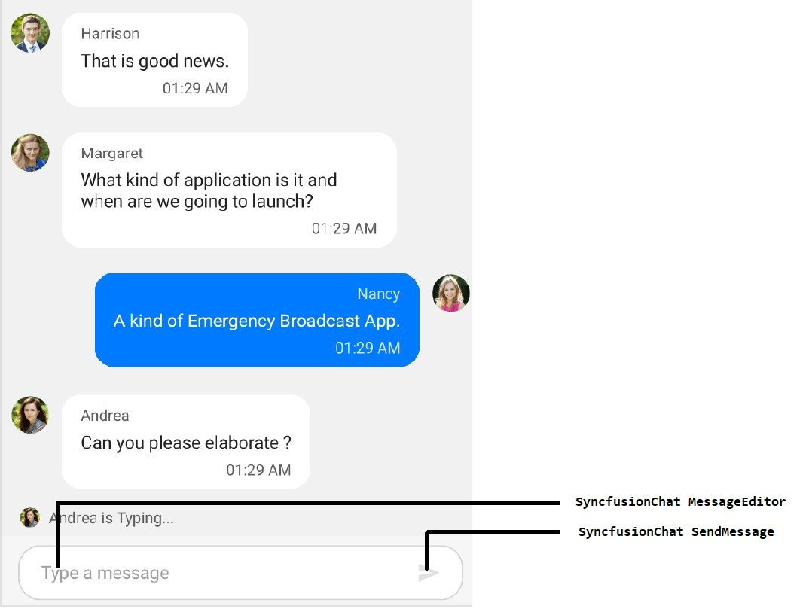

# AutomationId

SfChat support built-in [AutomationId](https://docs.microsoft.com/en-gb/dotnet/api/xamarin.forms.element.automationid?view=xamarin-forms#Xamarin_Forms_Element_AutomationId) for all their inner elements. These `AutomationId` values allow the automation framework to find and interact with the inner elements when the test scripts are run. A unique `AutomationId` is maintained for each inner element by prefixing the control's `AutomationId` with the inner element's Id.

## AutomationId for Chat elements

The below table illustrates the predefined automation values set internally which can be used to identify the Chat elements.

<table>
<tr>
<th>Element</th>
<th>Value</th>
</tr>
<tr>
<td>Message editor</td>
<td>"MessageEditor"</td>
</tr>
<tr>
<td>Send button</td>
<td>"SendMessage"</td>
</tr>
</table>

The following screenshot illustrates the `AutomationId` values of the inner elements of SfChat.

The following code snippet demonstrates how to set the `AutomationId` to chat.




 <sfChat:SfChat x:Name="sfChat"
                Messages="{Binding Messages}"
                CurrentUser="{Binding CurrentUser}" 
                ShowTypingIndicator="True"
                AutomationId="SyncfusionChat"/>





SfChat sfChat = new SfChat();
GettingStartedViewModel viewModel = new GettingStartedViewModel();
sfChat.Messages = viewModel.Messages;
sfChat.CurrentUser = viewModel.CurrentUser;
sfChat.ShowTypingIndicator = true;
sfChat.AutomationId = "SyncfusionChat";




Refer to the following code snippet to access the inner elements of chat from the automation script.




[Test]
[Description("SfChat Automation Id")]
public void SfChat_AutomationId()
{
   // To tap the Message editor in the message input area
   App.Tap("SyncfusionChat MessageEditor");

   // To tap Send button in the message input area
   App.Tap("SyncfusionChat SendMessage");
}


