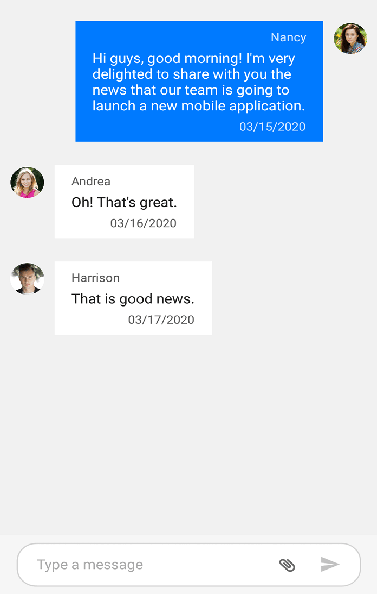

# Attachment Button in Xamarin.Forms Chat (SfChat)

You can show the attachment button in SfChat by setting the [SfChat.ShowAttachmentButton](https://help.syncfusion.com/cr/xamarin/Syncfusion.XForms.Chat.SfChat.html#Syncfusion_XForms_Chat_SfChat_ShowAttachmentButton) to `true`.





<?xml version="1.0" encoding="utf-8" ?>
<ContentPage xmlns="http://xamarin.com/schemas/2014/forms"
             xmlns:x="http://schemas.microsoft.com/winfx/2009/xaml"
             xmlns:sfChat="clr-namespace:Syncfusion.XForms.Chat;assembly=Syncfusion.SfChat.XForms"
             xmlns:local="clr-namespace:ChatSample"
             x:Class="ChatSample.MainPage">
    <ContentPage.BindingContext>
        <local:ViewModel/>
    </ContentPage.BindingContext>
    <ContentPage.Content>
            <sfChat:SfChat x:Name="chat" 
                           ShowAttachmentButton="True"
                           CurrentUser="{Binding CurrentUser}" 
                           Messages="{Binding Messages}"
                           ShowOutgoingMessageAvatar="True">
        </sfChat:SfChat>
    </ContentPage.Content>
</ContentPage>





//MainPage.cs

public partial class MainPage : ContentPage
{      
    SfChat sfChat;
    ViewModel viewModel = new ViewModel();
    public MainPage()
    {
        InitializeComponent();
        sfChat.Messages = viewModel.Messages;
        sfChat.CurrentUser = viewModel.CurrentUser;
        sfChat.ShowAttachmentButton = true;
        this.Content = sfChat;
    }
}





## Event and command

The [SfChat.AttachmentButtonClicked](https://help.syncfusion.com/cr/xamarin/Syncfusion.XForms.Chat.SfChat.html) event and [SfChat.AttachmentButtonCommand](https://help.syncfusion.com/cr/xamarin/Syncfusion.XForms.Chat.SfChat.html#Syncfusion_XForms_Chat_SfChat_AttachmentButtonCommand) will be executed upon tapping the attachment button. You can pass the desired object as parameter to the `SfChat.AttachmentButtonCommand` using the [SfChat.AttachmentButtonCommandParameter](https://help.syncfusion.com/cr/xamarin/Syncfusion.XForms.Chat.SfChat.html#Syncfusion_XForms_Chat_SfChat_AttachmentButtonCommandParameter). You can provide options for the users to upload files, images, pdf and other media as messages in SfChat from the event handler and action of the `SfChat.AttachmentButtonClicked` event and `SfChat.AttachmentButtonCommand` respectively.

**AttachmentButtonClicked Event**




<?xml version="1.0" encoding="utf-8" ?>
<ContentPage xmlns="http://xamarin.com/schemas/2014/forms"
             xmlns:x="http://schemas.microsoft.com/winfx/2009/xaml"
             xmlns:sfChat="clr-namespace:Syncfusion.XForms.Chat;assembly=Syncfusion.SfChat.XForms"
             xmlns:local="clr-namespace:ChatSample"
             x:Class="ChatSample.MainPage">
    <ContentPage.BindingContext>
        <local:ViewModel/>
    </ContentPage.BindingContext>
    <ContentPage.Content>
            <sfChat:SfChat x:Name="chat" 
                           Messages="{Binding Messages}"
                           CurrentUser="{Binding CurrentUser}"
                           ShowOutgoingMessageAvatar="True"
                           ShowAttachmentButton="True"
                           AttachmentButtonClicked="Chat_AttachmentButtonClicked">
        </sfChat:SfChat>
    </ContentPage.Content>
</ContentPage>




//MainPage.cs

public partial class MainPage : ContentPage
{
    public MainPage()
    {
        InitializeComponent();
    }
    private void Chat_AttachmentButtonClicked(object sender, EventArgs e)
    {
        //Adding an image message to the chat.
        this.Messages.Add(new ImageMessage()
        {
            Aspect = Xamarin.Forms.Aspect.AspectFill,
            Source = "Car1.jpeg",
            Author = new Author() { Name = "Andrea", Avatar = "People_Circle23.png" },
            Text = "Sports Car Type-1",
            DateTime = new DateTime(2020, 10, 02),
        });
    }
}




**AttachmentButtonCommand**




<?xml version="1.0" encoding="utf-8" ?>
<ContentPage xmlns="http://xamarin.com/schemas/2014/forms"
             xmlns:x="http://schemas.microsoft.com/winfx/2009/xaml"
             xmlns:sfChat="clr-namespace:Syncfusion.XForms.Chat;assembly=Syncfusion.SfChat.XForms"
             xmlns:local="clr-namespace:ChatSample"
             x:Class="ChatSample.MainPage">
    <ContentPage.BindingContext>
        <local:ViewModel/>
    </ContentPage.BindingContext>
    <ContentPage.Content>
            <sfChat:SfChat x:Name="chat"
                           Messages="{Binding Messages}"
                           CurrentUser="{Binding CurrentUser}"
                           ShowOutgoingMessageAvatar="True"
                           ShowAttachmentButton="True"
                           AttachmentButtonCommand="{Binding Command}"
                           AttachmentButtonCommandParameter="{x:Reference chat}">
        </sfChat:SfChat>
    </ContentPage.Content>
</ContentPage>



//ViewModel.cs
...
public ViewModel()
{
    this.messages = new ObservableCollection<object>();
    this.CurrentUser = new Author() { Name = "Nancy", Avatar = "Nancy.png" };
    Command = new Command(Tapped);
    this.GenerateMessages();
}

private void Tapped(object args)
{
    //Adding an image message to the chat.
    this.Messages.Add(new ImageMessage()
    {
        Aspect = Xamarin.Forms.Aspect.AspectFill,
        Source = "Car1.jpeg",
        Author = new Author() { Name = "Andrea", Avatar = "People_Circle23.png" },
        Text = "Sports Car Type-1",
        DateTime = new DateTime(2020, 10, 02),
    });
}
...



## Attachment button template 

You can load custom view/buttons as attachment button using [SfChat.AttachmentButtonTemplate](https://help.syncfusion.com/cr/xamarin/Syncfusion.XForms.Chat.SfChat.html#Syncfusion_XForms_Chat_SfChat_AttachmentButtonTemplate) property. You can also specify the width of your template view to load more than one button as shown below.




<?xml version="1.0" encoding="utf-8" ?>
<ContentPage xmlns="http://xamarin.com/schemas/2014/forms"
             xmlns:x="http://schemas.microsoft.com/winfx/2009/xaml"
             xmlns:sfChat="clr-namespace:Syncfusion.XForms.Chat;assembly=Syncfusion.SfChat.XForms"
             xmlns:local="clr-namespace:ChatSample"
             x:Class="ChatSample.MainPage">
    <ContentPage.BindingContext>
        <local:ViewModel/>
    </ContentPage.BindingContext>
    <ContentPage.Content>
            <sfChat:SfChat x:Name="chat" 
                           ShowAttachmentButton="True"
                           CurrentUser="{Binding CurrentUser}" 
                           Messages="{Binding Messages}"
                           ShowOutgoingMessageAvatar="True">
                <sfChat:SfChat.AttachmentButtonTemplate>
                    <DataTemplate>
                        <StackLayout WidthRequest="58" HeightRequest="17" Orientation="Horizontal">
                            <Image Source="AttachmentIcon.jpg" WidthRequest="22" HeightRequest="17" Rotation="225" Margin="0,0,8,0"/>
                            <Image Source="CameraIcon.jpg" WidthRequest="22" HeightRequest="17"/>
                        </StackLayout>
                    </DataTemplate>
                </sfChat:SfChat.AttachmentButtonTemplate>
        </sfChat:SfChat>
    </ContentPage.Content>
</ContentPage>




//MainPage.cs

public partial class MainPage : ContentPage
{
    DataTemplate attachmentDataTemplate;
    Image image = new Image();
    SfChat sfChat;
    ViewModel viewModel = new ViewModel();
    public MainPage()
    {
        InitializeComponent();
        sfChat.Messages = viewModel.Messages;
        sfChat.CurrentUser = viewModel.CurrentUser;
        sfChat.ShowAttachmentButton = true;
        attachmentDataTemplate = new DataTemplate(() =>
        {
            StackLayout layout = new StackLayout();
            
            Image cameraImage = new Image();
            cameraImage.Source = "CameraIcon.jpg";
            cameraImage.WidthRequest = 22;
            cameraImage.HeightRequest = 17;

            Image attachmentImage = new Image();
            attachmentImage.Source = AttachmentIcon.jpg;
            attachmentImage.WidthRequest = 22;
            attachmentImage.HeightRequest = 17;
            attachmentImage.Margin = new Thickness(0,0,8,0);
            attachmentImage.Rotation = 225;             

            layout.Orientation =StackOrientation.Horizontal;
            layout.HeightRequest = 17;
            layout.WidthRequest = 58;
            
            layout.Children.Add(attachmentImage);
            layout.Children.Add(cameraImage);
            return layout;
        });
        sfChat.AttachmentButtonTemplate = attachmentDataTemplate;
        this.Content = sfChat;
    }
}




## Attach image from gallery in Xamarin.Forms chat (SfChat)

You can add the desired image in to the chat by opening the device's gallery when `AttachmentButton` is tapped. You can download the entire project demo of adding an image from gallery in to SfChat from GitHub [here](https://github.com/SyncfusionExamples/How-to-attach-image-from-gallery-in-Xamarin.Forms-chat).