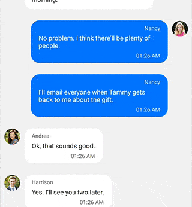
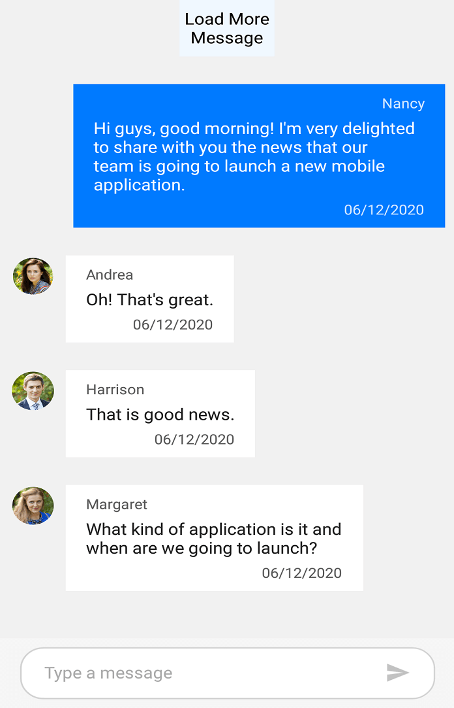

# Load more messages in Xamarin Chat (SfChat)

In SfChat you can scroll to the top of the message list to fetch the old messages on demand, in run-time either automatically or manually(by tapping the load more button) by setting the [SfChat.LoadMoreBehavior](https://help.syncfusion.com/cr/xamarin/Syncfusion.XForms.Chat.SfChat.html#Syncfusion_XForms_Chat_SfChat_LoadMoreBehavior) as `LoadMoreOption.Auto` or `LoadMoreOption.Manual` respectively. Assign the desired action to be triggered when load more is performed using the [SfChat.LoadMoreCommand](https://help.syncfusion.com/cr/xamarin/Syncfusion.XForms.Chat.SfChat.html#Syncfusion_XForms_Chat_SfChat_LoadMoreCommand) property. You can also pass the desired parameter to the `SfChat.LoadMoreCommand` using the [SfChat.LoadMoreCommandParameter](https://help.syncfusion.com/cr/xamarin/Syncfusion.XForms.Chat.SfChat.html#Syncfusion_XForms_Chat_SfChat_LoadMoreCommandParameter) property. Use the [SfChat.IsBusy](https://help.syncfusion.com/cr/xamarin/Syncfusion.XForms.Chat.SfChat.html#Syncfusion_XForms_Chat_SfChat_IsBusy) property to show the busy indicator denoting the loading operation in SfChat.

## Load more manually

By default upon reaching the top of the chat list, a load more button will be displayed, if `SfChat.LoadMoreBehavior` is set as `LoadMoreOption.Manual`. Clicking on this button triggers the `SfChat.LoadMoreCommand`. In the command's action, set the `SfChat.IsBusy` as `true` to show the busy indicator and hide the load more button. Once the messages are loaded, set the `SfChat.IsBusy` as `false` again to hide the busy indicator. Returning false from the `SfChat.LoadMoreCommand`'s `CanExecute()` override cancels the load more operation and removes the load more view from chat. All this can be achieved in MVVM using binding as shown below.





<?xml version="1.0" encoding="utf-8" ?>
<ContentPage xmlns="http://xamarin.com/schemas/2014/forms"
             xmlns:x="http://schemas.microsoft.com/winfx/2009/xaml"
             xmlns:sfChat="clr-namespace:Syncfusion.XForms.Chat;assembly=Syncfusion.SfChat.XForms"
             xmlns:local="clr-namespace:GettingStarted"
             x:Class="GettingStarted.MainPage">
    
    <ContentPage.BindingContext>
        <local:LoadMoreViewModel x:Name="viewModel"/>
    </ContentPage.BindingContext>   
    
    <ContentPage.Content>       
            <sfChat:SfChat x:Name="sfChat" 
                           LoadMoreCommand="{Binding LoadMoreCommand}"
                           LoadMoreBehavior="Manual"
                           IsBusy="{Binding IsBusy}"  
                           Messages="{Binding Messages}" 
                           CurrentUser="{Binding CurrentUser}" > 
            </sfChat:SfChat>        
    </ContentPage.Content>
</ContentPage>





//ViewModel.cs

public partial class LoadMoreViewModel : INotifyPropertyChanged
{      
        private bool isBusy = false;
        private ObservableCollection<object> messages;

        /// 

        /// Gets or sets the load more command of SfChat.
        /// 

        public ICommand LoadMoreCommand { get; set; }

        /// 

        /// Gets or sets the IsBusy of the chat control.
        /// 

        public bool IsBusy
        {
            get { return this.isBusy; }
            set
            {
                this.isBusy = value;
                RaisePropertyChanged("IsBusy");
            }
        }

        /// 

        /// Gets or sets the message conversation of SfChat.
        /// 

        public ObservableCollection<object> Messages
        {
            get{ return this.messages; }
            set
            {
                this.messages = value;
                RaisePropertyChanged("Messages");
            }
        }

        public LoadMoreViewModel()
        {
            this.Messages = CreateMessages();
            LoadMoreCommand = new Command<object>(LoadMoreItems, CanLoadMoreItems);
        }

        /// 

        /// Returns whether the load more command can execute.
        /// 
        
        private bool CanLoadMoreItems(object obj)
        {
            // If messages are still there in the old message collection then execute the load more command.
            if (this.OldMessages.Count > 0)
            {
                return true;
            }
            else
            {
                IsBusy = false;
                return false;
            }

            return true;
        }

        /// 

        /// Action raised when the load more command is executed.
        /// 

        private async void LoadMoreItems(object obj)
        {
            try
            {
                // Set is busy as true to show the busy indicator
                IsBusy = true;
                await Task.Delay(3000);
                LoadMoreMessages();
            }
            catch{ }
            finally
            {
                // Set is busy as false to hide the busy indicator
                IsBusy = false;
            }
        }

        /// 

        /// Adds the next ten messages from the older messages of the conversation to <see cref="SfChat"/>'s message collection.
        /// 

        /// <param name="index">index of message collection.</param>
        /// <param name="count">count of the message to be added.</param>
        private void LoadMoreMessages()
        {        
            for (int i = 1; i <= 10 ; i++)
            {
                var oldMessage = this.OldMessages[this.OldMessages.Count - 1];
                this.Messages.Insert(0, oldMessage);
                this.OldMessages.Remove(oldMessage);
            }
        }
}





## Load more automatically

By default, upon reaching the top of the chat list, a busy indicator will be displayed, if `SfChat.LoadMoreBehavior` is set as [LoadMoreOption.Auto](https://help.syncfusion.com/cr/xamarin/Syncfusion.ListView.XForms.LoadMoreOption.html). Unlike the [LoadMoreOption.Manual](https://help.syncfusion.com/cr/xamarin/Syncfusion.ListView.XForms.LoadMoreOption.html) the [SfChat.LoadMoreCommand](https://help.syncfusion.com/cr/xamarin/Syncfusion.ListView.XForms.LoadMoreOption.html) executes automatically upon reaching the top of the chat list, without any additional click. 

N> The `SfChat.IsBusy` will always be `true` if `SfChat.LoadMoreBehavior` is `Auto`. So to cancel the load more operation and remove the load more view from the chat, set the `SfChat.LoadMoreBehavior` as [LoadMoreOption.None](https://help.syncfusion.com/cr/xamarin/Syncfusion.ListView.XForms.LoadMoreOption.html). All this can be achieved in MVVM using binding as shown below.





<?xml version="1.0" encoding="utf-8" ?>
<ContentPage xmlns="http://xamarin.com/schemas/2014/forms"
             xmlns:x="http://schemas.microsoft.com/winfx/2009/xaml"
             xmlns:sfChat="clr-namespace:Syncfusion.XForms.Chat;assembly=Syncfusion.SfChat.XForms"
             xmlns:local="clr-namespace:GettingStarted"
             x:Class="GettingStarted.MainPage">
    
    <ContentPage.BindingContext>
        <local:LoadMoreViewModel x:Name="viewModel"/>
    </ContentPage.BindingContext>   
    
    <ContentPage.Content>       
            <sfChat:SfChat x:Name="sfChat" 
                           LoadMoreCommand="{Binding LoadMoreCommand}"
                           LoadMoreBehavior="{Binding LoadMoreBehavior}"
                           Messages="{Binding Messages}" 
                           CurrentUser="{Binding CurrentUser}" > 
            </sfChat:SfChat>        
    </ContentPage.Content>
</ContentPage>





//ViewModel.cs

public partial class LoadMoreViewModel : INotifyPropertyChanged
{      
        private LoadMoreOption loadMoreBehavior = LoadMoreOption.Auto;

        /// 

        /// Gets or sets the load more command of SfChat.
        /// 

        public ICommand LoadMoreCommand { get; set; }

        /// 

        /// Gets or sets the load more behavior of the chat control.
        /// 

        public bool LoadMoreBehavior
        {
            get { return this.loadMoreBehavior; }
            set
            {
                this.loadMoreBehavior = value;
                RaisePropertyChanged("LoadMoreBehavior");
            }
        }

        /// 

        /// Gets or sets the message conversation of SfChat.
        /// 

        public ObservableCollection<object> Messages
        {
            get{ return this.messages; }
            set
            {
                this.messages = value;
                RaisePropertyChanged("Messages");
            }
        }

        public LoadMoreViewModel()
        {
            this.Messages = CreateMessages();
            LoadMoreCommand = new Command<object>(LoadMoreItems, CanLoadMoreItems);
        }

        /// 

        /// Returns whether the load more command can execute.
        /// 
        
        private bool CanLoadMoreItems(object obj)
        {
            // If messages are still there in the old message collection then execute the load more command.
            if (this.OldMessages.Count > 0)
            {
                return true;
            }
            else
            {
                // Set the load more behavior of chat to none from auto to cancel the load more operation.
                this.LoadMoreBehavior = LoadMoreOption.None;
                return false;
            }

            return true;
        }

        /// 

        /// Action raised when the load more command is executed.
        /// 

        private async void LoadMoreItems(object obj)
        {
            try
            {
                await Task.Delay(3000);
                LoadMoreMessages();
            }
        }

        /// 

        /// Adds the next ten messages from the older messages of the conversation to <see cref="SfChat"/>'s message collection.
        /// 

        /// <param name="index">index of message collection.</param>
        /// <param name="count">count of the message to be added.</param>
        private void LoadMoreMessages()
        {        
            for (int i = 1; i <= 10 ; i++)
            {
                var oldMessage = this.OldMessages[this.OldMessages.Count - 1];
                this.Messages.Insert(0, oldMessage);
                this.OldMessages.Remove(oldMessage);
            }
        }
}





## Load more template

You can customize the load more view to display any view as the load more button and busy indicator view when load more operation is performed. Its built-in auto sizing capabilities displays the load more view based on the width/height of the view loaded inside the template.

Based on the value of `SfChat.IsBusy` property you can show different views for the load more button and the busy indicator. In the below code snippet a custom view and busy indicator are added as children of a grid and this grid is set as the [SfChat.LoadMoreTemplate](https://help.syncfusion.com/cr/xamarin/Syncfusion.XForms.Chat.SfChat.html#Syncfusion_XForms_Chat_SfChat_LoadMoreTemplate). When the `SfChat.IsBusy` is `false`, the custom view is made visible and the busy indicator is hidden. When the `SfChat.IsBusy` is `true` the custom view is hidden and the busy indicator is made visible. All this can be achieved in MVVM as shown below.




<?xml version="1.0" encoding="utf-8" ?>
<ContentPage xmlns="http://xamarin.com/schemas/2014/forms"
             xmlns:x="http://schemas.microsoft.com/winfx/2009/xaml"
             xmlns:sfChat="clr-namespace:Syncfusion.XForms.Chat;assembly=Syncfusion.SfChat.XForms"
             xmlns:local="clr-namespace:GettingStarted"
             xmlns:helper="clr-namespace:Syncfusion.ListView.XForms.Helpers;assembly=Syncfusion.SfListView.XForms"
             xmlns:sync="clr-namespace:Syncfusion.ListView.XForms;assembly=Syncfusion.SfListView.XForms"
             x:Class="GettingStarted.MainPage">

    <ContentPage.BindingContext>
        <local:ViewModel x:Name="viewModel"/>
    </ContentPage.BindingContext>
    
    <ContentPage.Resources>
        <ResourceDictionary>
            <helper:InverseBoolConverter x:Key="inverseBoolConverter"/>
        </ResourceDictionary>
    </ContentPage.Resources>
    <ContentPage.Content>
        <sfchat:SfChat x:Name="sfChat"
                        LoadMoreCommand="{Binding LoadMoreCommand}"
                        LoadMoreCommandParameter="{x:Reference sfChat}"
                        IsBusy="{Binding IsBusy}"
                        LoadMoreBehavior="Manual"
                        Messages="{Binding Messages}"                      
                        CurrentUser="{Binding CurrentUser}">
            <sfchat:SfChat.LoadMoreTemplate>
                <DataTemplate>
                    <Grid  HeightRequest="50" HorizontalOptions="Center" VerticalOptions="Center">
                        <Grid.RowDefinitions>
                            <RowDefinition Height="50" />
                        </Grid.RowDefinitions>
                        <Grid.ColumnDefinitions>
                            <ColumnDefinition Width="40" />
                            <ColumnDefinition Width="*" />
                        </Grid.ColumnDefinitions>
                        <Image  Source="Cloud.png"
                                Grid.Row="0" Grid.Column="0"
                                VerticalOptions="Center"
                                HorizontalOptions="End"
                                IsVisible="{Binding IsBusy, Converter={StaticResource inverseBoolConverter}, Source={x:Reference Name=sfChat}}"/>
                        <Label Text="Fetch Older Messages"
                                BackgroundColor="Transparent"
                                VerticalOptions="Center"
                                HorizontalOptions="Start"
                                Grid.Row="0" Grid.Column="1"
                                IsVisible="{Binding IsBusy, Converter={StaticResource inverseBoolConverter}, Source={x:Reference Name=sfChat}}"/>
                            <sync:LoadMoreIndicator Color="Red" IsRunning="{Binding IsBusy, Source={x:Reference Name=sfChat}}" IsVisible="{Binding IsBusy, Source={x:Reference Name=sfChat}}" VerticalOptions="Center"/>
                    </Grid>
                </DataTemplate>
            </sfchat:SfChat.LoadMoreTemplate>
        </sfchat:SfChat>
    </ContentPage.Content>
</ContentPage>




//MainPage.cs

public partial class MainPage : ContentPage
{
    public MainPage()
    {
        InitializeComponent();
        sfChat.Messages = viewModel.Messages;
        sfChat.CurrentUser = viewModel.CurrentUser;
        Label LoadMoreLabel;
        Image LoadMoreImage;
        sfChat.LoadMoreTemplate = new DataTemplate(() =>
        {
            Grid grid = new Grid
            {
                RowDefinitions =
                {
                    new RowDefinition { Height = 50 },
                },
                ColumnDefinitions =
                {
                    new ColumnDefinition { Width = 40 },
                    new ColumnDefinition { Width = new GridLength(1, GridUnitType.Star) },
                }
            };
            LoadMoreImage = new Image();
            LoadMoreLabel = new Label()
            {
                Text = "Fetch Older Messages",
            };                    
            LoadMoreLabel.BackgroundColor = Color.Transparent;
            LoadMoreLabel.VerticalOptions = LayoutOptions.Center;
            LoadMoreLabel.HorizontalOptions = LayoutOptions.Start;
            LoadMoreImage.VerticalOptions = LayoutOptions.Center;
            LoadMoreImage.HorizontalOptions = LayoutOptions.End;
            LoadMoreImage.Source = "Cloud.png";
            LoadMoreImage.SetBinding(Image.IsVisibleProperty, new Binding("IsBusy", BindingMode.Default, new InverseBoolConverter(), null, null, viewModel));
            LoadMoreLabel.SetBinding(Label.IsVisibleProperty, new Binding("IsBusy", BindingMode.Default, new InverseBoolConverter(), null, null, viewModel));
            LoadMoreIndicator indicator = new LoadMoreIndicator();
            indicator.Color = Color.Red;
            indicator.SetBinding(LoadMoreIndicator.IsRunningProperty, new Binding("IsBusy", BindingMode.Default, null, null, null, viewModel));
            indicator.SetBinding(LoadMoreIndicator.IsVisibleProperty, new Binding("IsBusy", BindingMode.Default, null, null, null, viewModel));
            grid.HeightRequest = 50;
            grid.VerticalOptions = LayoutOptions.Center;
            grid.HorizontalOptions = LayoutOptions.Center;
            grid.Children.Add(LoadMoreImage,0,0);
            grid.Children.Add(LoadMoreLabel,0,1);
            grid.Children.Add(indicator);
            return grid;
        });
        this.Content = sfChat;
    }
}




