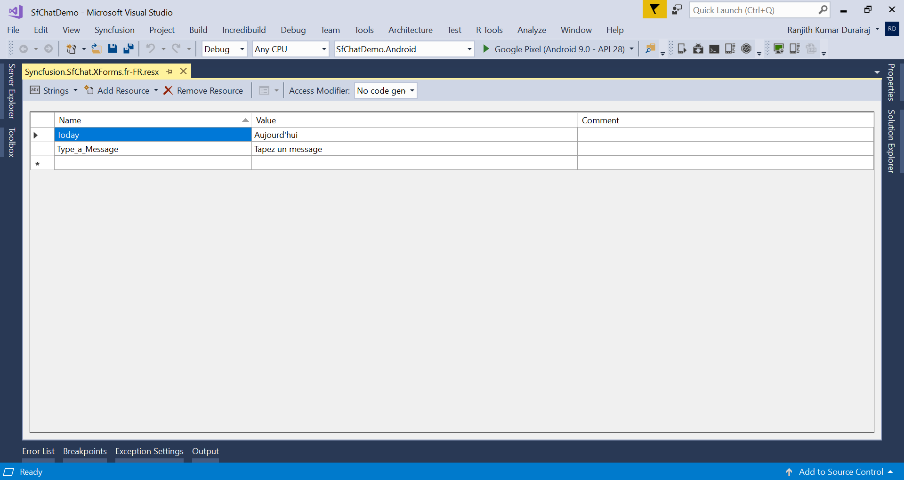
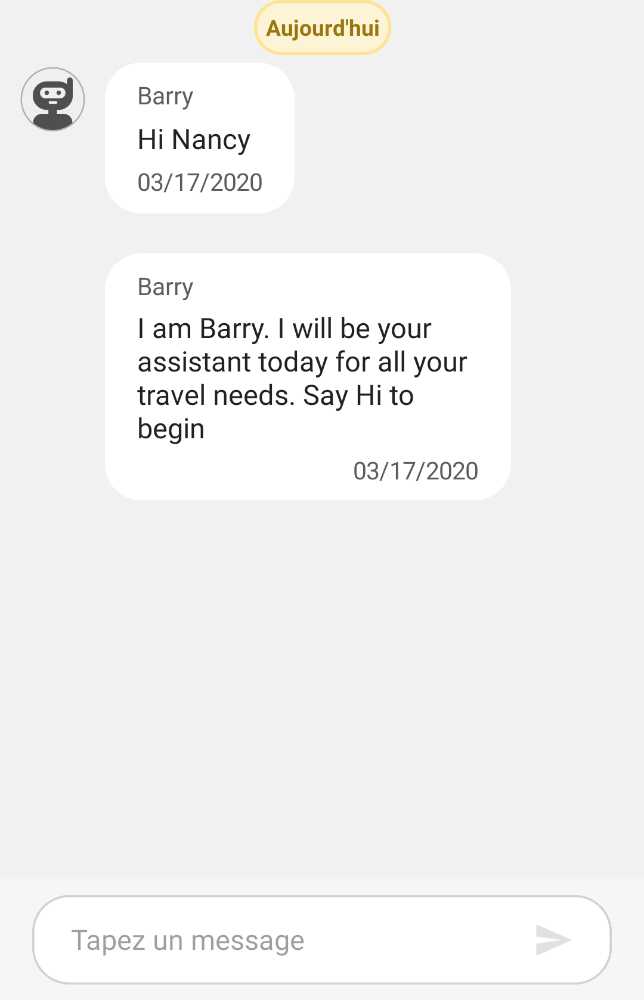

# Localization in Xamarin Chat (SfChat)

Localization is the process of translating application resources into different languages for specific cultures. SfChat uses the following static text that can be localized in application level:

* Today
* Type a Message

To localize the SfChat, follow the steps in application level:

1. Add a .resx file.
2. Convert the platform specific language format to .NET format.
3. Apply the converted format.

## Add a .resx file

In the portable project of your application, add a `.resx` file inside the resources folder with **Build Action -> EmbeddedResource**. The file name should be `Syncfusion control's Namespace + language code` format.

For example, to set the culture as French, the file should be named as **Syncfusion.SfChat.XForms.fr-FR.resx**.

Based on the language, set the appropriate equivalent text to the static text in the .resx file.

N> You should create and add separate .resx files for the individual languages.

## Convert the platform specific language format to .NET format

To get the localized text from the added `.resx` file, declare an interface named ILocalize in your PCL project and implement the interface in each platform renderer. This will query the language set in the device using platform specific code and convert this platform specific format to .NET format.

Refer to the following code snippet to declare the interface in PCL project.




public interface ILocalize
{
    CultureInfo GetCurrentCultureInfo();
    void SetLocale(CultureInfo cultureInfo);
}

public class PlatformCulture
{
    public PlatformCulture(string platformCultureString)
    {
        if (String.IsNullOrEmpty(platformCultureString))
            throw new ArgumentException("Expected culture identifier", "platformCultureString"); // in C# 6 use NameOf(platformCultureString)

        PlatformString = platformCultureString.Replace("_", "-"); // .NET expects dash, not underscore
        var dashIndex = PlatformString.IndexOf("-", StringComparison.Ordinal);
        if (dashIndex > 0)
        {
            var parts = PlatformString.Split('-');
            LanguageCode = parts[0];
            LocaleCode = parts[1];
        }
        else
        {
            LanguageCode = PlatformString;
            LocaleCode = "";
        }
    }

    public string PlatformString
    {
        get; private set;
    }

    public string LanguageCode
    {
        get; private set;
    }

    public string LocaleCode
    {
        get; private set;
    }

    public override string ToString()
    {
        return PlatformString;
    }
}




### Adding Localize class in Android and iOS project inheriting from ILocalize

Refer to the following code to implement the interface in Android renderer project.




public class Localize : ILocalize

{

    public void SetLocale(CultureInfo cultureInfo)
    {
        Thread.CurrentThread.CurrentCulture = cultureInfo;
        Thread.CurrentThread.CurrentUICulture = cultureInfo;
    }

    public CultureInfo GetCurrentCultureInfo()
    {
        var netLanguage = "en";
        var androidLocale = Java.Util.Locale.Default;
        netLanguage = AndroidToDotnetLanguage(androidLocale.ToString().Replace("_", "-"));

        // this gets called a lot - try/catch can be expensive so consider caching or something
        CultureInfo cultureInfo = null;
        try
        {
            cultureInfo = new CultureInfo(netLanguage);
        }
        catch
        {
            // iOS locale not valid .NET culture (eg. "en-ES" : English in Spain)
            // fallback to first characters, in this case "en"
            try
            {
                var fallback = ToDotnetFallbackLanguage(new PlatformCulture(netLanguage));
                cultureInfo = new CultureInfo(fallback);
            }
            catch
            {
                // iOS language not valid .NET culture, falling back to English
                cultureInfo = new CultureInfo("en");
            }
        }

        return cultureInfo;
    }

    private string AndroidToDotnetLanguage(string androidLanguage)
    {
        var netLanguage = androidLanguage;

        //certain languages need to be converted to CultureInfo equivalent
        switch (androidLanguage)
        {
            case "ms-BN":   // "Malaysian (Brunei)" not supported .NET culture
            case "ms-MY":   // "Malaysian (Malaysia)" not supported .NET culture
            case "ms-SG":   // "Malaysian (Singapore)" not supported .NET culture
                netLanguage = "ms"; // closest supported
                break;
            case "in-ID":  // "Indonesian (Indonesia)" has different code in  .NET 
                netLanguage = "id-ID"; // correct code for .NET
                break;
            case "gsw-CH":  // "Schwiizertüütsch (Swiss German)" not supported .NET culture
                netLanguage = "de-CH"; // closest supported
                break;
                // add more application-specific cases here (if required)
                // ONLY use cultures that have been tested and known to work
        }

        return netLanguage;
    }

    private string ToDotnetFallbackLanguage(PlatformCulture platformCulture)
    {
        var netLanguage = platformCulture.LanguageCode; // use the first part of the identifier (two chars, usually);

        switch (platformCulture.LanguageCode)
        {
            case "gsw":
                netLanguage = "de-CH"; // equivalent to German (Switzerland) for this app
                break;
                // add more application-specific cases here (if required)
                // ONLY use cultures that have been tested and known to work
        }

        return netLanguage;
    }

}



Refer to the following code to implement the interface in iOS renderer project.




public class Localize : ILocalize
{
    public void SetLocale(CultureInfo cultureInfo)
    {
        Thread.CurrentThread.CurrentCulture = cultureInfo;
        Thread.CurrentThread.CurrentUICulture = cultureInfo;
    }

    public CultureInfo GetCurrentCultureInfo()
    {
        var netLanguage = "en";
        if (NSLocale.PreferredLanguages.Length > 0)
        {
            var pref = NSLocale.PreferredLanguages[0];

            netLanguage = iOSToDotnetLanguage(pref);
        }

        // this gets called a lot - try/catch can be expensive so consider caching or something
        CultureInfo cultureInfo = null;
        try
        {
            cultureInfo = new CultureInfo(netLanguage);
        }
        catch
        {
            // iOS locale not valid .NET culture (eg. "en-ES" : English in Spain)
            // fallback to first characters, in this case "en"
            try
            {
                var fallback = ToDotnetFallbackLanguage(new PlatformCulture(netLanguage));
                cultureInfo = new CultureInfo(fallback);
            }
            catch
            {
                // iOS language not valid .NET culture, falling back to English
                cultureInfo = new CultureInfo("en");
            }
        }

        return cultureInfo;
    }
    private string iOSToDotnetLanguage(string iOSLanguage)
    {
        var netLanguage = iOSLanguage;

        //certain languages need to be converted to CultureInfo equivalent
        switch (iOSLanguage)
        {
            case "ms-MY":   // "Malaysian (Malaysia)" not supported .NET culture
            case "ms-SG":   // "Malaysian (Singapore)" not supported .NET culture
                netLanguage = "ms"; // closest supported
                break;
            case "gsw-CH":  // "Schwiizertüütsch (Swiss German)" not supported .NET culture
                netLanguage = "de-CH"; // closest supported
                break;
                // add more application-specific cases here (if required)
                // ONLY use cultures that have been tested and known to work
        }

        return netLanguage;
    }

    private string ToDotnetFallbackLanguage(PlatformCulture platCulture)
    {
        var netLanguage = platCulture.LanguageCode; // use the first part of the identifier (two chars, usually);

        switch (platCulture.LanguageCode)
        {
            // 
            case "pt":
                netLanguage = "pt-PT"; // fallback to Portuguese (Portugal)
                break;
            case "gsw":
                netLanguage = "de-CH"; // equivalent to German (Switzerland) for this app
                break;
                // add more application-specific cases here (if required)
                // ONLY use cultures that have been tested and known to work
        }

        return netLanguage;
    }
}




### Localize the text in UWP platform

Use `CultureInfo.CurrentUICulture` to set a specific language to the application in UWP platform.

MainPage.Xaml.cs



public MainPage()
{
    this.InitializeComponent();
    Syncfusion.XForms.UWP.Chat.SfChatRenderer.Init();
    // Applying localization for UWP
    CultureInfo.CurrentUICulture = new CultureInfo("fr");
    LoadApplication(new SfChatDemo.App());
}



## Apply the converted format 

After setting the root/main page of the application in your App.Xaml.cs file of the PCL project, initialize a new instance of the `ResourceManager` class and set it to the [ChatResourceManager.Manager](https://help.syncfusion.com/cr/xamarin/Syncfusion.XForms.ChatResourceManager.html#Syncfusion_XForms_ChatResourceManager_Manager) property to look up into the resources with specified root name in the given assembly. Using `DependencyService`, call `SetLocale()` of the implemented interface with necessary language code as parameter.




public partial class App : Application
{
    public App()
    {
        InitializeComponent();
        MainPage = new FlightBooking();
        ChatResourceManager.Manager = new ResourceManager("SfChatDemo.Syncfusion.SfChat.XForms", this.GetType().GetTypeInfo().Assembly);
        // the ResourceManager class constructor has two parameters.
        // 1. ResXPath => Full path of the resx file in the application. Here in the above line GettingStarted refers to the namespace of the Application
        // 2. Assembly => Application assembly (PCL)

        // Sets the required culture to the static texts in the control.
        if (Device.RuntimePlatform == Device.Android || Device.RuntimePlatform == Device.iOS)
        {
            DependencyService.Get<ILocalize>().SetLocale(new CultureInfo("fr-FR"));
        }
    }
}




You can download the sample from [GitHub](https://github.com/SyncfusionExamples/Localization-for-xamarin-forms-chat).
