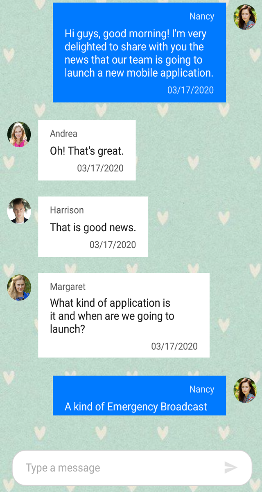
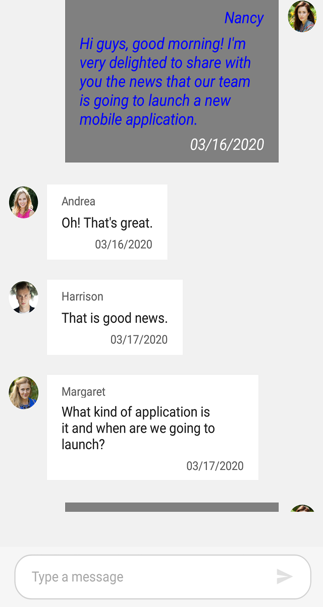
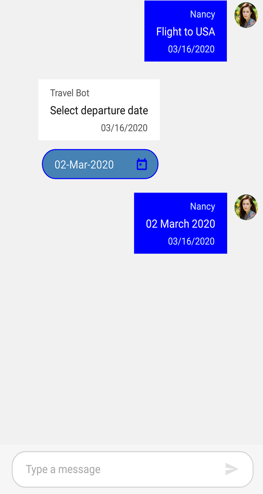
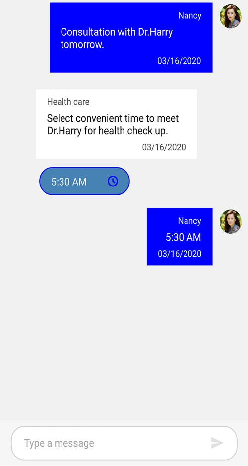
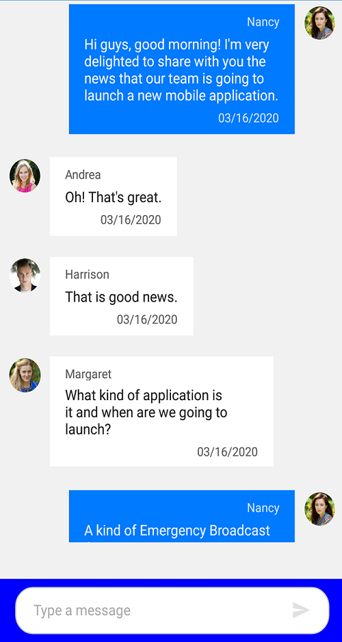
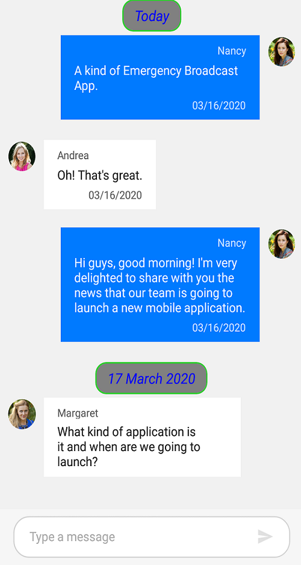
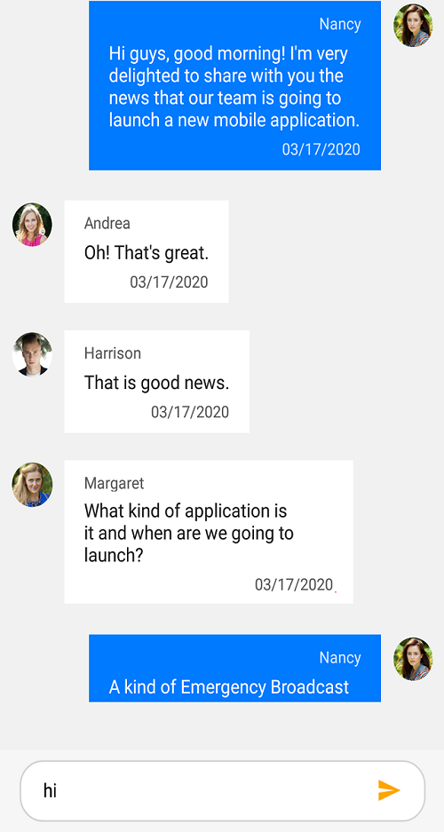

# Styling in Xamarin.Forms Chat (SfChat)

You can style the elements of the SfChat control by creating resource dictionaries and assigning values to the in-built keys assigned for each individual element.

## Default values of our keys

<table>
<tr>
<th> Key </th>
<th> Description </th>
<th> Default Value </th>
</tr>
<tr>
<td> SfChatIncomingMessageTextColor </td>
<td> Text color of the incoming message. </td>
<td> #212121 </td>
</tr>
<tr>
<td> SfChatIncomingMessageAuthorTextColor </td>
<td> Text color of the author name in an incoming message. </td>
<td> #5C5C5C </td>
</tr>
<tr>
<td> SfChatIncomingMessageTimestampTextColor </td>
<td> Text color of the timestamp in an incoming message. </td>
<td> #5C5C5C </td>
</tr>
<tr>
<td> SfChatIncomingMessageBackgroundColor </td>
<td>  Background color of the incoming message. </td>
<td> #FFFFFF </td>
</tr>
<tr>
<td> SfChatIncomingMessageFontFamily </td>
<td> Font family of the incoming message. </td>
<td> Roboto-Regular </td>
</tr>
<tr>
<td> SfChatIncomingMessageFontAttributes </td>
<td> Font attributes of the incoming message. </td>
<td> FontAttributes.None </td>
</tr>
<tr>
<td> SfChatIncomingMessageFontSize </td>
<td> Font size of the incoming message. </td>
<td> 14 </td>
</tr>
<tr>
<td> SfChatIncomingMessageAuthorFontFamily </td>
<td> Font family of the author name in an incoming message. </td>
<td> Roboto-Regular </td>
</tr>
<tr>
<td> SfChatIncomingMessageAuthorFontAttributes </td>
<td> Font attributes of the author name in an incoming message. </td>
<td> FontAttributes.None </td>
</tr>
<tr>
<td> SfChatIncomingMessageAuthorFontSize </td>
<td> Font size of the author name in an incoming message. </td>
<td> 12 </td>
</tr>
<tr>
<td> SfChatIncomingMessageTimestampFontFamily </td>
<td> Font family of the timestamp in an incoming message. </td>
<td> Roboto-Regular </td>
</tr>
<tr>
<td> SfChatIncomingMessageTimestampFontAttributes </td>
<td> Font attributes of the timestamp in an incoming message. </td>
<td> FontAttributes.None </td>
</tr>
<tr>
<td> IncomingMessageTimestampFontSize </td>
<td> Font size of the timestamp in an incoming message. </td>
<td> 12 </td>
</tr><tr>
<td> OutgoingMessageTextColor </td>
<td> Text color of outgoing message. </td>
<td> #FFFFFF </td>
</tr><tr>
<td> OutgoingMessageAuthorTextColor </td>
<td> Text color of the author name in an outgoing message. </td>
<td> #D0E8FF </td>
</tr><tr>
<td> OutgoingMessageTimestampTextColor </td>
<td> Text color of the timestamp in an outgoing message. </td>
<td> #D0E8FF </td>
</tr><tr>
<td> OutgoingMessageBackgroundColor </td>
<td> Background color of the outgoing message. </td>
<td> #007AFF </td>
</tr><tr>
<td> OutgoingMessageFontFamily </td>
<td> Font family of the outgoing message. </td>
<td> Roboto-Regular </td>
</tr><tr>
<td> OutgoingMessageFontAttributes </td>
<td> Font attributes of the outgoing message. </td>
<td> FontAttributes.None </td>
</tr><tr>
<td> OutgoingMessageFontSize </td>
<td> Font size of the outgoing message. </td>
<td> 14 </td>
</tr><tr>
<td> OutgoingMessageAuthorFontFamily </td>
<td> Font family of the author name in an outgoing message. </td>
<td> Roboto-Regular </td>
</tr><tr>
<td> OutgoingMessageAuthorFontAttributes </td>
<td> Font attributes of the author name in an outgoing message. </td>
<td> FontAttributes.None </td>
</tr><tr>
<td> OutgoingMessageAuthorFontSize </td>
<td> Font size of the author name in an outgoing message. </td>
<td> 12 </td>
</tr><tr>
<td> OutgoingMessageTimestampFontFamily </td>
<td> Font family of the timestamp in an outgoing message. </td>
<td> Roboto-Regular </td>
</tr><tr>
<td> OutgoingMessageTimestampFontAttributes </td>
<td>  Font attributes of the timestamp in an outgoing message. </td>
<td>  FontAttributes.None </td>
</tr><tr>
<td> OutgoingMessageTimestampFontSize </td>
<td> Font size of the timestamp in an outgoing message. </td>
<td> 12 </td>
</tr><tr>
<td> EditorTextColor </td>
<td> Color of the text in the editor. </td>
<td> Color.Black </td>
</tr>
<tr>
<td> EditorPlaceholderTextColor </td>
<td> Color of the placeholder text in the editor. </td>
<td> #ACACAC </td>
</tr>
<tr>
<td> EditorBorderColor </td>
<td> Color of the border in the editor. </td>
<td> #D2D2D2 </td>
</tr>
<tr>
<td> EditorBackgroundColor </td>
<td> Background color of the editor. </td>
<td> #FFFFFF </td>
</tr><tr>
<td> EditorFontFamily </td>
<td> Font family of the text in the editor. </td>
<td> Roboto-Regular </td>
</tr><tr>
<td> EditorFontAttributes </td>
<td> Font attributes of the text in the editor. </td>
<td> FontAttributes.None </td>
</tr><tr>
<td> EditorFontSize </td>
<td> Font size of the text in the editor. </td>
<td> 14 </td>
</tr><tr>
<td> SendButtonColor </td>
<td> Color of the send button. </td>
<td> #FF696969 </td>
</tr><tr>
<td> SendButtonDisabledColor </td>
<td> Color of the send button when it is in 'Disabled' state. </td>
<td> #FF696969 </td>
</tr><tr>
<td> TypingIndicatorTextColor </td>
<td> Text color in the typing indicator. </td>
<td> #5C5C5C </td>
</tr><tr>
<td> TypingIndicatorBackgroundColor </td>
<td> Background color of the typing indicator. </td>
<td> Color.Transparent </td>
</tr><tr>
<td> TypingIndicatorFontFamily </td>
<td> Font family of the text in the typing indicator. </td>
<td> Roboto-Italic </td>
</tr><tr>
<td> TypingIndicatorFontAttributes </td>
<td> Font attributes of the text in the typing indicator. </td>
<td> FontAttributes.None </td>
</tr><tr>
<td> TypingIndicatorFontSize </td>
<td> Font size of the text in the typing indicator. </td>
<td> 12 </td>
</tr><tr>
<td> TimeBreakViewTextColor </td>
<td> Text color of the text in the time break view. </td>
<td> #98770E </td>
</tr><tr>
<td> TimeBreakViewBackgroundColor </td>
<td> Background color of the time break view. </td>
<td> #FDF4D6 </td>
</tr><tr>
<td> TimeBreakViewFontFamily </td>
<td> Font family of the text in the time break view. </td>
<td> Roboto-Medium </td>
</tr><tr>
<td> TimeBreakViewFontAttributes </td>
<td> Font attributes of the text in the time break view. </td>
<td> FontAttributes.Bold </td>
</tr><tr>
<td> TimeBreakViewFontSize  </td>
<td> Font size of the text in the time break view. </td>
<td> 12 </td>
</tr><tr>
<td> SuggestionListItemTextColor </td>
<td> Text color of an item in the list of suggestions. </td>
<td> #0680F8 </td>
</tr><tr>
<td> SuggestionListItemBackgroundColor </td>
<td> Background color of an item in the list of suggestions. </td>
<td> Color.White </td>
</tr><tr>
<td> SuggestionListBackgroundColor </td>
<td> Background color of the suggestion list view. </td>
<td> Color.Transparent </td>
</tr><tr>
<td> SuggestionListItemFontFamily </td>
<td> Font family of an item in the list of suggestions. </td>
<td> Roboto-Regular </td>
</tr><tr>
<td> SuggestionListItemFontAttributes </td>
<td> Font attributes of an item in the list of suggestions. </td>
<td> FontAttributes.None </td>
</tr><tr>
<td> SuggestionListItemFontSize </td>
<td> Font size of an item in the list of suggestions. </td>
<td> 14 </td>
</tr><tr>
<td> SuggestionListItemBorderColor </td>
<td> Border color of an item in the list of suggestions. </td>
<td> #E1E1E1 </td>
</tr><tr>
<td> DatePickerIconColor </td>
<td> Color of date picker icon. </td>
<td> #FF007AFF </td>
</tr><tr>
<td> TimePickerIconColor </td>
<td> Color of time picker icon. </td>
<td> #FF007AFF </td>
</tr><tr>
<td> DatePickerTextColor </td>
<td> Color of the text in date picker.  </td>
<td> #007AFF </td>
</tr><tr>
<td> TimePickerTextColor </td>
<td> Color of the text in time picker.  </td>
<td> #007AFF </td>
</tr><tr>
<td> DatePickerBackgroundColor </td>
<td> Background color of date picker. </td>
<td> #FFFFFF </td>
</tr><tr>
<td> TimePickerBackgroundColor </td>
<td> Background color of time picker. </td>
<td> #FFFFFF </td>
</tr><tr>
<td> DatePickerBorderColor </td>
<td> Border color of date picker. </td>
<td> #007AFF </td>
</tr><tr>
<td> TimePickerBorderColor </td>
<td> Border color of time picker. </td>
<td> #007AFF </td>
</tr><tr>
<td> EditorPlaceholderTextColor </td>
<td> Place holder text color of the editor. </td>
<td> #ACACAC </td>
</tr><tr>
<td> EditorBorderColor </td>
<td> The border color of editor. </td>
<td> #D2D2D2 </td>
</tr><tr>
<td> MessageInputViewBackgroundColor </td>
<td> Message input view background color. </td>
<td> #F6F6F6 </td>
</tr><tr>
<td> TimeBreakViewBorderColor </td>
<td> Border color of the time break view. </td>
<td> #FDE490 </td>
</tr><tr>
<td> HyperlinkColor </td>
<td> Text color of the URL in a hyper link message. </td>
<td> #005DFF </td>
</tr><tr>
<td> HyperlinkDescriptionTextColor </td>
<td> Text color of the URL's meta description in a hyper link message. </td>
<td> #5C5C5C </td>
</tr><tr>
<td> HyperlinkDescriptionBackgroundColor </td>
<td> Background color of the URL description area in a hyper link message. </td>
<td> #F7F7F7 </td>
</tr><tr>
<td> HyperlinkMetaTitleTextColor </td>
<td> Text color of the URL's meta title in a hyper link message. </td>
<td> #212121 </td>
</tr><tr>
<td> CalendarBackgroundColor </td>
<td> Background color of the calendar message. </td>
<td> #FAFAFA </td>
</tr>
</table>

## Chat Background

You can set any solid color as background for SfChat by setting the [SfChat.BackgroundColor](https://help.syncfusion.com/cr/xamarin/Syncfusion.SfChat.XForms~Syncfusion.XForms.Chat.SfChat~BackgroundColor.html) property.





<?xml version="1.0" encoding="utf-8" ?>
<ContentPage xmlns="http://xamarin.com/schemas/2014/forms"
             xmlns:x="http://schemas.microsoft.com/winfx/2009/xaml"
             xmlns:local="clr-namespace:SampleBrowser.SfChat"
             xmlns:chat="clr-namespace:Syncfusion.XForms.Chat;assembly=Syncfusion.SfChat.XForms"
             x:Class="SfChat.MainPage">
    <ContentPage.BindingContext>
        <local:ViewModel/>
    </ContentPage.BindingContext>
	<ContentPage.Resources>
        <syncTheme:SyncfusionThemeDictionary>
            <syncTheme:SyncfusionThemeDictionary.MergedDictionaries>
                <ResourceDictionary>
                    <x:String x:Key="SfChatTheme">CustomTheme</x:String>
                    <Color x:Key="SfChatMessageInputViewBackgroundColor">Transparent</Color>
                </ResourceDictionary>
            </syncTheme:SyncfusionThemeDictionary.MergedDictionaries>
        </syncTheme:SyncfusionThemeDictionary>
    </ContentPage.Resources>
    <ContentPage.Content>
       <chat:SfChat CurrentUser="{Binding CurrentUser}" 
                    BackgroundColor="Gray"
                    Messages="{Binding Messages}">
        </chat:SfChat>
    </ContentPage.Content>
</ContentPage>





//MainPage.cs

    public partial class MainPage : ContentPage
    {
        Syncfusion.XForms.Chat.SfChat sfChat = new Syncfusion.XForms.Chat.SfChat();
        ViewModel viewModel;
        public MainPage()
        {
            this.InitializeComponent();
            sfChat.BackgroundColor = Color.Gray;
            this.viewModel = new ViewModel();
            this.sfChat.Messages = viewModel.Messages;
            this.sfChat.CurrentUser = viewModel.CurrentUser;
            this.Content = sfChat;
        }
    }





Executing the above codes renders the following output.

### Set background image

You can set any image as background for the SfChat by setting the `SfChat.BackgroundColor` as `Color.Transparent` and adding an image below the SfChat control.





<?xml version="1.0" encoding="utf-8" ?>
<ContentPage xmlns="http://xamarin.com/schemas/2014/forms"
             xmlns:x="http://schemas.microsoft.com/winfx/2009/xaml"
             xmlns:local="clr-namespace:SampleBrowser.SfChat"
             xmlns:chat="clr-namespace:Syncfusion.XForms.Chat;assembly=Syncfusion.SfChat.XForms"
             x:Class="SfChat.MainPage">
    <ContentPage.BindingContext>
        <local:ViewModel/>
    </ContentPage.BindingContext>
	<ContentPage.Resources>
        <syncTheme:SyncfusionThemeDictionary>
            <syncTheme:SyncfusionThemeDictionary.MergedDictionaries>
                <ResourceDictionary>
                    <x:String x:Key="SfChatTheme">CustomTheme</x:String>
                    <Color x:Key="SfChatMessageInputViewBackgroundColor">Transparent</Color>
                </ResourceDictionary>
            </syncTheme:SyncfusionThemeDictionary.MergedDictionaries>
        </syncTheme:SyncfusionThemeDictionary>
    </ContentPage.Resources>
    <ContentPage.Content>
        <Grid>
		    <Image Source="BackgroundImage.jpg" Aspect="AspectFill"/>
            <chat:SfChat   CurrentUser="{Binding CurrentUser}" 
                        BackgroundColor="Transparent"
                        Messages="{Binding Messages}">
            </chat:SfChat>
        </Grid>
    </ContentPage.Content>
</ContentPage>





//MainPage.cs

    public partial class MainPage : ContentPage
    {
        Grid grid = new Grid();
        Syncfusion.XForms.Chat.SfChat sfChat = new Syncfusion.XForms.Chat.SfChat();
        Image image = new Image();
        ViewModel viewModel;
        public MainPage()
        {
            this.InitializeComponent();
            image.Source = "BackgroundImage.jpg";
            image.Aspect = Aspect.AspectFill;
            grid.Children.Add(image);
            sfChat.BackgroundColor = Color.Transparent;
            this.viewModel = new ViewModel();
            this.sfChat.Messages = viewModel.Messages;
            this.sfChat.CurrentUser = viewModel.CurrentUser;
            grid.Children.Add(sfChat);
            this.Content = grid;
        }
    }





Executing the above codes render the following output.

### Set gradient background

You can set the gradient view as a background for chat by setting the `SfChat.BackgroundColor` property as `Color.Transparent` and adding the gradient view below the SfChat control.





<?xml version="1.0" encoding="utf-8" ?>
<ContentPage xmlns="http://xamarin.com/schemas/2014/forms"
             xmlns:x="http://schemas.microsoft.com/winfx/2009/xaml"
             xmlns:local="clr-namespace:SampleBrowser.SfChat"
             xmlns:chat="clr-namespace:Syncfusion.XForms.Chat;assembly=Syncfusion.SfChat.XForms"
             xmlns:gradient ="clr-namespace:Syncfusion.XForms.Graphics;assembly=Syncfusion.Core.XForms"
             x:Class="SfChat.MainPage">
    <ContentPage.BindingContext>
        <local:ViewModel/>
    </ContentPage.BindingContext>
	<ContentPage.Resources>
        <syncTheme:SyncfusionThemeDictionary>
            <syncTheme:SyncfusionThemeDictionary.MergedDictionaries>
                <ResourceDictionary>
                    <x:String x:Key="SfChatTheme">CustomTheme</x:String>
                    <Color x:Key="SfChatMessageInputViewBackgroundColor">Transparent</Color>
                </ResourceDictionary>
            </syncTheme:SyncfusionThemeDictionary.MergedDictionaries>
        </syncTheme:SyncfusionThemeDictionary>
    </ContentPage.Resources>
    <ContentPage.Content>
        <Grid>
		    <gradient:SfGradientView>
                <gradient:SfGradientView.BackgroundBrush>
                    <gradient:SfLinearGradientBrush>
                        <gradient:SfLinearGradientBrush.GradientStops>
                            <gradient:SfGradientStop Color="SkyBlue" Offset="0.0" />
							<gradient:SfGradientStop Color="LightCyan" Offset="0.25" />
							<gradient:SfGradientStop Color="SteelBlue" Offset="0.5" />
							<gradient:SfGradientStop Color="LightSkyBlue" Offset="0.75" />
                            <gradient:SfGradientStop Color="LightGray" Offset="1.0" />
                        </gradient:SfLinearGradientBrush.GradientStops>
                    </gradient:SfLinearGradientBrush>
                </gradient:SfGradientView.BackgroundBrush>
            </gradient:SfGradientView>
            <chat:SfChat CurrentUser="{Binding CurrentUser}" 
                         BackgroundColor="Transparent"
                         Messages="{Binding Messages}">
            </chat:SfChat>
        </Grid>
    </ContentPage.Content>
</ContentPage>





//MainPage.cs

    public partial class MainPage : ContentPage
    {
       Grid grid = new Grid();
       Syncfusion.XForms.Chat.SfChat sfChat = new Syncfusion.XForms.Chat.SfChat();
       
        ViewModel viewModel;
        public MainPage()
        {
            this.InitializeComponent();
            SfGradientView gradientView = new SfGradientView();
            SfLinearGradientBrush linearGradientBrush = new SfLinearGradientBrush();
            linearGradientBrush.GradientStops = new GradientStopCollection()
            {
                new SfGradientStop(){Color = Color.SkyBlue, Offset=0.0},
                new SfGradientStop(){Color = Color.LightCyan, Offset=0.25},
                new SfGradientStop(){Color = Color.SteelBlue, Offset=0.5},
                new SfGradientStop(){Color = Color.LightBlue, Offset=0.75},
                new SfGradientStop(){Color = Color.LightGray, Offset=1.0},
            };
            gradientView.BackgroundBrush = linearGradientBrush;
            grid.Children.Add(gradientView);
            sfChat.BackgroundColor = Color.Transparent;
            this.viewModel = new ViewModel();
            this.sfChat.Messages = viewModel.Messages;
            this.sfChat.CurrentUser = viewModel.CurrentUser;
            grid.Children.Add(sfChat);
            this.Content = grid;
        }
    }





Run the application to render the following output.

## Incoming Message Styling

You can style the elements of an incoming message by setting values to the in-built keys of an incoming message in resource dictionary.

<table>
<tr>
<th>Key</th>
<th>Description </th>
<tr>
<td> SfChatIncomingMessageTextColor </td>
<td> Text color of the incoming message. </td>
</tr>
<tr>
<td> SfChatIncomingMessageAuthorTextColor </td>
<td> Text color of the author name in an incoming message. </td>
</tr>
<tr>
<td> SfChatIncomingMessageTimestampTextColor </td>
<td> Text color of the timestamp in an incoming message. </td>
</tr>
<tr>
<td> SfChatIncomingMessageBackgroundColor </td>
<td> Background color of the incoming message. </td>
</tr>
<tr>
<td> SfChatIncomingMessageFontFamily </td>
<td> Font family of the incoming message. </td>
</tr>
<tr>
<td> SfChatIncomingMessageFontAttributes </td>
<td> Font attributes of the incoming message. </td>
</tr>
<tr>
<td> SfChatIncomingMessageFontSize </td>
<td> Font size of the incoming message. </td>
</tr>
<tr>
<td> SfChatIncomingMessageAuthorFontFamily </td>
<td> Font family of the author name in an incoming message. </td>
</tr>
<tr>
<td> SfChatIncomingMessageAuthorFontAttributes </td>
<td> Font attributes of the author name in an incoming message. </td>
</tr>
<tr>
<td> SfChatIncomingMessageAuthorFontSize </td>
<td> Font size of the author name in an incoming message. </td>
</tr>
<tr>
<td> SfChatIncomingMessageTimestampFontFamily </td>
<td> Font family of the timestamp in an incoming message. </td>
</tr>
<tr>
<td> SfChatIncomingMessageTimestampFontAttributes </td>
<td> Font attributes of the timestamp in an incoming message. </td>
</tr>
<tr>
<td> SfChatIncomingMessageTimestampFontSize </td>
<td> Font size of the timestamp in an incoming message. </td>
</tr>
</table>





    <ContentPage.Resources>
        <syncTheme:SyncfusionThemeDictionary>
            <syncTheme:SyncfusionThemeDictionary.MergedDictionaries>
                <ResourceDictionary>
                    <x:String x:Key="SfChatTheme">CustomTheme</x:String>
                    <Color x:Key="SfChatIncomingMessageTextColor">SlateGray</Color>
                    <Color x:Key="SfChatIncomingMessageTimestampTextColor">White</Color>
                    <Color x:Key="SfChatIncomingMessageAuthorTextColor">Gray</Color>
                    <Color x:Key="SfChatIncomingMessageBackgroundColor">Blue</Color>
                    <x:String x:Key="SfChatIncomingMessageFontFamily">Roboto-Medium</x:String>
                    <FontAttributes x:Key="SfChatIncomingMessageFontAttributes">Italic</FontAttributes>
                    <x:Double x:Key="SfChatIncomingMessageFontSize"> 16</x:Double>
                    <x:String x:Key="SfChatIncomingMessageAuthorFontFamily">Roboto-Medium</x:String>
                    <FontAttributes x:Key="SfChatIncomingMessageAuthorFontAttributes">Italic</FontAttributes>
                    <x:Double x:Key="SfChatIncomingMessageAuthorFontSize">16</x:Double>
                    <x:String x:Key="SfChatIncomingMessageTimestampFontFamily">Roboto-Medium</x:String>
                    <FontAttributes x:Key="SfChatIncomingMessageTimestampFontAttributes">Italic</FontAttributes>
                    <x:Double x:Key="SfChatIncomingMessageTimestampFontSize">16</x:Double>
                </ResourceDictionary>
            </syncTheme:SyncfusionThemeDictionary.MergedDictionaries>
        </syncTheme:SyncfusionThemeDictionary>
    </ContentPage.Resources>





//MainPage.cs

public MainPage()
{
    InitializeComponent();
    ResourceDictionary dictionary = new ResourceDictionary();
    dictionary.Add("SfChatTheme", "CustomTheme");
    dictionary.Add("SfChatIncomingMessageTextColor", Color.SlateGray);
    dictionary.Add("SfChatIncomingMessageTimestampTextColor", Color.White);
    dictionary.Add("SfChatIncomingMessageAuthorTextColor", Color.Gray);
    dictionary.Add("SfChatIncomingMessageBackgroundColor", Color.Blue);
    dictionary.Add("SfChatIncomingMessageFontFamily", "Roboto-Regular");
    dictionary.Add("SfChatIncomingMessageFontAttributes", FontAttributes.Italic);
    dictionary.Add("SfChatIncomingMessageFontSize", 16);
    dictionary.Add("SfChatIncomingAuthorFontFamily", "Roboto-Regular");
    dictionary.Add("SfChatIncomingAuthorFontAttributes", FontAttributes.Italic);
    dictionary.Add("SfChatIncomingAuthorFontSize", 16);
    dictionary.Add("SfChatIncomingTimestampFontFamily", "Roboto-Regular");
    dictionary.Add("SfChatIncomingTimestampFontAttributes", FontAttributes.Italic);
    dictionary.Add("SfChatIncomingTimestampFontSize", 16);
    this.Resources.Add(dictionary);
}





Executing the above codes renders the following output.

## Outgoing message styling

You can style the elements of an outgoing message by setting values to the in-built keys of an outgoing message in resource dictionary.

<table>
<tr>
<th> Key </th>
<th> Description </th>
</tr>
<td> SyncPrimaryForegroundColor </td>
<td> Text color of outgoing message. </td>
</tr><tr>
<td> sfChatOutgoingMessageAuthorTextColor </td>
<td> Text color of the author name in an outgoing message. </td>
</tr><tr>
<td> sfChatOutgoingMessageTimestampTextColor </td>
<td> Text color of the timestamp in an outgoing message. </td>
</tr><tr>
<td> SyncPrimaryColor </td>
<td> Background color of the outgoing message. </td>
</tr><tr>
<td> sfChatOutgoingMessageFontFamily </td>
<td> Font family of the outgoing message. </td>
</tr><tr>
<td> sfChatOutgoingMessageFontAttributes </td>
<td> Font attributes of the outgoing message. </td>
</tr><tr>
<td> sfChatOutgoingMessageFontSize </td>
<td> Font size of the outgoing message. </td>
</tr><tr>
<td> sfChatOutgoingMessageAuthorFontFamily </td>
<td> Font family of the author name in an outgoing message. </td>
</tr><tr>
<td> sfChatOutgoingMessageAuthorFontAttributes </td>
<td> Font attributes of the author name in an outgoing message. </td>
</tr><tr>
<td> sfChatOutgoingMessageAuthorFontSize </td>
<td> Font size of the author name in an outgoing message. </td>
</tr><tr>
<td> sfChatOutgoingMessageTimestampFontFamily </td>
<td> Font family of the timestamp in an outgoing message. </td>
</tr><tr>
<td> sfChatOutgoingMessageTimestampFontAttributes </td>
<td>  Font attributes of the timestamp in an outgoing message. </td>
</tr><tr>
<td> SfChatOutgoingMessageTimestampFontSize </td>
<td> Font size of the timestamp in an outgoing message. </td>
</tr>
</table>





    <ContentPage.Resources>
        <syncTheme:SyncfusionThemeDictionary>
            <syncTheme:SyncfusionThemeDictionary.MergedDictionaries>
                <ResourceDictionary>
                    <x:String x:Key="SfChatTheme">CustomTheme</x:String>
                    <Color x:Key="SyncPrimaryForegroundColor">Blue</Color>
                    <Color x:Key="SyncPrimaryColor">Gray</Color>
                    <Color x:Key="SfChatOutgoingMessageTimestampTextColor">White</Color>
                    <Color x:Key="SfChatOutgoingMessageAuthorTextColor">Blue</Color>
                    <x:String x:Key="SfChatOutgoingMessageFontFamily">Roboto-Medium</x:String>
                    <FontAttributes x:Key="SfChatOutgoingMessageFontAttributes">Italic</FontAttributes>
                    <x:Double x:Key="SfChatOutgoingMessageFontSize"> 16</x:Double>
                    <x:String x:Key="SfChatOutgoingingMessageAuthorFontFamily">Roboto-Medium</x:String>
                    <FontAttributes x:Key="SfChatOutgoingMessageAuthorFontAttributes">Italic</FontAttributes>
                    <x:Double x:Key="SfChatOutgoingMessageAuthorFontSize">16</x:Double>
                    <x:String x:Key="SfChatOutgoingMessageTimestampFontFamily">Roboto-Medium</x:String>
                    <FontAttributes x:Key="SfChatOutgoingMessageTimestampFontAttributes">Italic</FontAttributes>
                    <x:Double x:Key="SfChatOutgoingMessageTimestampFontSize">16</x:Double>
                </ResourceDictionary>
            </syncTheme:SyncfusionThemeDictionary.MergedDictionaries>
        </syncTheme:SyncfusionThemeDictionary>
    </ContentPage.Resources>





//MainPage.cs

public MainPage()
{
    InitializeComponent();
    ResourceDictionary dictionary = new ResourceDictionary();
    dictionary.Add("SfChatTheme", "CustomTheme");
    dictionary.Add("SyncPrimaryForegroundColor", Color.Blue);
    dictionary.Add("SfChatOutingMessageTimestampTextColor", Color.White);
    dictionary.Add("SfChatOutingMessageAuthorTextColor", Color.Gray);
    dictionary.Add("SyncPrimaryColor", Color.Blue);
    dictionary.Add("SfChatOutgoingMessageFontFamily", "Roboto-Regular");
    dictionary.Add("SfChatOutgoingMessageFontAttributes", FontAttributes.Italic);
    dictionary.Add("SfChatOutgoingMessageFontSize", 16);
    dictionary.Add("SfChatOutgoingAuthorFontFamily", "Roboto-Regular");
    dictionary.Add("SfChatOutgoingAuthorFontAttributes", FontAttributes.Italic);
    dictionary.Add("SfChatOutgoingAuthorFontSize", 16);
    dictionary.Add("SfChatOutgoingTimestampFontFamily", "Roboto-Regular");
    dictionary.Add("SfChatOutgoingTimestampFontAttributes", FontAttributes.Italic);
    dictionary.Add("SfChatOutgoingTimestampFontSize", 16);
    this.Resources.Add(dictionary);
}





Executing the above codes renders the following output.

## Calendar Message styling

You can style the elements of a calendar message by setting values to the in-built keys of a calendar message in resource dictionary.

<table>
<tr>
<th> Key </th>
<th> Description </th>
</tr>
<tr>
<td> SfChatCalendarBackgroundColor </td>
<td> Background color of the calendar message. </td>
</tr>
</table>





    <ContentPage.Resources>
        <syncTheme:SyncfusionThemeDictionary>
            <syncTheme:SyncfusionThemeDictionary.MergedDictionaries>
                <ResourceDictionary>
                    <x:String x:Key="SfChatTheme">CustomTheme</x:String>
                    <Color x:Key="SfChatCalendarBackgroundColor">Gray</Color>
                </ResourceDictionary>
            </syncTheme:SyncfusionThemeDictionary.MergedDictionaries>
        </syncTheme:SyncfusionThemeDictionary>
    </ContentPage.Resources>





//MainPage.cs

public MainPage()
{
    ....
    InitializeComponent();
    ResourceDictionary dictionary = new ResourceDictionary();
    dictionary.Add("SfChatTheme", "CustomTheme");
    dictionary.Add("SfChatCalendarBackgroundColor", Color.Gray);
	this.Resources.Add(dictionary);
    ....
}





In addition to this you can write target style to SfCalendar control to style the inner elements of the calendar like selection bacground color, foreground color etc.

## Hyperlink message styling

You can style the elements of a hyperlink message by setting values to the in-built keys of a hyeprlink message in resource dictionary.

<table>
<tr>
<th> Key </th>
<th> Description </th>
</tr>
<tr>
<td> SfChatHyperlinkColor </td>
<td> Text color of the URL in a hyper link message. </td>
</tr><tr>
<td> SfChatHyperlinkDescriptionTextColor </td>
<td> Text color of the URL's meta description in a hyper link message. </td>
</tr><tr>
<td> sfChatHyperlinkDescriptionBackgroundColor </td>
<td> Background color of the URL description area in a hyper link message. </td>
</tr><tr>
<td> SfChatHyperlinkMetaTitleTextColor </td>
<td> Text color of the URL's meta title in a hyper link message. </td>
</tr>
</table>





    <ContentPage.Resources>
        <syncTheme:SyncfusionThemeDictionary>
            <syncTheme:SyncfusionThemeDictionary.MergedDictionaries>
                <ResourceDictionary>
                    <x:String x:Key="SfChatTheme">CustomTheme</x:String>
                    <Color x:Key="SfChatHyperlinkColor">Gray</Color>
                    <Color x:Key="SfChatHyperlinkMetaTitleTextColor">Red</Color>
                    <Color x:Key="SfChatHyperlinkDescriptionTextColor">Blue</Color>
                    <Color x:Key="SfChatHyperlinkDescriptionBackgroundColor">Gray</Color>
                </ResourceDictionary>
            </syncTheme:SyncfusionThemeDictionary.MergedDictionaries>
        </syncTheme:SyncfusionThemeDictionary>
    </ContentPage.Resources>





//MainPage.cs

public MainPage()
{
    ....
    InitializeComponent();
    ResourceDictionary dictionary = new ResourceDictionary();
    dictionary.Add("SfChatTheme", "CustomTheme");
    dictionary.Add("SfChatHyperlinkColor", Color.Gray);
    dictionary.Add("SfChatHyperlinkMetaTitleTextColor", Color.Red);
    dictionary.Add("SfChatHyperlinkDescriptionTextColor", Color.Blue);
    dictionary.Add("SfChatHyperlinkDescriptionBackgroundColor", Color.Gray);
	this.Resources.Add(dictionary);
    ....
}





Exceuting the above codes renders the following output.

## Date Picker message styling

You can style the elements of a date picker message by setting values to the in-built keys of a date picker message in resource dictionary.

<table>
<tr>
<th> Key </th>
<th> Description </th>
</tr>
<tr>
<td> SyncPrimaryColor </td>
<td> Color of date picker icon. </td>
</tr>
<tr>
<td> SyncPrimaryLightColor </td>
<td> Color of the text in date picker.  </td>
</tr>
<tr>
<td> SfChatDatePickerBackgroundColor </td>
<td> Background color of date picker. </td>
</tr>
<tr>
<td> SyncPrimaryColor </td>
<td> Border color of date picker. </td>
</tr>
</table>





    <ContentPage.Resources>
        <syncTheme:SyncfusionThemeDictionary>
            <syncTheme:SyncfusionThemeDictionary.MergedDictionaries>
                <ResourceDictionary>
                    <x:String x:Key="SfChatTheme">CustomTheme</x:String>
                    <Color x:Key="SyncPrimaryColor">Blue</Color>
                    <Color x:Key="SyncPrimaryLightColor">White</Color>
                    <Color x:Key="SfChatDatePickerBackgroundColor">SteelBlue</Color>
                </ResourceDictionary>
            </syncTheme:SyncfusionThemeDictionary.MergedDictionaries>
        </syncTheme:SyncfusionThemeDictionary>
    </ContentPage.Resources>





//MainPage.cs

public MainPage()
{
    ....
    InitializeComponent();
    ResourceDictionary dictionary = new ResourceDictionary();
    dictionary.Add("SfChatTheme", "CustomTheme");
    dictionary.Add("SfChatDatePickerBackgroundColor", Color.SteelBlue);
    dictionary.Add("SyncPrimaryLightColor", Color.White);
    dictionary.Add("SyncPrimaryColor", Color.Blue);
	this.Resources.Add(dictionary);
    ....
}





Executing the above codes renders the following output.

## Time Picker message styling

You can style the elements of a time picker message by setting values to the in-built keys of a time picker message in resource dictionary.

<table>
<tr>
<th> Key </th>
<th> Description </th>
</tr>
<tr>
<td> SyncPrimaryColor </td>
<td> Color of time picker icon. </td>
</tr><tr>
<td> SyncPrimaryLightColor </td>
<td> Color of the text in time picker.  </td>
</tr><tr>
<td> SyncPrimaryColor </td>
<td> Background color of time picker. </td>
</tr><tr>
<td> TimePickerBorderColor </td>
<td> Border color of time picker. </td>
</tr>
</table>





    <ContentPage.Resources>
        <syncTheme:SyncfusionThemeDictionary>
            <syncTheme:SyncfusionThemeDictionary.MergedDictionaries>
                <ResourceDictionary>
                    <x:String x:Key="SfChatTheme">CustomTheme</x:String>
                    <Color x:Key="SyncPrimaryColor">Blue</Color>
                    <Color x:Key="SyncPrimaryLightColor">White</Color>
                    <Color x:Key="SfChatTimePickerBackgroundColor">SteelBlue</Color>
                 </ResourceDictionary>
            </syncTheme:SyncfusionThemeDictionary.MergedDictionaries>
        </syncTheme:SyncfusionThemeDictionary>
    </ContentPage.Resources>





//MainPage.cs

public MainPage()
{
    ....
    InitializeComponent();
    ResourceDictionary dictionary = new ResourceDictionary();
    dictionary.Add("SfChatTheme", "CustomTheme");
    dictionary.Add("SfChatDatePickerBackgroundColor", Color.SteelBlue);
    dictionary.Add("SyncPrimaryLightColor", Color.White);
    dictionary.Add("SyncPrimaryColor", Color.Blue);
	this.Resources.Add(dictionary);
    ....
}





Exceuting the above codes renders the following output.

## Message input view styling

You can style the elements of the message input view by setting values to the in-built keys of the message input view in resource dictionary.

<table>
<tr>
<th> Key </th>
<th> Description </th>
</tr>
<tr>
<td> SfChatMessageInputViewBackgroundColor </td>
<td> Message input view background color. </td>
</tr>
</table>





    <ContentPage.Resources>
        <syncTheme:SyncfusionThemeDictionary>
            <syncTheme:SyncfusionThemeDictionary.MergedDictionaries>
                <ResourceDictionary>
                    <x:String x:Key="SfChatTheme">CustomTheme</x:String>
                    <Color x:Key="SfChatMessageInputViewBackgroundColor">Blue</Color>
                 </ResourceDictionary>
            </syncTheme:SyncfusionThemeDictionary.MergedDictionaries>
        </syncTheme:SyncfusionThemeDictionary>
    </ContentPage.Resources>





//MainPage.cs

public MainPage()
{
    ....
    InitializeComponent();
    ResourceDictionary dictionary = new ResourceDictionary();
    dictionary.Add("SfChatTheme", "CustomTheme");
	dictionary.Add("SfChatMessageInputViewBackgroundColor", Color.Blue);
	this.Resources.Add(dictionary);
    ....
}





Executing the above code renders the following output.

## Editor styling

You can style the elements of the editor view by setting values to the in-built keys of the editor view in resource dictionary.

<table>
<tr>
<th> Key </th>
<th> Description </th>
</tr>
<tr>
<td> SfChatEditorTextColor </td>
<td> Color of the text in the editor. </td>
</tr>
<td> SfChatEditorPlaceholderTextColor </td>
<td> Color of the placeholder text in the editor. </td>
</tr>
<tr>
<td> SfChatEditorBorderColor </td>
<td> Color of the border in the editor. </td>
</tr><tr>
<td> SfChatEditorBackgroundColor </td>
<td> Background color of the editor. </td>
</tr><tr>
<td> SfChatEditorFontFamily </td>
<td> Font family of the text in the editor. </td>
</tr><tr>
<td> SfChatEditorFontAttributes </td>
<td> Font attributes of the text in the editor. </td>
</tr><tr>
<td> SfChatEditorFontSize </td>
<td> Font size of the text in the editor. </td>
</tr><tr>
</table>





    <ContentPage.Resources>
        <syncTheme:SyncfusionThemeDictionary>
            <syncTheme:SyncfusionThemeDictionary.MergedDictionaries>
                <ResourceDictionary>
                    <x:String x:Key="SfChatTheme">CustomTheme</x:String>
                    <Color x:Key="SfChatEditorPlaceholderTextColor">Blue</Color>
                    <Color x:Key="SfChatEditorTextColor">Gray</Color>
                    <Color x:Key="SfChatEditorBackgroundColor">Violet</Color>
                    <Color x:Key="SfChatEditorBorderColor">Black</Color>
                    <x:String x:Key="SfChatEditorFontFamily">Roboto-Medium</x:String>
                    <FontAttributes x:Key="SfChatEditorFontAttributes">Bold</FontAttributes>
                    <x:Double x:Key="SfChatEditorFontSize">16</x:Double>
                </ResourceDictionary>
            </syncTheme:SyncfusionThemeDictionary.MergedDictionaries>
        </syncTheme:SyncfusionThemeDictionary>
    </ContentPage.Resources>





//MainPage.cs

public MainPage()
{
    ....
    InitializeComponent();
    ResourceDictionary dictionary = new ResourceDictionary();
    dictionary.Add("SfChatTheme", "CustomTheme");
    dictionary.Add("SfChatEditorPlaceholderTextColor", Color.Blue);
    dictionary.Add("SfChatEditorBackgroundColor", Color.Violet);
    dictionary.Add("SfChatEditorTextColor", Color.Gray);
	dictionary.Add("SfChatEditorBorderColor", Color.Black);
    dictionary.Add("SfChatEditorFontFamily", "Roboto-Medium");
    dictionary.Add("SfChatEditorFontAttributes", FontAttributes.Italic);
    dictionary.Add("SfChatEditorFontSize", 16);
	this.Resources.Add(dictionary);
    ....
}





Executing the above code renders the following output.

## Typing Indicator styling

You can style the elements of the typing indicator view by setting values to the in-built keys of the typing indicator view in resource dictionary.

<table>
<tr>
<th> Key </th>
<th> Description </th>
</tr>
<tr>
<td> SfChatTypingIndicatorTextColor </td>
<td> Text color in the typing indicator. </td>
</tr><tr>
<td> SfChatTypingIndicatorBackgroundColor </td>
<td> Background color of the typing indicator. </td>
</tr><tr>
<td> SfChatTypingIndicatorFontFamily </td>
<td> Font family of the text in the typing indicator. </td>
</tr><tr>
<td> SfChatTypingIndicatorFontAttributes </td>
<td> Font attributes of the text in the typing indicator. </td>
</tr><tr>
<td> SfChatTypingIndicatorFontSize </td>
<td> Font size of the text in the typing indicator. </td>
</tr>
</table>





    <ContentPage.Resources>
        <syncTheme:SyncfusionThemeDictionary>
            <syncTheme:SyncfusionThemeDictionary.MergedDictionaries>
                <ResourceDictionary>
                    <x:String x:Key="SfChatTheme">CustomTheme</x:String>
                    <Color x:Key="SfChatTypingIndicatorTextColor">Blue</Color>
                    <Color x:Key="SfChatTypingIndicatorBackgroundColor">Gray</Color>
                    <x:String x:Key="SfChatTypingIndicatorFontFamily">Roboto-Medium</x:String>
                    <FontAttributes x:Key="SfChatTypingIndicatorFontAttributes">Italic</FontAttributes>
                    <x:Double x:Key="SfChatTypingIndicatorFontSize">16</x:Double>
                </ResourceDictionary>
            </syncTheme:SyncfusionThemeDictionary.MergedDictionaries>
        </syncTheme:SyncfusionThemeDictionary>
    </ContentPage.Resources>





//MainPage.cs

public MainPage()
{
    ....
    InitializeComponent();
    ResourceDictionary dictionary = new ResourceDictionary();
    dictionary.Add("SfChatTheme", "CustomTheme");
    dictionary.Add("SfChatTypingIndicatorBackgroundColor", Color.Gray);
    dictionary.Add("SfChatTypingIndicatorTextColor", Color.Blue);
    dictionary.Add("SfChatTypingIndicatorFontFamily", "Roboto-Regular");
    dictionary.Add("SfChatTypingIndicatorFontAttributes", FontAttributes.Italic);
    dictionary.Add("SfChatTypingIndicatorFontSize", 16);
	this.Resources.Add(dictionary);
    ....
}





Executing the above code renders the following output.

## Time break view styling

You can style the elements of the time break view by setting values to the in-built keys of the time break view in resource dictionary.

<table>
<tr>
<th> Key </th>
<th> Description </th>
</tr>
<tr>
<td> SyncPrimaryLightColor </td>
<td> Text color of the text in the time break view. </td>
</tr><tr>
<td> SfChatTimeBreakViewBackgroundColor </td>
<td> Background color of the time break view. </td>
</tr><tr>
<td> SfChatTimeBreakViewFontFamily </td>
<td> Font family of the text in the time break view. </td>
</tr><tr>
<td> SfChatTimeBreakViewFontAttributes </td>
<td> Font attributes of the text in the time break view. </td>
</tr><tr>
<td> SfChatTimeBreakViewFontSize  </td>
<td> Font size of the text in the time break view. </td>
</tr>
<tr>
<td> SfChatTimeBreakViewBorderColor </td>
<td> Border color of the time break view. </td>
</tr>
</table>





    <ContentPage.Resources>
        <syncTheme:SyncfusionThemeDictionary>
            <syncTheme:SyncfusionThemeDictionary.MergedDictionaries>
                <ResourceDictionary>
                    <x:String x:Key="SfChatTheme">CustomTheme</x:String>
                    <Color x:Key="SyncPrimaryLightColor">Blue</Color>
                    <Color x:Key="SfChatTimeBreakViewBackgroundColor">Gray</Color>
                    <Color x:Key="SfChatTimeBreakViewBorderColor">LimeGreen</Color>
                    <x:String x:Key="SfChatTimeBreakViewFontFamily">Roboto-Medium</x:String>
                    <FontAttributes x:Key="SfChatTimeBreakViewFontAttributes">Italic</FontAttributes>
                    <x:Double x:Key="SfChatTimeBreakViewFontSize">16</x:Double>
                </ResourceDictionary>
            </syncTheme:SyncfusionThemeDictionary.MergedDictionaries>
        </syncTheme:SyncfusionThemeDictionary>
    </ContentPage.Resources>





//MainPage.cs

public MainPage()
{
    ....
    InitializeComponent();
    ResourceDictionary dictionary = new ResourceDictionary();
    dictionary.Add("SfChatTheme", "CustomTheme");
    dictionary.Add("SyncPrimaryLightColor", Color.Blue);
    dictionary.Add("SfChatTimeBreakViewBorderColor", Color.Gray);
    dictionary.Add("SfChatTimeBreakViewBackgroundColor", Color.Gray);
    dictionary.Add("SfChatTimeBreakViewFontFamily", "Roboto-Regular");
    dictionary.Add("SfChatTimeBreakViewFontAttributes", FontAttributes.Italic);
    dictionary.Add("SfChatTimeBreakViewFontSize", 16);
	this.Resources.Add(dictionary);
    ....
}





Executing the above code renders the following output.

## Suggestion styling

You can style the elements of the suggestion view by setting values to the in-built keys of the suggestion view in resource dictionary.

<table>
<tr>
<th> Key </th>
<th> Description </th>
</tr>
<tr>
<td> SyncPrimaryLightColor </td>
<td> Text color of an item in the list of suggestions. </td>
</tr><tr>
<td> SfChatSuggestionListItemBackgroundColor </td>
<td> Background color of an item in the list of suggestions. </td>
</tr><tr>
<td> SfChatSuggestionListBackgroundColor </td>
<td> Background color of the suggestion list view. </td>
</tr><tr>
<td> SfChatSuggestionListItemFontFamily </td>
<td> Font family of an item in the list of suggestions. </td>
</tr><tr>
<td> SfChatSuggestionListItemFontAttributes </td>
<td> Font attributes of an item in the list of suggestions. </td>
</tr><tr>
<td> SfChatSuggestionListItemFontSize </td>
<td> Font size of an item in the list of suggestions. </td>
</tr><tr>
<td> SuggestionListItemBorderColor </td>
<td> Border color of an item in the list of suggestions. </td>
</tr>
</table>





    <ContentPage.Resources>
        <syncTheme:SyncfusionThemeDictionary>
            <syncTheme:SyncfusionThemeDictionary.MergedDictionaries>
                <ResourceDictionary>
                    <x:String x:Key="SfChatTheme">CustomTheme</x:String>
                    <Color x:Key="SyncPrimaryLightColor">Blue</Color>
                    <Color x:Key="SfChatSuggestionListItemBackgroundColor">Gray</Color>
                    <Color x:Key="SfChatSuggestionListBackgroundColor">Violet</Color>
                    <x:String x:Key="SfChatSuggestionListItemFontFamily">Roboto-Medium</x:String>
                    <FontAttributes x:Key="SfChatSuggestionListItemFontAttributes">Bold</FontAttributes>
                    <x:Double x:Key="SfChatSuggestionListItemFontSize">16</x:Double>
                </ResourceDictionary>
            </syncTheme:SyncfusionThemeDictionary.MergedDictionaries>
        </syncTheme:SyncfusionThemeDictionary>
    </ContentPage.Resources>





//MainPage.cs

public MainPage()
{
    ....
    InitializeComponent();
    ResourceDictionary dictionary = new ResourceDictionary();
    dictionary.Add("SfChatTheme", "CustomTheme");
    dictionary.Add("SyncPrimaryLightColor", Color.Blue);
    dictionary.Add("SfChatSuggestionListBackgroundColor", Color.Violet);
    dictionary.Add("SfChatSuggestionListItemBackgroundColor", Color.Gray);
    dictionary.Add("SfChatSuggestionListItemFontFamily", "Roboto-Medium");
    dictionary.Add("SfChatSuggestionListItemFontAttributes", FontAttributes.Italic);
    dictionary.Add("SfChatSuggestionListItemFontSize", 16);
	this.Resources.Add(dictionary);
    ....
}





Executing the above code renders the following output.

## Send Button styling

You can style the send message button based on its state by setting values to the in-built keys of the send message button in resource dictionary.

<table>
<tr>
<th> Key </th>
<th> Description </th>
</tr>
<tr>
<td> SfChatSendButtonColor </td>
<td> Color of the send button. </td>
</tr><tr>
<td> SfChatSendButtonDisabledColor </td>
<td> Color of the send button when it is in 'Disabled' state. </td>
</tr>
</table>





    <ContentPage.Resources>
        <syncTheme:SyncfusionThemeDictionary>
            <syncTheme:SyncfusionThemeDictionary.MergedDictionaries>
                <ResourceDictionary>
                    <x:String x:Key="SfChatTheme">CustomTheme</x:String>
                    <Color x:Key="SfChatSendButtonDisabledColor">Blue</Color>
                    <Color x:Key="SfChatSendButtonColor">Orange</Color>
                </ResourceDictionary>
            </syncTheme:SyncfusionThemeDictionary.MergedDictionaries>
        </syncTheme:SyncfusionThemeDictionary>
    </ContentPage.Resources>





//MainPage.cs

public MainPage()
{
    ....
    InitializeComponent();
    ResourceDictionary dictionary = new ResourceDictionary();
    dictionary.Add("SfChatTheme", "CustomTheme");
    dictionary.Add("SfChatSendButtonDisabledColor", Color.Blue);
    dictionary.Add("SfChatSendButtonColor", Color.Orange);
	this.Resources.Add(dictionary);
    ....
}





Executing the above code renders the following output.

