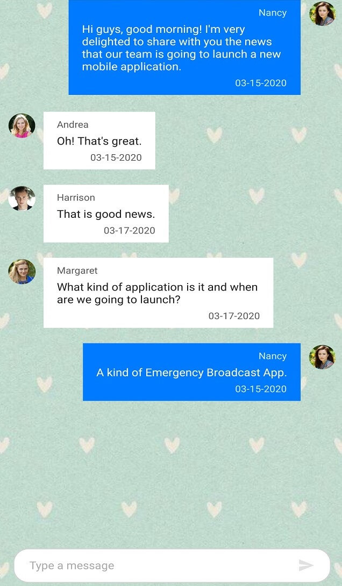
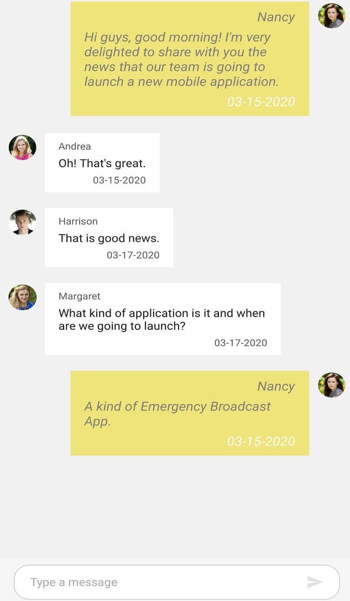
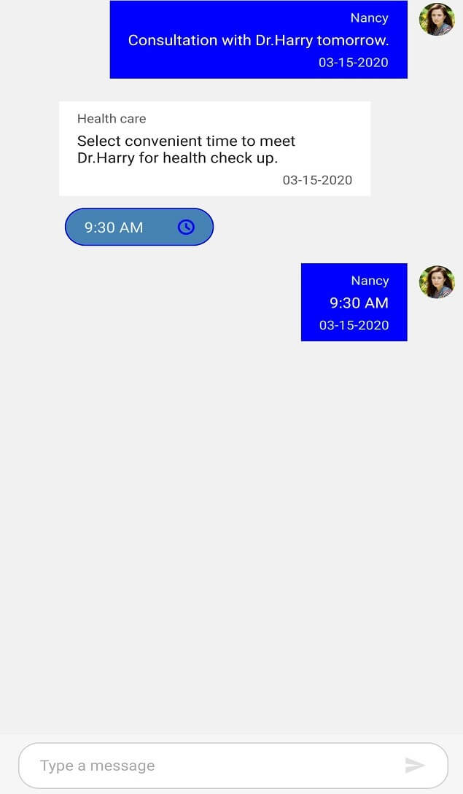
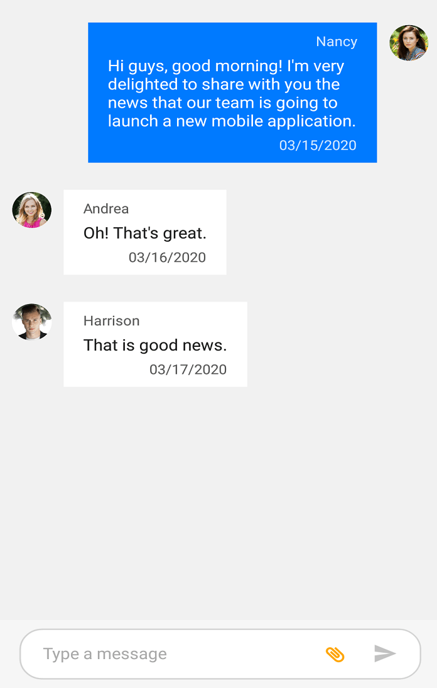

# Styling in Xamarin.Forms Chat (SfChat)

You can style the elements of the SfChat control by creating resource dictionaries and assigning values to the in-built keys assigned for each individual element.

## Chat Background

You can set any solid color as background for SfChat by setting any color to the [SfChat.BackgroundColor](https://help.syncfusion.com/cr/xamarin/Syncfusion.XForms.Chat.SfChat.html) property. However if you want the solid color to be applied to the message input view area also, set the background color of the message input view as transparent as shown in the below code snippet.





<?xml version="1.0" encoding="utf-8" ?>
<ContentPage xmlns="http://xamarin.com/schemas/2014/forms"
             xmlns:x="http://schemas.microsoft.com/winfx/2009/xaml"
             xmlns:local="clr-namespace:SampleBrowser.SfChat"
             xmlns:chat="clr-namespace:Syncfusion.XForms.Chat;assembly=Syncfusion.SfChat.XForms"
             x:Class="SfChat.MainPage">
    <ContentPage.BindingContext>
        <local:ViewModel/>
    </ContentPage.BindingContext>
	<ContentPage.Resources>
        <syncTheme:SyncfusionThemeDictionary>
            <syncTheme:SyncfusionThemeDictionary.MergedDictionaries>
                <ResourceDictionary>
                    <x:String x:Key="SfChatTheme">CustomTheme</x:String>
                    <Color x:Key="SfChatMessageInputViewBackgroundColor">Transparent</Color>
                </ResourceDictionary>
            </syncTheme:SyncfusionThemeDictionary.MergedDictionaries>
        </syncTheme:SyncfusionThemeDictionary>
    </ContentPage.Resources>
    <ContentPage.Content>
       <chat:SfChat CurrentUser="{Binding CurrentUser}" 
                    BackgroundColor="#94b6ec"
                    Messages="{Binding Messages}">
        </chat:SfChat>
    </ContentPage.Content>
</ContentPage>





//MainPage.cs

    public partial class MainPage : ContentPage
    {
        Syncfusion.XForms.Chat.SfChat sfChat = new Syncfusion.XForms.Chat.SfChat();
        ViewModel viewModel;
        public MainPage()
        {
            this.InitializeComponent();
            sfChat.BackgroundColor = Color.FromHex("#94b6ec");
            this.viewModel = new ViewModel();
            this.sfChat.Messages = viewModel.Messages;
            this.sfChat.CurrentUser = viewModel.CurrentUser;
            this.Content = sfChat;
        }
    }





### Set background image

You can set any image as background for the SfChat by setting the [SfChat.BackgroundColor](https://help.syncfusion.com/cr/xamarin/Syncfusion.XForms.Chat.SfChat.html) as `Color.Transparent` and adding an image below the SfChat control. However if you want the image to be applied to the message input view area also, set the background color of the message input view as transparent as shown in the below code snippet.





<?xml version="1.0" encoding="utf-8" ?>
<ContentPage xmlns="http://xamarin.com/schemas/2014/forms"
             xmlns:x="http://schemas.microsoft.com/winfx/2009/xaml"
             xmlns:local="clr-namespace:SampleBrowser.SfChat"
             xmlns:chat="clr-namespace:Syncfusion.XForms.Chat;assembly=Syncfusion.SfChat.XForms"
             x:Class="SfChat.MainPage">
    <ContentPage.BindingContext>
        <local:ViewModel/>
    </ContentPage.BindingContext>
	<ContentPage.Resources>
        <syncTheme:SyncfusionThemeDictionary>
            <syncTheme:SyncfusionThemeDictionary.MergedDictionaries>
                <ResourceDictionary>
                    <x:String x:Key="SfChatTheme">CustomTheme</x:String>
                    <Color x:Key="SfChatMessageInputViewBackgroundColor">Transparent</Color>
                </ResourceDictionary>
            </syncTheme:SyncfusionThemeDictionary.MergedDictionaries>
        </syncTheme:SyncfusionThemeDictionary>
    </ContentPage.Resources>
    <ContentPage.Content>
        <Grid>
		    <Image Source="BackgroundImage.jpg" Aspect="AspectFill"/>
            <chat:SfChat   CurrentUser="{Binding CurrentUser}" 
                        BackgroundColor="Transparent"
                        Messages="{Binding Messages}">
            </chat:SfChat>
        </Grid>
    </ContentPage.Content>
</ContentPage>





//MainPage.cs

    public partial class MainPage : ContentPage
    {
        Grid grid = new Grid();
        Syncfusion.XForms.Chat.SfChat sfChat = new Syncfusion.XForms.Chat.SfChat();
        Image image = new Image();
        ViewModel viewModel;
        public MainPage()
        {
            this.InitializeComponent();
            image.Source = "BackgroundImage.jpg";
            image.Aspect = Aspect.AspectFill;
            grid.Children.Add(image);
            sfChat.BackgroundColor = Color.Transparent;
            this.viewModel = new ViewModel();
            this.sfChat.Messages = viewModel.Messages;
            this.sfChat.CurrentUser = viewModel.CurrentUser;
            grid.Children.Add(sfChat);
            this.Content = grid;
        }
    }





### Set gradient background

You can set the gradient view as a background for chat by setting the [SfChat.BackgroundColor](https://help.syncfusion.com/cr/xamarin/Syncfusion.XForms.Chat.SfChat.html) property as `Color.Transparent` and adding the gradient view below the SfChat control. However if you want the gradient view to be applied to the message input view area also, set the background color of the message input view as transparent as shown in the below code snippet.





<?xml version="1.0" encoding="utf-8" ?>
<ContentPage xmlns="http://xamarin.com/schemas/2014/forms"
             xmlns:x="http://schemas.microsoft.com/winfx/2009/xaml"
             xmlns:local="clr-namespace:SampleBrowser.SfChat"
             xmlns:chat="clr-namespace:Syncfusion.XForms.Chat;assembly=Syncfusion.SfChat.XForms"
             xmlns:gradient ="clr-namespace:Syncfusion.XForms.Graphics;assembly=Syncfusion.Core.XForms"
             x:Class="SfChat.MainPage">
    <ContentPage.BindingContext>
        <local:ViewModel/>
    </ContentPage.BindingContext>
	<ContentPage.Resources>
        <syncTheme:SyncfusionThemeDictionary>
            <syncTheme:SyncfusionThemeDictionary.MergedDictionaries>
                <ResourceDictionary>
                    <x:String x:Key="SfChatTheme">CustomTheme</x:String>
                    <Color x:Key="SfChatMessageInputViewBackgroundColor">Transparent</Color>
                </ResourceDictionary>
            </syncTheme:SyncfusionThemeDictionary.MergedDictionaries>
        </syncTheme:SyncfusionThemeDictionary>
    </ContentPage.Resources>
    <ContentPage.Content>
        <Grid>
		    <gradient:SfGradientView>
                <gradient:SfGradientView.BackgroundBrush>
                    <gradient:SfLinearGradientBrush>
                        <gradient:SfLinearGradientBrush.GradientStops>
                            <gradient:SfGradientStop Color="SkyBlue" Offset="0.0" />
							<gradient:SfGradientStop Color="LightCyan" Offset="0.25" />
							<gradient:SfGradientStop Color="SteelBlue" Offset="0.5" />
							<gradient:SfGradientStop Color="LightSkyBlue" Offset="0.75" />
                            <gradient:SfGradientStop Color="LightGray" Offset="1.0" />
                        </gradient:SfLinearGradientBrush.GradientStops>
                    </gradient:SfLinearGradientBrush>
                </gradient:SfGradientView.BackgroundBrush>
            </gradient:SfGradientView>
            <chat:SfChat CurrentUser="{Binding CurrentUser}" 
                         BackgroundColor="Transparent"
                         Messages="{Binding Messages}">
            </chat:SfChat>
        </Grid>
    </ContentPage.Content>
</ContentPage>





//MainPage.cs

    public partial class MainPage : ContentPage
    {
       Grid grid = new Grid();
       Syncfusion.XForms.Chat.SfChat sfChat = new Syncfusion.XForms.Chat.SfChat();
       
        ViewModel viewModel;
        public MainPage()
        {
            this.InitializeComponent();
            SfGradientView gradientView = new SfGradientView();
            SfLinearGradientBrush linearGradientBrush = new SfLinearGradientBrush();
            linearGradientBrush.GradientStops = new GradientStopCollection()
            {
                new SfGradientStop(){Color = Color.SkyBlue, Offset=0.0},
                new SfGradientStop(){Color = Color.LightCyan, Offset=0.25},
                new SfGradientStop(){Color = Color.SteelBlue, Offset=0.5},
                new SfGradientStop(){Color = Color.LightBlue, Offset=0.75},
                new SfGradientStop(){Color = Color.LightGray, Offset=1.0},
            };
            gradientView.BackgroundBrush = linearGradientBrush;
            grid.Children.Add(gradientView);
            sfChat.BackgroundColor = Color.Transparent;
            this.viewModel = new ViewModel();
            this.sfChat.Messages = viewModel.Messages;
            this.sfChat.CurrentUser = viewModel.CurrentUser;
            grid.Children.Add(sfChat);
            this.Content = grid;
        }
    }





## Incoming Message Styling

You can style the elements of an incoming message by setting values to the in-built keys of an incoming message in resource dictionary.

<table>
<tr>
<th>Key</th>
<th>Description </th>
</tr>
<tr>
<td> SfChatIncomingMessageTextColor </td>
<td> Text color of the incoming message. </td>
</tr>
<tr>
<td> SfChatIncomingMessageAuthorTextColor </td>
<td> Text color of the author name in an incoming message. </td>
</tr>
<tr>
<td> SfChatIncomingMessageTimestampTextColor </td>
<td> Text color of the timestamp in an incoming message. </td>
</tr>
<tr>
<td> SfChatIncomingMessageBackgroundColor </td>
<td> Background color of the incoming message. </td>
</tr>
<tr>
<td> SfChatIncomingMessageFontFamily </td>
<td> Font family of the incoming message. </td>
</tr>
<tr>
<td> SfChatIncomingMessageFontAttributes </td>
<td> Font attributes of the incoming message. </td>
</tr>
<tr>
<td> SfChatIncomingMessageFontSize </td>
<td> Font size of the incoming message. </td>
</tr>
<tr>
<td> SfChatIncomingMessageAuthorFontFamily </td>
<td> Font family of the author name in an incoming message. </td>
</tr>
<tr>
<td> SfChatIncomingMessageAuthorFontAttributes </td>
<td> Font attributes of the author name in an incoming message. </td>
</tr>
<tr>
<td> SfChatIncomingMessageAuthorFontSize </td>
<td> Font size of the author name in an incoming message. </td>
</tr>
<tr>
<td> SfChatIncomingMessageTimestampFontFamily </td>
<td> Font family of the timestamp in an incoming message. </td>
</tr>
<tr>
<td> SfChatIncomingMessageTimestampFontAttributes </td>
<td> Font attributes of the timestamp in an incoming message. </td>
</tr>
<tr>
<td> SfChatIncomingMessageTimestampFontSize </td>
<td> Font size of the timestamp in an incoming message. </td>
</tr>
</table>





    <ContentPage.Resources>
        <syncTheme:SyncfusionThemeDictionary>
            <syncTheme:SyncfusionThemeDictionary.MergedDictionaries>
                <ResourceDictionary>
                    <x:String x:Key="SfChatTheme">CustomTheme</x:String>
                    <Color x:Key="SfChatIncomingMessageTextColor">Gray</Color>
                    <Color x:Key="SfChatIncomingMessageTimestampTextColor">White</Color>
                    <Color x:Key="SfChatIncomingMessageAuthorTextColor">Gray</Color>
                    <Color x:Key="SfChatIncomingMessageBackgroundColor">#eee479</Color>
                    <x:String x:Key="SfChatIncomingMessageFontFamily">Roboto-Medium</x:String>
                    <FontAttributes x:Key="SfChatIncomingMessageFontAttributes">Italic</FontAttributes>
                    <x:Double x:Key="SfChatIncomingMessageFontSize"> 16</x:Double>
                    <x:String x:Key="SfChatIncomingMessageAuthorFontFamily">Roboto-Medium</x:String>
                    <FontAttributes x:Key="SfChatIncomingMessageAuthorFontAttributes">Italic</FontAttributes>
                    <x:Double x:Key="SfChatIncomingMessageAuthorFontSize">16</x:Double>
                    <x:String x:Key="SfChatIncomingMessageTimestampFontFamily">Roboto-Medium</x:String>
                    <FontAttributes x:Key="SfChatIncomingMessageTimestampFontAttributes">Italic</FontAttributes>
                    <x:Double x:Key="SfChatIncomingMessageTimestampFontSize">16</x:Double>
                </ResourceDictionary>
            </syncTheme:SyncfusionThemeDictionary.MergedDictionaries>
        </syncTheme:SyncfusionThemeDictionary>
    </ContentPage.Resources>





//MainPage.cs

public MainPage()
{
    InitializeComponent();
    ResourceDictionary dictionary = new ResourceDictionary();
    dictionary.Add("SfChatTheme", "CustomTheme");
    dictionary.Add("SfChatIncomingMessageTextColor", Color.Gray);
    dictionary.Add("SfChatIncomingMessageTimestampTextColor", Color.White);
    dictionary.Add("SfChatIncomingMessageAuthorTextColor", Color.Gray);
    dictionary.Add("SfChatIncomingMessageBackgroundColor", Color.FromHex("#eee479"));
    dictionary.Add("SfChatIncomingMessageFontFamily", "Roboto-Regular");
    dictionary.Add("SfChatIncomingMessageFontAttributes", FontAttributes.Italic);
    dictionary.Add("SfChatIncomingMessageFontSize", 16);
    dictionary.Add("SfChatIncomingMessageAuthorFontFamily", "Roboto-Regular");
    dictionary.Add("SfChatIncomingMessageAuthorFontAttributes", FontAttributes.Italic);
    dictionary.Add("SfChatIncomingMessageAuthorFontSize", 16);
    dictionary.Add("SfChatIncomingMessageTimestampFontFamily", "Roboto-Regular");
    dictionary.Add("SfChatIncomingMessageTimestampFontAttributes", FontAttributes.Italic);
    dictionary.Add("SfChatIncomingMessageTimestampFontSize", 16);
    this.Resources.Add(dictionary);
}





## Outgoing message styling

You can style the elements of an outgoing message by setting values to the in-built keys of an outgoing message in resource dictionary.

<table>
<tr>
<th> Key </th>
<th> Description </th>
</tr>
<td> SyncPrimaryForegroundColor </td>
<td> Text color of outgoing message. </td>
</tr><tr>
<td> sfChatOutgoingMessageAuthorTextColor </td>
<td> Text color of the author name in an outgoing message. </td>
</tr><tr>
<td> sfChatOutgoingMessageTimestampTextColor </td>
<td> Text color of the timestamp in an outgoing message. </td>
</tr><tr>
<td> SyncPrimaryColor </td>
<td> Background color of the outgoing message. </td>
</tr><tr>
<td> sfChatOutgoingMessageFontFamily </td>
<td> Font family of the outgoing message. </td>
</tr><tr>
<td> sfChatOutgoingMessageFontAttributes </td>
<td> Font attributes of the outgoing message. </td>
</tr>
<tr>
<td> sfChatOutgoingMessageFontSize </td>
<td> Font size of the outgoing message. </td>
</tr><tr>
<td> sfChatOutgoingMessageAuthorFontFamily </td>
<td> Font family of the author name in an outgoing message. </td>
</tr><tr>
<td> sfChatOutgoingMessageAuthorFontAttributes </td>
<td> Font attributes of the author name in an outgoing message. </td>
</tr><tr>
<td> sfChatOutgoingMessageAuthorFontSize </td>
<td> Font size of the author name in an outgoing message. </td>
</tr><tr>
<td> sfChatOutgoingMessageTimestampFontFamily </td>
<td> Font family of the timestamp in an outgoing message. </td>
</tr><tr>
<td> sfChatOutgoingMessageTimestampFontAttributes </td>
<td>  Font attributes of the timestamp in an outgoing message. </td>
</tr><tr>
<td> SfChatOutgoingMessageTimestampFontSize </td>
<td> Font size of the timestamp in an outgoing message. </td>
</tr>
</table>





    <ContentPage.Resources>
        <syncTheme:SyncfusionThemeDictionary>
            <syncTheme:SyncfusionThemeDictionary.MergedDictionaries>
                <ResourceDictionary>
                    <x:String x:Key="SfChatTheme">CustomTheme</x:String>
                    <Color x:Key="SyncPrimaryForegroundColor">Gray</Color>
                    <Color x:Key="SyncPrimaryColor">#eee479</Color>
                    <Color x:Key="SfChatOutgoingMessageTimestampTextColor">White</Color>
                    <Color x:Key="SfChatOutgoingMessageAuthorTextColor">Gray</Color>
                    <x:String x:Key="SfChatOutgoingMessageFontFamily">Roboto-Medium</x:String>
                    <FontAttributes x:Key="SfChatOutgoingMessageFontAttributes">Italic</FontAttributes>
                    <x:Double x:Key="SfChatOutgoingMessageFontSize"> 16</x:Double>
                    <x:String x:Key="SfChatOutgoingingMessageAuthorFontFamily">Roboto-Medium</x:String>
                    <FontAttributes x:Key="SfChatOutgoingMessageAuthorFontAttributes">Italic</FontAttributes>
                    <x:Double x:Key="SfChatOutgoingMessageAuthorFontSize">16</x:Double>
                    <x:String x:Key="SfChatOutgoingMessageTimestampFontFamily">Roboto-Medium</x:String>
                    <FontAttributes x:Key="SfChatOutgoingMessageTimestampFontAttributes">Italic</FontAttributes>
                    <x:Double x:Key="SfChatOutgoingMessageTimestampFontSize">16</x:Double>
                </ResourceDictionary>
            </syncTheme:SyncfusionThemeDictionary.MergedDictionaries>
        </syncTheme:SyncfusionThemeDictionary>
    </ContentPage.Resources>





//MainPage.cs

public MainPage()
{
    InitializeComponent();
    ResourceDictionary dictionary = new ResourceDictionary();
    dictionary.Add("SfChatTheme", "CustomTheme");
    dictionary.Add("SyncPrimaryForegroundColor", Color.Gray);
    dictionary.Add("SfChatOutgoingMessageTimestampTextColor", Color.White);
    dictionary.Add("SfChatOutgoingMessageAuthorTextColor", Color.Gray);
    dictionary.Add("SyncPrimaryColor", Color.FromHex("#eee479"));
    dictionary.Add("SfChatOutgoingMessageFontFamily", "Roboto-Regular");
    dictionary.Add("SfChatOutgoingMessageFontAttributes", FontAttributes.Italic);
    dictionary.Add("SfChatOutgoingMessageFontSize", 16);
    dictionary.Add("SfChatOutgoingMessageAuthorFontFamily", "Roboto-Regular");
    dictionary.Add("SfChatOutgoingMessageAuthorFontAttributes", FontAttributes.Italic);
    dictionary.Add("SfChatOutgoingMessageAuthorFontSize", 16);
    dictionary.Add("SfChatOutgoingMessageTimestampFontFamily", "Roboto-Regular");
    dictionary.Add("SfChatOutgoingMessageTimestampFontAttributes", FontAttributes.Italic);
    dictionary.Add("SfChatOutgoingMessageTimestampFontSize", 16);
    this.Resources.Add(dictionary);
}





## Calendar Message styling

You can style the elements of a calendar message by setting values to the in-built keys of a calendar message in resource dictionary.

<table>
<tr>
<th> Key </th>
<th> Description </th>
</tr>
<tr>
<td> SfChatCalendarBackgroundColor </td>
<td> Background color of the calendar message. </td>
</tr>
</table>





    <ContentPage.Resources>
        <syncTheme:SyncfusionThemeDictionary>
            <syncTheme:SyncfusionThemeDictionary.MergedDictionaries>
                <ResourceDictionary>
                    <x:String x:Key="SfChatTheme">CustomTheme</x:String>
                    <Color x:Key="SfChatCalendarBackgroundColor">Gray</Color>
                </ResourceDictionary>
            </syncTheme:SyncfusionThemeDictionary.MergedDictionaries>
        </syncTheme:SyncfusionThemeDictionary>
    </ContentPage.Resources>





//MainPage.cs

public MainPage()
{
    ....
    InitializeComponent();
    ResourceDictionary dictionary = new ResourceDictionary();
    dictionary.Add("SfChatTheme", "CustomTheme");
    dictionary.Add("SfChatCalendarBackgroundColor", Color.Gray);
	this.Resources.Add(dictionary);
    ....
}





In addition to this you can write target style to SfCalendar control to style the inner elements of the calendar like selection background color, foreground color etc.

## Hyperlink message styling

You can style the elements of a hyperlink message by setting values to the in-built keys of a hyperlink message in resource dictionary.

<table>
<tr>
<th> Key </th>
<th> Description </th>
</tr>
<tr>
<td> SfChatHyperlinkColor </td>
<td> Text color of the URL in a hyper link message. </td>
</tr><tr>
<td> SfChatHyperlinkDescriptionTextColor </td>
<td> Text color of the URL's meta description in a hyper link message. </td>
</tr><tr>
<td> sfChatHyperlinkDescriptionBackgroundColor </td>
<td> Background color of the URL description area in a hyper link message. </td>
</tr><tr>
<td> SfChatHyperlinkMetaTitleTextColor </td>
<td> Text color of the URL's meta title in a hyper link message. </td>
</tr>
</table>





<ContentPage.Resources>
        <syncTheme:SyncfusionThemeDictionary>
            <syncTheme:SyncfusionThemeDictionary.MergedDictionaries>
                <ResourceDictionary>
                    <x:String x:Key="SfChatTheme">CustomTheme</x:String>
                    <Color x:Key="SfChatHyperlinkColor">#94b6ec</Color>
                    <Color x:Key="SfChatHyperlinkMetaTitleTextColor">#f29d0a</Color>
                    <Color x:Key="SfChatHyperlinkDescriptionTextColor">Black</Color>
                    <Color x:Key="SfChatHyperlinkDescriptionBackgroundColor">#dde9cc</Color>
                </ResourceDictionary>
            </syncTheme:SyncfusionThemeDictionary.MergedDictionaries>
        </syncTheme:SyncfusionThemeDictionary>
    </ContentPage.Resources>





//MainPage.cs

public MainPage()
{
    ....
    InitializeComponent();
    ResourceDictionary dictionary = new ResourceDictionary();
    dictionary.Add("SfChatTheme", "CustomTheme");
    dictionary.Add("SfChatHyperlinkColor", Color.FromHex("#94b6ec"));
    dictionary.Add("SfChatHyperlinkMetaTitleTextColor", Color.FromHex("#f29d0a"));
    dictionary.Add("SfChatHyperlinkDescriptionTextColor", Color.Black);
    dictionary.Add("SfChatHyperlinkDescriptionBackgroundColor", Color.FromHex("#dde9cc"));
	this.Resources.Add(dictionary);
    ....
}





## Date Picker message styling

You can style the elements of a date picker message by setting values to the in-built keys of a date picker message in resource dictionary.

<table>
<tr>
<th> Key </th>
<th> Description </th>
</tr>
<tr>
<td> SyncPrimaryColor </td>
<td> Color of date picker icon. </td>
</tr>
<tr>
<td> SyncPrimaryLightColor </td>
<td> Color of the text in date picker.  </td>
</tr>
<tr>
<td> SfChatDatePickerBackgroundColor </td>
<td> Background color of date picker. </td>
</tr>
<tr>
<td> SyncPrimaryColor </td>
<td> Border color of date picker. </td>
</tr>
</table>





    <ContentPage.Resources>
        <syncTheme:SyncfusionThemeDictionary>
            <syncTheme:SyncfusionThemeDictionary.MergedDictionaries>
                <ResourceDictionary>
                    <x:String x:Key="SfChatTheme">CustomTheme</x:String>
                    <Color x:Key="SyncPrimaryColor">Blue</Color>
                    <Color x:Key="SyncPrimaryLightColor">White</Color>
                    <Color x:Key="SfChatDatePickerBackgroundColor">SteelBlue</Color>
                </ResourceDictionary>
            </syncTheme:SyncfusionThemeDictionary.MergedDictionaries>
        </syncTheme:SyncfusionThemeDictionary>
    </ContentPage.Resources>





//MainPage.cs

public MainPage()
{
    ....
    InitializeComponent();
    ResourceDictionary dictionary = new ResourceDictionary();
    dictionary.Add("SfChatTheme", "CustomTheme");
    dictionary.Add("SfChatDatePickerBackgroundColor", Color.SteelBlue);
    dictionary.Add("SyncPrimaryLightColor", Color.White);
    dictionary.Add("SyncPrimaryColor", Color.Blue);
	this.Resources.Add(dictionary);
    ....
}





## Time Picker message styling

You can style the elements of a time picker message by setting values to the in-built keys of a time picker message in resource dictionary.

<table>
<tr>
<th> Key </th>
<th> Description </th>
</tr>
<tr>
<td> SyncPrimaryColor </td>
<td> Color of time picker icon. </td>
</tr><tr>
<td> SyncPrimaryLightColor </td>
<td> Color of the text in time picker.  </td>
</tr><tr>
<td> SyncPrimaryColor </td>
<td> Background color of time picker. </td>
</tr><tr>
<td> TimePickerBorderColor </td>
<td> Border color of time picker. </td>
</tr>
</table>





    <ContentPage.Resources>
        <syncTheme:SyncfusionThemeDictionary>
            <syncTheme:SyncfusionThemeDictionary.MergedDictionaries>
                <ResourceDictionary>
                    <x:String x:Key="SfChatTheme">CustomTheme</x:String>
                    <Color x:Key="SyncPrimaryColor">Blue</Color>
                    <Color x:Key="SyncPrimaryLightColor">White</Color>
                    <Color x:Key="SfChatTimePickerBackgroundColor">SteelBlue</Color>
                 </ResourceDictionary>
            </syncTheme:SyncfusionThemeDictionary.MergedDictionaries>
        </syncTheme:SyncfusionThemeDictionary>
    </ContentPage.Resources>





//MainPage.cs

public MainPage()
{
    ....
    InitializeComponent();
    ResourceDictionary dictionary = new ResourceDictionary();
    dictionary.Add("SfChatTheme", "CustomTheme");
    dictionary.Add("SfChatDatePickerBackgroundColor", Color.SteelBlue);
    dictionary.Add("SyncPrimaryLightColor", Color.White);
    dictionary.Add("SyncPrimaryColor", Color.Blue);
	this.Resources.Add(dictionary);
    ....
}





## Message input view styling

You can style the elements of the message input view by setting values to the in-built keys of the message input view in resource dictionary.

<table>
<tr>
<th> Key </th>
<th> Description </th>
</tr>
<tr>
<td> SfChatMessageInputViewBackgroundColor </td>
<td> Message input view background color. </td>
</tr>
</table>





    <ContentPage.Resources>
        <syncTheme:SyncfusionThemeDictionary>
            <syncTheme:SyncfusionThemeDictionary.MergedDictionaries>
                <ResourceDictionary>
                    <x:String x:Key="SfChatTheme">CustomTheme</x:String>
                    <Color x:Key="SfChatMessageInputViewBackgroundColor">#94b6ec</Color>
                 </ResourceDictionary>
            </syncTheme:SyncfusionThemeDictionary.MergedDictionaries>
        </syncTheme:SyncfusionThemeDictionary>
    </ContentPage.Resources>





//MainPage.cs

public MainPage()
{
    ....
    InitializeComponent();
    ResourceDictionary dictionary = new ResourceDictionary();
    dictionary.Add("SfChatTheme", "CustomTheme");
	dictionary.Add("SfChatMessageInputViewBackgroundColor", Color.FromHex("#94b6ec"));
	this.Resources.Add(dictionary);
    ....
}





## Editor styling

You can style the elements of the editor view by setting values to the in-built keys of the editor view in resource dictionary.

<table>
<tr>
<th> Key </th>
<th> Description </th>
</tr>
<tr>
<td> SfChatEditorTextColor </td>
<td> Color of the text in the editor. </td>
</tr>
<tr>
<td> SfChatEditorPlaceholderTextColor </td>
<td> Color of the placeholder text in the editor. </td>
</tr>
<tr>
<td> SfChatEditorBorderColor </td>
<td> Color of the border in the editor. </td>
</tr>
<tr>
<td> SfChatEditorBackgroundColor </td>
<td> Background color of the editor. </td>
</tr>
<tr>
<td> SfChatEditorFontFamily </td>
<td> Font family of the text in the editor. </td>
</tr>
<tr>
<td> SfChatEditorFontAttributes </td>
<td> Font attributes of the text in the editor. </td>
</tr>
<tr>
<td> SfChatEditorFontSize </td>
<td> Font size of the text in the editor. </td>
</tr>
</table>





    <ContentPage.Resources>
        <syncTheme:SyncfusionThemeDictionary>
            <syncTheme:SyncfusionThemeDictionary.MergedDictionaries>
                <ResourceDictionary>
                    <x:String x:Key="SfChatTheme">CustomTheme</x:String>
                    <Color x:Key="SfChatEditorPlaceholderTextColor">Blue</Color>
                    <Color x:Key="SfChatEditorTextColor">Gray</Color>
                    <Color x:Key="SfChatEditorBackgroundColor">Violet</Color>
                    <Color x:Key="SfChatEditorBorderColor">Black</Color>
                    <x:String x:Key="SfChatEditorFontFamily">Roboto-Medium</x:String>
                    <FontAttributes x:Key="SfChatEditorFontAttributes">Bold</FontAttributes>
                    <x:Double x:Key="SfChatEditorFontSize">16</x:Double>
                </ResourceDictionary>
            </syncTheme:SyncfusionThemeDictionary.MergedDictionaries>
        </syncTheme:SyncfusionThemeDictionary>
    </ContentPage.Resources>





//MainPage.cs

public MainPage()
{
    ....
    InitializeComponent();
    ResourceDictionary dictionary = new ResourceDictionary();
    dictionary.Add("SfChatTheme", "CustomTheme");
    dictionary.Add("SfChatEditorPlaceholderTextColor", Color.Blue);
    dictionary.Add("SfChatEditorBackgroundColor", Color.Violet);
    dictionary.Add("SfChatEditorTextColor", Color.Gray);
	dictionary.Add("SfChatEditorBorderColor", Color.Black);
    dictionary.Add("SfChatEditorFontFamily", "Roboto-Medium");
    dictionary.Add("SfChatEditorFontAttributes", FontAttributes.Italic);
    dictionary.Add("SfChatEditorFontSize", 16);
	this.Resources.Add(dictionary);
    ....
}





## Typing Indicator styling

You can style the elements of the typing indicator view by setting values to the in-built keys of the typing indicator view in resource dictionary.

<table>
<tr>
<th> Key </th>
<th> Description </th>
</tr>
<tr>
<td> SfChatTypingIndicatorTextColor </td>
<td> Text color in the typing indicator. </td>
</tr>
<tr>
<td> SfChatTypingIndicatorBackgroundColor </td>
<td> Background color of the typing indicator. </td>
</tr>
<tr>
<td> SfChatTypingIndicatorFontFamily </td>
<td> Font family of the text in the typing indicator. </td>
</tr>
<tr>
<td> SfChatTypingIndicatorFontAttributes </td>
<td> Font attributes of the text in the typing indicator. </td>
</tr>
<tr>
<td> SfChatTypingIndicatorFontSize </td>
<td> Font size of the text in the typing indicator. </td>
</tr>
</table>





    <ContentPage.Resources>
        <syncTheme:SyncfusionThemeDictionary>
            <syncTheme:SyncfusionThemeDictionary.MergedDictionaries>
                <ResourceDictionary>
                    <x:String x:Key="SfChatTheme">CustomTheme</x:String>
                    <Color x:Key="SfChatTypingIndicatorTextColor">Blue</Color>
                    <Color x:Key="SfChatTypingIndicatorBackgroundColor">#eee479 </Color>
                    <x:String x:Key="SfChatTypingIndicatorFontFamily">Roboto-Medium</x:String>
                    <FontAttributes x:Key="SfChatTypingIndicatorFontAttributes">Italic</FontAttributes>
                    <x:Double x:Key="SfChatTypingIndicatorFontSize">16</x:Double>
                </ResourceDictionary>
            </syncTheme:SyncfusionThemeDictionary.MergedDictionaries>
        </syncTheme:SyncfusionThemeDictionary>
    </ContentPage.Resources>





//MainPage.cs

public MainPage()
{
    ....
    InitializeComponent();
    ResourceDictionary dictionary = new ResourceDictionary();
    dictionary.Add("SfChatTheme", "CustomTheme");
    dictionary.Add("SfChatTypingIndicatorBackgroundColor", Color.FromHex("#eee479"));
    dictionary.Add("SfChatTypingIndicatorTextColor", Color.Blue);
    dictionary.Add("SfChatTypingIndicatorFontFamily", "Roboto-Regular");
    dictionary.Add("SfChatTypingIndicatorFontAttributes", FontAttributes.Italic);
    dictionary.Add("SfChatTypingIndicatorFontSize", 16);
	this.Resources.Add(dictionary);
    ....
}





## Time break view styling

You can style the elements of the time break view by setting values to the in-built keys of the time break view in resource dictionary.

<table>
<tr>
<th> Key </th>
<th> Description </th>
</tr>
<tr>
<td> SyncPrimaryLightColor </td>
<td> Text color of the text in the time break view. </td>
</tr>
<tr>
<td> SfChatTimeBreakViewBackgroundColor </td>
<td> Background color of the time break view. </td>
</tr>
<tr>
<td> SfChatTimeBreakViewFontFamily </td>
<td> Font family of the text in the time break view. </td>
</tr>
<tr>
<td> SfChatTimeBreakViewFontAttributes </td>
<td> Font attributes of the text in the time break view. </td>
</tr>
<tr>
<td> SfChatTimeBreakViewFontSize  </td>
<td> Font size of the text in the time break view. </td>
</tr>
<tr>
<td> SfChatTimeBreakViewBorderColor </td>
<td> Border color of the time break view. </td>
</tr>
</table>





    <ContentPage.Resources>
        <syncTheme:SyncfusionThemeDictionary>
            <syncTheme:SyncfusionThemeDictionary.MergedDictionaries>
                <ResourceDictionary>
                    <x:String x:Key="SfChatTheme">CustomTheme</x:String>
                    <Color x:Key="SyncPrimaryLightColor">Blue</Color>
                    <Color x:Key="SfChatTimeBreakViewBackgroundColor">#e2f9cd</Color>
                    <Color x:Key="SfChatTimeBreakViewBorderColor">LimeGreen</Color>
                    <x:String x:Key="SfChatTimeBreakViewFontFamily">Roboto-Medium</x:String>
                    <FontAttributes x:Key="SfChatTimeBreakViewFontAttributes">Italic</FontAttributes>
                    <x:Double x:Key="SfChatTimeBreakViewFontSize">16</x:Double>
                </ResourceDictionary>
            </syncTheme:SyncfusionThemeDictionary.MergedDictionaries>
        </syncTheme:SyncfusionThemeDictionary>
    </ContentPage.Resources>





//MainPage.cs

public MainPage()
{
    ....
    InitializeComponent();
    ResourceDictionary dictionary = new ResourceDictionary();
    dictionary.Add("SfChatTheme", "CustomTheme");
    dictionary.Add("SyncPrimaryLightColor", Color.Blue);
    dictionary.Add("SfChatTimeBreakViewBorderColor", Color.Gray);
    dictionary.Add("SfChatTimeBreakViewBackgroundColor", Color.FromHex("#e2f9cd"));
    dictionary.Add("SfChatTimeBreakViewFontFamily", "Roboto-Regular");
    dictionary.Add("SfChatTimeBreakViewFontAttributes", FontAttributes.Italic);
    dictionary.Add("SfChatTimeBreakViewFontSize", 16);
	this.Resources.Add(dictionary);
    ....
}





Executing the above code renders the following output.

## Suggestion styling

You can style the elements of the suggestion view by setting values to the in-built keys of the suggestion view in resource dictionary.

<table>
<tr>
<th> Key </th>
<th> Description </th>
</tr>
<tr>
<td> SyncPrimaryLightColor </td>
<td> Text color of an item in the list of suggestions. </td>
</tr>
<tr>
<td> SfChatSuggestionListItemBackgroundColor </td>
<td> Background color of an item in the list of suggestions. </td>
</tr>
<tr>
<td> SfChatSuggestionListBackgroundColor </td>
<td> Background color of the suggestion list view. </td>
</tr>
<tr>
<td> SfChatSuggestionListItemFontFamily </td>
<td> Font family of an item in the list of suggestions. </td>
</tr>
<tr>
<td> SfChatSuggestionListItemFontAttributes </td>
<td> Font attributes of an item in the list of suggestions. </td>
</tr>
<tr>
<td> SfChatSuggestionListItemFontSize </td>
<td> Font size of an item in the list of suggestions. </td>
</tr>
<tr>
<td> SuggestionListItemBorderColor </td>
<td> Border color of an item in the list of suggestions. </td>
</tr>
</table>





    <ContentPage.Resources>
        <syncTheme:SyncfusionThemeDictionary>
            <syncTheme:SyncfusionThemeDictionary.MergedDictionaries>
                <ResourceDictionary>
                    <x:String x:Key="SfChatTheme">CustomTheme</x:String>
                    <Color x:Key="SyncPrimaryLightColor">Blue</Color>
                    <Color x:Key="SfChatSuggestionListItemBackgroundColor">Gray</Color>
                    <Color x:Key="SfChatSuggestionListBackgroundColor">Violet</Color>
                    <x:String x:Key="SfChatSuggestionListItemFontFamily">Roboto-Medium</x:String>
                    <FontAttributes x:Key="SfChatSuggestionListItemFontAttributes">Bold</FontAttributes>
                    <x:Double x:Key="SfChatSuggestionListItemFontSize">16</x:Double>
                </ResourceDictionary>
            </syncTheme:SyncfusionThemeDictionary.MergedDictionaries>
        </syncTheme:SyncfusionThemeDictionary>
    </ContentPage.Resources>





//MainPage.cs

public MainPage()
{
    ....
    InitializeComponent();
    ResourceDictionary dictionary = new ResourceDictionary();
    dictionary.Add("SfChatTheme", "CustomTheme");
    dictionary.Add("SyncPrimaryLightColor", Color.Blue);
    dictionary.Add("SfChatSuggestionListBackgroundColor", Color.Violet);
    dictionary.Add("SfChatSuggestionListItemBackgroundColor", Color.Gray);
    dictionary.Add("SfChatSuggestionListItemFontFamily", "Roboto-Medium");
    dictionary.Add("SfChatSuggestionListItemFontAttributes", FontAttributes.Italic);
    dictionary.Add("SfChatSuggestionListItemFontSize", 16);
	this.Resources.Add(dictionary);
    ....
}





## Send Button styling

You can style the send message button based on its state by setting values to the in-built keys of the send message button in resource dictionary.

<table>
<tr>
<th> Key </th>
<th> Description </th>
</tr>
<tr>
<td> SfChatSendButtonColor </td>
<td> Color of the send button. </td>
</tr>
<tr>
<td> SfChatSendButtonDisabledColor </td>
<td> Color of the send button when it is in 'Disabled' state. </td>
</tr>
</table>





    <ContentPage.Resources>
        <syncTheme:SyncfusionThemeDictionary>
            <syncTheme:SyncfusionThemeDictionary.MergedDictionaries>
                <ResourceDictionary>
                    <x:String x:Key="SfChatTheme">CustomTheme</x:String>
                    <Color x:Key="SfChatSendButtonDisabledColor">Blue</Color>
                    <Color x:Key="SfChatSendButtonColor">Orange</Color>
                </ResourceDictionary>
            </syncTheme:SyncfusionThemeDictionary.MergedDictionaries>
        </syncTheme:SyncfusionThemeDictionary>
    </ContentPage.Resources>





//MainPage.cs

public MainPage()
{
    ....
    InitializeComponent();
    ResourceDictionary dictionary = new ResourceDictionary();
    dictionary.Add("SfChatTheme", "CustomTheme");
    dictionary.Add("SfChatSendButtonDisabledColor", Color.Blue);
    dictionary.Add("SfChatSendButtonColor", Color.Orange);
	this.Resources.Add(dictionary);
    ....
}





## Attachment Button styling

You can style the attachment button by setting values to the in-built keys of the attachment button in resource dictionary.

<table>
<tr>
<th> Key </th>
<th> Description </th>
</tr>
<tr>
<td> SfChatAttachmentButtonColor </td>
<td> Color of the attachment button. </td>
</tr>
<tr>
<td> SfChatAttachmentButtonEffectColor </td>
<td> Color of the effect when attachment button is clicked. </td>
</tr>
</table>





    <ContentPage.Resources>
        <syncTheme:SyncfusionThemeDictionary>
            <syncTheme:SyncfusionThemeDictionary.MergedDictionaries>
                <ResourceDictionary>
                    <x:String x:Key="SfChatTheme">CustomTheme</x:String>
                    <Color x:Key="SfChatAttachmentButtonColor">Orange</Color>
                </ResourceDictionary>
            </syncTheme:SyncfusionThemeDictionary.MergedDictionaries>
        </syncTheme:SyncfusionThemeDictionary>
    </ContentPage.Resources>





//MainPage.cs

public MainPage()
{
    ....
    InitializeComponent();
    ResourceDictionary dictionary = new ResourceDictionary();
    dictionary.Add("SfChatTheme", "CustomTheme");
    dictionary.Add("SfChatAttachmentButtonColor", Color.Orange);
	this.Resources.Add(dictionary);
    ....
}





