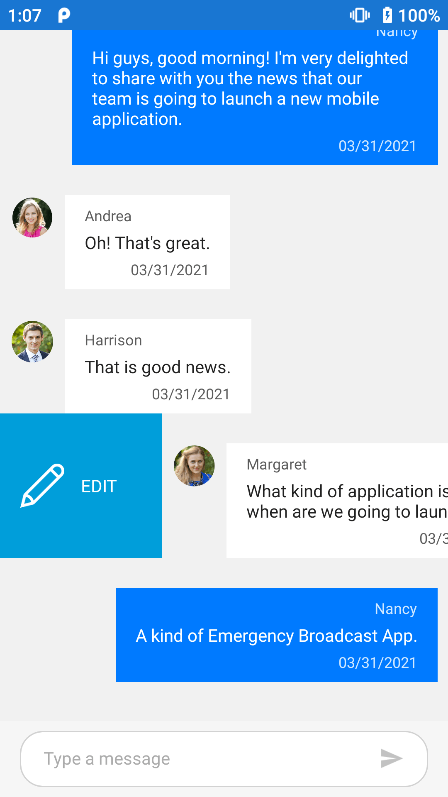
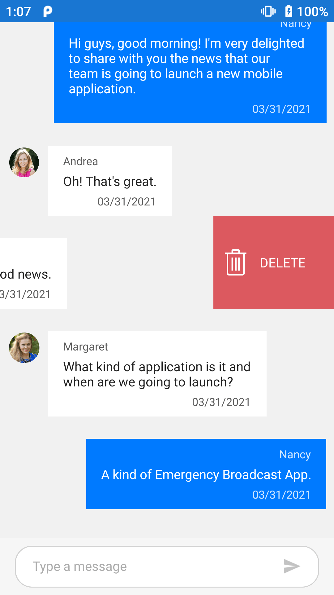

# Swiping in Xamarin Chat (SfChat)

The [SfChat](https://help.syncfusion.com/cr/xamarin/Syncfusion.XForms.Chat.SfChat.html) allows to enabling the swiping option by setting the [SfChat.AllowSwiping](https://help.syncfusion.com/cr/xamarin/Syncfusion.XForms.Chat.SfChat.html#Syncfusion_XForms_Chat_SfChat_AllowSwiping) property to `true`. Swipe views are displayed when swiping from ‘left to right’ or ‘right to left’ on a message. The control provides customizable swipe templates for swiping on the left and right side. The swipe gesture can be restricted to a certain point on the message by setting the [SfChat.MaxSwipeOffset](https://help.syncfusion.com/cr/xamarin/Syncfusion.XForms.Chat.SfChat.html#Syncfusion_XForms_Chat_SfChat_MaxSwipeOffset) property.

### Swipe templates

The Swiping can be customized by using the [SfChat.LeftSwipeViewTemplate](https://help.syncfusion.com/cr/xamarin/Syncfusion.XForms.Chat.SfChat.html#Syncfusion_XForms_Chat_SfChat_LeftSwipeViewTemplate) when swiping towards right and [SfListView.RightSwipeViewTemplate](https://help.syncfusion.com/cr/xamarin/Syncfusion.XForms.Chat.SfChat.html#Syncfusion_XForms_Chat_SfChat_RightSwipeViewTemplate) when swiping towards left. The content inside the swipe template is arranged based on the offset values when swiping a message.




<?xml version="1.0" encoding="utf-8" ?>
<ContentPage xmlns="http://xamarin.com/schemas/2014/forms"
             xmlns:x="http://schemas.microsoft.com/winfx/2009/xaml"
             xmlns:sfchat="clr-namespace:Syncfusion.XForms.Chat;assembly=Syncfusion.SfChat.XForms"
             xmlns:local="clr-namespace:GettingStarted"
             x:Class="GettingStarted.MainPage">

    <ContentPage.BindingContext>
        <local:GettingStartedViewModel x:Name="viewModel" />
    </ContentPage.BindingContext>

    <ContentPage.Content>
        <sfchat:SfChat x:Name="sfChat"                
                       Messages="{Binding Messages}"     
                       CurrentUser="{Binding CurrentUser}"
                       AllowSwiping="True">    
           <sfchat:SfChat.LeftSwipeViewTemplate>
                <DataTemplate>
                    <Grid BackgroundColor="#009EDA" Padding="9">
                        <Grid.ColumnDefinitions>
                            <ColumnDefinition Width="50"/>
                            <ColumnDefinition Width="50"/>
                        </Grid.ColumnDefinitions>

                        <Image Grid.Column="0"
                               BackgroundColor="Transparent"                             
                               HorizontalOptions="CenterAndExpand"
                               Source="EditIcon.png"/>

                        <Label Grid.Column="1"
                               BackgroundColor="Transparent"
                               LineBreakMode="NoWrap"
                               Text="EDIT"
                               TextColor="White"
                               HorizontalTextAlignment="Start"
                               VerticalTextAlignment="Center"/>
                    </Grid>
                </DataTemplate>
           </sfchat:SfChat.LeftSwipeViewTemplate>
			
           <sfchat:SfChat.RightSwipeViewTemplate>
               <DataTemplate>
                   <Grid BackgroundColor="#DC595F" Padding="4">
                        <Grid.ColumnDefinitions>
                            <ColumnDefinition Width="40"/>
                            <ColumnDefinition Width="60"/>
                        </Grid.ColumnDefinitions>

                        <Image Grid.Column="0"
                           BackgroundColor="Transparent"                          
                           HorizontalOptions="CenterAndExpand"
                           Source="TrashImage.png"/>

                        <Label Grid.Column="1"
                           BackgroundColor="Transparent"
                           LineBreakMode="NoWrap"
                           Text="DELETE"
                           TextColor="White"
                           HorizontalTextAlignment="Start"
                           VerticalTextAlignment="Center"/>
                    </Grid>
               </DataTemplate>
           </sfchat:SfChat.RightSwipeViewTemplate>
        </sfchat:SfChat>
    </ContentPage.Content>
</ContentPage>        




namespace GettingStarted
{
    public partial class MainPage : ContentPage
    {
        SfChat sfChat;
        ViewModel viewModel;

        public MainPage()
        {
            InitializeComponent();
            sfChat = new SfChat();
            viewModel = new ViewModel();
            sfChat.Messages = viewModel.Messages;
            sfChat.CurrentUser = viewModel.CurrentUser;
            sfChat.AllowSwiping = true;
            sfChat.LeftSwipeViewTemplate = new DataTemplate(() =>
            {
                var grid = new Grid()
                {
                    ColumnDefinitions =
                    {
                     new ColumnDefinition(){Width=50 },
                     new ColumnDefinition(){Width=50 }
                    },
                    Padding = 9,
                    BackgroundColor = Color.FromHex("#009EDA"),
                    HorizontalOptions = LayoutOptions.Fill,
                    VerticalOptions = LayoutOptions.Fill,
                };
				
                var image = new Image()
                {
                    BackgroundColor = Color.Transparent,
                    HorizontalOptions = LayoutOptions.CenterAndExpand,
                    Source = "EditIcon.png",
                };

                var label = new Label()
                {
                    BackgroundColor = Color.Transparent,
                    VerticalTextAlignment = TextAlignment.Center,
                    HorizontalTextAlignment = TextAlignment.Start,
                    TextColor = Color.White,
                    Text = "EDIT",
                    LineBreakMode = LineBreakMode.NoWrap,
                };

                grid.Children.Add(image);
                grid.Children.Add(label, 1, 0);

                return grid;
            });
			
            sfChat.RightSwipeViewTemplate = new DataTemplate(() =>
            {
                var grid = new Grid()
                {
                    ColumnDefinitions =
                    {
                     new ColumnDefinition(){Width=40 },
                     new ColumnDefinition(){Width=60 }
                    },
                    Padding = 4,
                    BackgroundColor = Color.FromHex("#DC595F"),
                    HorizontalOptions = LayoutOptions.Fill,
                    VerticalOptions = LayoutOptions.Fill,
                };
				
                var image = new Image()
                {
                    BackgroundColor = Color.Transparent,
                    HorizontalOptions = LayoutOptions.CenterAndExpand,
                    Source = "TrashImage.png",
                };

                var label = new Label()
                {
                    BackgroundColor = Color.Transparent,
                    VerticalTextAlignment = TextAlignment.Center,
                    HorizontalTextAlignment = TextAlignment.Start,
                    TextColor = Color.White,
                    Text = "DELETE",
                    LineBreakMode = LineBreakMode.NoWrap,
                };

                grid.Children.Add(image);
                grid.Children.Add(label, 1, 0);

                return grid;
            });
            this.Content = sfChat;
        }
    }
}




### Swipe Events

### SwipeStarted Event

The [SfChat.SwipeStarted](https://help.syncfusion.com/cr/xamarin/Syncfusion.XForms.Chat.SfChat.html#Syncfusion_XForms_Chat_SfChat_SwipeStarted) event is raised when the swipe offset changes from its initial value. This event is triggered with [MessageSwipeStartedEventArgs](https://help.syncfusion.com/cr/xamarin/Syncfusion.XForms.Chat.MessageSwipeStartedEventArgs.html).

The `SwipeStarted` event provides the following properties in their arguments:

* [Message](https://help.syncfusion.com/cr/xamarin/Syncfusion.XForms.Chat.MessageSwipeEventArgs.html#Syncfusion_XForms_Chat_MessageSwipeEventArgs_Message) : Defines the underlying data associated with the swiped message.
* [SwipeDirection](https://help.syncfusion.com/cr/xamarin/Syncfusion.XForms.Chat.MessageSwipeEventArgs.html#Syncfusion_XForms_Chat_MessageSwipeEventArgs_SwipeDirection) : Defines the swipe direction of the message is being swiped.
* [Cancel](https://help.syncfusion.com/cr/xamarin/Syncfusion.XForms.Chat.MessageSwipeStartedEventArgs.html#Syncfusion_XForms_Chat_MessageSwipeStartedEventArgs_Cancel) : Defines that the swipe action can be canceled by setting the 'Cancel' property of the [MessageSwipeStartedEventArgs](https://help.syncfusion.com/cr/xamarin/Syncfusion.XForms.Chat.MessageSwipeStartedEventArgs.html) to true.




<?xml version="1.0" encoding="utf-8" ?>
<ContentPage xmlns="http://xamarin.com/schemas/2014/forms"
             xmlns:x="http://schemas.microsoft.com/winfx/2009/xaml"
             xmlns:sfchat="clr-namespace:Syncfusion.XForms.Chat;assembly=Syncfusion.S
             xmlns:local="clr-namespace:GettingStarted"
             x:Class="GettingStarted.MainPage">

    <ContentPage.BindingContext>
        <local:GettingStartedViewModel x:Name="viewModel" />
    </ContentPage.BindingContext>

    <ContentPage.Content>
        <sfchat:SfChat x:Name="sfChat"                
                       Messages="{Binding Messages}"     
                       CurrentUser="{Binding CurrentUser}"
                       SwipeStarted="sfChat_SwipeStarted"
                       AllowSwiping="True">                      
           <sfchat:SfChat.RightSwipeViewTemplate>
               <DataTemplate>
                   <Grid BackgroundColor="#DC595F" Padding="4">
                        <Grid.ColumnDefinitions>
                            <ColumnDefinition Width="40"/>
                            <ColumnDefinition Width="60"/>
                        </Grid.ColumnDefinitions>

                        <Image Grid.Column="0"
                           BackgroundColor="Transparent"                          
                           HorizontalOptions="CenterAndExpand"
                           Source="TrashImage.png"/>

                        <Label Grid.Column="1"
                           BackgroundColor="Transparent"
                           LineBreakMode="NoWrap"
                           Text="DELETE"
                           TextColor="White"
                           HorizontalTextAlignment="Start"
                           VerticalTextAlignment="Center"/>
                    </Grid>
               </DataTemplate>
           </sfchat:SfChat.RightSwipeViewTemplate>
        </sfchat:SfChat>
    </ContentPage.Content>
</ContentPage>      




namespace GettingStarted
{
    public partial class MainPage : ContentPage
    {
	    SfChat sfChat;
        ViewModel viewModel;
		
        public MainPage()
        {
            InitializeComponent();
            sfChat = new SfChat();
            viewModel = new ViewModel();
            sfChat.Messages = viewModel.Messages;
            sfChat.CurrentUser = viewModel.CurrentUser;
            sfChat.SwipeStarted += SfChat_SwipeStarted;
            sfChat.AllowSwiping = true;
            sfChat.RightSwipeViewTemplate = new DataTemplate(() =>
            {
                var grid = new Grid()
                {
                    ColumnDefinitions =
                    {
                     new ColumnDefinition(){Width=40 },
                     new ColumnDefinition(){Width=60 }
                    },
                    Padding = 4,
                    BackgroundColor = Color.FromHex("#DC595F"),
                    HorizontalOptions = LayoutOptions.Fill,
                    VerticalOptions = LayoutOptions.Fill,
                };
				
                var image = new Image()
                {
                    BackgroundColor = Color.Transparent,
                    HorizontalOptions = LayoutOptions.CenterAndExpand,
                    Source = "TrashImage.png",
                };

                var label = new Label()
                {
                    BackgroundColor = Color.Transparent,
                    VerticalTextAlignment = TextAlignment.Center,
                    HorizontalTextAlignment = TextAlignment.Start,
                    TextColor = Color.White,
                    Text = "DELETE",
                    LineBreakMode = LineBreakMode.NoWrap,
                };

                grid.Children.Add(image);
                grid.Children.Add(label, 1, 0);

                return grid;
            });
            this.Content = sfChat;
        }
        
        private void sfChat_SwipeStarted(object sender, MessageSwipeStartedEventArgs e)
        {
            var index = sfChat.Messages.IndexOf(e.Message);
            if (index == 1)
            {
                e.Cancel = true;
            }
        }
    }
}




### Swiping Event

The [SfChat.Swiping](https://help.syncfusion.com/cr/xamarin/Syncfusion.XForms.Chat.SfChat.html#Syncfusion_XForms_Chat_SfChat_Swiping) event is raised while swiping a message is in progress. This event is triggered with [MessageSwipingEventArgs](https://help.syncfusion.com/cr/xamarin/Syncfusion.XForms.Chat.MessageSwipingEventArgs.html).

The `Swiping` event provides the following properties in their arguments:

* [Message](https://help.syncfusion.com/cr/xamarin/Syncfusion.XForms.Chat.MessageSwipeEventArgs.html#Syncfusion_XForms_Chat_MessageSwipeEventArgs_Message) : Defines the underlying data associated with the swiped message.
* [SwipeDirection](https://help.syncfusion.com/cr/xamarin/Syncfusion.XForms.Chat.MessageSwipeEventArgs.html#Syncfusion_XForms_Chat_MessageSwipeEventArgs_SwipeDirection) : Defines the swipe direction of the message is being swiped.
* [SwipeOffSet](https://help.syncfusion.com/cr/xamarin/Syncfusion.XForms.Chat.MessageSwipingEventArgs.html#Syncfusion_XForms_Chat_MessageSwipingEventArgs_SwipeOffSet) : Defines the current swipe offset of the message that is being swiped.
* [Handled](https://help.syncfusion.com/cr/xamarin/Syncfusion.XForms.Chat.MessageSwipingEventArgs.html#Syncfusion_XForms_Chat_MessageSwipingEventArgs_Handled) : Defines that if it is true, current swipe offset value remains same for the swiped message until the `SwipeEnded` event is raised.




<?xml version="1.0" encoding="utf-8" ?>
<ContentPage xmlns="http://xamarin.com/schemas/2014/forms"
             xmlns:x="http://schemas.microsoft.com/winfx/2009/xaml"
             xmlns:sfchat="clr-namespace:Syncfusion.XForms.Chat;assembly=Syncfusion.SfChat.XFo
             xmlns:local="clr-namespace:GettingStarted"
             x:Class="GettingStarted.MainPage">

    <ContentPage.BindingContext>
        <local:GettingStartedViewModel x:Name="viewModel" />
    </ContentPage.BindingContext>

    <ContentPage.Content>
        <sfchat:SfChat x:Name="sfChat"                
                       Messages="{Binding Messages}"     
                       CurrentUser="{Binding CurrentUser}"
                       Swiping="sfChat_Swiping"
                       MaxSwipeOffset="130"
                       AllowSwiping="True">                      
           <sfchat:SfChat.RightSwipeViewTemplate>
               <DataTemplate>
                   <Grid BackgroundColor="#DC595F" Padding="4">
                        <Grid.ColumnDefinitions>
                            <ColumnDefinition Width="40"/>
                            <ColumnDefinition Width="60"/>
                        </Grid.ColumnDefinitions>

                        <Image Grid.Column="0"
                           BackgroundColor="Transparent"                          
                           HorizontalOptions="CenterAndExpand"
                           Source="TrashImage.png"/>

                        <Label Grid.Column="1"
                           BackgroundColor="Transparent"
                           LineBreakMode="NoWrap"
                           Text="DELETE"
                           TextColor="White"
                           HorizontalTextAlignment="Start"
                           VerticalTextAlignment="Center"/>
                    </Grid>
               </DataTemplate>
           </sfchat:SfChat.RightSwipeViewTemplate>
        </sfchat:SfChat>
    </ContentPage.Content>
</ContentPage>      




namespace GettingStarted
{
    
    public partial class MainPage : ContentPage
    {
	    SfChat sfChat;
        ViewModel viewModel;
		
        public MainPage()
        {
            InitializeComponent();
            sfChat = new SfChat();
            viewModel = new ViewModel();
            sfChat.Messages = viewModel.Messages;
            sfChat.CurrentUser = viewModel.CurrentUser;
            sfChat.Swiping += SfChat_Swiping;
            sfChat.MaxSwipeOffset = 130;
            sfChat.AllowSwiping = true;
            sfChat.RightSwipeViewTemplate = new DataTemplate(() =>
            {
                var grid = new Grid()
                {
                    ColumnDefinitions =
                    {
                     new ColumnDefinition(){Width=40 },
                     new ColumnDefinition(){Width=60 }
                    },
                    Padding = 4,
                    BackgroundColor = Color.FromHex("#DC595F"),
                    HorizontalOptions = LayoutOptions.Fill,
                    VerticalOptions = LayoutOptions.Fill,
                };
				
                var image = new Image()
                {
                    BackgroundColor = Color.Transparent,
                    HorizontalOptions = LayoutOptions.CenterAndExpand,
                    Source = "TrashImage.png",
                };

                var label = new Label()
                {
                    BackgroundColor = Color.Transparent,
                    VerticalTextAlignment = TextAlignment.Center,
                    HorizontalTextAlignment = TextAlignment.Start,
                    TextColor = Color.White,
                    Text = "DELETE",
                    LineBreakMode = LineBreakMode.NoWrap,
                };

                grid.Children.Add(image);
                grid.Children.Add(label, 1, 0);

                return grid;
            });
            this.Content = sfChat;
        }
        
        private void sfChat_Swiping(object sender, MessageSwipingEventArgs e)
        {
            var index = sfChat.Messages.IndexOf(e.Message);
            if (index == 1 && e.SwipeOffset > 70)
            {
                e.Handled = true;
            }
        }
    }
}




### SwipeEnded Event

The [SfChat.SwipeEnded](https://help.syncfusion.com/cr/xamarin/Syncfusion.XForms.Chat.SfChat.html#Syncfusion_XForms_Chat_SfChat_SwipeEnded) event is fired when the swipe offset value reaches the [SfChat.MaxSwipeOffset](https://help.syncfusion.com/cr/xamarin/Syncfusion.XForms.Chat.SfChat.html#Syncfusion_XForms_Chat_SfChat_MaxSwipeOffset) value indicating that the swipe action is completed. This event is triggered with [MessageSwipeEndedEventArgs](https://help.syncfusion.com/cr/xamarin/Syncfusion.XForms.Chat.MessageSwipeEndedEventArgs.html).

The `SwipeEnded` event provides the following properties in their arguments:

* [Message](https://help.syncfusion.com/cr/xamarin/Syncfusion.XForms.Chat.MessageSwipeEventArgs.html#Syncfusion_XForms_Chat_MessageSwipeEventArgs_Message) : Defines the underlying data associated with the swiped message.
* [SwipeDirection](https://help.syncfusion.com/cr/xamarin/Syncfusion.XForms.Chat.MessageSwipeEventArgs.html#Syncfusion_XForms_Chat_MessageSwipeEventArgs_SwipeDirection) : Defines the swipe direction of the message is being swiped.
* [SwipeOffSet](https://help.syncfusion.com/cr/xamarin/Syncfusion.XForms.Chat.MessageSwipeEndedEventArgs.html#Syncfusion_XForms_Chat_MessageSwipeEndedEventArgs_SwipeOffSet) : Defines the current swipe offset of the message that is being swiped



<?xml version="1.0" encoding="utf-8" ?>
<ContentPage xmlns="http://xamarin.com/schemas/2014/forms"
             xmlns:x="http://schemas.microsoft.com/winfx/2009/xaml"
             xmlns:sfchat="clr-namespace:Syncfusion.XForms.Chat;assembly=Syncfusion.SfChat.XForms"
             xmlns:local="clr-namespace:GettingStarted"
             x:Class="GettingStarted.MainPage">

    <ContentPage.BindingContext>
        <local:GettingStartedViewModel x:Name="viewModel" />
    </ContentPage.BindingContext>

    <ContentPage.Content>
        <sfchat:SfChat x:Name="sfChat"                
                       Messages="{Binding Messages}"     
                       CurrentUser="{Binding CurrentUser}"
                       SwipeEnded="sfChat_SwipeEnded"
                       MaxSwipeOffset="130"
                       AllowSwiping="True">             
			
           <sfchat:SfChat.RightSwipeViewTemplate>
               <DataTemplate>
                   <Grid BackgroundColor="#DC595F" Padding="4">
                        <Grid.ColumnDefinitions>
                            <ColumnDefinition Width="40"/>
                            <ColumnDefinition Width="60"/>
                        </Grid.ColumnDefinitions>

                        <Image Grid.Column="0"
                           BackgroundColor="Transparent"                          
                           HorizontalOptions="CenterAndExpand"
                           Source="TrashImage.png"/>

                        <Label Grid.Column="1"
                           BackgroundColor="Transparent"
                           LineBreakMode="NoWrap"
                           Text="DELETE"
                           TextColor="White"
                           HorizontalTextAlignment="Start"
                           VerticalTextAlignment="Center"/>
                    </Grid>
               </DataTemplate>
           </sfchat:SfChat.RightSwipeViewTemplate>
        </sfchat:SfChat>
    </ContentPage.Content>
</ContentPage>        




namespace GettingStarted
{
    public partial class MainPage : ContentPage
    {
	    SfChat sfChat;
        ViewModel viewModel;
		
        public MainPage()
        {
            InitializeComponent();
            sfChat = new SfChat();
            viewModel = new ViewModel();
            sfChat.Messages = viewModel.Messages;
            sfChat.CurrentUser = viewModel.CurrentUser;
            sfChat.SwipeEnded += SfChat_SwipeEnded;
            sfChat.MaxSwipeOffset = 130;
            sfChat.AllowSwiping = true;
            sfChat.RightSwipeViewTemplate = new DataTemplate(() =>
            {
                var grid = new Grid()
                {
                    ColumnDefinitions =
                    {
                     new ColumnDefinition(){Width=40 },
                     new ColumnDefinition(){Width=60 }
                    },
                    Padding = 4,
                    BackgroundColor = Color.FromHex("#DC595F"),
                    HorizontalOptions = LayoutOptions.Fill,
                    VerticalOptions = LayoutOptions.Fill,
                };
				
                var image = new Image()
                {
                    BackgroundColor = Color.Transparent,
                    HorizontalOptions = LayoutOptions.CenterAndExpand,
                    Source = "TrashImage.png",
                };

                var label = new Label()
                {
                    BackgroundColor = Color.Transparent,
                    VerticalTextAlignment = TextAlignment.Center,
                    HorizontalTextAlignment = TextAlignment.Start,
                    TextColor = Color.White,
                    Text = "DELETE",
                    LineBreakMode = LineBreakMode.NoWrap,
                };

                grid.Children.Add(image);
                grid.Children.Add(label, 1, 0);

                return grid;
            });
            this.Content = sfChat;
        }
        
        private void sfChat_SwipeEnded(object sender, MessageSwipeEndedEventArgs e)
        {
            if (e.SwipeOffset > 100)
            {
                sfChat.ResetSwipeOffset();
            }
        }
    }
}




## Reset Swipe view Programmatically 

The `SfChat` allows to canceling the swipe programmatically by calling the [SfChat.ResetSwipeOffset](https://help.syncfusion.com/cr/xamarin/Syncfusion.XForms.Chat.SfChat.html#Syncfusion_XForms_Chat_SfChat_ResetSwipeOffset) method in [SfChat.SwipeEnded](https://help.syncfusion.com/cr/xamarin/Syncfusion.XForms.Chat.SfChat.html#Syncfusion_XForms_Chat_SfChat_SwipeEnded) event.




<?xml version="1.0" encoding="utf-8" ?>
<ContentPage xmlns="http://xamarin.com/schemas/2014/forms"
             xmlns:x="http://schemas.microsoft.com/winfx/2009/xaml"
             xmlns:sfchat="clr-namespace:Syncfusion.XForms.Chat;assembly=Syncfusion.SfChat.XForms"
             xmlns:local="clr-namespace:GettingStarted"
             x:Class="GettingStarted.MainPage">

    <ContentPage.BindingContext>
        <local:GettingStartedViewModel x:Name="viewModel" />
    </ContentPage.BindingContext>

    <ContentPage.Content>
        <sfchat:SfChat x:Name="sfChat"                
                       Messages="{Binding Messages}"     
                       CurrentUser="{Binding CurrentUser}"
                       SwipeEnded="sfChat_SwipeEnded"                      
                       AllowSwiping="True">             
			
           <sfchat:SfChat.RightSwipeViewTemplate>
               <DataTemplate>
                   <Grid BackgroundColor="#DC595F" Padding="4">
                        <Grid.ColumnDefinitions>
                            <ColumnDefinition Width="40"/>
                            <ColumnDefinition Width="60"/>
                        </Grid.ColumnDefinitions>

                        <Image Grid.Column="0"
                           BackgroundColor="Transparent"                          
                           HorizontalOptions="CenterAndExpand"
                           Source="TrashImage.png"/>

                        <Label Grid.Column="1"
                           BackgroundColor="Transparent"
                           LineBreakMode="NoWrap"
                           Text="DELETE"
                           TextColor="White"
                           HorizontalTextAlignment="Start"
                           VerticalTextAlignment="Center"/>
                    </Grid>
               </DataTemplate>
           </sfchat:SfChat.RightSwipeViewTemplate>
        </sfchat:SfChat>
    </ContentPage.Content>
</ContentPage> 




namespace GettingStarted
{   
    public partial class MainPage : ContentPage
    {
	    SfChat sfChat;
        ViewModel viewModel;
        public MainPage()
        {
            InitializeComponent();
            sfChat = new SfChat();
            viewModel = new ViewModel();
            sfChat.Messages = viewModel.Messages;
            sfChat.CurrentUser = viewModel.CurrentUser;
            sfChat.SwipeEnded += SfChat_SwipeEnded;
            sfChat.MaxSwipeOffset = 130;
            sfChat.AllowSwiping = true;	
            sfChat.RightSwipeViewTemplate = new DataTemplate(() =>
            {
                var grid = new Grid()
                {
                    ColumnDefinitions =
                    {
                     new ColumnDefinition(){Width=40 },
                     new ColumnDefinition(){Width=60 }
                    },
                    Padding = 4,
                    BackgroundColor = Color.FromHex("#DC595F"),
                    HorizontalOptions = LayoutOptions.Fill,
                    VerticalOptions = LayoutOptions.Fill,
                };
				
                var image = new Image()
                {
                    BackgroundColor = Color.Transparent,
                    HorizontalOptions = LayoutOptions.CenterAndExpand,
                    Source = "TrashImage.png",
                };

                var label = new Label()
                {
                    BackgroundColor = Color.Transparent,
                    VerticalTextAlignment = TextAlignment.Center,
                    HorizontalTextAlignment = TextAlignment.Start,
                    TextColor = Color.White,
                    Text = "DELETE",
                    LineBreakMode = LineBreakMode.NoWrap,
                };

                grid.Children.Add(image);
                grid.Children.Add(label, 1, 0);

                return grid;
            });
            this.Content = sfChat;
        }
        
        private void sfChat_SwipeEnded(object sender, MessageSwipeEndedEventArgs e)
        {
            if (e.SwipeOffset > 100)
            {
                sfChat.ResetSwipeOffset();
            }
        }
    }
}



