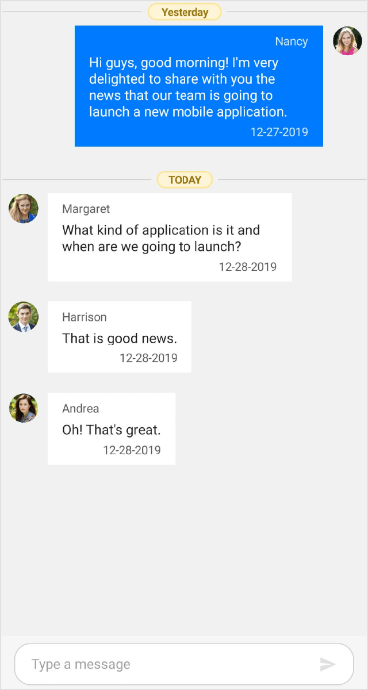

# Time break between Messages in Xamarin.Forms Chat (SfChat)

The chat control provides a convenient way to group messages based on the date and time the messages were created. So, users can easily identify the messages in the order they were created. To enable time break view in `SfChat` set `true` to the [SfChat.ShowTimeBreak](https://help.syncfusion.com/cr/xamarin/Syncfusion.XForms.Chat.SfChat.html#Syncfusion_XForms_Chat_SfChat_ShowTimeBreak) property.




<?xml version="1.0" encoding="utf-8" ?>
<ContentPage xmlns="http://xamarin.com/schemas/2014/forms"
             xmlns:x="http://schemas.microsoft.com/winfx/2009/xaml"
             xmlns:sfChat="clr-namespace:Syncfusion.XForms.Chat;assembly=Syncfusion.SfChat.XForms"
             xmlns:local="clr-namespace:GettingStarted"
             x:Class="GettingStarted.MainPage">

    <ContentPage.BindingContext>
        <local:GettingStartedViewModel/>
    </ContentPage.BindingContext>
    
    <ContentPage.Content>
        <sfChat:SfChat x:Name="sfChat"
                       ShowTimeBreak="True"
                       Messages="{Binding Messages}"
                       CurrentUser="{Binding CurrentUser}" />
    </ContentPage.Content>

</ContentPage>


using Syncfusion.XForms.Chat;
using Xamarin.Forms;

namespace GettingStarted
{
    public partial class MainPage : ContentPage
    {
        SfChat sfChat;
        GettingStartedViewModel viewModel;
        public MainPage()
        {
            InitializeComponent();
            sfChat = new SfChat();
            viewModel = new GettingStartedViewModel();
            this.sfChat.Messages = viewModel.Messages;
            this.sfChat.CurrentUser = viewModel.CurrentUser;
            this.sfChat.ShowTimeBreak = true;
            this.Content = sfChat;
        }
    }
}




## Stick time break view

To stick the time break view, enable the property [SfChat.StickyTimeBreak](https://help.syncfusion.com/cr/xamarin/Syncfusion.XForms.Chat.SfChat.html#Syncfusion_XForms_Chat_SfChat_StickyTimeBreak). If `StickyTimeBreak` is true, the corresponding time break view will be displayed until the previous time break view goes out of view, and time break will move when another time break comes in while scrolling.



<?xml version="1.0" encoding="utf-8" ?>
<ContentPage xmlns="http://xamarin.com/schemas/2014/forms"
             xmlns:x="http://schemas.microsoft.com/winfx/2009/xaml"
             xmlns:sfChat="clr-namespace:Syncfusion.XForms.Chat;assembly=Syncfusion.SfChat.XForms"
             xmlns:local="clr-namespace:GettingStarted"
             x:Class="GettingStarted.MainPage">

    <ContentPage.BindingContext>
        <local:GettingStartedViewModel/>
    </ContentPage.BindingContext>
    
    <ContentPage.Content>
        <sfChat:SfChat x:Name="sfChat"
                       ShowTimeBreak="True"
                       StickyTimeBreak="True"
                       Messages="{Binding Messages}"
                       CurrentUser="{Binding CurrentUser}"
                       ShowOutgoingMessageAvatar="True" />
    </ContentPage.Content>

</ContentPage>



using Syncfusion.XForms.Chat;
using Xamarin.Forms;

namespace GettingStarted
{
    public partial class MainPage : ContentPage
    {
        SfChat sfChat;
        GettingStartedViewModel viewModel;
        public MainPage()
        {
            InitializeComponent();
            sfChat = new SfChat();
            viewModel = new GettingStartedViewModel();
            this.sfChat.Messages = viewModel.Messages;
            this.sfChat.CurrentUser = viewModel.CurrentUser;
            this.sfChat.ShowOutgoingMessageAvatar = true;
            this.sfChat.ShowTimeBreak = true;
            this.sfChat.StickyTimeBreak = true;
            this.Content = sfChat;
        }
    }
}

public class GettingStartedViewModel : INotifyPropertyChanged
{
    /// 

    /// Collection of messages or conversation.
    /// 

    private ObservableCollection<object> messages;

    /// 

    /// current user of chat.
    /// 

    private Author currentUser;

    public GettingStartedViewModel()
    {
        this.messages = new ObservableCollection<object>();
        this.currentUser = new Author() { Name = "Nancy", Avatar = "People_Circle16.png" };
        this.GenerateMessages();
    }

    /// 

    /// Gets or sets the message conversation.
    /// 

    public ObservableCollection<object> Messages
    {
        get
        {
            return this.messages;
        }

        set
        {
            this.messages = value;
        }
    }

    /// 

    /// Gets or sets the current user.
    /// 

    public Author CurrentUser
    {
        get
        {
        return this.currentUser;
        }
        set
        {
            this.currentUser = value;
            RaisePropertyChanged("CurrentUser");
        }
    }

    /// 

    /// Property changed handler.
    /// 

    public event PropertyChangedEventHandler PropertyChanged;

    /// 

    /// Occurs when property is changed.
    /// 

    /// <param name="propName">changed property name</param>
    public void RaisePropertyChanged(string propName)
    {
        if (this.PropertyChanged != null)
        {
            this.PropertyChanged(this, new PropertyChangedEventArgs(propName));
        }
    }

    private void GenerateMessages()
    {
        this.Messages.Add(new TextMessage()
        {
            Author = CurrentUser,
            Text = "Hi guys, good morning! I'm very delighted to share with you the news that our team is going to launch a new mobile application.",
            DateTime = new DateTime(DateTime.Now.Year, DateTime.Now.Month, DateTime.Now.Day - 1),
        });

        this.Messages.Add(new TextMessage()
        {
            Author = new Author() { Name = "Andrea", Avatar = "People_Circle2.png" },
            Text = "Oh! That's great.",
        });

        this.Messages.Add(new TextMessage()
        {
            Author = new Author() { Name = "Harrison", Avatar = "People_Circle14.png" },
            Text = "That is good news.",
        });

        this.Messages.Add(new TextMessage()
        {
            Author = new Author() { Name = "Margaret", Avatar = "People_Circle7.png" },
            Text = "What kind of application is it and when are we going to launch?",
        });
    }
}




## Template for time break view

`SfChat` allows to load custom template for time break view using the [SfChat.TimeBreakTemplate](https://help.syncfusion.com/cr/xamarin/Syncfusion.XForms.Chat.SfChat.html#Syncfusion_XForms_Chat_SfChat_TimeBreakTemplate) property. 

To apply custom `TimeBreakTemplate` in the SfChat, refer the below code example:



<?xml version="1.0" encoding="utf-8" ?>
<ContentPage xmlns="http://xamarin.com/schemas/2014/forms"
             xmlns:x="http://schemas.microsoft.com/winfx/2009/xaml"
             xmlns:sfChat="clr-namespace:Syncfusion.XForms.Chat;assembly=Syncfusion.SfChat.XForms"
             xmlns:local="clr-namespace:GettingStarted"
             x:Class="GettingStarted.MainPage">

    <ContentPage.Resources>
        <local:TimeBreakTemplateSelector x:Key="timeBreakTemplateSelector"/>
    </ContentPage.Resources>
    
    <ContentPage.BindingContext>
        <local:GettingStartedViewModel/>
    </ContentPage.BindingContext>

    <ContentPage.Content>
        <sfChat:SfChat x:Name="sfChat"
                       ShowTimeBreak="True"
                       TimeBreakTemplate="{StaticResource timeBreakTemplateSelector}"
                       Messages="{Binding Messages}"
                       CurrentUser="{Binding CurrentUser}" />
    </ContentPage.Content>
</ContentPage>





using Syncfusion.XForms.Chat;
using Xamarin.Forms;

namespace GettingStarted
{
    public partial class MainPage : ContentPage
    {
        SfChat sfChat;
        GettingStartedViewModel viewModel;
        public MainPage()
        {
            InitializeComponent();
            sfChat = new SfChat();
            viewModel = new GettingStartedViewModel();
            this.sfChat.Messages = viewModel.Messages;
            this.sfChat.CurrentUser = viewModel.CurrentUser;
            this.sfChat.ShowTimeBreak="True"
            this.sfChat.TimeBreakTemplate = new TimeBreakTemplateSelector();
            this.Content = sfChat;
        }
    }
}

internal class TimeBreakTemplateSelector : DataTemplateSelector
{
    /// 

    /// Returns the template based on the message's date time.
    /// 

    /// <param name="item">The <see cref="GroupResult"/> of the grouped row.</param>
    /// <param name="container">The <see cref="ChatListView"/> as <see cref="BindableObject"/>.</param>
    /// <returns>The <see cref="SfBorder"/> control which contains templates for the grouped row.</returns>
    protected override DataTemplate OnSelectTemplate(object item, BindableObject container)
    {
        string dateString = (item as GroupResult).Key.ToString();
        DateTime groupedDate = DateTime.ParseExact(dateString, "d/M/yyyy", CultureInfo.InvariantCulture);
        string formatDate = string.Format("{0:dd MMMM yyyy}", groupedDate);
        
        Grid grid = new Grid();
        grid.Padding = new Thickness(3, 4, 2, 0);
        
        grid.RowDefinitions = new RowDefinitionCollection()
        {
            new RowDefinition(){Height = 20},
        };

        grid.ColumnDefinitions = new ColumnDefinitionCollection()
        {
            new ColumnDefinition(){ Width = GridLength.Star},
            new ColumnDefinition(){ Width = GridLength.Auto},
            new ColumnDefinition(){ Width = GridLength.Star},
        };

        SfBorder border = new SfBorder();
        border.VerticalOptions = LayoutOptions.Center;
        border.HorizontalOptions = LayoutOptions.Center;
        border.BorderColor = Color.FromHex("#FDE490");
        border.CornerRadius = 13;
        border.BorderWidth = 1.5;

        Label label = new Label();
        label.FontSize = 11;
        label.VerticalOptions = LayoutOptions.Center;
        label.HorizontalOptions = LayoutOptions.Center;
        label.HorizontalTextAlignment = TextAlignment.Center;
        label.TextColor = Color.FromHex("#98770E");
        label.FontAttributes = FontAttributes.Bold;
        label.BackgroundColor = Color.FromHex("#FDF4D6");

        border.Content = label;
        
        grid.Children.Add(new BoxView() { HeightRequest = 2, BackgroundColor = Color.Black, HorizontalOptions =LayoutOptions.FillAndExpand, VerticalOptions = LayoutOptions.CenterAndExpand },0,0);
        grid.Children.Add(new BoxView() { HeightRequest = 2, BackgroundColor = Color.Black, HorizontalOptions =LayoutOptions.FillAndExpand, VerticalOptions = LayoutOptions.CenterAndExpand },2,0);

        if (groupedDate.Date == DateTime.Now.Date)
        {
            label.WidthRequest = 60;
            label.Text = "TODAY";
            grid.Children.Add(border, 1, 0);
            return new DataTemplate(() =>
            {
                return grid;
            });
        }
        else if (groupedDate.Date == new DateTime(DateTime.Now.Year, DateTime.Now.Month, DateTime.Now.Day - 1))
        {
            label.WidthRequest = 80;
            label.Text = "Yesterday";
            grid.Children.Add(border, 1, 0);
            return new DataTemplate(() =>
            {
                return grid;
            });
        }
        else
        {
            label.WidthRequest = 120;
            label.Text = formatDate;
            grid.Children.Add(border, 1, 0);
            return new DataTemplate(() =>
            {
                return grid;
            });
        }
    }
}




