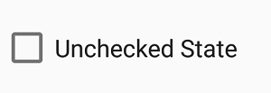

# Event in Xamarin CheckBox (SfCheckBox)

## StateChanged event
Occurs when the value(state) of the [`IsChecked`](https://help.syncfusion.com/cr/xamarin/Syncfusion.XForms.Buttons.ToggleButton.html#Syncfusion_XForms_Buttons_ToggleButton_IsChecked) property is changed by either touching the check box or setting the value to the [`IsChecked`](https://help.syncfusion.com/cr/xamarin/Syncfusion.XForms.Buttons.ToggleButton.html#Syncfusion_XForms_Buttons_ToggleButton_IsChecked) property using XAML or C# code. The event arguments are of type [`StateChangedEventArgs`](https://help.syncfusion.com/cr/xamarin/Syncfusion.XForms.Buttons.StateChangedEventArgs.html) and expose the following property:

* [`IsChecked`](https://help.syncfusion.com/cr/xamarin/Syncfusion.XForms.Buttons.ToggleButton.html#Syncfusion_XForms_Buttons_ToggleButton_IsChecked): The new value(state) of the [`IsChecked`](https://help.syncfusion.com/cr/xamarin/Syncfusion.XForms.Buttons.ToggleButton.html#Syncfusion_XForms_Buttons_ToggleButton_IsChecked) property.



<syncfusion:SfCheckBox x:Name="checkBox" Text="Unchecked State" IsThreeState="True" StateChanged="CheckBox_StateChanged"/>




SfCheckBox checkBox = new SfCheckBox();
checkBox.Text = "Unchecked State";
checkBox.IsThreeState = true;
checkBox.StateChanged += CheckBox_StateChanged;
	






private void CheckBox_StateChanged(object sender, StateChangedEventArgs e)
{
    if (e.IsChecked.HasValue && e.IsChecked.Value)
    {
        checkBox.Text = "Checked State";
    }
    else if(e.IsChecked.HasValue && !e.IsChecked.Value)
    {
        checkBox.Text = "Unchecked State";
    }
    else
    {
    checkBox.Text = "Indeterminate State";
    }
}




## See also

[How to get the values of selected checkboxes in a group using Xamarin.Forms](https://support.syncfusion.com/kb/article/9507/how-to-get-the-values-of-selected-checkboxes-in-a-group-using-xamarin-forms)

