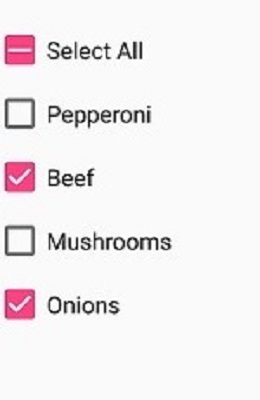
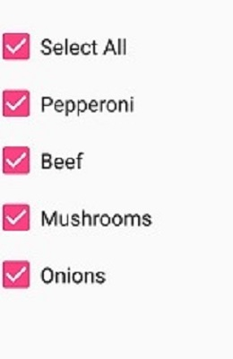

# Getting Started in Xamarin CheckBox (SfCheckBox)

This section explains the steps required to configure the [`SfCheckBox`](https://help.syncfusion.com/cr/xamarin/Syncfusion.XForms.Buttons.SfCheckBox.html) control in a real-time scenario and provides a walk-through on some of the customization features available in [`SfCheckBox`](https://help.syncfusion.com/cr/xamarin/Syncfusion.XForms.Buttons.SfCheckBox.html) control.

## Adding SfCheckBox reference

You can add SfCheckBox reference using one of the following methods:

**Method 1: Adding SfCheckBox reference from nuget.org**

Syncfusion Xamarin components are available in [nuget.org](https://www.nuget.org/). To add SfCheckBox to your project, open the NuGet package manager in Visual Studio, search for [Syncfusion.Xamarin.Buttons](https://www.nuget.org/packages/Syncfusion.Xamarin.Buttons), and then install it.

N> 
* Install the same version of SfCheckBox NuGet in all the projects.
* In addition, you need to install the [Syncfusion.Xamarin.Buttons.WPF]() package for Xamarin.Forms WPF platform only.

**Method 2: Adding SfCheckBox reference from toolbox**

Syncfusion also provides Xamarin Toolbox. Using this toolbox, you can drag the SfCheckBox control to the XAML page. It will automatically install the required NuGet packages and add the namespace to the page. To install Syncfusion Xamarin Toolbox, refer to [Toolbox](https://help.syncfusion.com/xamarin/utility#toolbox).

**Method 3: Adding SfCheckBox assemblies manually from the installed location**

If you prefer to manually reference the assemblies instead referencing from NuGet, add the following assemblies in respective projects.

Location: {Installed location}/{version}/Xamarin/lib

<table>
<tr>
<td>PCL</td>
<td>Syncfusion.Buttons.XForms.dll Syncfusion.Core.XForms.dll Syncfusion.Licensing.dll </td>
</tr>
<tr>
<td>Android</td>
<td>Syncfusion.Buttons.XForms.dll Syncfusion.Buttons.XForms.Android.dll Syncfusion.Core.XForms.dll Syncfusion.Core.XForms.Android.dll Syncfusion.Licensing.dll </td>
</tr>
<tr>
<td>iOS</td>
<td>Syncfusion.Buttons.XForms.dll Syncfusion.Buttons.XForms.iOS.dll Syncfusion.Core.XForms.dll Syncfusion.Core.XForms.iOS.dll Syncfusion.Licensing.dll </td>
</tr>
<tr>
<td>UWP</td>
<td>Syncfusion.Buttons.XForms.dll Syncfusion.Buttons.XForms.UWP.dll Syncfusion.Core.XForms.dll Syncfusion.Core.XForms.UWP.dll Syncfusion.Licensing.dll </td>
</tr>
<tr>
<td>WPF</td>
<td>Syncfusion.Buttons.XForms.dll Syncfusion.Buttons.XForms.WPF.dll Syncfusion.Core.XForms.dll Syncfusion.Core.XForms.WPF.dll Syncfusion.Licensing.dll </td>
</tr>
</table>

N> To know more about obtaining our components, refer to these links for [Mac](https://help.syncfusion.com/xamarin/introduction/download-and-installation/mac/) and [Windows](https://help.syncfusion.com/xamarin/introduction/download-and-installation/windows/).

I> Starting with v16.2.0.x, if you reference Syncfusion assemblies from the trial setup or from the NuGet feed, you also have to include a license key in your projects. Please refer to [Syncfusion license key](https://help.syncfusion.com/common/essential-studio/licensing/license-key/) to know about registering Syncfusion license key in your Xamarin application to use our components.

N> If you are adding the references from toolbox, this step is not needed.

### Additional step for iOS
To launch [`SfCheckBox`](https://help.syncfusion.com/cr/xamarin/Syncfusion.XForms.Buttons.SfCheckBox.html) in iOS, call the `SfCheckBoxRenderer.Init()` in `FinishedLaunching` overridden method of `AppDelegate` class in iOS Project, as demonstrated in the following code example.



public override bool FinishedLaunching(UIApplication app, NSDictionary options)
{
    global::Xamarin.Forms.Forms.Init();
    LoadApplication(new App());
    Syncfusion.XForms.iOS.Buttons.SfCheckBoxRenderer.Init();
    return base.FinishedLaunching(app, options);
}



### Additional step for UWP
This step is required only if the application is deployed in Release mode with .NET native tool chain enabled. It is for resolving the known Framework issue “Custom controls not rendering in Release mode” in UWP platform. Initializing the [`SfCheckBox`](https://help.syncfusion.com/cr/xamarin/Syncfusion.XForms.Buttons.SfCheckBox.html) assembly at `OnLaunched` overridden method of the `App` class in UWP project is the suggested work around, as demonstrated in the following code example.



protected override void OnLaunched(LaunchActivatedEventArgs e)
{
    ..... 
    rootFrame.NavigationFailed += OnNavigationFailed;
    // Add `using System.Reflection;` 
    List<Assembly> assembliesToInclude = new List<Assembly>();
    //Now, add all the assemblies that your app uses 
    assembliesToInclude.Add(typeof(SfCheckBoxRenderer).GetTypeInfo().Assembly);
    // replaces Xamarin.Forms.Forms.Init(e);
    Xamarin.Forms.Forms.Init(e, assembliesToInclude);
    ..... 
}



### Additional step for WPF

To launch the check box in WPF, call the SfCheckBoxRenderer.Init() method in the MainWindow constructor of the MainWindow class after the Xamarin.Forms framework has been initialized and before the LoadApplication method is called as demonstrated in the following code sample.


 

public partial class MainWindow : FormsApplicationPage
{
     public MainWindow()
     { 
            InitializeComponent();
            
            Forms.Init();
            
            Syncfusion.XForms.WPF.Buttons.SfCheckBoxRenderer.Init();
            
            LoadApplication(new App());
     }
}




## Create a Simple SfCheckBox
The [`SfCheckBox`](https://help.syncfusion.com/cr/xamarin/Syncfusion.XForms.Buttons.SfCheckBox.html) control is configured entirely in C# code or by using XAML markup. The following steps explain how to create a [`SfCheckBox`](https://help.syncfusion.com/cr/xamarin/Syncfusion.XForms.Buttons.SfCheckBox.html) and configure its elements.

### Add namespace for referred assemblies



xmlns:syncfusion="clr-namespace:Syncfusion.XForms.Buttons;assembly=Syncfusion.Buttons.XForms"


using Syncfusion.XForms.Buttons;



### Refer SfCheckBox control with declared suffix name for Namespace




<?xml version="1.0" encoding="utf-8" ?>
<ContentPage xmlns="http://xamarin.com/schemas/2014/forms"
             xmlns:x="http://schemas.microsoft.com/winfx/2009/xaml"
             xmlns:local="clr-namespace:GettingStarted"
	     xmlns:syncfusion="clr-namespace:Syncfusion.XForms.Buttons;assembly=Syncfusion.Buttons.XForms"             
	     x:Class="GettingStarted.MainPage">
    <ContentPage.Content>
        <StackLayout>
              <syncfusion:SfCheckBox x:Name="checkBox"/>
        </StackLayout>
    </ContentPage.Content>
</ContentPage>


using Syncfusion.XForms.Buttons;
using Xamarin.Forms;
namespace GettingStarted
{
    public partial class MainPage : ContentPage
    {
        public MainPage()
        {
            InitializeComponent();
            StackLayout stackLayout = new StackLayout();
            SfCheckBox checkBox = new SfCheckBox();
            stackLayout.Children.Add(checkbox);
            this.Content = stackLayout;
        }
    }
}



## Setting caption
The check box caption can be defined using the [`Text`](https://help.syncfusion.com/cr/xamarin/Syncfusion.XForms.Buttons.ToggleButton.html#Syncfusion_XForms_Buttons_ToggleButton_Text) property of [`SfCheckBox`](https://help.syncfusion.com/cr/xamarin/Syncfusion.XForms.Buttons.SfCheckBox.html). This caption normally describes the meaning of the check box and it displays next to check box.



<syncfusion:SfCheckBox x:Name="checkBox" IsChecked="True" Text="CheckBox"/>


SfCheckBox checkBox = new SfCheckBox();
checkBox.IsChecked = true;
checkBox.Text = "CheckBox";



 

## Change the check box state
The three visual states of [`SfCheckBox`](https://help.syncfusion.com/cr/xamarin/Syncfusion.XForms.Buttons.SfCheckBox.html) are: 

* Checked
* Unchecked
* Indeterminate

 

You can change the state of the check box using the [`IsChecked`](https://help.syncfusion.com/cr/xamarin/Syncfusion.XForms.Buttons.ToggleButton.html#Syncfusion_XForms_Buttons_ToggleButton_IsChecked) property of [`SfCheckBox`](https://help.syncfusion.com/cr/xamarin/Syncfusion.XForms.Buttons.SfCheckBox.html). In checked state, a tick mark is added to the visualization of check box.

<table>
<tr>
<td>
<b>State</b>
</td>
<td>
<b>Property</b>
</td>
<td>
<b>Value</b>
</td>
</tr>
<tr>
<td>
checked
</td>
<td>
IsChecked
</td>
<td>
true
</td>
</tr>
<tr>
<td>
unchecked
</td>
<td>
IsChecked
</td>
<td>
false
</td>
</tr>
<tr>
<td>
indeterminate
</td>
<td>
IsChecked
</td>
<td>
null
</td>
</tr>
</table>

N>For the check box, to report the indeterminate state, set the [`IsThreeState`](https://help.syncfusion.com/cr/xamarin/Syncfusion.XForms.Buttons.ToggleButton.html#Syncfusion_XForms_Buttons_ToggleButton_IsThreeState) property to true.

Check box can be used as a single or as a group. A single check box mostly used for a binary yes/no choice, such as "Remember me?", login scenario, or a terms of service agreement.



<syncfusion:SfCheckBox x:Name="checkBox" Text="I agree to the terms of services for this site" IsChecked="True"/> 


SfCheckBox checkBox = new SfCheckBox();
checkBox.Text = "I agree to the terms of services for this site";
checkBox.IsChecked = true;



Multiple check boxes can be used as a group for multi-select scenarios in which a user chooses one or more items from the group of choices that are not mutually exclusive.



<Label x:Name="label" Text="Pizza Toppings" />
<syncfusion:SfCheckBox x:Name="pepperoni" Text="Pepperoni"/>
<syncfusion:SfCheckBox x:Name="beef" Text="Beef" IsChecked="True"/>
<syncfusion:SfCheckBox x:Name="mushroom" Text="Mushrooms"/>
<syncfusion:SfCheckBox x:Name="onion" Text="Onions" IsChecked="True"/>


Label label = new Label();
label.Text = "Pizza Toppings";
SfCheckBox pepperoni= new SfCheckBox();
pepperoni.Text = "Pepperoni";
SfCheckBox beef= new SfCheckBox();
beef.Text = "Beef";
beef.IsChecked = true;
SfCheckBox mushroom = new SfCheckBox();
mushroom.Text = "Mushrooms";
SfCheckBox onion = new SfCheckBox();
onion.Text = "Pepperoni";
onion.IsChecked = true;



## Indeterminate

The [`SfCheckBox`](https://help.syncfusion.com/cr/xamarin/Syncfusion.XForms.Buttons.SfCheckBox.html) allows an indeterminate state in addition to the checked and unchecked state. The indeterminate state of the check box is enabled by setting the [`IsThreeState`](https://help.syncfusion.com/cr/xamarin/Syncfusion.XForms.Buttons.ToggleButton.html#Syncfusion_XForms_Buttons_ToggleButton_IsThreeState) property of the control to `True`.

N>When the [`IsThreeState`](https://help.syncfusion.com/cr/xamarin/Syncfusion.XForms.Buttons.ToggleButton.html#Syncfusion_XForms_Buttons_ToggleButton_IsThreeState) property is set to `False` and [`IsChecked`](https://help.syncfusion.com/cr/xamarin/Syncfusion.XForms.Buttons.ToggleButton.html#Syncfusion_XForms_Buttons_ToggleButton_IsChecked) property is set to `null` then the check box will be in unchecked state.

The indeterminate state is used when a group of sub-choices has both checked and unchecked states. In the following example, the "Select all" checkbox has the [`IsThreeState`](https://help.syncfusion.com/cr/xamarin/Syncfusion.XForms.Buttons.ToggleButton.html#Syncfusion_XForms_Buttons_ToggleButton_IsThreeState) property set to `true`. The "Select all" checkbox is checked if all child elements are checked, unchecked if all the child elements are unchecked, and indeterminate otherwise.



<syncfusion:SfCheckBox x:Name="selectAll" Text="Select All" IsChecked="{x:Null}" StateChanged="SelectAll_StateChanged"/>
<syncfusion:SfCheckBox x:Name="pepperoni" Text="Pepperoni" StateChanged="CheckBox_StateChanged"/>
<syncfusion:SfCheckBox x:Name="beef" Text="Beef" IsChecked="True" StateChanged="CheckBox_StateChanged"/>
<syncfusion:SfCheckBox x:Name="mushroom" Text="Mushrooms" StateChanged="CheckBox_StateChanged"/>
<syncfusion:SfCheckBox x:Name="onion" Text="Onions" IsChecked="True" StateChanged="CheckBox_StateChanged"/>



bool skip = false;
SfCheckBox selectAll, pepperoni, beef, mushroom, onion;
selectAll = new SfCheckBox();
selectAll.StateChanged += SelectAll_StateChanged;
selectAll.Text = "Select All";
pepperoni = new SfCheckBox();
pepperoni.StateChanged += CheckBox_StateChanged;
pepperoni.Text = "Pepperoni";
beef = new SfCheckBox();
beef.StateChanged += CheckBox_StateChanged;
beef.Text = "Beef";
beef.IsChecked = true;
mushroom = new SfCheckBox();
mushroom.StateChanged += CheckBox_StateChanged;
mushroom.Text = "Mushrooms";
onion = new SfCheckBox();
onion.StateChanged += CheckBox_StateChanged;
onion.Text = "Onions";
onion.IsChecked = true;

private void SelectAll_StateChanged(object sender, StateChangedEventArgs e)
{
    if (!skip)
    {
       skip = true;
       pepperoni.IsChecked = beef.IsChecked = mushroom.IsChecked = onion.IsChecked = e.IsChecked;
       skip = false;
    }
}

private void CheckBox_StateChanged(object sender, StateChangedEventArgs e)
{
    if (!skip)
    {
       skip = true;
       if (pepperoni.IsChecked.Value && beef.IsChecked.Value && mushroom.IsChecked.Value && onion.IsChecked.Value)
           selectAll.IsChecked = true;
       else if (!pepperoni.IsChecked.Value && !beef.IsChecked.Value && !mushroom.IsChecked.Value && !onion.IsChecked.Value)
	       selectAll.IsChecked = false;
       else
           selectAll.IsChecked = null;
       skip = false;
    }
}
		



 

This demo can be downloaded from this [link](http://www.syncfusion.com/downloads/support/directtrac/general/ze/CheckBox_IndeterminateState-1420370588).

## See also

[How to create a Xamarin.Forms check box](https://www.syncfusion.com/kb/10888/how-to-create-a-xamarin-forms-checkbox)

[How to create a collection of Xamarin.Forms check box](https://www.syncfusion.com/kb/10837/how-to-create-a-collection-of-xamarin-checkbox)
