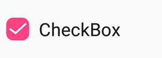

# Visual Customization

## Customizing a shape
The check box shape can be customized using the [`CornerRadius`](https://help.syncfusion.com/cr/xamarin/Syncfusion.XForms.Buttons.SfCheckBox.html#Syncfusion_XForms_Buttons_SfCheckBox_CornerRadius) property. This property specifies the uniform radius value to the every corner of the check box.



<syncfusion:SfCheckBox x:Name="checkBox" Text="CheckBox" IsChecked="True" CornerRadius="5.0"/>            


SfCheckBox checkBox = new SfCheckBox();
checkBox.Text = "CheckBox";
checkBox.IsChecked = true;
checkBox.CornerRadius = 5.0f;



## Customizing a state color
The default state colors can be customized using the [`CheckedColor`](https://help.syncfusion.com/cr/xamarin/Syncfusion.XForms.Buttons.ToggleButton.html#Syncfusion_XForms_Buttons_ToggleButton_CheckedColor) and [`UncheckedColor`](https://help.syncfusion.com/cr/xamarin/Syncfusion.XForms.Buttons.ToggleButton.html#Syncfusion_XForms_Buttons_ToggleButton_UncheckedColor) properties. The checked or indeterminate state color is updated to the [`CheckedColor`](https://help.syncfusion.com/cr/xamarin/Syncfusion.XForms.Buttons.ToggleButton.html#Syncfusion_XForms_Buttons_ToggleButton_CheckedColor) property value when the state is changed to the checked or indeterminate.The unchecked state color is updated to [`UncheckedColor`](https://help.syncfusion.com/cr/xamarin/Syncfusion.XForms.Buttons.ToggleButton.html#Syncfusion_XForms_Buttons_ToggleButton_UncheckedColor) property value when the state is changed to unchecked. 


<syncfusion:SfCheckBox x:Name="check" Text="CheckBox" IsChecked="True" CheckedColor="Green"/>
<syncfusion:SfCheckBox x:Name="uncheck" Text="CheckBox" UncheckedColor="Violet"/>
<syncfusion:SfCheckBox x:Name="indeterminate " Text="CheckBox" IsThreeState="True" IsChecked="{x:Null}" CheckedColor="Purple"/> 


SfCheckBox check= new SfCheckBox();
check.Text = "CheckBox";
check.IsChecked = true;
check.CheckedColor = Color.Green;
SfCheckBox uncheck = new SfCheckBox();
uncheck.Text = "CheckBox";
uncheck.UncheckedColor = Color.Violet;
SfCheckBox indeterminate = new SfCheckBox();
indeterminate.IsChecked = null;
indeterminate.IsThreeState = true;
indeterminate.Text = "CheckBox";
indeterminate.CheckedColor = Color.Purple;



## BorderWidth
The tick box border thickness of the checkbox control can be customized using the [`BorderWidth`](https://help.syncfusion.com/cr/xamarin/Syncfusion.XForms.Buttons.ToggleButton.html#Syncfusion_XForms_Buttons_ToggleButton_BorderWidth) property.  



<syncfusion:SfCheckBox Text="Hello" BorderWidth="2" UncheckedColor="Blue" FontSize="20"/>
<syncfusion:SfCheckBox Text="Hello" BorderWidth="4" UncheckedColor="Blue" FontSize="25"/>
<syncfusion:SfCheckBox Text="Hello" BorderWidth="6" UncheckedColor="Blue" FontSize="30"/>            


SfCheckBox check1= new SfCheckBox();
check1.Text = "Hello";
check1.BorderWidth = 2;
check1.FontSize = 20;
check1.UncheckedColor = Color.Blue;
SfCheckBox check2 = new SfCheckBox();
check2.Text = "Hello";
check2.BorderWidth = 4;
check2.FontSize = 25;
check2.UncheckedColor = Color.Blue;
SfCheckBox check3 = new SfCheckBox();
check3.Text = "Hello";
check3.BorderWidth = 6;
check3.FontSize = 30;
check3.UncheckedColor = Color.Blue;



## Setting a caption text appearance 
You can customize the display text appearance of the [`SfCheckBox`](https://help.syncfusion.com/cr/xamarin/Syncfusion.XForms.Buttons.SfCheckBox.html) control using the following properties:

* [`TextColor`](https://help.syncfusion.com/cr/xamarin/Syncfusion.XForms.Buttons.ToggleButton.html#Syncfusion_XForms_Buttons_ToggleButton_TextColor): Changes the color of the text.
* [`HorizontalTextAlignment`](https://help.syncfusion.com/cr/xamarin/Syncfusion.XForms.Buttons.ToggleButton.html#Syncfusion_XForms_Buttons_ToggleButton_HorizontalTextAlignment): Changes the horizontal alignment of the caption text.
* [`FontFamily`](https://help.syncfusion.com/cr/xamarin/Syncfusion.XForms.Buttons.ToggleButton.html#Syncfusion_XForms_Buttons_ToggleButton_FontFamily): Changes the font family of the caption text.
* [`FontAttributes`](https://help.syncfusion.com/cr/xamarin/Syncfusion.XForms.Buttons.ToggleButton.html#Syncfusion_XForms_Buttons_ToggleButton_FontAttributes): Sets font attributes(bold/italic/none) of the caption text.
* [`FontSize`](https://help.syncfusion.com/cr/xamarin/Syncfusion.XForms.Buttons.ToggleButton.html#Syncfusion_XForms_Buttons_ToggleButton_FontSize): Sets font size of the caption text.



<syncfusion:SfCheckBox x:Name="caption" Text="CheckBox" IsChecked="True" TextColor="Violet" HorizontalTextAlignment="Center" FontFamily="Arial" FontAttributes="Bold" FontSize="20"/>           


SfCheckBox caption = new SfCheckBox();
caption.IsChecked = true;
caption.Text = "CheckBox";
caption.TextColor = Color.Violet;
caption.HorizontalTextAlignment = TextAlignment.Center;
caption.FontFamily = "Arial";
caption.FontAttributes = FontAttributes.Bold;
caption.FontSize = 20;



## LineBreakMode
The [`LineBreakMode`](https://help.syncfusion.com/cr/xamarin/Syncfusion.XForms.Buttons.ToggleButton.html#Syncfusion_XForms_Buttons_ToggleButton_LineBreakMode) allows you to wrap or truncate the text. The default value of this property is [`NoWrap`](https://help.syncfusion.com/cr/xamarin/Syncfusion.XForms.Buttons.LineBreakMode.html). The following other options are available in [`LineBreakMode`](https://help.syncfusion.com/cr/xamarin/Syncfusion.XForms.Buttons.ToggleButton.html#Syncfusion_XForms_Buttons_ToggleButton_LineBreakMode):

 * `NoWrap` - Avoids the text wrap. 
 * `WordWrap` - Wraps the text by words.
 * `CharacterWrap` - Wraps the text by character.
 * `HeadTruncation` - Truncates the text at the start.
 * `MiddleTruncation` - Truncates the text at the center.
 * `TailTruncation` - Truncates the text at the end.
 
## TickColor Customization
The [`TickColor`](https://help.syncfusion.com/cr/xamarin/Syncfusion.XForms.Buttons.SfCheckBox.html#Syncfusion_XForms_Buttons_SfCheckBox_TickColor) property customizes the color of the tick in SfCheckBox.



<ContentPage xmlns="http://xamarin.com/schemas/2014/forms"
             xmlns:x="http://schemas.microsoft.com/winfx/2009/xaml"
             xmlns:syncfusion="clr-namespace:Syncfusion.XForms.Buttons;assembly=Syncfusion.Buttons.XForms"  x:Class="CheckBoxCustomization.checkbox">
     <ContentPage.Content>
            <StackLayout>
                <syncfusion:SfCheckBox x:Name="checkBox" IsChecked="True" CheckedColor="Aqua" TickColor="Fuchsia" Text="CheckBox" />
            </StackLayout>
        </ContentPage.Content>
</ContentPage>


using System;
using Syncfusion.XForms.Buttons;
using Xamarin.Forms;

namespace CheckBoxCustomization
{
    public partial class MainPage : ContentPage
    {
        public MainPage()
        {
            InitializeComponent();
            StackLayout stackLayout = new StackLayout();
            SfCheckBox checkBox = new SfCheckBox();
            checkBox.IsChecked = true;
            checkBox.Text = "CheckBox";
            checkBox.CheckedColor = Color.Aqua;
            checkBox.TickColor = Color.Fuchsia;
            stackLayout.Children.Add(checkBox);
            this.Content = stackLayout;



## Size Customization

The [`ControlSize`](https://help.syncfusion.com/cr/xamarin/Syncfusion.XForms.Buttons.ToggleButton.html#Syncfusion_XForms_Buttons_ToggleButton_ControlSize) property is used to customize the [`CheckBox`](https://help.syncfusion.com/cr/xamarin/Syncfusion.XForms.Buttons.SfCheckBox.html) control size.



<StackLayout>
    <syncfusion:SfCheckBox Text="CheckBox" ControlSize="60"/>
</StackLayout>


StackLayout stackLayout = new StackLayout();
SfCheckBox  sfCheckBox  = new SfCheckBox();
sfCheckBox.Text = "Radio Button";
sfCheckBox.ControlSize = 60;
stackLayout.Children.Add(sfCheckBox);



N>[`ControlSize`](https://help.syncfusion.com/cr/xamarin/Syncfusion.XForms.Buttons.ToggleButton.html#Syncfusion_XForms_Buttons_ToggleButton_ControlSize) is not applicable for Android Platform.

## See also

[How to get the values of selected checkboxes in a group using Xamarin.Forms](https://www.syncfusion.com/kb/10915/how-to-get-the-values-of-selected-checkboxes-in-a-group-using-xamarin-forms)
